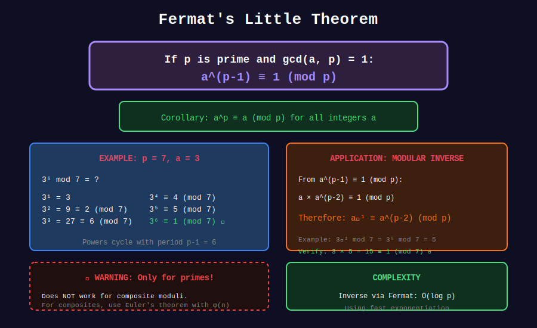

# 🔬 Fermat's Little Theorem

## 📊 Metadata
- **Difficulty:** 
- **Time Complexity:** O(log p) for inverse/exponentiation
- **Space Complexity:** O(1)
- **Pattern:** Number Theory, Modular Inverse, Primality Testing

---

## 🎯 Overview

**Fermat's Little Theorem:** If p is prime and gcd(a, p) = 1, then:
```
a^(p-1) ≡ 1 (mod p)
```

**Corollary:** For any integer a:
```
a^p ≡ a (mod p)
```

---

## 📐 Core Concepts

### The Theorem

**Statement:** For prime p and integer a not divisible by p:
```
a^(p-1) ≡ 1 (mod p)
```

**Proof Sketch:**
Consider {a, 2a, 3a, ..., (p-1)a} mod p.
These are a permutation of {1, 2, 3, ..., p-1}.
Therefore: a × 2a × 3a × ... × (p-1)a ≡ 1 × 2 × 3 × ... × (p-1) (mod p)
So: a^(p-1) × (p-1)! ≡ (p-1)! (mod p)
Thus: a^(p-1) ≡ 1 (mod p)

### Applications

1. **Modular Inverse:** a⁻¹ ≡ a^(p-2) (mod p)
2. **Primality Testing:** Fermat test
3. **Reducing Exponents:** a^n ≡ a^(n mod (p-1)) (mod p)

---

## 📊 Visual Diagram

<div align="center">



</div>

---

## 💻 Implementations

### 1. Modular Inverse using Fermat

```python
def mod_inverse_fermat(a, p):
    """
    Find a⁻¹ mod p using Fermat's Little Theorem
    
    a⁻¹ ≡ a^(p-2) (mod p)
    
    Time: O(log p)
    Space: O(1)
    
    Requirements: p must be prime, gcd(a, p) = 1
    """
    if a % p == 0:
        return None  # No inverse
    
    return pow(a, p - 2, p)

# Examples
p = 10**9 + 7
print(mod_inverse_fermat(2, p))   # 500000004
print(mod_inverse_fermat(3, p))
print((2 * mod_inverse_fermat(2, p)) % p)  # Should be 1
```

### 2. Fermat Primality Test

```python
import random

def fermat_test(n, k=5):
    """
    Fermat primality test
    
    If a^(n-1) ≢ 1 (mod n) for some a, then n is composite
    
    Time: O(k log n)
    
    WARNING: Carmichael numbers are false positives!
    """
    if n < 2:
        return False
    if n == 2 or n == 3:
        return True
    if n % 2 == 0:
        return False
    
    for _ in range(k):
        a = random.randint(2, n - 2)
        
        if pow(a, n - 1, n) != 1:
            return False
    
    return True  # Probably prime

# Examples
print(fermat_test(17))       # True
print(fermat_test(561))      # True (but 561 is Carmichael!)
print(fermat_test(1000003))  # True
```

### 3. Reduce Large Exponents

```python
def reduce_exponent(a, n, p):
    """
    Compute a^n mod p efficiently by reducing exponent
    
    If gcd(a, p) = 1 and p is prime:
    a^n ≡ a^(n mod (p-1)) (mod p)
    
    Time: O(log(n mod (p-1)))
    """
    if n == 0:
        return 1
    
    # Reduce exponent using Fermat
    reduced_exp = n % (p - 1)
    if reduced_exp == 0:
        reduced_exp = p - 1  # a^(p-1) ≡ 1, not 0
    
    return pow(a, reduced_exp, p)

# Example: Compute 2^(10^18) mod (10^9+7)
p = 10**9 + 7
print(reduce_exponent(2, 10**18, p))
```

### 4. Modular Division

```python
def mod_divide(a, b, p):
    """
    Compute (a / b) mod p
    
    Uses Fermat's theorem for inverse
    
    Time: O(log p)
    """
    b_inv = pow(b, p - 2, p)
    return (a * b_inv) % p

# Example
p = 10**9 + 7
print(mod_divide(10, 2, p))  # 5
print(mod_divide(7, 3, p))   # 7 × 3⁻¹
```

### 5. Factorial Division mod p

```python
def factorial_division_mod(n, k, p):
    """
    Compute n! / k! mod p
    
    Useful when k < n and both are less than p
    
    Time: O(n - k + log p)
    """
    # n! / k! = (k+1) × (k+2) × ... × n
    result = 1
    for i in range(k + 1, n + 1):
        result = (result * i) % p
    
    return result

# Example: 10! / 7! = 10 × 9 × 8 = 720
print(factorial_division_mod(10, 7, 10**9 + 7))  # 720
```

### 6. Combinations using Fermat

```python
class Combinations:
    """
    Compute C(n, r) mod p using Fermat's theorem
    """
    
    def __init__(self, max_n, p):
        self.p = p
        self.fact = [1] * (max_n + 1)
        self.inv_fact = [1] * (max_n + 1)
        
        # Compute factorials
        for i in range(1, max_n + 1):
            self.fact[i] = self.fact[i-1] * i % p
        
        # Compute inverse factorials using Fermat
        self.inv_fact[max_n] = pow(self.fact[max_n], p - 2, p)
        for i in range(max_n - 1, -1, -1):
            self.inv_fact[i] = self.inv_fact[i+1] * (i + 1) % p
    
    def nCr(self, n, r):
        if r < 0 or r > n:
            return 0
        return self.fact[n] * self.inv_fact[r] % self.p * self.inv_fact[n-r] % self.p

# Example
comb = Combinations(1000, 10**9 + 7)
print(comb.nCr(10, 3))   # 120
print(comb.nCr(100, 50))
```

---

## 🧩 LeetCode Problems

| # | Problem | Difficulty | Key Concept |
|---|---------|------------|-------------|
| 1922 | [Count Good Numbers](https://leetcode.com/problems/count-good-numbers/) | 🟡 Medium | Modular exponentiation |
| 2550 | [Count Collisions of Monkeys on a Polygon](https://leetcode.com/problems/count-collisions-of-monkeys-on-a-polygon/) | 🟡 Medium | 2^n - 2 mod p |

---

## 💡 Solutions

### Problem 2550: Count Collisions

```python
class Solution:
    def monkeyMove(self, n: int) -> int:
        """
        Total arrangements: 2^n
        No collision arrangements: 2 (all left or all right)
        Answer: 2^n - 2
        
        Use Fermat for modular inverse if needed
        """
        MOD = 10**9 + 7
        return (pow(2, n, MOD) - 2) % MOD
```

---

## 💡 Key Insights

### 1. Carmichael Numbers

Composite numbers that pass Fermat test for all a coprime to n:
```
561 = 3 × 11 × 17
1105 = 5 × 13 × 17
1729 = 7 × 13 × 19 (Ramanujan's taxi number!)
```

### 2. When to Use Fermat

| Scenario | Use Fermat? |
|----------|-------------|
| p is prime, need inverse | Yes |
| m is composite | No, use Extended GCD |
| Primality testing | Yes, but prefer Miller-Rabin |

### 3. Exponent Reduction

For prime p and gcd(a, p) = 1:
```
a^(10^18) mod p = a^(10^18 mod (p-1)) mod p
```

This is crucial for handling very large exponents.

---

**Navigation:** [← Fast Exponentiation](../03_fast_exponentiation/) | [Euler's Theorem →](../05_eulers_theorem/)

