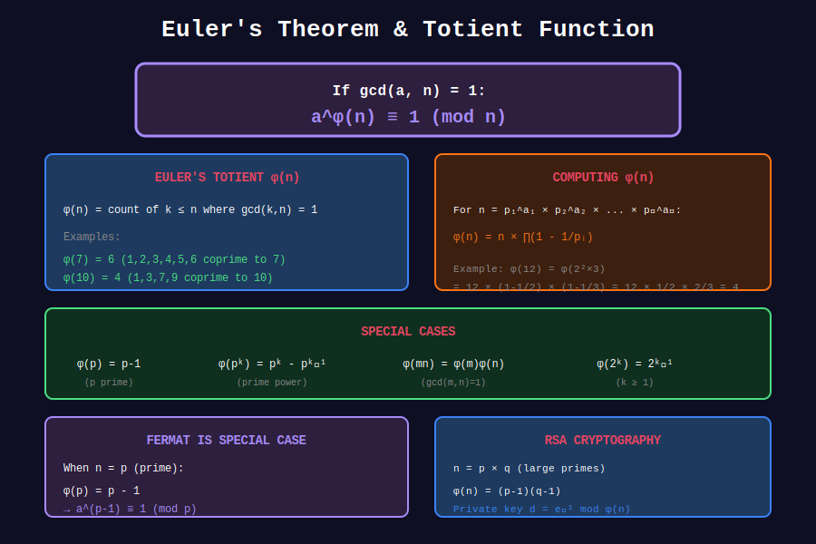

<div align="center">

# 🔐 Euler's Theorem

<p>
  
  
</p>

**The Generalization of Fermat's Little Theorem**

*Foundation of RSA encryption and modular arithmetic*

</div>

---

## 🧭 Navigation

| ⬅️ Previous | 📂 Current | ➡️ Next |
|:------------|:----------:|--------:|
| [← 04. Fermat's Theorem](../04_fermats_theorem/README.md) | **05. Euler's Theorem** | [06. Applications →](../06_applications/README.md) |

---

## 📐 Mathematical Foundations

### 1️⃣ Euler's Theorem

**Statement:** If $\gcd(a, n) = 1$, then:

```math
a^{\phi(n)} \equiv 1 \pmod{n}

```

where $\phi(n)$ is Euler's totient function.

**Corollary:** $a^k \equiv a^{k \mod \phi(n)} \pmod{n}$ when $\gcd(a, n) = 1$

---

## 📊 Visual Diagram

<div align="center">



</div>

---

### 2️⃣ Euler's Totient Function

**Definition:** $\phi(n)$ = count of integers from 1 to n that are coprime to n.

**Formula for prime power:** $\phi(p^k) = p^{k-1}(p-1)$

**Formula for general n:** If $n = p\_1^{a\_1} \cdots p\_k^{a\_k}$:

```math
\phi(n) = n \prod_{p|n}\left(1 - \frac{1}{p}\right)

```

---

### 3️⃣ RSA Algorithm

**Key Generation:**

1. Choose primes $p, q$

2. Compute $n = pq$, $\phi(n) = (p-1)(q-1)$

3. Choose $e$ with $\gcd(e, \phi(n)) = 1$

4. Compute $d = e^{-1} \mod \phi(n)$

**Encryption:** $c = m^e \mod n$

**Decryption:** $m = c^d \mod n$

---

## 💻 Code Implementations

```python
def euler_phi(n: int) -> int:
    """Compute Euler's totient function."""
    result = n
    p = 2
    while p * p <= n:
        if n % p == 0:
            result -= result // p
            while n % p == 0:
                n //= p
        p += 1
    if n > 1:
        result -= result // n
    return result

def mod_pow_euler(a: int, k: int, n: int) -> int:
    """Compute a^k mod n using Euler's theorem for large k."""
    from math import gcd
    if gcd(a, n) == 1:
        k = k % euler_phi(n)
    return pow(a, k, n)

# RSA Example
def rsa_example():
    p, q = 61, 53
    n = p * q  # 3233
    phi_n = (p - 1) * (q - 1)  # 3120
    
    e = 17  # Public exponent
    d = pow(e, -1, phi_n)  # Private exponent: 2753
    
    message = 65
    cipher = pow(message, e, n)
    decrypted = pow(cipher, d, n)
    
    print(f"Original: {message}, Encrypted: {cipher}, Decrypted: {decrypted}")

```

---

## 🏆 LeetCode Problems

| # | Problem | Key Concept |
|:-:|---------|-------------|
| 372 | [Super Pow](https://leetcode.com/problems/super-pow/) | Euler's theorem |
| 1922 | [Count Good Numbers](https://leetcode.com/problems/count-good-numbers/) | Fast exponentiation |

---

<div align="center">

**Made with ❤️ by [Gaurav Goswami](https://github.com/Gaurav14cs17)**

</div>

