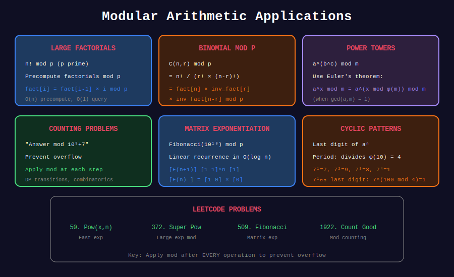

<div align="center">

# 🎯 Modular Arithmetic Applications

<p>
  
  
  
</p>

**Real-World Problems & Competition Patterns**

*Master the art of modular computation*

</div>

---

## 🧭 Navigation

| ⬅️ Previous | 📂 Current | ➡️ Next |
|:------------|:----------:|--------:|
| [← 05. Euler's Theorem](../05_eulers_theorem/README.md) | **06. Applications** | [🏠 Modular Arithmetic Home](../README.md) |

---

## 📐 Overview

Modular arithmetic appears in **30%+ of competitive programming problems**. This section covers the most common patterns and their solutions.

---

## 📊 Visual Diagram

<div align="center">



</div>

---

## 🏆 LeetCode Problems

| # | Problem | Difficulty | Key Concept | Link |
|:-:|---------|:----------:|-------------|------|
| 50 | Pow(x, n) | 🟡 Medium | Fast exponentiation | [LeetCode](https://leetcode.com/problems/powx-n/) |
| 372 | Super Pow | 🟡 Medium | Modular power with array | [LeetCode](https://leetcode.com/problems/super-pow/) |
| 1922 | Count Good Numbers | 🟡 Medium | Modular counting | [LeetCode](https://leetcode.com/problems/count-good-numbers/) |
| 1808 | Maximize Nice Divisors | 🔴 Hard | Modular inverse | [LeetCode](https://leetcode.com/problems/maximize-number-of-nice-divisors/) |
| 1513 | Number of Substrings With Only 1s | 🟡 Medium | Arithmetic series mod | [LeetCode](https://leetcode.com/problems/number-of-substrings-with-only-1s/) |
| 1916 | Count Ways to Build Rooms | 🔴 Hard | Factorial + inverse | [LeetCode](https://leetcode.com/problems/count-ways-to-build-rooms-in-an-ant-colony/) |

---

## 🎯 Complete Solutions

### LeetCode 50: Pow(x, n)

```python
class Solution:
    def myPow(self, x: float, n: int) -> float:
        """
        Compute x^n using binary exponentiation.
        
        Time: O(log n)
        Space: O(1)
        """
        if n < 0:
            x = 1 / x
            n = -n
        
        result = 1.0
        while n > 0:
            if n & 1:
                result *= x
            x *= x
            n >>= 1
        
        return result
```

---

### LeetCode 372: Super Pow

```python
class Solution:
    def superPow(self, a: int, b: list[int]) -> int:
        """
        Compute a^b mod 1337 where b is given as array of digits.
        
        Key insight: a^1234 = (a^123)^10 × a^4
        
        Time: O(len(b))
        Space: O(1)
        """
        MOD = 1337
        
        def pow_mod(base, exp):
            result = 1
            base %= MOD
            while exp > 0:
                if exp & 1:
                    result = result * base % MOD
                base = base * base % MOD
                exp >>= 1
            return result
        
        result = 1
        for digit in b:

            # result = result^10 × a^digit
            result = pow_mod(result, 10) * pow_mod(a, digit) % MOD
        
        return result
```

---

### LeetCode 1922: Count Good Numbers

```python
class Solution:
    def countGoodNumbers(self, n: int) -> int:
        """
        Count digit strings of length n where:
        - Even indices (0,2,4,...) have even digits (0,2,4,6,8) → 5 choices
        - Odd indices (1,3,5,...) have prime digits (2,3,5,7) → 4 choices
        
        Answer: 5^(ceil(n/2)) × 4^(floor(n/2)) mod (10^9+7)
        
        Time: O(log n)
        Space: O(1)
        """
        MOD = 10**9 + 7
        
        even_positions = (n + 1) // 2  # 0, 2, 4, ...
        odd_positions = n // 2          # 1, 3, 5, ...
        
        return pow(5, even_positions, MOD) * pow(4, odd_positions, MOD) % MOD
```

---

### LeetCode 1808: Maximize Number of Nice Divisors

```python
class Solution:
    def maxNiceDivisors(self, primeFactors: int) -> int:
        """
        Maximize product of exponents whose sum equals primeFactors.
        
        Key insight: Use 3s as much as possible (3 > 2 > 1)
        - If n % 3 == 0: use all 3s
        - If n % 3 == 1: use (n//3 - 1) 3s and two 2s (3+1 → 2+2)
        - If n % 3 == 2: use (n//3) 3s and one 2
        
        Time: O(log n)
        Space: O(1)
        """
        MOD = 10**9 + 7
        n = primeFactors
        
        if n == 1:
            return 1
        if n == 2:
            return 2
        if n == 3:
            return 3
        
        if n % 3 == 0:
            return pow(3, n // 3, MOD)
        elif n % 3 == 1:
            return pow(3, n // 3 - 1, MOD) * 4 % MOD
        else:  # n % 3 == 2
            return pow(3, n // 3, MOD) * 2 % MOD
```

---

### LeetCode 1513: Number of Substrings With Only 1s

```python
class Solution:
    def numSub(self, s: str) -> int:
        """
        Count substrings containing only '1's.
        
        For consecutive k 1s: count = k(k+1)/2
        
        Time: O(n)
        Space: O(1)
        """
        MOD = 10**9 + 7
        result = 0
        count = 0
        
        for c in s:
            if c == '1':
                count += 1
                result = (result + count) % MOD
            else:
                count = 0
        
        return result
```

---

## 📚 Common Patterns

### Pattern 1: Large Power Modulo

```python
MOD = 10**9 + 7

def solve_power(a: int, b: int) -> int:
    """Compute a^b mod MOD efficiently."""
    return pow(a, b, MOD)  # Python's built-in is optimized!
```

### Pattern 2: Factorial and Inverse Factorial

```python
def precompute_factorials(n: int, mod: int):
    """Precompute factorials and their inverses."""
    fact = [1] * (n + 1)
    for i in range(1, n + 1):
        fact[i] = fact[i - 1] * i % mod
    
    inv_fact = [1] * (n + 1)
    inv_fact[n] = pow(fact[n], mod - 2, mod)
    for i in range(n - 1, -1, -1):
        inv_fact[i] = inv_fact[i + 1] * (i + 1) % mod
    
    return fact, inv_fact

def nCr(n: int, r: int, fact: list, inv_fact: list, mod: int) -> int:
    """Compute C(n,r) mod p using precomputed factorials."""
    if r > n or r < 0:
        return 0
    return fact[n] * inv_fact[r] % mod * inv_fact[n - r] % mod
```

### Pattern 3: Modular Division

```python
def mod_divide(a: int, b: int, mod: int) -> int:
    """Compute (a / b) mod p = a × b^(-1) mod p."""
    return a * pow(b, mod - 2, mod) % mod
```

### Pattern 4: Sum of Arithmetic Progression

```python
def sum_ap_mod(n: int, mod: int) -> int:
    """Compute 1 + 2 + ... + n mod p."""

    # n(n+1)/2 mod p = n × (n+1) × inverse(2) mod p
    return n * (n + 1) % mod * pow(2, mod - 2, mod) % mod
```

---

## 🎨 Visual: Modular Exponentiation

```
+-----------------------------------------------------------------+
| COMPUTING 3^13 mod 1000 using Binary Exponentiation            |
+-----------------------------------------------------------------+
|                                                                 |
| 13 in binary = 1101                                            |
| 3^13 = 3^8 × 3^4 × 3^1                                        |
|                                                                 |
| Step-by-step:                                                  |
|   base = 3, result = 1                                         |
|                                                                 |
|   exp = 13 (1101)                                              |
|   bit 0 = 1: result = 1 × 3 = 3, base = 9                     |
|   bit 1 = 0: result = 3, base = 81                            |
|   bit 2 = 1: result = 3 × 81 = 243, base = 6561 % 1000 = 561  |
|   bit 3 = 1: result = 243 × 561 % 1000 = 323                  |
|                                                                 |
| Final: 3^13 mod 1000 = 323                                     |
| Verify: 3^13 = 1594323, 1594323 % 1000 = 323 ✓                |
+-----------------------------------------------------------------+
```

---

## 💡 Key Insights

### 1. Common Moduli in Competitive Programming

```python
MOD1 = 10**9 + 7   # 1000000007 (prime)
MOD2 = 10**9 + 9   # 1000000009 (prime)
MOD3 = 998244353   # Prime with primitive root, good for NTT
```

**Why these values?**
- Prime (Fermat's theorem works)
- Fits in 32-bit signed integer
- Product of two numbers < MOD fits in 64-bit

### 2. Avoiding Overflow

```python

# Safe multiplication for very large numbers
def safe_mul(a: int, b: int, mod: int) -> int:
    return (a % mod) * (b % mod) % mod

# For extremely large numbers (>10^18), use __int128 in C++ or:
def safe_mul_large(a: int, b: int, mod: int) -> int:
    result = 0
    a %= mod
    while b > 0:
        if b & 1:
            result = (result + a) % mod
        a = (a * 2) % mod
        b >>= 1
    return result
```

### 3. When to Use Which Inverse Method

| Condition | Method | Time |
|-----------|--------|------|
| p is prime | Fermat: a^(p-2) | O(log p) |
| gcd(a, m) = 1 | Extended GCD | O(log m) |
| Multiple queries | Precompute inverses | O(n) + O(1) |

---

## 📖 References

| Resource | Link |
|----------|------|
| **CP-Algorithms** | [Modular Arithmetic](https://cp-algorithms.com/algebra/module-inverse.html) |
| **Brilliant** | [Modular Arithmetic](https://brilliant.org/wiki/modular-arithmetic/) |

---

<div align="center">

**Made with ❤️ by [Gaurav Goswami](https://github.com/Gaurav14cs17)**

</div>

---

## 🧭 Navigation

| ⬅️ Previous | 📂 Current | ➡️ Next |
|:------------|:----------:|--------:|
| [← 05. Euler's Theorem](../05_eulers_theorem/README.md) | **06. Applications** | [🏠 Modular Arithmetic Home](../README.md) |
