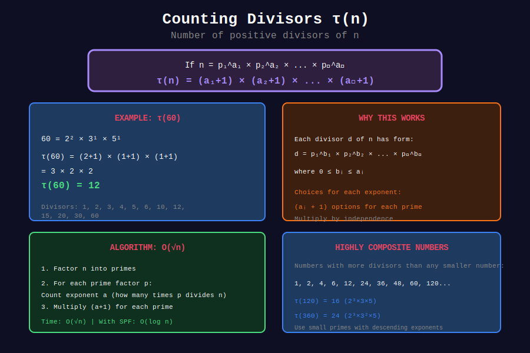

<div align="center">

# 📊 Count Divisors

<p>
  
  
  
</p>

**The Divisor Count Function τ(n)**

*Counting the factors of any integer efficiently*

</div>

---

## 🧭 Navigation

| ⬅️ Previous | 📂 Current | ➡️ Next |
|:------------|:----------:|--------:|
| [🏠 Divisors Home](../README.md) | **01. Count Divisors** | [02. Sum Divisors →](../02_sum_divisors/README.md) |

---

## 📊 Visual Diagram

<div align="center">



</div>

---

## 📐 Mathematical Foundations

### 1️⃣ Definition

**Divisor Count Function:** Also denoted as $\tau(n)$, $d(n)$, or $\sigma\_0(n)$

```math
\tau(n) = \text{number of positive divisors of } n

```

**Examples:**

- $\tau(1) = 1$ → divisors: {1}

- $\tau(6) = 4$ → divisors: {1, 2, 3, 6}

- $\tau(12) = 6$ → divisors: {1, 2, 3, 4, 6, 12}

- $\tau(p) = 2$ for any prime p → divisors: {1, p}

---

### 2️⃣ The Divisor Count Formula

**Theorem:** If $n = p\_1^{a\_1} \cdot p\_2^{a\_2} \cdots p\_k^{a\_k}$ is the prime factorization, then:

```math
\tau(n) = (a_1 + 1)(a_2 + 1) \cdots (a_k + 1) = \prod_{i=1}^{k}(a_i + 1)

```

**Proof:**
Each divisor of n has the form $p\_1^{b\_1} \cdot p\_2^{b\_2} \cdots p\_k^{b\_k}$ where $0 \leq b\_i \leq a\_i$.

For each prime $p\_i$, there are $(a\_i + 1)$ choices for the exponent $b\_i$.

By the multiplication principle, total divisors = $(a\_1 + 1)(a\_2 + 1) \cdots (a\_k + 1)$.

---

### 3️⃣ Examples with Formula

**Example 1:** $n = 12 = 2^2 \cdot 3^1$

```math
\tau(12) = (2+1)(1+1) = 3 \times 2 = 6

```

Divisors: 1, 2, 3, 4, 6, 12 ✓

**Example 2:** $n = 360 = 2^3 \cdot 3^2 \cdot 5^1$

```math
\tau(360) = (3+1)(2+1)(1+1) = 4 \times 3 \times 2 = 24

```

**Example 3:** $n = p^k$ (prime power)

```math
\tau(p^k) = k + 1

```

---

## 🎨 Visual Walkthrough

```
+-----------------------------------------------------------------+

| COUNTING DIVISORS OF n = 60                                    |
+-----------------------------------------------------------------+
|                                                                 |
| Step 1: Prime Factorization                                    |
|         60 = 2² × 3¹ × 5¹                                      |
|                                                                 |
| Step 2: Apply Formula                                          |
|         τ(60) = (2+1) × (1+1) × (1+1)                         |
|               = 3 × 2 × 2                                      |
|               = 12                                             |
|                                                                 |
| Step 3: Verify by Listing                                      |
|         Divisors of 60:                                        |
|                                                                 |
|         2⁰×3⁰×5⁰ = 1      2¹×3⁰×5⁰ = 2      2²×3⁰×5⁰ = 4     |
|         2⁰×3¹×5⁰ = 3      2¹×3¹×5⁰ = 6      2²×3¹×5⁰ = 12    |
|         2⁰×3⁰×5¹ = 5      2¹×3⁰×5¹ = 10     2²×3⁰×5¹ = 20    |
|         2⁰×3¹×5¹ = 15     2¹×3¹×5¹ = 30     2²×3¹×5¹ = 60    |
|                                                                 |
|         Count = 12 ✓                                           |
+-----------------------------------------------------------------+

```

---

## 💻 Code Implementations

### 1. Count Divisors Using Prime Factorization

```python
def count_divisors(n: int) -> int:
    """
    Count divisors of n using the formula τ(n) = ∏(aᵢ + 1).
    
    Time: O(√n)
    Space: O(1)
    
    Args:
        n: Positive integer
    
    Returns:
        Number of positive divisors of n
    
    Examples:
        >>> count_divisors(12)
        6
        >>> count_divisors(1)
        1
        >>> count_divisors(100)
        9
    """
    if n <= 0:
        return 0
    if n == 1:
        return 1
    
    count = 1
    d = 2
    
    while d * d <= n:
        if n % d == 0:
            exp = 0
            while n % d == 0:
                exp += 1
                n //= d
            count *= (exp + 1)
        d += 1
    
    # If n > 1, it's a prime factor with exponent 1
    if n > 1:
        count *= 2
    
    return count

# Examples
print(count_divisors(1))      # 1
print(count_divisors(12))     # 6
print(count_divisors(60))     # 12
print(count_divisors(100))    # 9
print(count_divisors(997))    # 2 (prime)

```

### 2. Count by Direct Enumeration

```python
def count_divisors_simple(n: int) -> int:
    """
    Count divisors by iterating up to √n.
    
    Time: O(√n)
    Space: O(1)
    
    For each d ≤ √n that divides n:
    - d is a divisor
    - n/d is also a divisor (if different from d)
    """
    if n <= 0:
        return 0
    
    count = 0
    d = 1
    
    while d * d <= n:
        if n % d == 0:
            count += 1  # d is a divisor
            if d * d != n:
                count += 1  # n/d is also a divisor
        d += 1
    
    return count

# This is simpler but doesn't give prime factorization

```

### 3. Count Divisors with Verbose Output

```python
def count_divisors_verbose(n: int) -> tuple[int, list[int]]:
    """
    Count divisors and return the list of divisors.
    
    Returns:
        (count, list of divisors)
    """
    if n <= 0:
        return 0, []
    
    small_divisors = []
    large_divisors = []
    
    d = 1
    while d * d <= n:
        if n % d == 0:
            small_divisors.append(d)
            if d * d != n:
                large_divisors.append(n // d)
        d += 1
    
    all_divisors = small_divisors + large_divisors[::-1]
    return len(all_divisors), all_divisors

# Example
count, divisors = count_divisors_verbose(60)
print(f"60 has {count} divisors: {divisors}")
# 60 has 12 divisors: [1, 2, 3, 4, 5, 6, 10, 12, 15, 20, 30, 60]

```

### 4. Sieve for Multiple Queries

```python
def sieve_divisor_count(limit: int) -> list[int]:
    """
    Compute τ(i) for all i from 1 to limit.
    
    Time: O(n log n)
    Space: O(n)
    
    Use when you need τ(n) for many values.
    """
    tau = [0] * (limit + 1)
    
    for d in range(1, limit + 1):
        for multiple in range(d, limit + 1, d):
            tau[multiple] += 1
    
    return tau

# Example: Count divisors for 1 to 20
tau = sieve_divisor_count(20)
for i in range(1, 21):
    print(f"τ({i}) = {tau[i]}")

```

### 5. Using Smallest Prime Factor Sieve

```python
def spf_divisor_count(n: int, spf: list[int]) -> int:
    """
    Count divisors using precomputed smallest prime factors.
    
    Time: O(log n) after O(n log log n) precomputation
    """
    count = 1
    while n > 1:
        p = spf[n]
        exp = 0
        while n % p == 0:
            exp += 1
            n //= p
        count *= (exp + 1)
    return count

def build_spf(limit: int) -> list[int]:
    """Build smallest prime factor sieve."""
    spf = list(range(limit + 1))
    for i in range(2, int(limit**0.5) + 1):
        if spf[i] == i:  # i is prime
            for j in range(i * i, limit + 1, i):
                if spf[j] == j:
                    spf[j] = i
    return spf

# Example
spf = build_spf(1000)
print(spf_divisor_count(360, spf))  # 24

```

---

## 🏆 LeetCode Problems

| # | Problem | Difficulty | Key Concept | Link |
|:-:|---------|:----------:|-------------|------|
| 1952 | Three Divisors | 🟢 Easy | τ(n) = 3 | [LeetCode](https://leetcode.com/problems/three-divisors/) |
| 1390 | Four Divisors | 🟡 Medium | τ(n) = 4 | [LeetCode](https://leetcode.com/problems/four-divisors/) |
| 1492 | The kth Factor of n | 🟡 Medium | k-th divisor | [LeetCode](https://leetcode.com/problems/the-kth-factor-of-n/) |

---

## 🎯 Solutions to Key Problems

### LeetCode 1952: Three Divisors

```python
def is_three(n: int) -> bool:
    """
    n has exactly 3 divisors iff n = p² for some prime p.
    
    τ(p²) = 2 + 1 = 3
    Divisors are: 1, p, p²
    """
    # Check if n is a perfect square
    root = int(n ** 0.5)
    if root * root != n:
        return False
    
    # Check if root is prime
    if root < 2:
        return False
    for i in range(2, int(root**0.5) + 1):
        if root % i == 0:
            return False
    
    return True

# Examples
print(is_three(4))   # True (4 = 2², divisors: 1,2,4)
print(is_three(9))   # True (9 = 3², divisors: 1,3,9)
print(is_three(12))  # False

```

### LeetCode 1390: Four Divisors

```python
def sum_four_divisors(nums: list[int]) -> int:
    """
    Sum of divisors for numbers with exactly 4 divisors.
    
    τ(n) = 4 when:
    - n = p³ (divisors: 1, p, p², p³)
    - n = p × q (divisors: 1, p, q, pq)
    """
    def get_divisors_if_four(n: int) -> list[int]:
        divisors = []
        d = 1
        while d * d <= n:
            if n % d == 0:
                divisors.append(d)
                if d * d != n:
                    divisors.append(n // d)
                if len(divisors) > 4:
                    return []
            d += 1
        return divisors if len(divisors) == 4 else []
    
    total = 0
    for n in nums:
        divs = get_divisors_if_four(n)
        if divs:
            total += sum(divs)
    
    return total

```

---

## 💡 Key Insights

### 1. Numbers with Specific Divisor Counts

| τ(n) | Form of n | Example |
|------|-----------|---------|
| 1 | n = 1 | 1 |
| 2 | n = p (prime) | 2, 3, 5, 7, ... |
| 3 | n = p² | 4, 9, 25, 49, ... |
| 4 | n = p³ or pq | 8, 6, 10, 14, ... |
| Even | Any composite | Most numbers |

### 2. Highly Composite Numbers

Numbers with record number of divisors:

| n | τ(n) | Prime Factorization |
|---|------|---------------------|
| 1 | 1 | 1 |
| 2 | 2 | 2 |
| 4 | 3 | 2² |
| 6 | 4 | 2 × 3 |
| 12 | 6 | 2² × 3 |
| 24 | 8 | 2³ × 3 |
| 36 | 9 | 2² × 3² |
| 48 | 10 | 2⁴ × 3 |
| 60 | 12 | 2² × 3 × 5 |
| 120 | 16 | 2³ × 3 × 5 |

### 3. Average Number of Divisors

```math
\sum_{i=1}^{n} \tau(i) \approx n \ln n + (2\gamma - 1)n

```

where γ ≈ 0.5772 is the Euler-Mascheroni constant.

### 4. Maximum Divisors

For n ≤ 10^9, maximum τ(n) ≈ 1344

For n ≤ 10^18, maximum τ(n) ≈ 103680

---

## 📚 Common Interview Questions

1. **Find all numbers ≤ n with exactly k divisors**

2. **Find the number with most divisors in range [1, n]**

3. **Count numbers with odd number of divisors** (Answer: √n, all perfect squares)

4. **Find smallest number with exactly k divisors**

---

## 📖 References

| Resource | Link |
|----------|------|
| **Wikipedia** | [Divisor Function](https://en.wikipedia.org/wiki/Divisor_function) |
| **OEIS A000005** | [Sequence of τ(n)](https://oeis.org/A000005) |
| **CP-Algorithms** | [Divisor Function](https://cp-algorithms.com/algebra/divisors.html) |

---

<div align="center">

**Made with ❤️ by [Gaurav Goswami](https://github.com/Gaurav14cs17)**

</div>

---

## 🧭 Navigation

| ⬅️ Previous | 📂 Current | ➡️ Next |
|:------------|:----------:|--------:|
| [🏠 Divisors Home](../README.md) | **01. Count Divisors** | [02. Sum Divisors →](../02_sum_divisors/README.md) |
