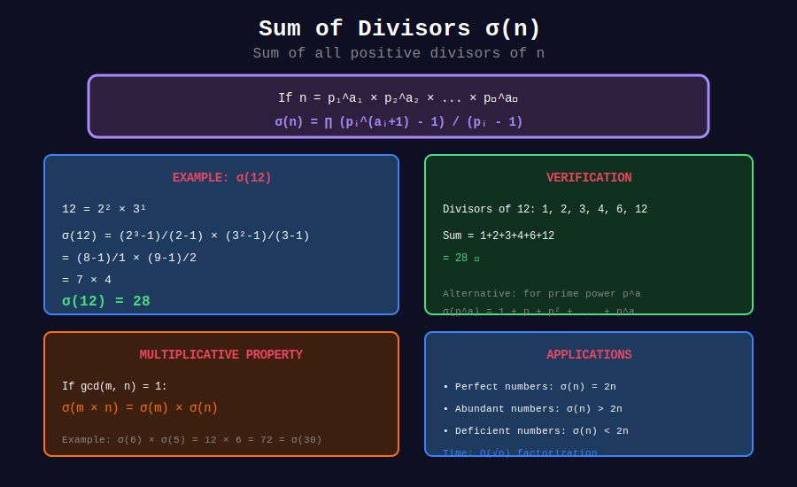

<div align="center">

# ➕ Sum of Divisors

<p>
  
  
  
</p>

**The Divisor Sum Function σ(n)**

*Summing all factors to discover number properties*

</div>

---

## 🧭 Navigation

| ⬅️ Previous | 📂 Current | ➡️ Next |
|:------------|:----------:|--------:|
| [← 01. Count Divisors](../01_count_divisors/README.md) | **02. Sum Divisors** | [03. Perfect Numbers →](../03_perfect_numbers/README.md) |

---

## 📊 Visual Diagram

<div align="center">



</div>

---

## 📐 Mathematical Foundations

### 1️⃣ Definition

**Divisor Sum Function:** $\sigma(n) = \sigma\_1(n)$

$$
\sigma(n) = \sum_{d|n} d = \text{sum of all positive divisors of } n
$$

**Examples:**
- $\sigma(1) = 1$
- $\sigma(6) = 1 + 2 + 3 + 6 = 12$
- $\sigma(12) = 1 + 2 + 3 + 4 + 6 + 12 = 28$
- $\sigma(p) = 1 + p$ for prime p

---

### 2️⃣ The Divisor Sum Formula

**Theorem:** If $n = p\_1^{a\_1} \cdot p\_2^{a\_2} \cdots p\_k^{a\_k}$, then:

$$
\sigma(n) = \prod_{i=1}^{k} \frac{p_i^{a_i+1} - 1}{p_i - 1}
$$

**Proof:**
For a single prime power $p^a$:

$$
\sigma(p^a) = 1 + p + p^2 + \cdots + p^a = \frac{p^{a+1} - 1}{p - 1}
$$

Since σ is multiplicative: $\sigma(mn) = \sigma(m)\sigma(n)$ when $\gcd(m,n) = 1$.

---

### 3️⃣ Examples with Formula

**Example 1:** $n = 12 = 2^2 \cdot 3^1$

$$
\sigma(12) = \frac{2^3 - 1}{2 - 1} \cdot \frac{3^2 - 1}{3 - 1} = \frac{7}{1} \cdot \frac{8}{2} = 7 \times 4 = 28
$$

Verify: $1 + 2 + 3 + 4 + 6 + 12 = 28$ ✓

**Example 2:** $n = 60 = 2^2 \cdot 3^1 \cdot 5^1$

$$
\sigma(60) = \frac{2^3-1}{1} \cdot \frac{3^2-1}{2} \cdot \frac{5^2-1}{4} = 7 \times 4 \times 6 = 168
$$

---

## 🎨 Visual Walkthrough

```
+-----------------------------------------------------------------+
| COMPUTING σ(60)                                                |
+-----------------------------------------------------------------+
|                                                                 |
| Step 1: Prime Factorization                                    |
|         60 = 2² × 3¹ × 5¹                                      |
|                                                                 |
| Step 2: Apply Formula for Each Prime                           |
|                                                                 |
|   For 2²: (1 + 2 + 4) = 7        or  (2³-1)/(2-1) = 7         |
|   For 3¹: (1 + 3) = 4            or  (3²-1)/(3-1) = 4         |
|   For 5¹: (1 + 5) = 6            or  (5²-1)/(5-1) = 6         |
|                                                                 |
| Step 3: Multiply                                               |
|         σ(60) = 7 × 4 × 6 = 168                                |
|                                                                 |
| Step 4: Verify                                                 |
|         Divisors: 1,2,3,4,5,6,10,12,15,20,30,60               |
|         Sum = 1+2+3+4+5+6+10+12+15+20+30+60 = 168 ✓           |
+-----------------------------------------------------------------+
```

---

## 💻 Code Implementations

### 1. Sum Divisors Using Formula

```python
def sum_divisors(n: int) -> int:
    """
    Compute σ(n) using the formula σ(p^a) = (p^(a+1) - 1)/(p - 1).
    
    Time: O(√n)
    Space: O(1)
    
    Examples:
        >>> sum_divisors(12)
        28
        >>> sum_divisors(6)
        12
    """
    if n <= 0:
        return 0
    if n == 1:
        return 1
    
    result = 1
    d = 2
    
    while d * d <= n:
        if n % d == 0:

            # Calculate 1 + d + d² + ... + d^exp
            power_sum = 1
            current_power = 1
            
            while n % d == 0:
                current_power *= d
                power_sum += current_power
                n //= d
            
            result *= power_sum
        d += 1
    
    # If n > 1, it's a prime factor (contributes 1 + n)
    if n > 1:
        result *= (1 + n)
    
    return result

# Examples
print(sum_divisors(1))    # 1
print(sum_divisors(6))    # 12
print(sum_divisors(12))   # 28
print(sum_divisors(60))   # 168
```

### 2. Sum Divisors by Direct Enumeration

```python
def sum_divisors_simple(n: int) -> int:
    """
    Sum divisors by iterating up to √n.
    
    Time: O(√n)
    Space: O(1)
    """
    if n <= 0:
        return 0
    
    total = 0
    d = 1
    
    while d * d <= n:
        if n % d == 0:
            total += d  # Add d
            if d * d != n:
                total += n // d  # Add n/d
        d += 1
    
    return total
```

### 3. Sum of Proper Divisors

```python
def sum_proper_divisors(n: int) -> int:
    """
    Sum of divisors excluding n itself.
    
    Also called aliquot sum s(n) = σ(n) - n.
    
    Used for classifying perfect, deficient, abundant numbers.
    """
    return sum_divisors(n) - n

# Examples
print(sum_proper_divisors(6))   # 1+2+3 = 6 (perfect!)
print(sum_proper_divisors(28))  # 1+2+4+7+14 = 28 (perfect!)
print(sum_proper_divisors(12))  # 1+2+3+4+6 = 16 (abundant)
```

### 4. Sieve for Multiple Queries

```python
def sieve_divisor_sum(limit: int) -> list[int]:
    """
    Compute σ(i) for all i from 1 to limit.
    
    Time: O(n log n)
    Space: O(n)
    """
    sigma = [0] * (limit + 1)
    
    for d in range(1, limit + 1):
        for multiple in range(d, limit + 1, d):
            sigma[multiple] += d
    
    return sigma

# Example
sigma = sieve_divisor_sum(20)
for i in range(1, 21):
    print(f"σ({i}) = {sigma[i]}")
```

### 5. Generalized Divisor Sum σₖ(n)

```python
def sigma_k(n: int, k: int) -> int:
    """
    Compute σₖ(n) = sum of k-th powers of divisors.
    
    σ₀(n) = τ(n) (count of divisors)
    σ₁(n) = σ(n) (sum of divisors)
    σ₂(n) = sum of squares of divisors
    """
    if n <= 0:
        return 0
    
    total = 0
    d = 1
    
    while d * d <= n:
        if n % d == 0:
            total += d ** k
            if d * d != n:
                total += (n // d) ** k
        d += 1
    
    return total

# Examples
print(sigma_k(12, 0))  # τ(12) = 6
print(sigma_k(12, 1))  # σ(12) = 28
print(sigma_k(12, 2))  # 1² + 2² + 3² + 4² + 6² + 12² = 210
```

---

## 🏆 LeetCode Problems

| # | Problem | Difficulty | Key Concept | Link |
|:-:|---------|:----------:|-------------|------|
| 507 | Perfect Number | 🟢 Easy | σ(n) - n = n | [LeetCode](https://leetcode.com/problems/perfect-number/) |
| 1390 | Four Divisors | 🟡 Medium | Sum if τ = 4 | [LeetCode](https://leetcode.com/problems/four-divisors/) |

---

## 🎯 Solutions to Key Problems

### LeetCode 507: Perfect Number

```python
def check_perfect_number(num: int) -> bool:
    """
    A perfect number equals the sum of its proper divisors.
    
    Perfect numbers: 6, 28, 496, 8128, 33550336, ...
    """
    if num <= 1:
        return False
    
    divisor_sum = 1  # 1 is always a proper divisor
    d = 2
    
    while d * d <= num:
        if num % d == 0:
            divisor_sum += d
            if d * d != num:
                divisor_sum += num // d
        d += 1
    
    return divisor_sum == num

# Known perfect numbers (first 5)
perfect = [6, 28, 496, 8128, 33550336]
for p in perfect:
    print(f"{p}: {check_perfect_number(p)}")  # All True
```

---

## 💡 Key Insights

### 1. Number Classification by σ(n)

| Type | Condition | Examples |
|------|-----------|----------|
| **Perfect** | σ(n) = 2n | 6, 28, 496 |
| **Deficient** | σ(n) < 2n | 1, 2, 3, 4, 5, 7, 8 |
| **Abundant** | σ(n) > 2n | 12, 18, 20, 24 |

### 2. Abundancy Index

$$
\text{abundancy}(n) = \frac{\sigma(n)}{n}
$$

- Perfect: abundancy = 2
- Deficient: abundancy < 2
- Abundant: abundancy > 2

### 3. Multiplicativity

σ(n) is a **multiplicative function**:

$$
\sigma(mn) = \sigma(m) \cdot \sigma(n) \text{ when } \gcd(m,n) = 1
$$

### 4. Identity Involving τ and σ

$$
\sum_{d|n} \tau(d) = (\text{number of divisor pairs } (a,b) \text{ with } ab | n)
$$

---

## 📖 References

| Resource | Link |
|----------|------|
| **Wikipedia** | [Divisor Function](https://en.wikipedia.org/wiki/Divisor_function) |
| **OEIS A000203** | [Sequence of σ(n)](https://oeis.org/A000203) |

---

<div align="center">

**Made with ❤️ by [Gaurav Goswami](https://github.com/Gaurav14cs17)**

</div>

---

## 🧭 Navigation

| ⬅️ Previous | 📂 Current | ➡️ Next |
|:------------|:----------:|--------:|
| [← 01. Count Divisors](../01_count_divisors/README.md) | **02. Sum Divisors** | [03. Perfect Numbers →](../03_perfect_numbers/README.md) |
