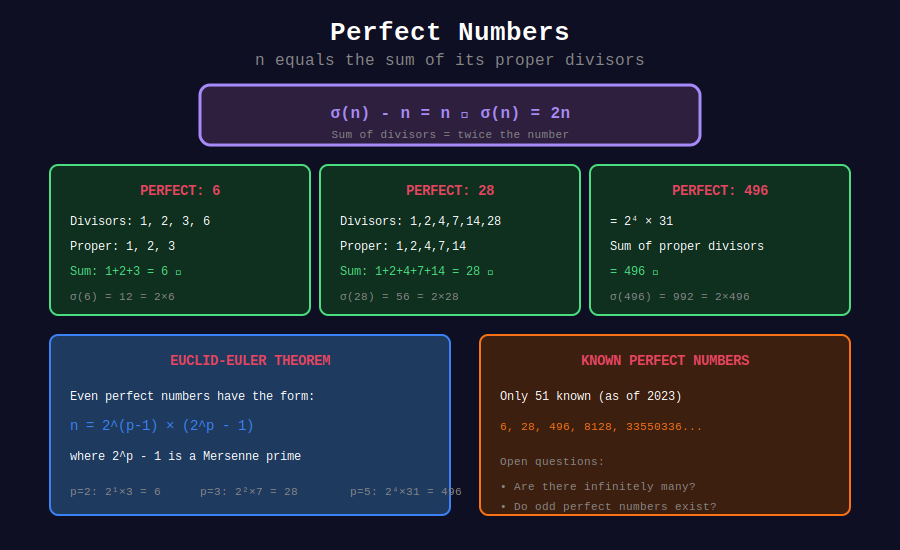

<div align="center">

# ✨ Perfect Numbers

<p>
  
  
  
</p>

**Numbers Equal to the Sum of Their Proper Divisors**

*Ancient mysteries that mathematicians still study today*

</div>

---

## 🧭 Navigation

| ⬅️ Previous | 📂 Current | ➡️ Next |
|:------------|:----------:|--------:|
| [← 02. Sum Divisors](../02_sum_divisors/README.md) | **03. Perfect Numbers** | [04. Divisor Properties →](../04_divisor_properties/README.md) |

---

## 📊 Visual Diagram

<div align="center">



</div>

---

## 📐 Mathematical Foundations

### 1️⃣ Definition

A positive integer n is **perfect** if it equals the sum of its proper divisors:

$$n = \sum_{\substack{d|n \\ d < n}} d$$

Equivalently: $\sigma(n) = 2n$

---

### 2️⃣ Known Perfect Numbers

| # | Perfect Number | Mersenne Exponent p | Year Discovered |
|:-:|----------------|:-------------------:|-----------------|
| 1 | 6 | 2 | Ancient |
| 2 | 28 | 3 | Ancient |
| 3 | 496 | 5 | Ancient |
| 4 | 8128 | 7 | Ancient |
| 5 | 33,550,336 | 13 | 1456 |
| 6 | 8,589,869,056 | 17 | 1588 |
| 7 | 137,438,691,328 | 19 | 1588 |

---

### 3️⃣ Euclid-Euler Theorem

**Theorem:** An even number is perfect **if and only if** it has the form:

$$n = 2^{p-1}(2^p - 1)$$

where $2^p - 1$ is a **Mersenne prime**.

**Proof Sketch:**

- If $M_p = 2^p - 1$ is prime, then $\sigma(M_p) = M_p + 1 = 2^p$

- $\sigma(2^{p-1}) = 2^p - 1$

- $\sigma(n) = \sigma(2^{p-1}) \cdot \sigma(M_p) = (2^p - 1) \cdot 2^p = 2n$ ✓

---

### 4️⃣ Odd Perfect Numbers

**Open Problem:** Do odd perfect numbers exist?

- If one exists, it must be greater than $10^{1500}$

- Must have at least 101 prime factors (counting multiplicity)

- Most mathematicians believe they don't exist

---

## 🎨 Visual Walkthrough

```
+-----------------------------------------------------------------+
| WHY 28 IS PERFECT                                              |
+-----------------------------------------------------------------+
|                                                                 |
| Proper divisors of 28: 1, 2, 4, 7, 14                          |
|                                                                 |
|       1                                                         |
|     + 2                                                         |
|     + 4                                                         |
|     + 7                                                         |
|    +14                                                          |
|   ----                                                          |
|     28  ✓                                                       |
|                                                                 |
| Using Euclid-Euler:                                             |
|   28 = 2^(3-1) × (2³ - 1)                                      |
|      = 4 × 7                                                    |
|   7 is prime (Mersenne prime M₃) ✓                             |
+-----------------------------------------------------------------+

```

---

## 💻 Code Implementations

### 1. Check if Perfect (LeetCode 507)

```python
def check_perfect_number(num: int) -> bool:
    """
    LeetCode 507: Perfect Number
    
    Time: O(√n)
    Space: O(1)
    
    Examples:
        >>> check_perfect_number(28)
        True
        >>> check_perfect_number(7)
        False
    """
    if num <= 1:
        return False
    
    divisor_sum = 1  # 1 is always a proper divisor
    d = 2
    
    while d * d <= num:
        if num % d == 0:
            divisor_sum += d
            if d * d != num:
                divisor_sum += num // d
            
            # Early termination if sum exceeds num
            if divisor_sum > num:
                return False
        d += 1
    
    return divisor_sum == num

# Test
print(check_perfect_number(6))     # True
print(check_perfect_number(28))    # True
print(check_perfect_number(496))   # True
print(check_perfect_number(12))    # False (sum = 16)

```

### 2. Generate Perfect Numbers

```python
def generate_perfect_numbers(count: int) -> list[int]:
    """
    Generate first 'count' even perfect numbers using Euclid-Euler.
    
    Perfect = 2^(p-1) × (2^p - 1) where 2^p - 1 is Mersenne prime.
    """
    def is_prime(n: int) -> bool:
        if n < 2:
            return False
        if n == 2:
            return True
        if n % 2 == 0:
            return False
        for i in range(3, int(n**0.5) + 1, 2):
            if n % i == 0:
                return False
        return True
    
    perfect = []
    p = 2
    
    while len(perfect) < count:
        mersenne = (1 << p) - 1  # 2^p - 1
        
        if is_prime(mersenne):
            perfect_num = (1 << (p - 1)) * mersenne
            perfect.append(perfect_num)
        
        p += 1
    
    return perfect

# Generate first 5 perfect numbers
print(generate_perfect_numbers(5))
# [6, 28, 496, 8128, 33550336]

```

### 3. Classify Numbers (Perfect/Deficient/Abundant)

```python
def classify_number(n: int) -> str:
    """
    Classify n as perfect, deficient, or abundant.
    """
    if n <= 1:
        return "deficient"
    
    proper_sum = 1
    d = 2
    while d * d <= n:
        if n % d == 0:
            proper_sum += d
            if d * d != n:
                proper_sum += n // d
        d += 1
    
    if proper_sum == n:
        return "perfect"
    elif proper_sum < n:
        return "deficient"
    else:
        return "abundant"

# Examples
for i in range(1, 30):
    classification = classify_number(i)
    if classification != "deficient":
        print(f"{i}: {classification}")

```

### 4. Find All Abundant Numbers

```python
def find_abundant_numbers(limit: int) -> list[int]:
    """
    Find all abundant numbers up to limit.
    
    Abundant: σ(n) > 2n, or equivalently, s(n) > n
    """
    abundant = []
    
    for n in range(12, limit + 1):  # 12 is smallest abundant
        proper_sum = 1
        d = 2
        while d * d <= n:
            if n % d == 0:
                proper_sum += d
                if d * d != n:
                    proper_sum += n // d
            d += 1
        
        if proper_sum > n:
            abundant.append(n)
    
    return abundant

# First 10 abundant numbers
print(find_abundant_numbers(50))
# [12, 18, 20, 24, 30, 36, 40, 42, 48]

```

### 5. Check Mersenne Prime

```python
def is_mersenne_prime(p: int) -> bool:
    """
    Check if 2^p - 1 is a Mersenne prime using Lucas-Lehmer test.
    
    Only works for odd primes p.
    """
    if p == 2:
        return True  # 2^2 - 1 = 3 is prime
    
    # p must be prime for 2^p - 1 to possibly be prime
    def is_prime(n):
        if n < 2:
            return False
        for i in range(2, int(n**0.5) + 1):
            if n % i == 0:
                return False
        return True
    
    if not is_prime(p):
        return False
    
    # Lucas-Lehmer test
    M = (1 << p) - 1  # 2^p - 1
    s = 4
    
    for _ in range(p - 2):
        s = (s * s - 2) % M
    
    return s == 0

# Find Mersenne prime exponents
for p in range(2, 20):
    if is_mersenne_prime(p):
        print(f"M_{p} = {(1 << p) - 1} is prime")

```

---

## 🏆 LeetCode Problem

### LeetCode 507: Perfect Number

```python
class Solution:
    def checkPerfectNumber(self, num: int) -> bool:
        """
        Check if num is perfect.
        
        Time: O(√n)
        Space: O(1)
        """
        if num <= 1:
            return False
        
        total = 1
        i = 2
        
        while i * i <= num:
            if num % i == 0:
                total += i
                if i != num // i:
                    total += num // i
            i += 1
        
        return total == num

```

---

## 💡 Key Insights

### 1. Why Perfect Numbers Are Rare

- Only 51 perfect numbers are known (as of 2024)

- Each corresponds to a Mersenne prime

- Finding new Mersenne primes is computationally intensive

### 2. Related Number Types

| Type | Definition | Example |
|------|------------|---------|
| **Perfect** | s(n) = n | 6, 28 |
| **Almost Perfect** | s(n) = n - 1 | Powers of 2 |
| **Quasiperfect** | s(n) = n + 1 | None known! |
| **Multiperfect** | s(n) = kn | 120: s(120)=240=2×120 |
| **Amicable** | s(a)=b, s(b)=a | (220, 284) |

### 3. Amicable Numbers

Two numbers (a, b) are amicable if each is the sum of the other's proper divisors.

```python
def are_amicable(a: int, b: int) -> bool:
    return sum_proper_divisors(a) == b and sum_proper_divisors(b) == a

# First pair: (220, 284)
# s(220) = 1+2+4+5+10+11+20+22+44+55+110 = 284
# s(284) = 1+2+4+71+142 = 220

```

---

## 📚 References

| Resource | Link |
|----------|------|
| **Wikipedia** | [Perfect Number](https://en.wikipedia.org/wiki/Perfect_number) |
| **GIMPS Project** | [Great Internet Mersenne Prime Search](https://www.mersenne.org/) |
| **OEIS A000396** | [Perfect Numbers](https://oeis.org/A000396) |

---

<div align="center">

**Made with ❤️ by [Gaurav Goswami](https://github.com/Gaurav14cs17)**

</div>

---

## 🧭 Navigation

| ⬅️ Previous | 📂 Current | ➡️ Next |
|:------------|:----------:|--------:|
| [← 02. Sum Divisors](../02_sum_divisors/README.md) | **03. Perfect Numbers** | [04. Divisor Properties →](../04_divisor_properties/README.md) |
