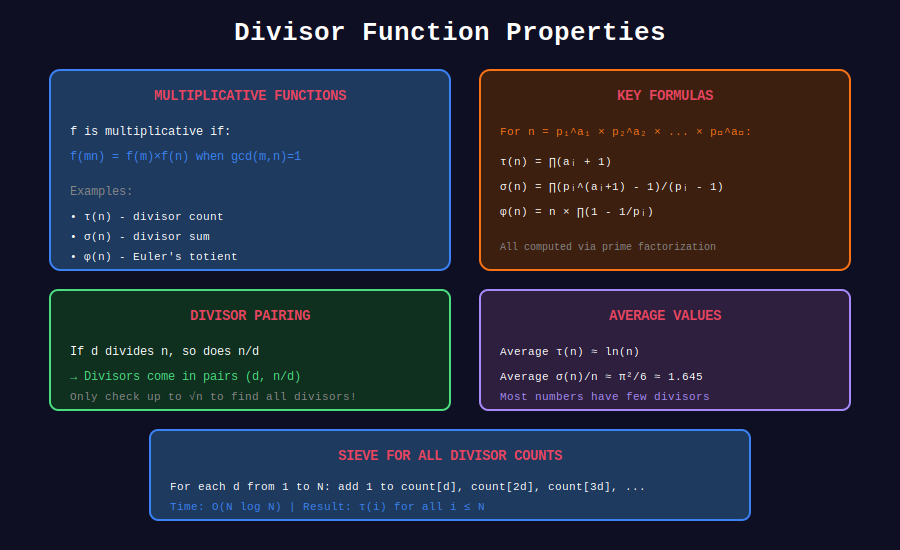

<div align="center">

# 🔍 Divisor Properties

<p>
  
  
</p>

**Multiplicative Functions and Divisor Identities**

*The elegant mathematics behind divisor functions*

</div>

---

## 🧭 Navigation

| ⬅️ Previous | 📂 Current | ➡️ Next |
|:------------|:----------:|--------:|
| [← 03. Perfect Numbers](../03_perfect_numbers/README.md) | **04. Divisor Properties** | [05. Sieve Divisors →](../05_sieve_divisors/README.md) |

---

## 📊 Visual Diagram

<div align="center">



</div>

---

## 📐 Mathematical Foundations

### 1️⃣ Multiplicative Functions

A function f is **multiplicative** if:
- f(1) = 1
- f(mn) = f(m)f(n) whenever gcd(m,n) = 1

**Key multiplicative functions:**
- τ(n) - divisor count
- σ(n) - divisor sum
- φ(n) - Euler's totient
- μ(n) - Möbius function

---

### 2️⃣ Key Identities

**Sum over Divisors:**
```math
\sum_{d|n} \phi(d) = n
```

**Möbius Inversion:**
```math
g(n) = \sum_{d|n} f(d) \implies f(n) = \sum_{d|n} \mu(d) g(n/d)
```

**Dirichlet Convolution:**
```math
\tau = 1 * 1
\sigma = \text{id} * 1
```

---

### 3️⃣ Product Formula

For multiplicative f, if $n = p\_1^{a\_1} \cdots p\_k^{a\_k}$:

```math
f(n) = f(p_1^{a_1}) \cdot f(p_2^{a_2}) \cdots f(p_k^{a_k})
```

---

## 💻 Code Implementations

### 1. Get All Divisors

```python
def get_divisors(n: int) -> list[int]:
    """
    Get all divisors of n in sorted order.
    
    Time: O(√n)
    Space: O(number of divisors)
    """
    if n <= 0:
        return []
    
    small = []
    large = []
    
    d = 1
    while d * d <= n:
        if n % d == 0:
            small.append(d)
            if d * d != n:
                large.append(n // d)
        d += 1
    
    return small + large[::-1]

# Example
print(get_divisors(60))
# [1, 2, 3, 4, 5, 6, 10, 12, 15, 20, 30, 60]
```

### 2. Möbius Function

```python
def mobius(n: int) -> int:
    """
    Compute the Möbius function μ(n).
    
    μ(n) = 1  if n is square-free with even number of prime factors
    μ(n) = -1 if n is square-free with odd number of prime factors
    μ(n) = 0  if n has a squared prime factor
    """
    if n == 1:
        return 1
    
    prime_count = 0
    d = 2
    
    while d * d <= n:
        if n % d == 0:
            n //= d
            prime_count += 1
            
            if n % d == 0:
                return 0  # Squared factor
        d += 1
    
    if n > 1:
        prime_count += 1
    
    return -1 if prime_count % 2 == 1 else 1

# Examples
print(mobius(1))   # 1
print(mobius(6))   # 1 (6 = 2×3, two primes)
print(mobius(30))  # -1 (30 = 2×3×5, three primes)
print(mobius(4))   # 0 (4 = 2²)
```

### 3. Common Divisors of Two Numbers

```python
from math import gcd

def common_divisors(a: int, b: int) -> list[int]:
    """
    Find all common divisors of a and b.
    
    Common divisors = divisors of gcd(a, b)
    """
    return get_divisors(gcd(a, b))

# Example
print(common_divisors(12, 18))  # [1, 2, 3, 6]
```

### 4. Count of Common Divisors

```python
def count_common_divisors(a: int, b: int) -> int:
    """Number of common divisors."""
    g = gcd(a, b)
    return count_divisors(g)

def gcd_sum(n: int) -> int:
    """
    Compute Σ gcd(i, n) for i = 1 to n.
    
    Formula: Σ_{d|n} d × φ(n/d)
    """
    from math import gcd
    
    total = 0
    for d in get_divisors(n):
        total += d * euler_phi(n // d)
    
    return total
```

### 5. Multiplicativity Verification

```python
def verify_multiplicativity(f, limit: int = 100) -> bool:
    """
    Verify that f is multiplicative for small values.
    """
    from math import gcd
    
    if f(1) != 1:
        return False
    
    for m in range(2, limit):
        for n in range(2, limit):
            if gcd(m, n) == 1:
                if f(m * n) != f(m) * f(n):
                    print(f"Failed: f({m}×{n}) ≠ f({m})×f({n})")
                    return False
    
    return True
```

---

## 💡 Key Insights

### Highly Composite Numbers

Numbers with record τ(n):

| n | τ(n) | Factorization |
|---|------|---------------|
| 1 | 1 | 1 |
| 2 | 2 | 2 |
| 6 | 4 | 2×3 |
| 12 | 6 | 2²×3 |
| 60 | 12 | 2²×3×5 |
| 120 | 16 | 2³×3×5 |
| 360 | 24 | 2³×3²×5 |
| 2520 | 48 | 2³×3²×5×7 |

### Divisor Bound

For most n: $\tau(n) = O(n^\epsilon)$ for any ε > 0

Average: $\frac{1}{n}\sum\_{i=1}^{n} \tau(i) \approx \ln n$

---

## 📖 References

| Resource | Link |
|----------|------|
| **Wikipedia** | [Multiplicative Function](https://en.wikipedia.org/wiki/Multiplicative_function) |
| **OEIS A002182** | [Highly Composite Numbers](https://oeis.org/A002182) |

---

<div align="center">

**Made with ❤️ by [Gaurav Goswami](https://github.com/Gaurav14cs17)**

</div>

---

## 🧭 Navigation

| ⬅️ Previous | 📂 Current | ➡️ Next |
|:------------|:----------:|--------:|
| [← 03. Perfect Numbers](../03_perfect_numbers/README.md) | **04. Divisor Properties** | [05. Sieve Divisors →](../05_sieve_divisors/README.md) |
