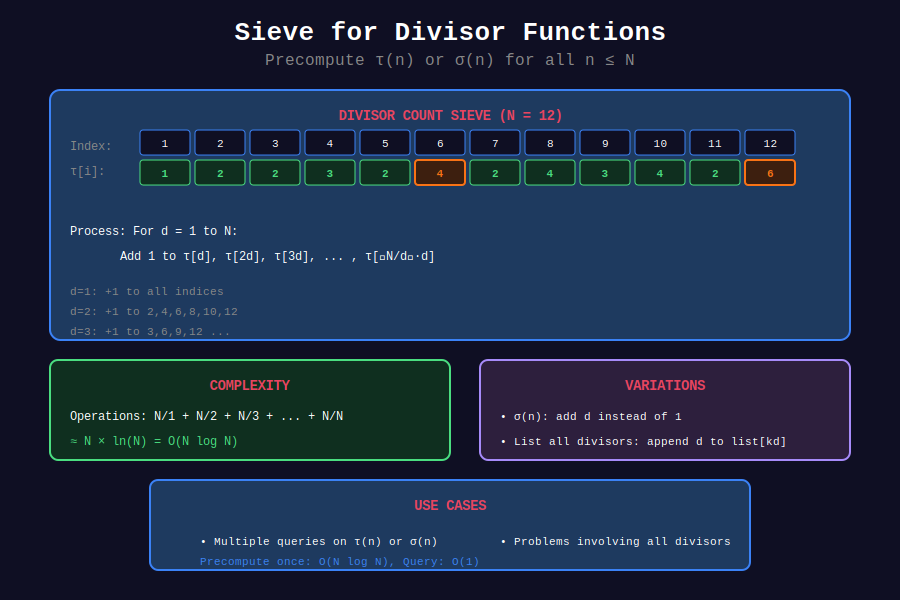

<div align="center">

# 🔢 Sieve for Divisors

<p>
  
  
  
</p>

**Precomputing Divisor Functions Efficiently**

*Batch processing for multiple queries*

</div>

---

## 🧭 Navigation

| ⬅️ Previous | 📂 Current | ➡️ Next |
|:------------|:----------:|--------:|
| [← 04. Divisor Properties](../04_divisor_properties/README.md) | **05. Sieve Divisors** | [06. Applications →](../06_applications/README.md) |

---

## 📐 Overview

When you need divisor information for many numbers, precomputation is faster than computing each individually.

---

## 📊 Visual Diagram

<div align="center">



</div>

---

## 💻 Code Implementations

### 1. Sieve for Divisor Count τ(n)

```python
def sieve_divisor_count(limit: int) -> list[int]:
    """
    Compute τ(i) for all i from 0 to limit.
    
    Time: O(n log n)
    Space: O(n)
    
    Idea: For each d, add 1 to all multiples of d.
    """
    tau = [0] * (limit + 1)
    
    for d in range(1, limit + 1):
        for multiple in range(d, limit + 1, d):
            tau[multiple] += 1
    
    return tau

# Example
tau = sieve_divisor_count(20)
print("τ values:", tau[1:21])
# [1, 2, 2, 3, 2, 4, 2, 4, 3, 4, 2, 6, 2, 4, 4, 5, 2, 6, 2, 6]

```

### 2. Sieve for Divisor Sum σ(n)

```python
def sieve_divisor_sum(limit: int) -> list[int]:
    """
    Compute σ(i) for all i from 0 to limit.
    
    Time: O(n log n)
    Space: O(n)
    """
    sigma = [0] * (limit + 1)
    
    for d in range(1, limit + 1):
        for multiple in range(d, limit + 1, d):
            sigma[multiple] += d
    
    return sigma

# Example
sigma = sieve_divisor_sum(20)
for i in range(1, 21):
    print(f"σ({i}) = {sigma[i]}")

```

### 3. Smallest Prime Factor (SPF) Sieve

```python
def spf_sieve(limit: int) -> list[int]:
    """
    Compute smallest prime factor for each number.
    
    Time: O(n log log n)
    Space: O(n)
    
    This enables O(log n) factorization!
    """
    spf = list(range(limit + 1))  # spf[i] = i initially
    
    for i in range(2, int(limit**0.5) + 1):
        if spf[i] == i:  # i is prime
            for j in range(i * i, limit + 1, i):
                if spf[j] == j:  # Not yet assigned
                    spf[j] = i
    
    return spf

def factorize_with_spf(n: int, spf: list[int]) -> dict[int, int]:
    """
    Factorize n using precomputed SPF.
    
    Time: O(log n)
    """
    factors = {}
    while n > 1:
        p = spf[n]
        factors[p] = factors.get(p, 0) + 1
        n //= p
    return factors

# Example
spf = spf_sieve(1000)
print(factorize_with_spf(360, spf))  # {2: 3, 3: 2, 5: 1}

```

### 4. Sieve for Largest Prime Factor

```python
def lpf_sieve(limit: int) -> list[int]:
    """
    Compute largest prime factor for each number.
    
    Time: O(n log n)
    """
    lpf = list(range(limit + 1))
    
    for i in range(2, limit + 1):
        if lpf[i] == i:  # i is prime
            for j in range(i, limit + 1, i):
                lpf[j] = i  # Update to larger prime
    
    return lpf

lpf = lpf_sieve(20)
print("LPF values:", lpf[1:21])

```

### 5. Sieve for Number of Distinct Prime Factors

```python
def omega_sieve(limit: int) -> list[int]:
    """
    Compute ω(n) = number of distinct prime factors.
    
    Time: O(n log log n)
    """
    omega = [0] * (limit + 1)
    
    for i in range(2, limit + 1):
        if omega[i] == 0:  # i is prime
            for j in range(i, limit + 1, i):
                omega[j] += 1
    
    return omega

omega = omega_sieve(20)
print("ω values:", omega[1:21])
# ω(1)=0, ω(6)=2 (6=2×3), ω(12)=2 (12=2²×3)

```

### 6. Sieve for Euler's Totient φ(n)

```python
def phi_sieve(limit: int) -> list[int]:
    """
    Compute φ(i) for all i from 0 to limit.
    
    Time: O(n log log n)
    """
    phi = list(range(limit + 1))  # φ(n) = n initially
    
    for i in range(2, limit + 1):
        if phi[i] == i:  # i is prime
            for j in range(i, limit + 1, i):
                phi[j] -= phi[j] // i
    
    return phi

phi = phi_sieve(20)
print("φ values:", phi[1:21])

```

### 7. Sieve for Möbius Function

```python
def mobius_sieve(limit: int) -> list[int]:
    """
    Compute μ(i) for all i from 0 to limit.
    
    Time: O(n log log n)
    """
    mu = [1] * (limit + 1)
    is_prime = [True] * (limit + 1)
    
    for i in range(2, limit + 1):
        if is_prime[i]:
            for j in range(i, limit + 1, i):
                is_prime[j] = (j == i)
                mu[j] *= -1
            for j in range(i * i, limit + 1, i * i):
                mu[j] = 0
    
    mu[0] = 0
    return mu

mu = mobius_sieve(20)
print("μ values:", mu[1:21])

```

---

## 🎨 Complexity Comparison

| Sieve Type | Time | Space | Use Case |
|------------|------|-------|----------|
| Divisor Count | O(n log n) | O(n) | τ(n) for all n |
| Divisor Sum | O(n log n) | O(n) | σ(n) for all n |
| SPF | O(n log log n) | O(n) | Fast factorization |
| Euler Totient | O(n log log n) | O(n) | φ(n) for all n |
| Möbius | O(n log log n) | O(n) | μ(n) for all n |

---

## 💡 When to Use Sieves

✅ **Use sieves when:**
- Multiple queries on range [1, n]

- n ≤ 10^7 (memory constraint)

- Need O(1) or O(log n) per query

❌ **Don't use sieves when:**
- Single query for large n

- n > 10^8 (too much memory)

- Only need a few values

---

<div align="center">

**Made with ❤️ by [Gaurav Goswami](https://github.com/Gaurav14cs17)**

</div>

---

## 🧭 Navigation

| ⬅️ Previous | 📂 Current | ➡️ Next |
|:------------|:----------:|--------:|
| [← 04. Divisor Properties](../04_divisor_properties/README.md) | **05. Sieve Divisors** | [06. Applications →](../06_applications/README.md) |
