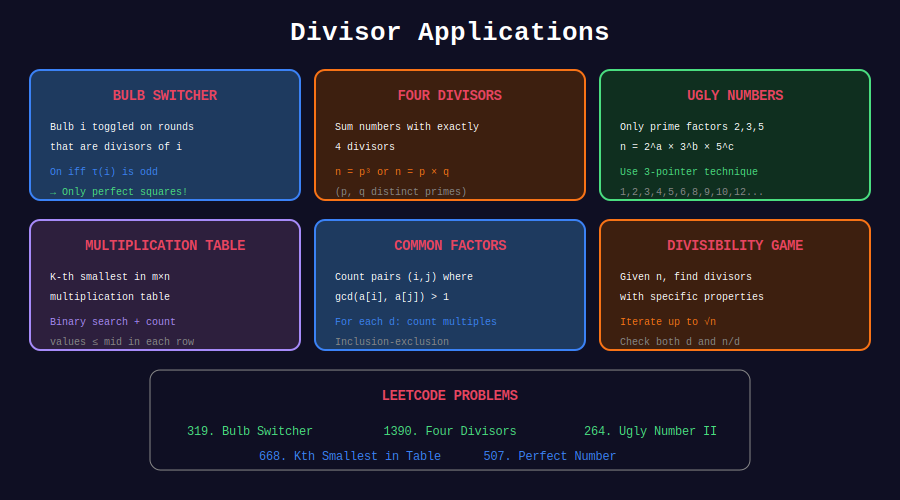

<div align="center">

# 🎯 Divisor Applications

<p>
  
  
</p>

**LeetCode Problems & Competition Patterns**

</div>

---

## 🧭 Navigation

| ⬅️ Previous | 📂 Current | ➡️ Next |
|:------------|:----------:|--------:|
| [← 05. Sieve Divisors](../05_sieve_divisors/README.md) | **06. Applications** | [🏠 Divisors Home](../README.md) |

---

## 📊 Visual Diagram

<div align="center">



</div>

---

## 🏆 LeetCode Problems

| # | Problem | Difficulty | Key Concept | Link |
|:-:|---------|:----------:|-------------|------|
| 507 | Perfect Number | 🟢 Easy | σ(n) = 2n | [LeetCode](https://leetcode.com/problems/perfect-number/) |
| 1952 | Three Divisors | 🟢 Easy | τ(n) = 3 → p² | [LeetCode](https://leetcode.com/problems/three-divisors/) |
| 1390 | Four Divisors | 🟡 Medium | τ(n) = 4 | [LeetCode](https://leetcode.com/problems/four-divisors/) |
| 1492 | The kth Factor of n | 🟡 Medium | k-th divisor | [LeetCode](https://leetcode.com/problems/the-kth-factor-of-n/) |
| 829 | Consecutive Numbers Sum | 🔴 Hard | Odd divisors | [LeetCode](https://leetcode.com/problems/consecutive-numbers-sum/) |
| 952 | Largest Component Size | 🔴 Hard | Common factors | [LeetCode](https://leetcode.com/problems/largest-component-size-by-common-factor/) |

---

## 🎯 Complete Solutions

### LeetCode 507: Perfect Number

```python
class Solution:
    def checkPerfectNumber(self, num: int) -> bool:
        if num <= 1:
            return False
        
        total = 1
        d = 2
        while d * d <= num:
            if num % d == 0:
                total += d
                if d != num // d:
                    total += num // d
            d += 1
        
        return total == num

```

### LeetCode 1952: Three Divisors

```python
class Solution:
    def isThree(self, n: int) -> bool:
        """τ(n) = 3 iff n = p² for prime p."""
        root = int(n ** 0.5)
        if root * root != n:
            return False
        
        # Check if root is prime
        if root < 2:
            return False
        for i in range(2, int(root**0.5) + 1):
            if root % i == 0:
                return False
        return True

```

### LeetCode 1390: Four Divisors

```python
class Solution:
    def sumFourDivisors(self, nums: list[int]) -> int:
        def get_sum_if_four(n):
            divisors = []
            d = 1
            while d * d <= n:
                if n % d == 0:
                    divisors.append(d)
                    if d * d != n:
                        divisors.append(n // d)
                    if len(divisors) > 4:
                        return 0
                d += 1
            return sum(divisors) if len(divisors) == 4 else 0
        
        return sum(get_sum_if_four(n) for n in nums)

```

### LeetCode 1492: The kth Factor of n

```python
class Solution:
    def kthFactor(self, n: int, k: int) -> int:
        # Method 1: O(√n)
        factors = []
        d = 1
        while d * d <= n:
            if n % d == 0:
                factors.append(d)
            d += 1
        
        # Add larger factors in reverse
        idx = len(factors) - 1
        if factors[idx] ** 2 == n:
            idx -= 1
        
        large = []
        while idx >= 0:
            large.append(n // factors[idx])
            idx -= 1
        
        all_factors = factors + large
        
        return all_factors[k-1] if k <= len(all_factors) else -1

```

### LeetCode 829: Consecutive Numbers Sum

```python
class Solution:
    def consecutiveNumbersSum(self, n: int) -> int:
        """
        n = k*a + k*(k-1)/2 where a is starting number.
        Rearranging: a = (n - k*(k-1)/2) / k
        Need a > 0 and a is integer.
        
        Count valid k values.
        """
        count = 0
        k = 1
        while k * (k - 1) // 2 < n:
            remainder = n - k * (k - 1) // 2
            if remainder % k == 0:
                count += 1
            k += 1
        return count

```

### LeetCode 952: Largest Component Size by Common Factor

```python
class Solution:
    def largestComponentSize(self, nums: list[int]) -> int:
        from collections import defaultdict
        
        # Union-Find with path compression
        parent = {}
        rank = defaultdict(int)
        
        def find(x):
            if x not in parent:
                parent[x] = x
            if parent[x] != x:
                parent[x] = find(parent[x])
            return parent[x]
        
        def union(x, y):
            px, py = find(x), find(y)
            if px != py:
                if rank[px] < rank[py]:
                    px, py = py, px
                parent[py] = px
                if rank[px] == rank[py]:
                    rank[px] += 1
        
        # For each number, union it with its prime factors
        def prime_factors(n):
            factors = set()
            d = 2
            while d * d <= n:
                if n % d == 0:
                    factors.add(d)
                    while n % d == 0:
                        n //= d
                d += 1
            if n > 1:
                factors.add(n)
            return factors
        
        for num in nums:
            primes = prime_factors(num)
            for p in primes:
                union(num, p)
        
        # Count component sizes
        count = defaultdict(int)
        for num in nums:
            count[find(num)] += 1
        
        return max(count.values())

```

---

## 📚 Common Patterns

### 1. Divisor Counting Problems
- Use formula τ(n) = ∏(aᵢ + 1)
- Special cases: τ(n) = 2 (prime), τ(n) = 3 (p²)

### 2. Sum of Divisors Problems
- Perfect numbers: σ(n) = 2n
- Abundant/Deficient classification

### 3. k-th Divisor Problems
- Find divisors up to √n
- Pair small with large divisors

### 4. Common Factor Problems
- Use Union-Find with prime factors
- GCD-based connectivity

---

<div align="center">

**Made with ❤️ by [Gaurav Goswami](https://github.com/Gaurav14cs17)**

</div>

---

## 🧭 Navigation

| ⬅️ Previous | 📂 Current | ➡️ Next |
|:------------|:----------:|--------:|
| [← 05. Sieve Divisors](../05_sieve_divisors/README.md) | **06. Applications** | [🏠 Divisors Home](../README.md) |
