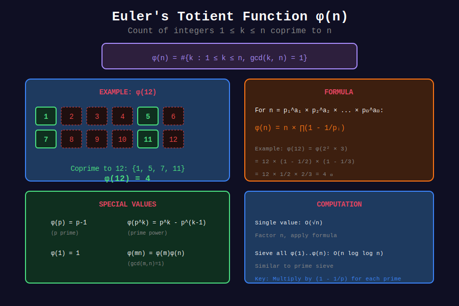

<div align="center">

# φ Basic Totient Function

<p>
  
  
  
</p>

**Counting Numbers Coprime to n**

*The fundamental function in modular arithmetic*

</div>

---

## 🧭 Navigation

| ⬅️ Previous | 📂 Current | ➡️ Next |
|:------------|:----------:|--------:|
| [🏠 Euler Totient Home](../README.md) | **01. Basic Totient** | [02. Properties →](../02_totient_properties/README.md) |

---

## 📊 Visual Diagram

<div align="center">



</div>

---

## 📐 Mathematical Foundations

### 1️⃣ Definition

**Euler's Totient Function:** $\phi(n)$ counts integers from 1 to n that are coprime to n.

$$\phi(n) = |\{k : 1 \leq k \leq n, \gcd(k, n) = 1\}|$$

---

### 2️⃣ The Product Formula

For $n = p_1^{a_1} \cdot p_2^{a_2} \cdots p_k^{a_k}$:

$$\phi(n) = n \prod_{p|n}\left(1 - \frac{1}{p}\right) = n \cdot \frac{p_1-1}{p_1} \cdot \frac{p_2-1}{p_2} \cdots$$

**Equivalently:**

$$\phi(n) = \prod_{i=1}^{k} p_i^{a_i - 1}(p_i - 1)$$

---

### 3️⃣ Special Cases

| n | φ(n) | Reason |
|---|------|--------|
| 1 | 1 | Only 1 is coprime to 1 |
| p (prime) | p - 1 | 1, 2, ..., p-1 are coprime |
| p^k | p^(k-1)(p-1) | Prime power formula |
| 2^k | 2^(k-1) | Half are odd |

---

## 🎨 Visual Walkthrough

```
+-----------------------------------------------------------------+
| COMPUTING φ(12)                                                |
+-----------------------------------------------------------------+
|                                                                 |
| Numbers 1 to 12:                                               |
|   1  2  3  4  5  6  7  8  9  10  11  12                       |
|   ✓  ✗  ✗  ✗  ✓  ✗  ✓  ✗  ✗   ✗   ✓   ✗                       |
|                                                                 |
| Coprime to 12: {1, 5, 7, 11}  → φ(12) = 4                     |
|                                                                 |
| Using formula:                                                  |
|   12 = 2² × 3                                                  |
|   φ(12) = 12 × (1 - 1/2) × (1 - 1/3)                          |
|         = 12 × 1/2 × 2/3                                       |
|         = 4 ✓                                                  |
+-----------------------------------------------------------------+

```

---

## 💻 Code Implementations

### 1. Euler's Totient Function

```python
def euler_phi(n: int) -> int:
    """
    Compute φ(n) using the product formula.
    
    Time: O(√n)
    Space: O(1)
    
    Examples:
        >>> euler_phi(1)
        1
        >>> euler_phi(12)
        4
        >>> euler_phi(36)
        12
    """
    if n <= 0:
        return 0
    
    result = n
    p = 2
    
    while p * p <= n:
        if n % p == 0:
            # Apply factor (1 - 1/p)
            result -= result // p
            
            # Remove all factors of p
            while n % p == 0:
                n //= p
        p += 1
    
    # If n > 1, it's a remaining prime factor
    if n > 1:
        result -= result // n
    
    return result

# Test cases
print(euler_phi(1))    # 1
print(euler_phi(2))    # 1
print(euler_phi(10))   # 4 (1, 3, 7, 9)
print(euler_phi(12))   # 4 (1, 5, 7, 11)
print(euler_phi(36))   # 12
print(euler_phi(97))   # 96 (prime)

```

### 2. List Coprimes Explicitly

```python
def list_coprimes(n: int) -> list[int]:
    """
    List all numbers from 1 to n that are coprime to n.
    
    Time: O(n log n) due to GCD calls
    """
    from math import gcd
    return [k for k in range(1, n + 1) if gcd(k, n) == 1]

# Example
print(list_coprimes(12))  # [1, 5, 7, 11]
print(list_coprimes(10))  # [1, 3, 7, 9]

```

### 3. Totient with Verbose Output

```python
def euler_phi_verbose(n: int) -> int:
    """
    Compute φ(n) with step-by-step output.
    """
    if n <= 0:
        return 0
    
    original = n
    result = n
    factors = []
    
    p = 2
    while p * p <= n:
        if n % p == 0:
            exp = 0
            while n % p == 0:
                exp += 1
                n //= p
            factors.append((p, exp))
            result = result - result // p
            print(f"Prime {p}^{exp}: result = {result}")
        p += 1
    
    if n > 1:
        factors.append((n, 1))
        result = result - result // n
        print(f"Prime {n}^1: result = {result}")
    
    print(f"\nφ({original}) = {result}")
    print(f"Factorization: {' × '.join(f'{p}^{e}' for p, e in factors)}")
    
    return result

euler_phi_verbose(360)

```

### 4. First n Values of Totient

```python
def first_totients(n: int) -> list[int]:
    """First n values of φ (1-indexed)."""
    return [euler_phi(i) for i in range(1, n + 1)]

# First 20 values
print(first_totients(20))
# [1, 1, 2, 2, 4, 2, 6, 4, 6, 4, 10, 4, 12, 6, 8, 8, 16, 6, 18, 8]

```

---

## 📊 Reference Table

| n | φ(n) | Coprimes |
|---|------|----------|
| 1 | 1 | {1} |
| 2 | 1 | {1} |
| 3 | 2 | {1, 2} |
| 4 | 2 | {1, 3} |
| 5 | 4 | {1, 2, 3, 4} |
| 6 | 2 | {1, 5} |
| 7 | 6 | {1, 2, 3, 4, 5, 6} |
| 8 | 4 | {1, 3, 5, 7} |
| 9 | 6 | {1, 2, 4, 5, 7, 8} |
| 10 | 4 | {1, 3, 7, 9} |
| 12 | 4 | {1, 5, 7, 11} |
| 36 | 12 | 12 values |

---

## 💡 Key Insights

### 1. φ(n) = n - 1 iff n is prime
The only numbers not coprime to a prime p are multiples of p, and only p itself (≤p) qualifies.

### 2. φ(2n) Relationship

- If n is odd: φ(2n) = φ(n)

- If n is even: φ(2n) = 2·φ(n)

### 3. Average Value

$$\frac{1}{n}\sum_{i=1}^{n} \phi(i) \approx \frac{3n}{\pi^2}$$

---

## 📖 References

| Resource | Link |
|----------|------|
| **Wikipedia** | [Euler's Totient Function](https://en.wikipedia.org/wiki/Euler%27s_totient_function) |
| **OEIS A000010** | [Totient Sequence](https://oeis.org/A000010) |

---

<div align="center">

**Made with ❤️ by [Gaurav Goswami](https://github.com/Gaurav14cs17)**

</div>

---

## 🧭 Navigation

| ⬅️ Previous | 📂 Current | ➡️ Next |
|:------------|:----------:|--------:|
| [🏠 Euler Totient Home](../README.md) | **01. Basic Totient** | [02. Properties →](../02_totient_properties/README.md) |
