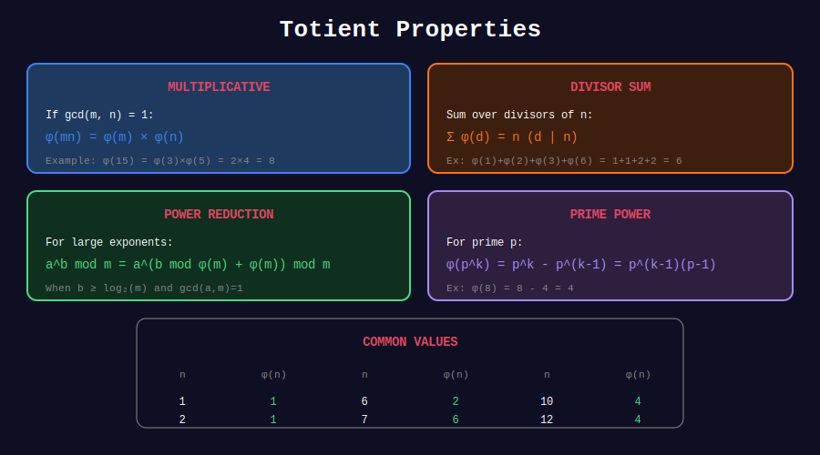

<div align="center">

# 📐 Totient Properties

<p>
  
  
</p>

**Key Identities and Theorems**

*The mathematical beauty of φ(n)*

</div>

---

## 🧭 Navigation

| ⬅️ Previous | 📂 Current | ➡️ Next |
|:------------|:----------:|--------:|
| [← 01. Basic Totient](../01_basic_totient/README.md) | **02. Properties** | [03. Euler's Theorem →](../03_euler_theorem/README.md) |

---

## 📊 Visual Diagram

<div align="center">



</div>

---

## 📐 Key Properties

### 1️⃣ Multiplicativity

```math
\phi(mn) = \phi(m) \cdot \phi(n) \text{ when } \gcd(m, n) = 1
```

**Example:** φ(12) = φ(4) × φ(3) = 2 × 2 = 4 ✓

---

### 2️⃣ Sum Over Divisors

```math
\sum_{d|n} \phi(d) = n
```

**Example for n = 12:**
- Divisors: 1, 2, 3, 4, 6, 12
- φ(1) + φ(2) + φ(3) + φ(4) + φ(6) + φ(12)
- = 1 + 1 + 2 + 2 + 2 + 4 = 12 ✓

---

### 3️⃣ Möbius Inversion

```math
\phi(n) = \sum_{d|n} \mu(d) \cdot \frac{n}{d} = n \sum_{d|n} \frac{\mu(d)}{d}
```

---

### 4️⃣ General Product Rule

For any m, n:

```math
\phi(mn) = \phi(m) \cdot \phi(n) \cdot \frac{d}{\phi(d)}
```

where d = gcd(m, n).

---

## 💻 Code Implementations

### 1. Verify Multiplicativity

```python
from math import gcd

def verify_multiplicativity(limit: int = 100) -> bool:
    """Verify φ(mn) = φ(m)φ(n) when gcd(m,n) = 1."""
    for m in range(1, limit):
        for n in range(1, limit):
            if gcd(m, n) == 1:
                if euler_phi(m * n) != euler_phi(m) * euler_phi(n):
                    return False
    return True

print(verify_multiplicativity())  # True
```

### 2. Verify Sum Property

```python
def verify_divisor_sum(n: int) -> bool:
    """Verify Σ φ(d) = n for all d|n."""
    divisors = []
    d = 1
    while d * d <= n:
        if n % d == 0:
            divisors.append(d)
            if d * d != n:
                divisors.append(n // d)
        d += 1
    
    return sum(euler_phi(d) for d in divisors) == n

# Test
for n in range(1, 50):
    assert verify_divisor_sum(n), f"Failed for n={n}"
print("All verified!")
```

### 3. General Product Formula

```python
def phi_product(m: int, n: int) -> int:
    """
    Compute φ(mn) using the general formula.
    
    φ(mn) = φ(m) × φ(n) × d / φ(d) where d = gcd(m, n)
    """
    d = gcd(m, n)
    return euler_phi(m) * euler_phi(n) * d // euler_phi(d)

# Test
print(phi_product(6, 10))  # φ(60) = 16
print(euler_phi(60))       # 16 ✓
```

### 4. Inversion Using Möbius

```python
def phi_via_mobius(n: int) -> int:
    """
    Compute φ(n) using Möbius inversion.
    
    φ(n) = Σ μ(d) × (n/d) for all d|n
    """
    divisors = []
    d = 1
    while d * d <= n:
        if n % d == 0:
            divisors.append(d)
            if d * d != n:
                divisors.append(n // d)
        d += 1
    
    return sum(mobius(d) * (n // d) for d in divisors)

# Verify
for n in range(1, 50):
    assert phi_via_mobius(n) == euler_phi(n)
```

---

## 📊 Special Values

| Form | φ(n) |
|------|------|
| n = 1 | 1 |
| n = 2 | 1 |
| n = p (prime) | p - 1 |
| n = p^k | p^(k-1)(p-1) |
| n = 2^k | 2^(k-1) |
| n = pq (p, q prime) | (p-1)(q-1) |

---

## 💡 Key Insights

> **Multiplicativity:** Reduces computation of φ(n) to prime power cases.

> **Divisor Sum:** Useful for counting lattice points and cyclic groups.

> **RSA Connection:** φ(pq) = (p-1)(q-1) is the key to RSA decryption.

---

<div align="center">

**Made with ❤️ by [Gaurav Goswami](https://github.com/Gaurav14cs17)**

</div>

---

## 🧭 Navigation

| ⬅️ Previous | 📂 Current | ➡️ Next |
|:------------|:----------:|--------:|
| [← 01. Basic Totient](../01_basic_totient/README.md) | **02. Properties** | [03. Euler's Theorem →](../03_euler_theorem/README.md) |
