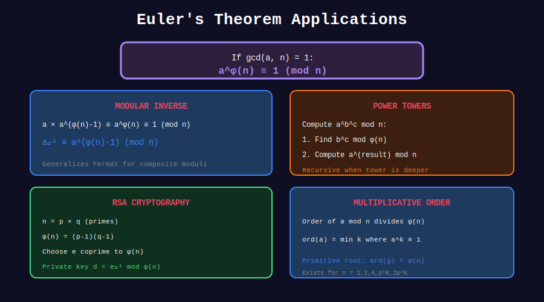

<div align="center">

# 🔐 Euler's Theorem

<p>
  
  
</p>

**The Foundation of Modern Cryptography**

*Generalizing Fermat's Little Theorem*

</div>

---

## 🧭 Navigation

| ⬅️ Previous | 📂 Current | ➡️ Next |
|:------------|:----------:|--------:|
| [← 02. Properties](../02_totient_properties/README.md) | **03. Euler's Theorem** | [04. Totient Sum →](../04_totient_sum/README.md) |

---

## 📊 Visual Diagram

<div align="center">



</div>

---

## 📐 The Theorem

### Statement

**Euler's Theorem:** If $\gcd(a, n) = 1$, then:

```math
a^{\phi(n)} \equiv 1 \pmod{n}
```

### Special Case: Fermat's Little Theorem

For prime p and $\gcd(a, p) = 1$:

```math
a^{p-1} \equiv 1 \pmod{p}
```

(Since φ(p) = p - 1)

---

## 🎨 Visual Proof Sketch

```
+-----------------------------------------------------------------+
| WHY a^φ(n) ≡ 1 (mod n)                                        |
+-----------------------------------------------------------------+
|                                                                 |
| Let R = {r₁, r₂, ..., rₖ} be the reduced residue system       |
| (all k = φ(n) elements coprime to n in [1, n])                 |
|                                                                 |
| Consider: aR = {ar₁, ar₂, ..., arₖ} (mod n)                   |
|                                                                 |
| Key observation: aR is a permutation of R!                      |
| (because gcd(a, n) = 1)                                         |
|                                                                 |
| Therefore:                                                       |
|   (ar₁)(ar₂)...(arₖ) ≡ r₁·r₂·...·rₖ (mod n)                  |
|   a^φ(n) · (r₁r₂...rₖ) ≡ r₁r₂...rₖ (mod n)                   |
|   a^φ(n) ≡ 1 (mod n) ✓                                        |
+-----------------------------------------------------------------+
```

---

## 💻 Code Implementations

### 1. Verify Euler's Theorem

```python
from math import gcd

def verify_euler(a: int, n: int) -> bool:
    """Verify a^φ(n) ≡ 1 (mod n) when gcd(a,n) = 1."""
    if gcd(a, n) != 1:
        return False
    
    phi_n = euler_phi(n)
    return pow(a, phi_n, n) == 1

# Test for various a, n
for n in range(2, 20):
    for a in range(2, n):
        if gcd(a, n) == 1:
            assert verify_euler(a, n), f"Failed: a={a}, n={n}"
print("Euler's theorem verified!")
```

### 2. Modular Exponentiation with Euler

```python
def mod_pow_euler(a: int, k: int, n: int) -> int:
    """
    Compute a^k mod n for very large k.
    
    Uses Euler's theorem to reduce exponent when gcd(a,n) = 1.
    
    Time: O(log(k mod φ(n)) + √n)
    """
    if gcd(a, n) == 1:
        phi_n = euler_phi(n)
        k = k % phi_n  # Reduce exponent!
    
    return pow(a, k, n)

# Example: 2^(10^18) mod 1000
print(mod_pow_euler(2, 10**18, 1000))  # Fast!
```

### 3. Modular Inverse via Euler

```python
def mod_inverse_euler(a: int, n: int) -> int:
    """
    Find a⁻¹ mod n using Euler's theorem.
    
    a⁻¹ ≡ a^(φ(n)-1) (mod n)
    
    Returns None if inverse doesn't exist.
    """
    if gcd(a, n) != 1:
        return None
    
    phi_n = euler_phi(n)
    return pow(a, phi_n - 1, n)

# Example
print(mod_inverse_euler(3, 11))  # 4, because 3×4 ≡ 1 (mod 11)
```

### 4. RSA Key Generation

```python
def rsa_demo():
    """
    Demonstrate RSA encryption/decryption using Euler's theorem.
    """

    # 1. Choose two primes
    p, q = 61, 53
    n = p * q  # 3233
    phi_n = (p - 1) * (q - 1)  # 3120
    
    # 2. Choose public exponent e
    e = 17  # Common choice, coprime to φ(n)
    
    # 3. Compute private exponent d
    d = pow(e, -1, phi_n)  # 2753
    
    print(f"Public key: (n={n}, e={e})")
    print(f"Private key: d={d}")
    
    # 4. Encrypt
    message = 65
    cipher = pow(message, e, n)
    print(f"Encrypt: {message} → {cipher}")
    
    # 5. Decrypt
    decrypted = pow(cipher, d, n)
    print(f"Decrypt: {cipher} → {decrypted}")
    
    # Why it works:
    # cipher^d = (m^e)^d = m^(ed)
    # ed ≡ 1 (mod φ(n)), so ed = 1 + k·φ(n)
    # m^(ed) = m · (m^φ(n))^k ≡ m · 1^k ≡ m (mod n)

rsa_demo()
```

---

## 🏆 LeetCode Problems

| # | Problem | Difficulty | Key Concept |
|:-:|---------|:----------:|-------------|
| 372 | [Super Pow](https://leetcode.com/problems/super-pow/) | 🟡 Medium | Euler's theorem |
| 1922 | [Count Good Numbers](https://leetcode.com/problems/count-good-numbers/) | 🟡 Medium | Fast power |

---

## 💡 Key Insights

> **Exponent Reduction:** a^k mod n = a^(k mod φ(n)) mod n when gcd(a,n) = 1

> **Fermat as Special Case:** φ(p) = p-1 for prime p

> **RSA Foundation:** Security relies on difficulty of computing φ(n) = (p-1)(q-1) without knowing p, q

---

<div align="center">

**Made with ❤️ by [Gaurav Goswami](https://github.com/Gaurav14cs17)**

</div>

---

## 🧭 Navigation

| ⬅️ Previous | 📂 Current | ➡️ Next |
|:------------|:----------:|--------:|
| [← 02. Properties](../02_totient_properties/README.md) | **03. Euler's Theorem** | [04. Totient Sum →](../04_totient_sum/README.md) |
