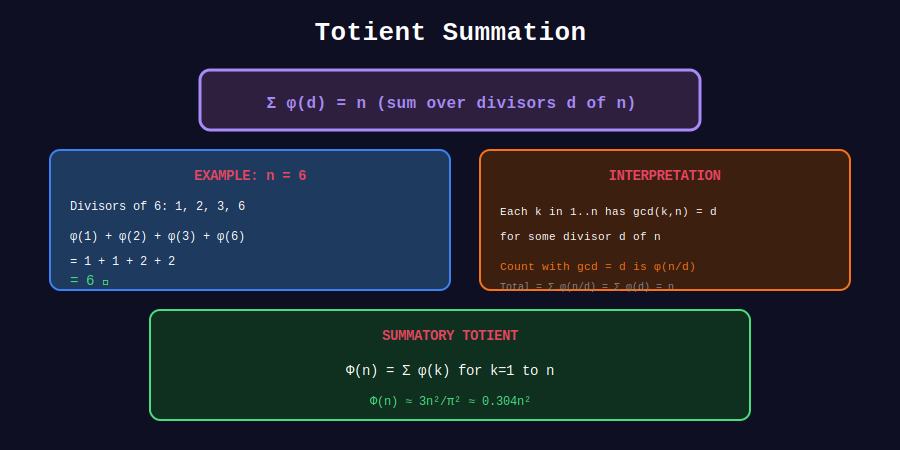

<div align="center">

# 📈 Totient Summation

<p>
  
  
</p>

**Computing Sums of Totient Values**

*Sieving and batch computation techniques*

</div>

---

## 🧭 Navigation

| ⬅️ Previous | 📂 Current | ➡️ Next |
|:------------|:----------:|--------:|
| [← 03. Euler's Theorem](../03_euler_theorem/README.md) | **04. Totient Sum** | [05. Applications →](../05_applications/README.md) |

---

## 📊 Visual Diagram

<div align="center">



</div>

---

## 📐 Mathematical Background

### Totient Summatory Function

```math
\Phi(n) = \sum_{i=1}^{n} \phi(i)

```

**Asymptotic:** $\Phi(n) \approx \frac{3n^2}{\pi^2}$

### Relationship to Farey Sequence

$\Phi(n) = 1 + |F_n|$ where $F_n$ is the Farey sequence of order n.

---

## 💻 Code Implementations

### 1. Totient Sieve

```python
def phi_sieve(limit: int) -> list[int]:
    """
    Compute φ(i) for all i from 0 to limit.
    
    Time: O(n log log n)
    Space: O(n)
    
    Uses a sieve-like approach:
    For each prime p, multiply all multiples by (1 - 1/p).
    """
    phi = list(range(limit + 1))  # φ(n) = n initially
    
    for i in range(2, limit + 1):
        if phi[i] == i:  # i is prime
            for j in range(i, limit + 1, i):
                phi[j] -= phi[j] // i
    
    return phi

# Example
phi = phi_sieve(20)
print("φ values:", phi[1:21])
# [1, 1, 2, 2, 4, 2, 6, 4, 6, 4, 10, 4, 12, 6, 8, 8, 16, 6, 18, 8]

```

### 2. Totient Summatory Function

```python
def totient_sum(n: int) -> int:
    """
    Compute Σ φ(i) for i = 1 to n.
    
    Time: O(n log log n)
    """
    phi = phi_sieve(n)
    return sum(phi[1:n+1])

# Example
print(totient_sum(10))  # 1+1+2+2+4+2+6+4+6+4 = 32
print(totient_sum(100))  # 3044

```

### 3. GCD Sum Using Totient

```python
def gcd_sum(n: int) -> int:
    """
    Compute Σᵢ Σⱼ gcd(i, j) for 1 ≤ i, j ≤ n.
    
    Formula: Σ_{d=1}^{n} φ(d) × ⌊n/d⌋²
    
    Time: O(n log log n)
    """
    phi = phi_sieve(n)
    
    result = 0
    for d in range(1, n + 1):
        result += phi[d] * (n // d) ** 2
    
    return result

print(gcd_sum(10))  # Sum of all gcd(i,j) for i,j ≤ 10

```

### 4. Count Coprime Pairs

```python
def count_coprime_pairs(n: int) -> int:
    """
    Count pairs (i, j) with 1 ≤ i < j ≤ n and gcd(i, j) = 1.
    
    Formula: (Σ φ(i) for i=2 to n) = Φ(n) - 1
    """
    phi = phi_sieve(n)
    return sum(phi[2:n+1])

def count_coprime_pairs_with_n(n: int) -> int:
    """
    Count i with 1 ≤ i ≤ n and gcd(i, n) = 1.
    
    This is exactly φ(n)!
    """
    return euler_phi(n)

```

### 5. Sublinear Totient Sum (Advanced)

```python
def totient_sum_fast(n: int) -> int:
    """
    Compute Σ φ(i) for i = 1 to n in O(n^(2/3)) time.
    
    Uses: Φ(n) = n(n+1)/2 - Σ_{d=2}^{n} Φ(⌊n/d⌋)
    with memoization and sqrt decomposition.
    """
    if n == 0:
        return 0
    
    # Precompute small values
    LIMIT = int(n ** 0.67) + 1
    phi = phi_sieve(LIMIT)
    prefix = [0] * (LIMIT + 1)
    for i in range(1, LIMIT + 1):
        prefix[i] = prefix[i-1] + phi[i]
    
    cache = {}
    
    def solve(m):
        if m <= LIMIT:
            return prefix[m]
        if m in cache:
            return cache[m]
        
        result = m * (m + 1) // 2
        
        v = 2
        while v <= m:
            next_v = m // (m // v) + 1
            result -= (next_v - v) * solve(m // v)
            v = next_v
        
        cache[m] = result
        return result
    
    return solve(n)

```

---

## 💡 Key Insights

> **Linear Sieve:** Computing all φ(i) for i ≤ n takes O(n log log n).

> **GCD Sum Identity:** $\sum_{i,j} \gcd(i,j) = \sum_d \phi(d) \lfloor n/d \rfloor^2$

> **Sublinear Algorithm:** Φ(n) can be computed in O(n^(2/3)) using Dirichlet hyperbola method.

---

<div align="center">

**Made with ❤️ by [Gaurav Goswami](https://github.com/Gaurav14cs17)**

</div>

---

## 🧭 Navigation

| ⬅️ Previous | 📂 Current | ➡️ Next |
|:------------|:----------:|--------:|
| [← 03. Euler's Theorem](../03_euler_theorem/README.md) | **04. Totient Sum** | [05. Applications →](../05_applications/README.md) |
