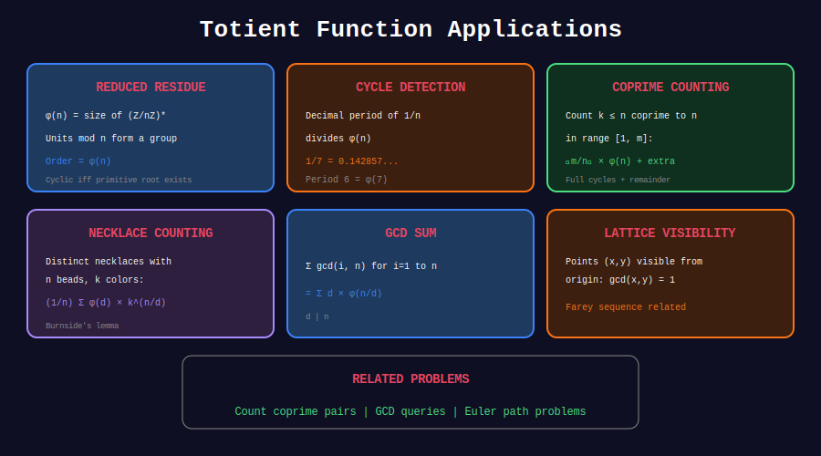

<div align="center">

# 🎯 Totient Applications

<p>
  
  
</p>

**LeetCode Problems & Real-World Uses**

</div>

---

## 🧭 Navigation

| ⬅️ Previous | 📂 Current | ➡️ Next |
|:------------|:----------:|--------:|
| [← 04. Totient Sum](../04_totient_sum/README.md) | **05. Applications** | [🏠 Euler Totient Home](../README.md) |

---

## 📊 Visual Diagram

<div align="center">



</div>

---

## 🏆 LeetCode Problems

| # | Problem | Difficulty | Key Concept |
|:-:|---------|:----------:|-------------|
| 372 | [Super Pow](https://leetcode.com/problems/super-pow/) | 🟡 Medium | Euler's theorem |
| 1808 | [Maximize Number of Nice Divisors](https://leetcode.com/problems/maximize-number-of-nice-divisors/) | 🔴 Hard | Optimization |

---

## 💻 Solutions

### LeetCode 372: Super Pow

```python
class Solution:
    def superPow(self, a: int, b: list[int]) -> int:
        """
        Compute a^b mod 1337 where b is given as array of digits.
        
        Use Euler's theorem: a^φ(1337) ≡ 1 when gcd(a, 1337) = 1.
        φ(1337) = φ(7 × 191) = 6 × 190 = 1140
        """
        MOD = 1337
        
        # Reduce exponent mod φ(1337) = 1140
        def array_mod(b, m):
            result = 0
            for digit in b:
                result = (result * 10 + digit) % m
            return result
        
        # Handle case when gcd(a, 1337) != 1
        # 1337 = 7 × 191
        if a % 1337 == 0:
            return 0
        
        exp = array_mod(b, 1140)  # φ(1337)
        if exp == 0:
            exp = 1140  # a^0 would be 1, but we need a^1140
        
        return pow(a, exp, MOD)

```

### Counting Reduced Fractions

```python
def count_reduced_fractions(n: int) -> int:
    """
    Count reduced proper fractions a/b with b ≤ n.
    
    For each denominator b, there are φ(b) valid numerators.
    Answer: Σ φ(b) for b = 2 to n.
    """
    phi = phi_sieve(n)
    return sum(phi[2:n+1])

# Example: Fractions with denominator ≤ 8
# 1/2, 1/3, 2/3, 1/4, 3/4, 1/5, 2/5, 3/5, 4/5, 1/6, 5/6, 1/7, 2/7, ...
print(count_reduced_fractions(8))

```

### Primitive Roots

```python
def count_primitive_roots(n: int) -> int:
    """
    Count primitive roots modulo n.
    
    If primitive roots exist: count = φ(φ(n))
    Primitive roots exist iff n = 1, 2, 4, p^k, 2p^k
    """
    def has_primitive_root(n):
        if n <= 4:
            return True
        if n % 2 == 0:
            n //= 2
            if n % 2 == 0:
                return False
        # Check if remaining is prime power
        p = 2
        while p * p <= n:
            if n % p == 0:
                while n % p == 0:
                    n //= p
                return n == 1
            p += 1
        return True
    
    if not has_primitive_root(n):
        return 0
    
    return euler_phi(euler_phi(n))

# Example
print(count_primitive_roots(7))   # φ(φ(7)) = φ(6) = 2
print(count_primitive_roots(11))  # φ(φ(11)) = φ(10) = 4

```

### Cyclic Group Generators

```python
def find_primitive_roots(n: int) -> list[int]:
    """Find all primitive roots modulo n."""
    phi_n = euler_phi(n)
    
    # Get divisors of φ(n)
    divisors = []
    d = 1
    while d * d <= phi_n:
        if phi_n % d == 0:
            divisors.append(d)
            if d != phi_n // d:
                divisors.append(phi_n // d)
        d += 1
    divisors.sort()
    
    def is_primitive_root(g):
        if gcd(g, n) != 1:
            return False
        for d in divisors:
            if d < phi_n and pow(g, d, n) == 1:
                return False
        return True
    
    roots = []
    for g in range(1, n):
        if is_primitive_root(g):
            roots.append(g)
    
    return roots

print(find_primitive_roots(7))  # [3, 5]

```

---

## 💡 Real-World Applications

### 1. RSA Cryptography

- Key generation: φ(pq) = (p-1)(q-1)

- Decryption exponent: d = e^(-1) mod φ(n)

### 2. Cyclic Redundancy Checks

- Generator polynomial selection

- Primitive root requirements

### 3. Number of Generators in Cyclic Groups

- Z_n* has φ(φ(n)) generators when they exist

---

<div align="center">

**Made with ❤️ by [Gaurav Goswami](https://github.com/Gaurav14cs17)**

</div>

---

## 🧭 Navigation

| ⬅️ Previous | 📂 Current | ➡️ Next |
|:------------|:----------:|--------:|
| [← 04. Totient Sum](../04_totient_sum/README.md) | **05. Applications** | [🏠 Euler Totient Home](../README.md) |
