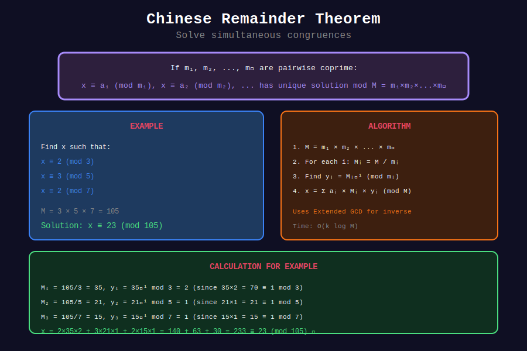

<div align="center">

# 🏛️ Basic Chinese Remainder Theorem

<p>
  
  
  
</p>

**Solving Systems of Linear Congruences**

*Ancient Chinese mathematics meets modern algorithms*

</div>

---

## 🧭 Navigation

| ⬅️ Previous | 📂 Current | ➡️ Next |
|:------------|:----------:|--------:|
| [🏠 CRT Home](../README.md) | **01. Basic CRT** | [02. General CRT →](../02_general_crt/README.md) |

---

## 📊 Visual Diagram

<div align="center">



</div>

---

## 📐 Mathematical Foundations

### 1️⃣ The Theorem

**Statement:** Given pairwise coprime positive integers $m\_1, m\_2, \ldots, m\_k$ and any integers $a\_1, a\_2, \ldots, a\_k$, the system:

$$
\begin{cases}
x \equiv a_1 \pmod{m_1} \\
x \equiv a_2 \pmod{m_2} \\
\vdots \\
x \equiv a_k \pmod{m_k}
\end{cases}
$$

has a **unique solution** modulo $M = m\_1 \cdot m\_2 \cdots m\_k$.

---

### 2️⃣ Construction Formula

Let $M\_i = M / m\_i$ and $y\_i = M\_i^{-1} \pmod{m\_i}$

$$
x = \sum_{i=1}^{k} a_i \cdot M_i \cdot y_i \pmod{M}
$$

**Why this works:** Each term $a\_i M\_i y\_i$ is:
- ≡ $a\_i$ (mod $m\_i$) because $M\_i y\_i \equiv 1$ (mod $m\_i$)
- ≡ 0 (mod $m\_j$) for $j \neq i$ because $m\_j | M\_i$

---

## 🎨 Visual Walkthrough

```
+-----------------------------------------------------------------+
| EXAMPLE: Solve x ≡ 2 (mod 3), x ≡ 3 (mod 5), x ≡ 2 (mod 7)   |
+-----------------------------------------------------------------+
|                                                                 |
| Step 1: Compute M = 3 × 5 × 7 = 105                            |
|                                                                 |
| Step 2: Compute M_i values                                     |
|   M₁ = 105/3 = 35                                              |
|   M₂ = 105/5 = 21                                              |
|   M₃ = 105/7 = 15                                              |
|                                                                 |
| Step 3: Find modular inverses y_i = M_i⁻¹ (mod m_i)           |
|   y₁ = 35⁻¹ (mod 3) = 2⁻¹ (mod 3) = 2  [2×2=4≡1]             |
|   y₂ = 21⁻¹ (mod 5) = 1⁻¹ (mod 5) = 1  [21≡1]                |
|   y₃ = 15⁻¹ (mod 7) = 1⁻¹ (mod 7) = 1  [15≡1]                |
|                                                                 |
| Step 4: Compute x = Σ aᵢ × Mᵢ × yᵢ                            |
|   x = 2×35×2 + 3×21×1 + 2×15×1                                 |
|     = 140 + 63 + 30                                            |
|     = 233                                                      |
|     = 233 mod 105 = 23                                         |
|                                                                 |
| Verify:                                                         |
|   23 mod 3 = 2 ✓                                               |
|   23 mod 5 = 3 ✓                                               |
|   23 mod 7 = 2 ✓                                               |
+-----------------------------------------------------------------+
```

---

## 💻 Code Implementations

### 1. Basic CRT Implementation

```python
def extended_gcd(a: int, b: int) -> tuple[int, int, int]:
    """Returns (gcd, x, y) where ax + by = gcd."""
    if b == 0:
        return a, 1, 0
    g, x, y = extended_gcd(b, a % b)
    return g, y, x - (a // b) * y

def mod_inverse(a: int, m: int) -> int:
    """Find a⁻¹ mod m using extended GCD."""
    g, x, _ = extended_gcd(a % m, m)
    if g != 1:
        return None  # No inverse
    return x % m

def chinese_remainder(remainders: list[int], moduli: list[int]) -> int:
    """
    Solve system of congruences using CRT.
    
    x ≡ remainders[i] (mod moduli[i])
    
    Requires: moduli are pairwise coprime.
    
    Time: O(n log M) where M = product of moduli
    Space: O(1)
    """

    # Compute M = product of all moduli
    M = 1
    for m in moduli:
        M *= m
    
    x = 0
    for a_i, m_i in zip(remainders, moduli):
        M_i = M // m_i
        y_i = mod_inverse(M_i, m_i)
        x = (x + a_i * M_i * y_i) % M
    
    return x

# Example
print(chinese_remainder([2, 3, 2], [3, 5, 7]))  # 23
```

### 2. CRT with Verification

```python
def chinese_remainder_verified(remainders: list[int], moduli: list[int]) -> int:
    """
    CRT with input validation and verification.
    """
    from math import gcd
    from functools import reduce
    
    # Check pairwise coprime
    for i in range(len(moduli)):
        for j in range(i + 1, len(moduli)):
            if gcd(moduli[i], moduli[j]) != 1:
                raise ValueError(f"Moduli {moduli[i]} and {moduli[j]} are not coprime")
    
    result = chinese_remainder(remainders, moduli)
    
    # Verify
    for a, m in zip(remainders, moduli):
        if result % m != a % m:
            raise ValueError(f"Verification failed: {result} mod {m} ≠ {a}")
    
    return result
```

### 3. Two Moduli Case (Simplified)

```python
def crt_two(a1: int, m1: int, a2: int, m2: int) -> int:
    """
    Solve x ≡ a1 (mod m1), x ≡ a2 (mod m2).
    
    Requires gcd(m1, m2) = 1.
    """
    from math import gcd
    if gcd(m1, m2) != 1:
        raise ValueError("Moduli must be coprime")
    
    # x = a1 + m1 × k where k = (a2 - a1) × m1⁻¹ (mod m2)
    k = (a2 - a1) * mod_inverse(m1, m2) % m2
    return (a1 + m1 * k) % (m1 * m2)

# Example
print(crt_two(2, 3, 3, 5))  # 8 (x ≡ 2 mod 3, x ≡ 3 mod 5)
```

### 4. Iterative CRT for Multiple Equations

```python
def crt_iterative(remainders: list[int], moduli: list[int]) -> tuple[int, int]:
    """
    Solve CRT by iteratively combining pairs.
    
    Returns (solution, combined_modulus).
    """
    if len(remainders) == 0:
        return 0, 1
    
    x, m = remainders[0], moduli[0]
    
    for i in range(1, len(remainders)):
        a2, m2 = remainders[i], moduli[i]
        
        # Combine x ≡ x (mod m) and x ≡ a2 (mod m2)
        k = (a2 - x) * mod_inverse(m, m2) % m2
        x = x + m * k
        m = m * m2
        x = x % m
    
    return x, m

print(crt_iterative([2, 3, 2], [3, 5, 7]))  # (23, 105)
```

---

## 🏆 Common Applications

### 1. Large Number Reconstruction

```python
def reconstruct_number(values: list[int], primes: list[int]) -> int:
    """
    Given n mod p_i for several primes, reconstruct n.
    
    Useful when computing n is easier modulo small primes.
    """
    return chinese_remainder(values, primes)

# Example: Computing large factorial
def factorial_mod(n: int, p: int) -> int:
    result = 1
    for i in range(1, n + 1):
        result = result * i % p
    return result

# Compute 50! using CRT with multiple primes
primes = [101, 103, 107, 109]
remainders = [factorial_mod(50, p) for p in primes]

# Reconstruct full value (within the product of primes)
```

### 2. Clock Problem

```python
def clock_problem():
    """
    Classic: What time is it if:
    - Hours mod 3 = 2
    - Hours mod 4 = 1
    - Hours mod 7 = 3
    """
    return chinese_remainder([2, 1, 3], [3, 4, 7])

print(clock_problem())  # Solution within 0-83
```

---

## 💡 Key Insights

> **Existence:** Solution exists iff moduli are pairwise coprime.

> **Uniqueness:** Solution is unique modulo M = m₁ × m₂ × ... × mₖ.

> **Efficiency:** Each inverse computation is O(log m), total O(n log M).

> **Historical:** First recorded in 3rd century China (Sunzi Suanjing).

---

## 📖 References

| Resource | Link |
|----------|------|
| **Wikipedia** | [Chinese Remainder Theorem](https://en.wikipedia.org/wiki/Chinese_remainder_theorem) |
| **CP-Algorithms** | [CRT](https://cp-algorithms.com/algebra/chinese-remainder-theorem.html) |

---

<div align="center">

**Made with ❤️ by [Gaurav Goswami](https://github.com/Gaurav14cs17)**

</div>

---

## 🧭 Navigation

| ⬅️ Previous | 📂 Current | ➡️ Next |
|:------------|:----------:|--------:|
| [🏠 CRT Home](../README.md) | **01. Basic CRT** | [02. General CRT →](../02_general_crt/README.md) |
