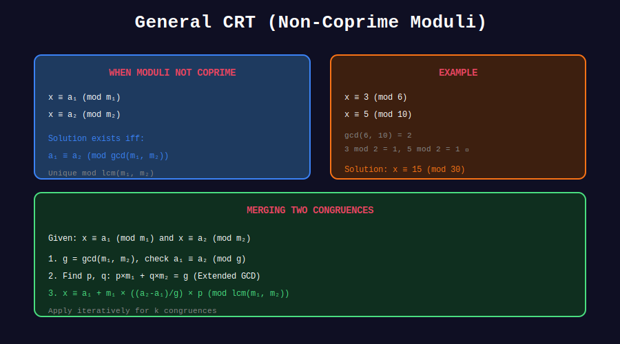

<div align="center">

# 🔄 General CRT

<p>
  
  
</p>

**CRT for Non-Coprime Moduli**

*When the standard CRT isn't enough*

</div>

---

## 🧭 Navigation

| ⬅️ Previous | 📂 Current | ➡️ Next |
|:------------|:----------:|--------:|
| [← 01. Basic CRT](../01_basic_crt/README.md) | **02. General CRT** | [03. Applications →](../03_applications/README.md) |

---

## 📊 Visual Diagram

<div align="center">



</div>

---

## 📐 Mathematical Foundations

### When Moduli Aren't Coprime

For $x \equiv a\_1 \pmod{m\_1}$ and $x \equiv a\_2 \pmod{m\_2}$:

**Solution exists ⟺** $a\_1 \equiv a\_2 \pmod{\gcd(m\_1, m\_2)}$

**Solution:** Unique modulo $\text{lcm}(m\_1, m\_2)$

---

## 🎨 Visual Example

```
+-----------------------------------------------------------------+
| EXAMPLE: x ≡ 3 (mod 6), x ≡ 5 (mod 10)                        |
+-----------------------------------------------------------------+
|                                                                 |
| Check existence:                                                |
|   gcd(6, 10) = 2                                               |
|   3 mod 2 = 1                                                   |
|   5 mod 2 = 1                                                   |
|   1 = 1 ✓  Solution exists!                                    |
|                                                                 |
| Solution is unique mod lcm(6, 10) = 30                         |
|                                                                 |
| x ≡ 3 (mod 6): candidates = 3, 9, 15, 21, 27, ...             |
| x ≡ 5 (mod 10): candidates = 5, 15, 25, ...                   |
|                                                                 |
| Common: x = 15 (mod 30)                                        |
|                                                                 |
| Verify: 15 mod 6 = 3 ✓, 15 mod 10 = 5 ✓                       |
+-----------------------------------------------------------------+

```

---

## 💻 Code Implementations

### 1. Two Moduli - General Case

```python
def crt_general_two(a1: int, m1: int, a2: int, m2: int) -> tuple[int, int]:
    """
    Solve x ≡ a1 (mod m1), x ≡ a2 (mod m2).
    
    Works even when gcd(m1, m2) > 1.
    
    Returns (solution, lcm(m1, m2)) or (None, None) if no solution.
    """
    from math import gcd
    
    g = gcd(m1, m2)
    
    # Check if solution exists
    if (a2 - a1) % g != 0:
        return None, None
    
    # Compute LCM
    lcm = m1 * m2 // g
    
    # Extended GCD to find coefficients
    _, p, q = extended_gcd(m1, m2)
    
    # Solution: x = a1 + m1 × p × (a2 - a1) / g
    diff = (a2 - a1) // g
    x = (a1 + m1 * p * diff) % lcm
    
    return x, lcm

# Example
print(crt_general_two(3, 6, 5, 10))  # (15, 30)
print(crt_general_two(3, 6, 4, 10))  # (None, None) - no solution

```

### 2. Multiple Equations - General Case

```python
def crt_general(remainders: list[int], moduli: list[int]) -> tuple[int, int]:
    """
    Solve system of congruences with possibly non-coprime moduli.
    
    Returns (solution, combined_modulus) or (None, None).
    """
    if len(remainders) == 0:
        return 0, 1
    
    x, m = remainders[0], moduli[0]
    
    for i in range(1, len(remainders)):
        result = crt_general_two(x, m, remainders[i], moduli[i])
        if result[0] is None:
            return None, None
        x, m = result
    
    return x, m

# Example with non-coprime moduli
print(crt_general([3, 5, 2], [6, 10, 15]))  # May or may not have solution

```

### 3. Check Solvability

```python
def crt_solvable(remainders: list[int], moduli: list[int]) -> bool:
    """
    Check if the system of congruences has a solution.
    """
    from math import gcd
    
    for i in range(len(moduli)):
        for j in range(i + 1, len(moduli)):
            g = gcd(moduli[i], moduli[j])
            if remainders[i] % g != remainders[j] % g:
                return False
    
    return True

```

### 4. Find All Solutions in Range

```python
def crt_all_solutions(remainders: list[int], moduli: list[int], 
                       lo: int, hi: int) -> list[int]:
    """
    Find all solutions in [lo, hi].
    """
    result = crt_general(remainders, moduli)
    if result[0] is None:
        return []
    
    x, period = result
    
    # Find smallest solution >= lo
    if x < lo:
        k = (lo - x + period - 1) // period
        x += k * period
    
    solutions = []
    while x <= hi:
        solutions.append(x)
        x += period
    
    return solutions

# Example: Solutions to x ≡ 2 (mod 5), x ≡ 3 (mod 7) in [1, 100]
print(crt_all_solutions([2, 3], [5, 7], 1, 100))

```

---

## 💡 Key Insights

> **Existence Condition:** Solution exists iff remainders agree modulo gcd of moduli.

> **Uniqueness:** Solution is unique modulo LCM (not product) of moduli.

> **Reduction:** Can always reduce to coprime case by factoring moduli.

---

<div align="center">

**Made with ❤️ by [Gaurav Goswami](https://github.com/Gaurav14cs17)**

</div>

---

## 🧭 Navigation

| ⬅️ Previous | 📂 Current | ➡️ Next |
|:------------|:----------:|--------:|
| [← 01. Basic CRT](../01_basic_crt/README.md) | **02. General CRT** | [03. Applications →](../03_applications/README.md) |
