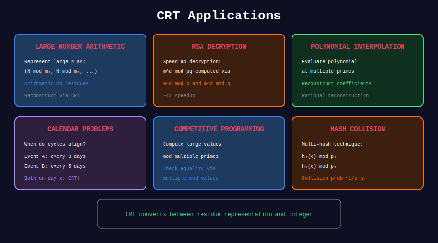

<div align="center">

# 🎯 CRT Applications

<p>
  
  
</p>

**Practical Uses of the Chinese Remainder Theorem**

</div>

---

## 🧭 Navigation

| ⬅️ Previous | 📂 Current | ➡️ Next |
|:------------|:----------:|--------:|
| [← 02. General CRT](../02_general_crt/README.md) | **03. Applications** | [🏠 CRT Home](../README.md) |

---

## 📊 Visual Diagram

<div align="center">



</div>

---

## 🔐 1. RSA Speedup (Garner's Algorithm)

```python
def garner(remainders: list[int], moduli: list[int]) -> int:
    """
    Reconstruct x from remainders using Garner's algorithm.
    
    More numerically stable than direct CRT formula.
    Used in RSA-CRT optimization.
    
    Time: O(n²) for n moduli
    """
    n = len(moduli)
    coeffs = [0] * n
    
    for i in range(n):
        coeffs[i] = remainders[i]
        for j in range(i):
            coeffs[i] = (coeffs[i] - coeffs[j]) * mod_inverse(moduli[j], moduli[i])
            coeffs[i] = coeffs[i] % moduli[i]
    
    # Reconstruct
    x = coeffs[0]
    m = moduli[0]
    for i in range(1, n):
        x = x + m * coeffs[i]
        m *= moduli[i]
    
    return x

def rsa_crt_decrypt(c: int, d: int, p: int, q: int) -> int:
    """
    RSA decryption using CRT optimization.
    
    Instead of computing c^d mod n directly,
    compute mod p and mod q separately, then combine.
    
    Speedup: ~4x faster than standard decryption.
    """
    n = p * q
    
    # Precompute
    d_p = d % (p - 1)
    d_q = d % (q - 1)
    q_inv = mod_inverse(q, p)
    
    # Decrypt mod p and mod q
    m_p = pow(c, d_p, p)
    m_q = pow(c, d_q, q)
    
    # Combine using CRT (Garner's method)
    h = (q_inv * (m_p - m_q)) % p
    m = m_q + h * q
    
    return m % n

```

---

## 🛡️ 2. Hash Collision Avoidance

```python
def robust_hash(s: str) -> tuple[int, int]:
    """
    Double polynomial hashing with coprime moduli.
    
    Collision probability ≈ 1/(mod1 × mod2)
    """
    MOD1, MOD2 = 10**9 + 7, 10**9 + 9
    BASE = 31
    
    h1, h2 = 0, 0
    for c in s:
        val = ord(c) - ord('a') + 1
        h1 = (h1 * BASE + val) % MOD1
        h2 = (h2 * BASE + val) % MOD2
    
    return h1, h2

def compare_strings(s1: str, s2: str) -> bool:
    """Compare strings using double hash."""
    return robust_hash(s1) == robust_hash(s2)

```

---

## 📊 3. Large Number Arithmetic

```python
def multiply_large_numbers(a: int, b: int, primes: list[int]) -> int:
    """
    Multiply large numbers using CRT.
    
    Compute a×b mod each prime, then reconstruct.
    """
    remainders = [(a % p) * (b % p) % p for p in primes]
    return chinese_remainder(remainders, primes)

def factorial_large(n: int, primes: list[int]) -> int:
    """
    Compute n! using CRT for very large n.
    """
    remainders = []
    for p in primes:
        fact = 1
        for i in range(1, n + 1):
            fact = fact * i % p
        remainders.append(fact)
    
    return chinese_remainder(remainders, primes)

```

---

## 🎮 4. Competition Problems

```python
def count_arrangements(n: int, constraints: list[tuple]) -> int:
    """
    Count arrangements satisfying modular constraints.
    
    constraints: list of (remainder, modulus) pairs
    """
    result = crt_general(
        [c[0] for c in constraints],
        [c[1] for c in constraints]
    )
    
    if result[0] is None:
        return 0
    
    x, period = result
    
    # Count valid x in [0, n)
    if x >= n:
        return 0
    
    return (n - x - 1) // period + 1

```

---

## 💡 Key Use Cases

| Application | Why CRT? |
|-------------|----------|
| **RSA-CRT** | ~4x speedup in decryption |
| **Hashing** | Reduce collision probability |
| **Big integers** | Parallelize computation |
| **Scheduling** | Find common meeting times |
| **Cryptography** | Secret sharing schemes |

---

<div align="center">

**Made with ❤️ by [Gaurav Goswami](https://github.com/Gaurav14cs17)**

</div>

---

## 🧭 Navigation

| ⬅️ Previous | 📂 Current | ➡️ Next |
|:------------|:----------:|--------:|
| [← 02. General CRT](../02_general_crt/README.md) | **03. Applications** | [🏠 CRT Home](../README.md) |
