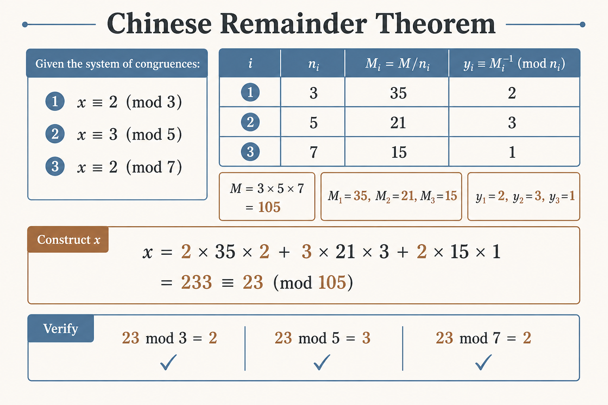
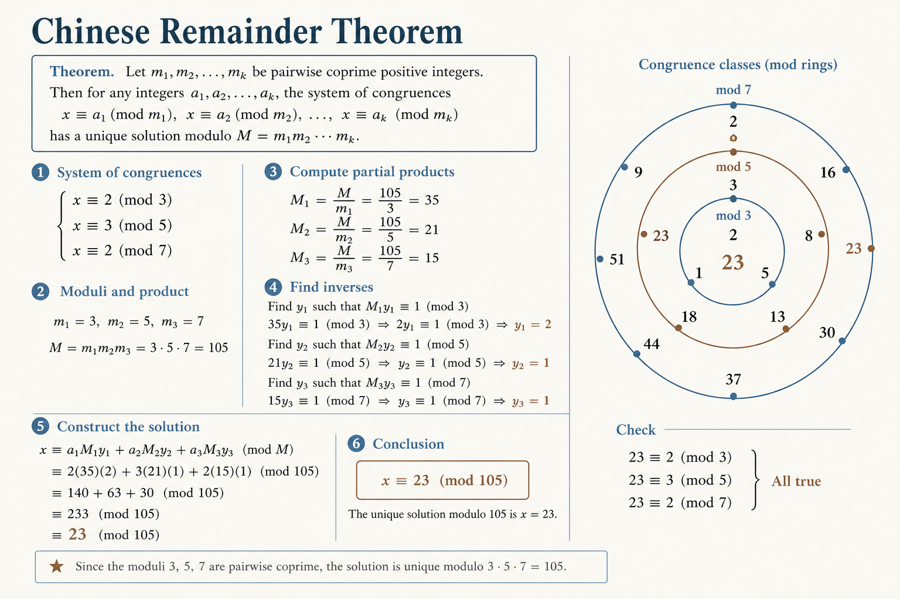

<div align="center">

# 🏛️ Chinese Remainder Theorem

### *Solving Systems of Linear Congruences*




<p>
  
  
</p>

**Solving Systems of Linear Congruences**

*Ancient theorem with modern applications*

</div>

---

## 📊 Visual Overview




---

## 🎯 At a Glance

| | |
|:---|:---|
| **In one line** | Solving Systems of Linear Congruences |
| **Difficulty** | Medium to Hard |
| **Problems** | 10+ |

{: .highlight }
> **How to use this page:** Start with the visual overview, scan **At a Glance**, then work through theory → walkthroughs → code.

---

## 🧭 Navigation

| ⬅️ Previous | 📂 Current | ➡️ Next |
|:------------|:----------:|--------:|
| [← 05. Euler Totient](../05_euler_totient/README.md) | **06. Chinese Remainder** | [07. Linear Diophantine →](../07_linear_diophantine/README.md) |

---

## 📐 Mathematical Foundation
### 1️⃣ The Theorem

**Statement:** Given pairwise coprime moduli $m_1, m_2, \ldots, m_k$ and any integers $a_1, a_2, \ldots, a_k$, the system:

$$\begin{cases}
x \equiv a_1 \pmod{m_1} \\
x \equiv a_2 \pmod{m_2} \\
\vdots \\
x \equiv a_k \pmod{m_k}
\end{cases}$$

has a unique solution modulo $M = m_1 \cdot m_2 \cdots m_k$.

---

### 2️⃣ Construction Formula

Let $M_i = M / m_i$ and $y_i = M_i^{-1} \pmod{m_i}$

$$x = \sum_{i=1}^{k} a_i \cdot M_i \cdot y_i \pmod{M}$$

---

### 3️⃣ Two Moduli Case

For $x \equiv a_1 \pmod{m_1}$ and $x \equiv a_2 \pmod{m_2}$:

$$x = a_1 + m_1 \cdot \frac{(a_2 - a_1) \cdot m_1^{-1} \pmod{m_2}}{1} \pmod{m_1 \cdot m_2}$$

---

## 💻 Code Implementations

```python
def extended_gcd(a: int, b: int) -> tuple[int, int, int]:
    """Returns (gcd, x, y) where ax + by = gcd."""
    if b == 0:
        return a, 1, 0
    g, x, y = extended_gcd(b, a % b)
    return g, y, x - (a // b) * y

def mod_inverse(a: int, m: int) -> int:
    """Compute modular inverse of a mod m."""
    g, x, _ = extended_gcd(a, m)
    if g != 1:
        return None
    return x % m

def chinese_remainder(remainders: list[int], moduli: list[int]) -> int:
    """
    Solve system of congruences using CRT.
    
    x ≡ remainders[i] (mod moduli[i])
    
    Time: O(n log M)
    Space: O(1)
    """
    M = 1
    for m in moduli:
        M *= m
    
    x = 0
    for a_i, m_i in zip(remainders, moduli):
        M_i = M // m_i
        y_i = mod_inverse(M_i, m_i)
        x += a_i * M_i * y_i
    
    return x % M

def crt_two_moduli(a1: int, m1: int, a2: int, m2: int) -> tuple[int, int]:
    """
    Solve x ≡ a1 (mod m1), x ≡ a2 (mod m2).
    
    Works for non-coprime moduli too (if solution exists).
    
    Returns (x, lcm(m1, m2)) or (None, None) if no solution.
    """
    from math import gcd
    
    g = gcd(m1, m2)
    if (a2 - a1) % g != 0:
        return None, None
    
    lcm = m1 * m2 // g
    _, x, _ = extended_gcd(m1, m2)
    
    diff = (a2 - a1) // g
    x = (a1 + m1 * x * diff) % lcm
    
    return x, lcm

# Example usage
print(chinese_remainder([2, 3, 2], [3, 5, 7]))  # 23

```

---

## 🏆 LeetCode Problems

| # | Problem | Difficulty | Key Concept |
|:-:|---------|:----------:|-------------|
| 1175 | [Prime Arrangements](https://leetcode.com/problems/prime-arrangements/) | 🟢 Easy | CRT counting |
| 458 | [Poor Pigs](https://leetcode.com/problems/poor-pigs/) | 🔴 Hard | Information theory |

---

## 💡 Key Insights

> **Existence Condition:** CRT requires pairwise coprime moduli. For general moduli, solution exists iff $a_i \equiv a_j \pmod{\gcd(m_i, m_j)}$ for all pairs.

> **Applications:** RSA speedup (computing mod p and mod q separately), hash collision avoidance, reconstructing large numbers

---

<div align="center">

**Made with ❤️ by [Gaurav Goswami](https://github.com/Gaurav14cs17)**

</div>

---
