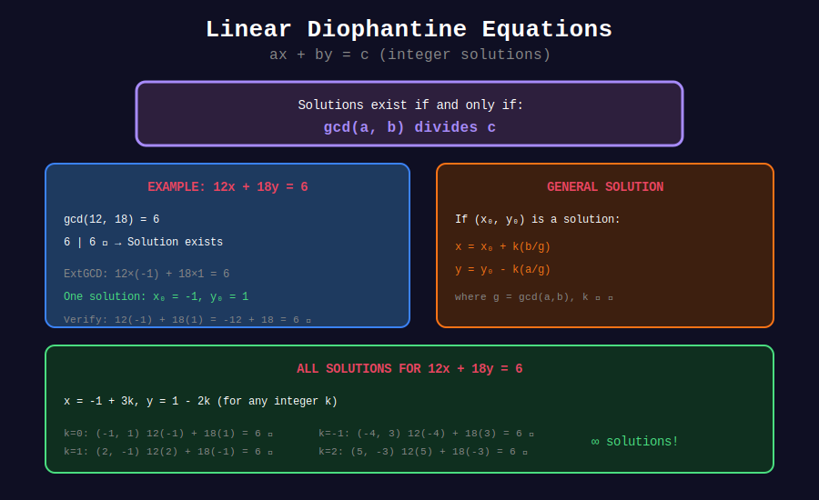

<div align="center">

# ➗ Basic Diophantine Equations

<p>
  
  
</p>

**Integer Solutions to ax + by = c**

*Named after Diophantus of Alexandria (3rd century AD)*

</div>

---

## 🧭 Navigation

| ⬅️ Previous | 📂 Current | ➡️ Next |
|:------------|:----------:|--------:|
| [🏠 Diophantine Home](../README.md) | **01. Basic Equations** | [02. Extended GCD →](../02_extended_gcd_method/README.md) |

---

## 📊 Visual Diagram

<div align="center">



</div>

---

## 📐 Mathematical Foundations

### 1️⃣ The Problem

**Linear Diophantine Equation:** $ax + by = c$

where $a, b, c \in \mathbb{Z}$ and we seek integer solutions $(x, y)$.

---

### 2️⃣ Existence Theorem

**Theorem:** $ax + by = c$ has integer solutions **if and only if** $\gcd(a, b) | c$

**Proof:**

- (⟹) If $ax + by = c$, then since $\gcd(a,b) | a$ and $\gcd(a,b) | b$, we have $\gcd(a,b) | c$.

- (⟸) By Bézout's identity, $\exists x\_0, y\_0$ with $ax\_0 + by\_0 = \gcd(a,b)$.
  Multiply by $c/\gcd(a,b)$ to get solution.

---

### 3️⃣ Finding One Solution

**Method:**
1. Compute $g, x\_0, y\_0$ such that $ax\_0 + by\_0 = g = \gcd(a,b)$
2. Check if $g | c$
3. Scale: $x = x\_0 \cdot (c/g)$, $y = y\_0 \cdot (c/g)$

---

## 🎨 Visual Walkthrough

```
+-----------------------------------------------------------------+

| SOLVE: 3x + 5y = 7                                             |
+-----------------------------------------------------------------+
|                                                                 |
| Step 1: Check existence                                        |
|   gcd(3, 5) = 1                                                |
|   1 | 7 ✓  Solution exists!                                    |
|                                                                 |
| Step 2: Extended GCD                                           |
|   3(2) + 5(-1) = 1                                             |
|   x₀ = 2, y₀ = -1                                              |
|                                                                 |
| Step 3: Scale by c/g = 7/1 = 7                                |
|   x = 2 × 7 = 14                                               |
|   y = -1 × 7 = -7                                              |
|                                                                 |
| Verify: 3(14) + 5(-7) = 42 - 35 = 7 ✓                         |
+-----------------------------------------------------------------+

```

---

## 💻 Code Implementations

```python
def extended_gcd(a: int, b: int) -> tuple[int, int, int]:
    """Returns (gcd, x, y) where ax + by = gcd."""
    if b == 0:
        return a, 1, 0
    g, x, y = extended_gcd(b, a % b)
    return g, y, x - (a // b) * y

def solve_diophantine(a: int, b: int, c: int) -> tuple[int, int] | None:
    """
    Find one solution to ax + by = c.
    
    Returns (x, y) or None if no solution exists.
    
    Time: O(log(min(a, b)))
    """
    if a == 0 and b == 0:
        return (0, 0) if c == 0 else None
    
    g, x0, y0 = extended_gcd(abs(a), abs(b))
    
    if c % g != 0:
        return None
    
    # Scale solution
    x = x0 * (c // g)
    y = y0 * (c // g)
    
    # Adjust for negative coefficients
    if a < 0:
        x = -x
    if b < 0:
        y = -y
    
    return x, y

# Examples
print(solve_diophantine(3, 5, 7))    # (14, -7)
print(solve_diophantine(6, 9, 12))   # (8, -4) or similar
print(solve_diophantine(6, 9, 10))   # None (gcd=3 doesn't divide 10)

```

---

## 💡 Key Insights

> **No Solution:** If gcd(a,b) doesn't divide c, there's no integer solution.

> **Infinite Solutions:** If one solution exists, infinitely many exist.

> **Geometric View:** Solutions lie on a line in the xy-plane; we want lattice points.

---

<div align="center">

**Made with ❤️ by [Gaurav Goswami](https://github.com/Gaurav14cs17)**

</div>

---

## 🧭 Navigation

| ⬅️ Previous | 📂 Current | ➡️ Next |
|:------------|:----------:|--------:|
| [🏠 Diophantine Home](../README.md) | **01. Basic Equations** | [02. Extended GCD →](../02_extended_gcd_method/README.md) |
