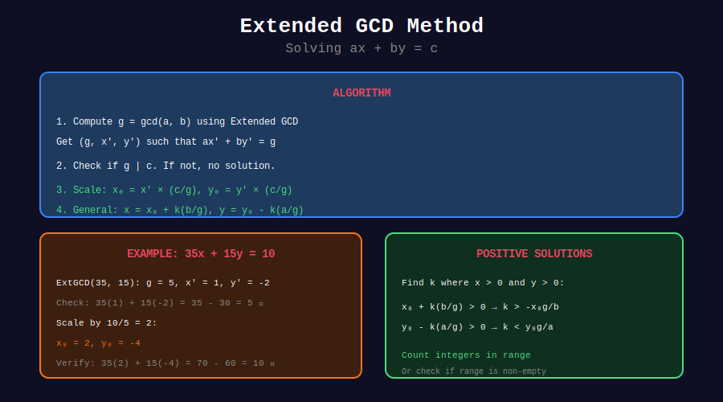

<div align="center">

# 🔧 Extended GCD Method

<p>
  
  
</p>

**Finding All Integer Solutions**

*The complete solution space*

</div>

---

## 🧭 Navigation

| ⬅️ Previous | 📂 Current | ➡️ Next |
|:------------|:----------:|--------:|
| [← 01. Basic Equations](../01_basic_equations/README.md) | **02. Extended GCD** | [03. Frobenius →](../03_frobenius_number/README.md) |

---

## 📊 Visual Diagram

<div align="center">



</div>

---

## 📐 General Solution

If $(x\_0, y\_0)$ is one solution to $ax + by = c$, **all solutions** are:

$$
x = x_0 + k \cdot \frac{b}{\gcd(a,b)}, \quad y = y_0 - k \cdot \frac{a}{\gcd(a,b)}
$$

for any integer $k$.

---

## 💻 Code Implementations

```python
def all_solutions_generator(a: int, b: int, c: int):
    """
    Generator for solutions to ax + by = c.
    
    Yields solutions for k = 0, ±1, ±2, ...
    """
    base = solve_diophantine(a, b, c)
    if base is None:
        return
    
    x0, y0 = base
    g = extended_gcd(abs(a), abs(b))[0]
    step_x = b // g
    step_y = -a // g
    
    # Yield solutions in order: k=0, 1, -1, 2, -2, ...
    yield (x0, y0)
    
    k = 1
    while True:
        yield (x0 + k * step_x, y0 + k * step_y)
        yield (x0 - k * step_x, y0 - k * step_y)
        k += 1

def solutions_in_range(a: int, b: int, c: int, 
                       x_range: tuple, y_range: tuple) -> list[tuple]:
    """
    Find all solutions with x in x_range and y in y_range.
    """
    base = solve_diophantine(a, b, c)
    if base is None:
        return []
    
    x0, y0 = base
    g = extended_gcd(abs(a), abs(b))[0]
    step_x = b // g
    step_y = -a // g
    
    solutions = []
    
    # Find valid k values
    # x0 + k*step_x in [x_min, x_max]
    # y0 + k*step_y in [y_min, y_max]
    
    for k in range(-10**6, 10**6):  # Practical limit
        x = x0 + k * step_x
        y = y0 + k * step_y
        
        if x_range[0] <= x <= x_range[1] and y_range[0] <= y <= y_range[1]:
            solutions.append((x, y))
    
    return solutions

def positive_solutions(a: int, b: int, c: int) -> list[tuple]:
    """Find all solutions with x > 0 and y > 0."""
    return solutions_in_range(a, b, c, (1, c//a + 1), (1, c//b + 1))
```

---

## 💡 Key Insights

> **Parallel Lines:** Solutions form a lattice on the line ax + by = c.

> **Step Size:** Adjacent solutions differ by (b/g, -a/g) where g = gcd(a,b).

> **Counting Solutions:** In finite range, count valid k values.

---

<div align="center">

**Made with ❤️ by [Gaurav Goswami](https://github.com/Gaurav14cs17)**

</div>

---

## 🧭 Navigation

| ⬅️ Previous | 📂 Current | ➡️ Next |
|:------------|:----------:|--------:|
| [← 01. Basic Equations](../01_basic_equations/README.md) | **02. Extended GCD** | [03. Frobenius →](../03_frobenius_number/README.md) |
