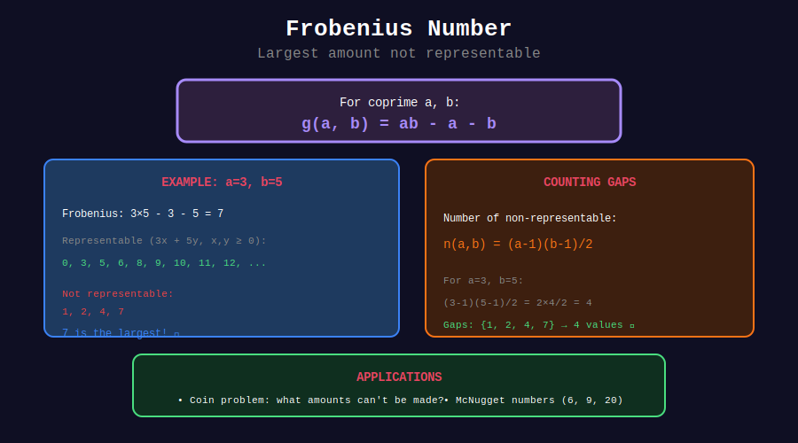

<div align="center">

# 🪙 Frobenius Number

<p>
  
  
</p>

**The Largest Non-Representable Number**

*Also known as the Coin Problem or Chicken McNugget Theorem*

</div>

---

## 🧭 Navigation

| ⬅️ Previous | 📂 Current | ➡️ Next |
|:------------|:----------:|--------:|
| [← 02. Extended GCD](../02_extended_gcd_method/README.md) | **03. Frobenius** | [04. Coin Problems →](../04_coin_problems/README.md) |

---

## 📊 Visual Diagram

<div align="center">



</div>

---

## 📐 Mathematical Foundation

### Definition

For positive coprime integers $a, b$, the **Frobenius number** $g(a, b)$ is the largest integer that **cannot** be represented as $ax + by$ with $x, y \geq 0$.

```math
g(a, b) = ab - a - b

```

### Sylvester-Frobenius Theorem

For coprime $a, b$:
- Frobenius number: $g(a, b) = ab - a - b$
- Count of non-representable: $\frac{(a-1)(b-1)}{2}$

---

## 🎨 Visual Example

```
+-----------------------------------------------------------------+

| FROBENIUS NUMBER FOR a=3, b=5                                  |
+-----------------------------------------------------------------+
|                                                                 |
| g(3, 5) = 3×5 - 3 - 5 = 7                                      |
|                                                                 |
| Representable numbers (3x + 5y, x,y ≥ 0):                      |
|   0 = 0×3 + 0×5 ✓                                              |
|   3 = 1×3 + 0×5 ✓                                              |
|   5 = 0×3 + 1×5 ✓                                              |
|   6 = 2×3 + 0×5 ✓                                              |
|   8 = 1×3 + 1×5 ✓                                              |
|   9 = 3×3 + 0×5 ✓                                              |
|   10 = 0×3 + 2×5 ✓                                             |
|   ...all numbers ≥ 8 are representable                         |
|                                                                 |
| Non-representable: {1, 2, 4, 7}                                |
| Largest = 7 ✓                                                  |
| Count = 4 = (3-1)(5-1)/2 ✓                                     |
+-----------------------------------------------------------------+

```

---

## 💻 Code Implementations

```python
from math import gcd

def frobenius_two(a: int, b: int) -> int:
    """
    Frobenius number for two coprime values.
    
    Returns infinity if not coprime (infinitely many non-representable).
    
    Time: O(1)
    """
    if gcd(a, b) != 1:
        return float('inf')
    return a * b - a - b

def non_representable_count(a: int, b: int) -> int:
    """Count of non-representable numbers."""
    if gcd(a, b) != 1:
        return float('inf')
    return (a - 1) * (b - 1) // 2

def is_representable(n: int, a: int, b: int) -> bool:
    """Check if n = ax + by for some x, y ≥ 0."""
    if n < 0:
        return False
    for x in range(n // a + 1):
        if (n - a * x) % b == 0 and (n - a * x) >= 0:
            return True
    return False

def list_non_representable(a: int, b: int) -> list[int]:
    """List all non-representable numbers."""
    if gcd(a, b) != 1:
        raise ValueError("a and b must be coprime")
    
    frob = frobenius_two(a, b)
    return [n for n in range(1, frob + 1) if not is_representable(n, a, b)]

# Examples
print(frobenius_two(3, 5))  # 7
print(frobenius_two(6, 9))  # inf (not coprime)
print(list_non_representable(3, 5))  # [1, 2, 4, 7]

```

---

## 🏆 Classic Problems

### McNugget Numbers

McDonald's sold nuggets in packs of 6, 9, 20. What's the largest number you can't order?

```python
def mcnugget_problem():
    """
    Find largest n that can't be expressed as 6a + 9b + 20c.
    
    For 3+ values, no simple formula exists.
    Use dynamic programming.
    """
    sizes = [6, 9, 20]
    limit = 100  # Upper bound
    
    can_make = [False] * limit
    can_make[0] = True
    
    for s in sizes:
        for i in range(s, limit):
            if can_make[i - s]:
                can_make[i] = True
    
    # Find largest False
    for i in range(limit - 1, -1, -1):
        if not can_make[i]:
            return i
    
    return 0

print(mcnugget_problem())  # 43

```

---

<div align="center">

**Made with ❤️ by [Gaurav Goswami](https://github.com/Gaurav14cs17)**

</div>

---

## 🧭 Navigation

| ⬅️ Previous | 📂 Current | ➡️ Next |
|:------------|:----------:|--------:|
| [← 02. Extended GCD](../02_extended_gcd_method/README.md) | **03. Frobenius** | [04. Coin Problems →](../04_coin_problems/README.md) |
