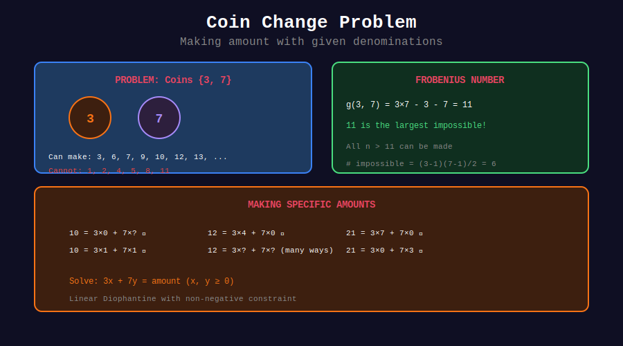

<div align="center">

# 🪙 Coin Problems

<p>
  
  
</p>

**Making Change with Diophantine Equations**

</div>

---

## 🧭 Navigation

| ⬅️ Previous | 📂 Current | ➡️ Next |
|:------------|:----------:|--------:|
| [← 03. Frobenius](../03_frobenius_number/README.md) | **04. Coin Problems** | [05. Applications →](../05_applications/README.md) |

---

## 📊 Visual Diagram

<div align="center">



</div>

---

## 🏆 LeetCode Problems

| # | Problem | Difficulty | Connection |
|:-:|---------|:----------:|------------|
| 322 | [Coin Change](https://leetcode.com/problems/coin-change/) | 🟡 Medium | Min coins (DP) |
| 518 | [Coin Change 2](https://leetcode.com/problems/coin-change-2/) | 🟡 Medium | Count ways (DP) |

---

## 💻 Solutions

### Two Denominations (Diophantine Approach)

```python
def can_make_exact(amount: int, a: int, b: int) -> bool:
    """
    Check if amount = ax + by has solution with x, y ≥ 0.
    
    Time: O(amount/a) ≈ O(amount)
    """
    for x in range(amount // a + 1):
        remainder = amount - a * x
        if remainder >= 0 and remainder % b == 0:
            return True
    return False

def min_coins_two(amount: int, a: int, b: int) -> int:
    """
    Minimum coins to make amount using denominations a, b.
    
    Time: O(amount/max(a,b))
    """
    min_count = float('inf')
    
    for x in range(amount // a + 1):
        remainder = amount - a * x
        if remainder >= 0 and remainder % b == 0:
            y = remainder // b
            min_count = min(min_count, x + y)
    
    return min_count if min_count != float('inf') else -1

def count_ways_two(amount: int, a: int, b: int) -> int:
    """
    Count ways to make amount using a and b.
    
    Time: O(amount/max(a,b))
    """
    count = 0
    for x in range(amount // a + 1):
        if (amount - a * x) % b == 0:
            count += 1
    return count
```

### General DP Solution

```python
def coin_change(coins: list[int], amount: int) -> int:
    """
    LeetCode 322: Minimum coins to make amount.
    
    Time: O(amount × len(coins))
    Space: O(amount)
    """
    dp = [float('inf')] * (amount + 1)
    dp[0] = 0
    
    for coin in coins:
        for i in range(coin, amount + 1):
            dp[i] = min(dp[i], dp[i - coin] + 1)
    
    return dp[amount] if dp[amount] != float('inf') else -1

def coin_change_2(amount: int, coins: list[int]) -> int:
    """
    LeetCode 518: Count ways to make amount.
    
    Time: O(amount × len(coins))
    Space: O(amount)
    """
    dp = [0] * (amount + 1)
    dp[0] = 1
    
    for coin in coins:
        for i in range(coin, amount + 1):
            dp[i] += dp[i - coin]
    
    return dp[amount]
```

---

## 💡 Connection to Diophantine

For two coins a, b:
- Can make n ⟺ ax + by = n has non-negative solution
- Minimum coins = minimize x + y subject to ax + by = n
- After Frobenius number, all amounts are makeable

---

<div align="center">

**Made with ❤️ by [Gaurav Goswami](https://github.com/Gaurav14cs17)**

</div>

---

## 🧭 Navigation

| ⬅️ Previous | 📂 Current | ➡️ Next |
|:------------|:----------:|--------:|
| [← 03. Frobenius](../03_frobenius_number/README.md) | **04. Coin Problems** | [05. Applications →](../05_applications/README.md) |
