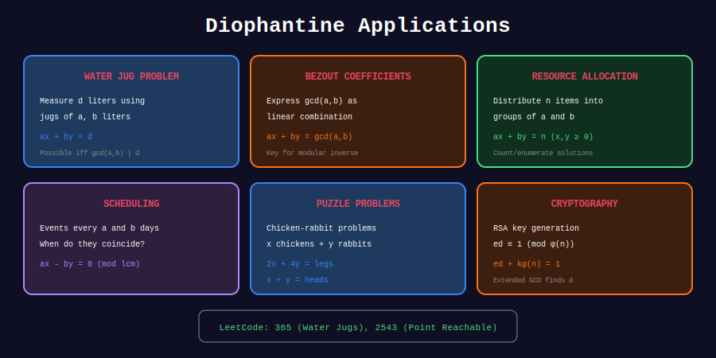

<div align="center">

# 🎯 Diophantine Applications

<p>
  
  
</p>

**LeetCode Problems & Competition Uses**

</div>

---

## 🧭 Navigation

| ⬅️ Previous | 📂 Current | ➡️ Next |
|:------------|:----------:|--------:|
| [← 04. Coin Problems](../04_coin_problems/README.md) | **05. Applications** | [🏠 Diophantine Home](../README.md) |

---

## 📊 Visual Diagram

<div align="center">



</div>

---

## 🏆 LeetCode Problems

| # | Problem | Difficulty | Connection |
|:-:|---------|:----------:|------------|
| 1250 | [Check If Good Array](https://leetcode.com/problems/check-if-it-is-a-good-array/) | 🔴 Hard | Bézout's identity |
| 365 | [Water and Jug](https://leetcode.com/problems/water-and-jug-problem/) | 🟡 Medium | GCD check |
| 322 | [Coin Change](https://leetcode.com/problems/coin-change/) | 🟡 Medium | Min representation |

---

## 💻 Solutions

### LeetCode 1250: Check If Good Array

```python
class Solution:
    def isGoodArray(self, nums: list[int]) -> bool:
        """
        Can we choose subset and coefficients to sum to 1?
        
        By Bézout: Yes iff gcd of all elements = 1.
        
        Time: O(n log(max))
        """
        from math import gcd
        from functools import reduce
        return reduce(gcd, nums) == 1

```

### LeetCode 365: Water and Jug Problem

```python
class Solution:
    def canMeasureWater(self, x: int, y: int, target: int) -> bool:
        """
        Can we measure exactly 'target' liters?
        
        Possible iff:
        1. target ≤ x + y
        2. gcd(x, y) | target
        
        Time: O(log(min(x, y)))
        """
        from math import gcd
        
        if target > x + y:
            return False
        
        return target % gcd(x, y) == 0

```

### Linear Congruence Solver

```python
def solve_linear_congruence(a: int, b: int, m: int) -> list[int]:
    """
    Solve ax ≡ b (mod m).
    
    Equivalent to: ax + my = b
    
    Returns all solutions in [0, m-1].
    """
    g, x0, _ = extended_gcd(a, m)
    
    if b % g != 0:
        return []  # No solution
    
    x0 = x0 * (b // g) % m
    
    # g solutions: x0, x0 + m/g, x0 + 2m/g, ...
    step = m // g
    return [(x0 + i * step) % m for i in range(g)]

# Example: 3x ≡ 6 (mod 9)
print(solve_linear_congruence(3, 6, 9))  # [2, 5, 8]

```

---

## 💡 Key Patterns

| Pattern | Check |
|---------|-------|
| Sum equals target | gcd = 1 |
| Measure exact amount | gcd divides target |
| Make change | Frobenius bound |
| Solve ax ≡ b (mod m) | gcd(a,m) divides b |

---

<div align="center">

**Made with ❤️ by [Gaurav Goswami](https://github.com/Gaurav14cs17)**

</div>

---

## 🧭 Navigation

| ⬅️ Previous | 📂 Current | ➡️ Next |
|:------------|:----------:|--------:|
| [← 04. Coin Problems](../04_coin_problems/README.md) | **05. Applications** | [🏠 Diophantine Home](../README.md) |
