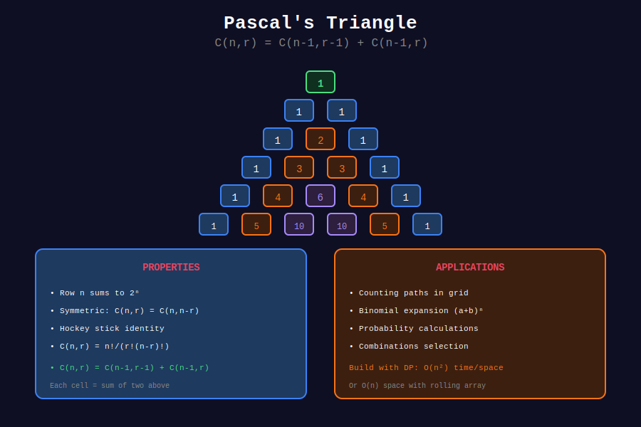

<div align="center">

# 📐 Pascal's Triangle

<p>
  
  
</p>

**The Foundation of Combinatorics**

*Named after Blaise Pascal (1623-1662)*

</div>

---

## 🧭 Navigation

| ⬅️ Previous | 📂 Current | ➡️ Next |
|:------------|:----------:|--------:|
| [🏠 Binomial Home](../README.md) | **01. Pascal's Triangle** | [02. Combinations →](../02_combinations/README.md) |

---

## 📊 Visual Diagram

<div align="center">



</div>

---

## 📐 Structure

```
Row 0:              1
Row 1:            1   1
Row 2:          1   2   1
Row 3:        1   3   3   1
Row 4:      1   4   6   4   1
Row 5:    1   5  10  10   5   1
Row 6:  1   6  15  20  15   6   1

```

**Pascal's Rule:** $C(n,k) = C(n-1,k-1) + C(n-1,k)$

---

## 💻 LeetCode Solutions

### LeetCode 118: Pascal's Triangle

```python
class Solution:
    def generate(self, numRows: int) -> list[list[int]]:
        """
        Generate first numRows of Pascal's triangle.
        
        Time: O(n²)
        Space: O(n²)
        """
        triangle = []
        
        for row in range(numRows):
            curr = [1] * (row + 1)
            for j in range(1, row):
                curr[j] = triangle[row-1][j-1] + triangle[row-1][j]
            triangle.append(curr)
        
        return triangle

```

### LeetCode 119: Pascal's Triangle II

```python
class Solution:
    def getRow(self, rowIndex: int) -> list[int]:
        """
        Get nth row (0-indexed) in O(n) space.
        
        Time: O(n²)
        Space: O(n)
        """
        row = [1] * (rowIndex + 1)
        
        for i in range(1, rowIndex):
            for j in range(i, 0, -1):
                row[j] += row[j - 1]
        
        return row

```

---

## 💡 Key Properties

- Row n sums to $2^n$
- Central element of row 2n is $C(2n, n)$
- Entries are symmetric: $C(n,k) = C(n, n-k)$
- Row n has exactly n+1 entries

---

<div align="center">

**Made with ❤️ by [Gaurav Goswami](https://github.com/Gaurav14cs17)**

</div>

---

## 🧭 Navigation

| ⬅️ Previous | 📂 Current | ➡️ Next |
|:------------|:----------:|--------:|
| [🏠 Binomial Home](../README.md) | **01. Pascal's Triangle** | [02. Combinations →](../02_combinations/README.md) |
