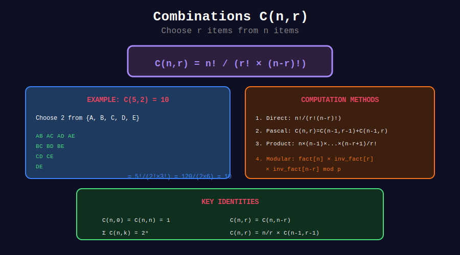

<div align="center">

# 🔢 Combinations

<p>
  
  
  
</p>

**Computing C(n, k) Efficiently**

*The heart of combinatorics*

</div>

---

## 🧭 Navigation

| ⬅️ Previous | 📂 Current | ➡️ Next |
|:------------|:----------:|--------:|
| [← 01. Pascal's Triangle](../01_pascals_triangle/README.md) | **02. Combinations** | [03. Modular Binomial →](../03_modular_binomial/README.md) |

---

## 📊 Visual Diagram

<div align="center">



</div>

---

## 📐 Mathematical Foundations

### Definition

```math
C(n,k) = \binom{n}{k} = \frac{n!}{k!(n-k)!}
```

**Meaning:** Number of ways to choose k items from n items (order doesn't matter).

### Multiplicative Formula (Avoids Overflow)

```math
C(n,k) = \frac{n \times (n-1) \times \cdots \times (n-k+1)}{k \times (k-1) \times \cdots \times 1}
```

---

## 💻 Code Implementations

### 1. Multiplicative Formula (Best for Single Queries)

```python
def nCr(n: int, k: int) -> int:
    """
    Compute C(n,k) without factorial overflow.
    
    Time: O(min(k, n-k))
    Space: O(1)
    
    Key: Divide at each step to keep numbers small.
    """
    if k > n or k < 0:
        return 0
    if k > n - k:
        k = n - k  # C(n,k) = C(n, n-k)
    
    result = 1
    for i in range(k):
        result = result * (n - i) // (i + 1)
    
    return result

# Examples
print(nCr(5, 2))   # 10
print(nCr(10, 3))  # 120
print(nCr(52, 5))  # 2598960 (poker hands)
```

### 2. DP Approach (Pascal's Triangle)

```python
def nCr_dp(n: int, k: int) -> int:
    """
    Compute C(n,k) using Pascal's triangle.
    
    Time: O(n * k)
    Space: O(k)
    
    Use when you need multiple C(n,k) for same n.
    """
    if k > n or k < 0:
        return 0
    if k > n - k:
        k = n - k
    
    dp = [1] + [0] * k
    
    for i in range(1, n + 1):
        for j in range(min(i, k), 0, -1):
            dp[j] += dp[j - 1]
    
    return dp[k]
```

### 3. Using Python's Built-in

```python
from math import comb  # Python 3.8+

print(comb(10, 3))  # 120
print(comb(52, 5))  # 2598960
```

### 4. Recursive with Memoization

```python
from functools import lru_cache

@lru_cache(maxsize=None)
def nCr_memo(n: int, k: int) -> int:
    """
    Compute C(n,k) using Pascal's rule with memoization.
    
    C(n,k) = C(n-1,k-1) + C(n-1,k)
    """
    if k == 0 or k == n:
        return 1
    if k > n or k < 0:
        return 0
    return nCr_memo(n - 1, k - 1) + nCr_memo(n - 1, k)
```

---

## 🏆 LeetCode Problems

| # | Problem | Difficulty | Key Concept | Link |
|:-:|---------|:----------:|-------------|------|
| 62 | Unique Paths | 🟡 Medium | C(m+n-2, m-1) | [LeetCode](https://leetcode.com/problems/unique-paths/) |
| 77 | Combinations | 🟡 Medium | Generate all | [LeetCode](https://leetcode.com/problems/combinations/) |
| 1641 | Count Sorted Vowel Strings | 🟡 Medium | Stars & bars | [LeetCode](https://leetcode.com/problems/count-sorted-vowel-strings/) |

---

## 🎯 Complete Solutions

### LeetCode 62: Unique Paths

```python
class Solution:
    def uniquePaths(self, m: int, n: int) -> int:
        """
        Count paths from (0,0) to (m-1, n-1).
        
        Analysis:
        - Need (m-1) down moves and (n-1) right moves
        - Total moves = m + n - 2
        - Choose positions for (m-1) down moves
        - Answer = C(m+n-2, m-1)
        
        Time: O(min(m, n))
        Space: O(1)
        """
        from math import comb
        return comb(m + n - 2, m - 1)
```

### LeetCode 77: Combinations

```python
class Solution:
    def combine(self, n: int, k: int) -> list[list[int]]:
        """
        Generate all C(n,k) combinations.
        
        Time: O(C(n,k) × k)
        Space: O(k) for recursion
        """
        result = []
        
        def backtrack(start: int, path: list):
            if len(path) == k:
                result.append(path[:])
                return
            
            # Pruning: need at least (k - len(path)) more elements
            for i in range(start, n - (k - len(path)) + 2):
                path.append(i)
                backtrack(i + 1, path)
                path.pop()
        
        backtrack(1, [])
        return result
```

### LeetCode 1641: Count Sorted Vowel Strings

```python
class Solution:
    def countVowelStrings(self, n: int) -> int:
        """
        Count strings of length n with vowels in non-decreasing order.
        
        This is "stars and bars" problem:
        - Distribute n items into 5 bins (a, e, i, o, u)
        - Answer = C(n + 5 - 1, 5 - 1) = C(n + 4, 4)
        
        Time: O(1) using formula
        """
        from math import comb
        return comb(n + 4, 4)
```

---

## 🎨 Visual: Stars and Bars

```
+-----------------------------------------------------------------+
| STARS AND BARS: Distribute n=3 items into k=5 bins             |
+-----------------------------------------------------------------+
|                                                                 |
| Represent as: ★★★ and 4 bars (dividers)                        |
|                                                                 |
| Example arrangements:                                           |
|   ★★★||||  → (3,0,0,0,0) - all in first bin                   |
|   ★|★|★||  → (1,1,1,0,0) - one in each of first 3             |
|   ||★★★||  → (0,0,3,0,0) - all in third bin                   |
|   |★||★|★  → (0,1,0,1,1) - distributed                        |
|                                                                 |
| Total arrangements = C(n + k - 1, k - 1) = C(7, 4) = 35        |
+-----------------------------------------------------------------+
```

---

## 📚 Key Identities

| Identity | Formula |
|----------|---------|
| Symmetry | $C(n,k) = C(n, n-k)$ |
| Pascal's Rule | $C(n,k) = C(n-1,k-1) + C(n-1,k)$ |
| Sum of Row | $\sum\_{k=0}^{n} C(n,k) = 2^n$ |
| Vandermonde | $\sum\_k C(m,k)C(n,r-k) = C(m+n,r)$ |
| Hockey Stick | $\sum\_{i=r}^{n} C(i,r) = C(n+1,r+1)$ |

---

## 💡 Key Insights

> **Path Counting:** Grid paths = C(rows + cols - 2, rows - 1)

> **Stars and Bars:** n items in k bins = C(n + k - 1, k - 1)

> **Subset Selection:** Subsets of size k from n = C(n, k)

> **Overflow Prevention:** Always use multiplicative formula with interleaved division

---

<div align="center">

**Made with ❤️ by [Gaurav Goswami](https://github.com/Gaurav14cs17)**

</div>

---

## 🧭 Navigation

| ⬅️ Previous | 📂 Current | ➡️ Next |
|:------------|:----------:|--------:|
| [← 01. Pascal's Triangle](../01_pascals_triangle/README.md) | **02. Combinations** | [03. Modular Binomial →](../03_modular_binomial/README.md) |
