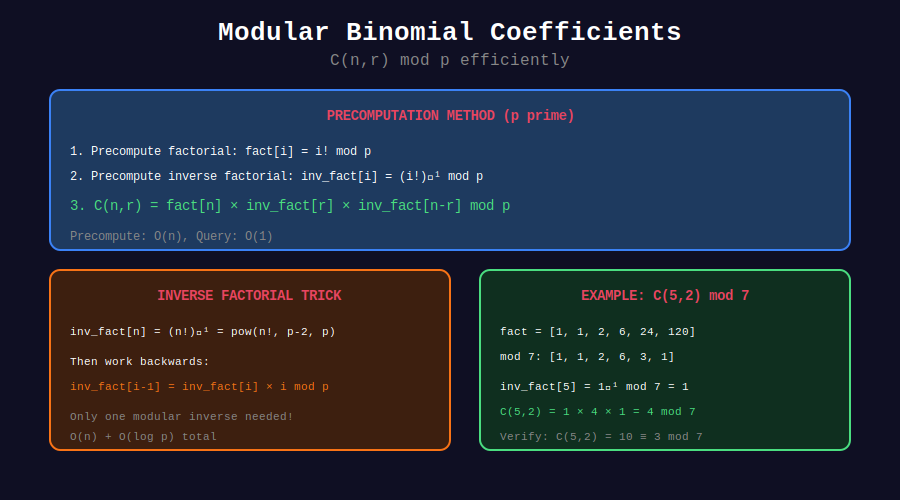

<div align="center">

# 🔐 Modular Binomial Coefficients

<p>
  
  
  
</p>

**Computing C(n,k) mod p Efficiently**

*Essential for competitive programming*

</div>

---

## 🧭 Navigation

| ⬅️ Previous | 📂 Current | ➡️ Next |
|:------------|:----------:|--------:|
| [← 02. Combinations](../02_combinations/README.md) | **03. Modular Binomial** | [04. Lucas →](../04_lucas_application/README.md) |

---

## 📊 Visual Diagram

<div align="center">



</div>

---

## 📐 The Challenge

For large n, k:
- n! can be astronomically large (overflow)
- We need C(n,k) mod p where p is typically 10^9 + 7

**Solution:** Use modular arithmetic with inverse factorials.

---

## 💻 Code Implementations

### 1. BinomialMod Class (Recommended)

```python
class BinomialMod:
    """
    Precompute factorials for O(1) binomial queries.
    
    Time: O(n) precomputation, O(1) per query
    Space: O(n)
    
    Usage:
        binom = BinomialMod(10**6)
        print(binom.nCr(1000, 500))
    """
    def __init__(self, max_n: int, mod: int = 10**9 + 7):
        self.mod = mod
        n = max_n
        
        # Compute factorials: fact[i] = i! mod p
        self.fact = [1] * (n + 1)
        for i in range(1, n + 1):
            self.fact[i] = self.fact[i - 1] * i % mod
        
        # Compute inverse factorials: inv_fact[i] = (i!)^(-1) mod p
        self.inv_fact = [1] * (n + 1)
        self.inv_fact[n] = pow(self.fact[n], mod - 2, mod)  # Fermat
        for i in range(n - 1, -1, -1):
            self.inv_fact[i] = self.inv_fact[i + 1] * (i + 1) % mod
    
    def nCr(self, n: int, r: int) -> int:
        """Compute C(n,r) mod p in O(1)."""
        if r > n or r < 0:
            return 0
        return self.fact[n] * self.inv_fact[r] % self.mod * self.inv_fact[n - r] % self.mod
    
    def nPr(self, n: int, r: int) -> int:
        """Compute P(n,r) = n!/(n-r)! mod p in O(1)."""
        if r > n or r < 0:
            return 0
        return self.fact[n] * self.inv_fact[n - r] % self.mod
    
    def factorial(self, n: int) -> int:
        """Return n! mod p."""
        return self.fact[n]
    
    def inverse_factorial(self, n: int) -> int:
        """Return (n!)^(-1) mod p."""
        return self.inv_fact[n]


# Example usage
MOD = 10**9 + 7
binom = BinomialMod(10**6, MOD)

print(binom.nCr(1000000, 500000))  # Instant!
print(binom.nCr(100, 50))          # 538992043
print(binom.nPr(10, 3))            # 720
```

### 2. Without Precomputation (Single Query)

```python
def nCr_mod(n: int, k: int, mod: int) -> int:
    """
    Compute C(n,k) mod p without precomputation.
    
    Time: O(k log mod) due to modular inverse
    Space: O(1)
    
    Use when you only need a few queries.
    """
    if k > n or k < 0:
        return 0
    if k > n - k:
        k = n - k
    
    numerator = 1
    denominator = 1
    
    for i in range(k):
        numerator = numerator * (n - i) % mod
        denominator = denominator * (i + 1) % mod
    
    # C(n,k) = numerator × denominator^(-1)
    return numerator * pow(denominator, mod - 2, mod) % mod


# Example
print(nCr_mod(1000, 500, 10**9 + 7))
```

### 3. Batch Inverse Computation

```python
def batch_inverse(arr: list[int], mod: int) -> list[int]:
    """
    Compute modular inverse of all elements in O(n).
    
    Uses the identity: 
    inv[i] = -floor(p/i) × inv[p mod i] mod p
    """
    n = len(arr)
    if n == 0:
        return []
    
    # Compute prefix products
    prefix = [1] * (n + 1)
    for i in range(n):
        prefix[i + 1] = prefix[i] * arr[i] % mod
    
    # Compute inverse of total product
    inv_total = pow(prefix[n], mod - 2, mod)
    
    # Compute individual inverses
    result = [0] * n
    for i in range(n - 1, -1, -1):
        result[i] = prefix[i] * inv_total % mod
        inv_total = inv_total * arr[i] % mod
    
    return result
```

---

## 🎨 Visual: Why Precomputation Works

```
┌─────────────────────────────────────────────────────────────────┐
│ COMPUTING C(5, 2) mod 7                                        │
├─────────────────────────────────────────────────────────────────┤
│                                                                 │
│ C(5,2) = 5! / (2! × 3!)                                        │
│        = 120 / (2 × 6)                                         │
│        = 120 / 12                                              │
│        = 10                                                    │
│                                                                 │
│ Modular version:                                               │
│   fact[5] = 120 mod 7 = 1                                      │
│   fact[2] = 2 mod 7 = 2                                        │
│   fact[3] = 6 mod 7 = 6                                        │
│                                                                 │
│   inv_fact[2] = 2^(-1) mod 7 = 4  (because 2×4 = 8 ≡ 1)       │
│   inv_fact[3] = 6^(-1) mod 7 = 6  (because 6×6 = 36 ≡ 1)      │
│                                                                 │
│   C(5,2) mod 7 = 1 × 4 × 6 mod 7 = 24 mod 7 = 3               │
│   Verify: 10 mod 7 = 3 ✓                                       │
└─────────────────────────────────────────────────────────────────┘
```

---

## 🏆 When to Use What

| Scenario | Method | Time |
|----------|--------|------|
| Multiple queries, n ≤ 10^7 | BinomialMod class | O(n) + O(1) per query |
| Few queries | nCr_mod function | O(k log p) per query |
| n up to 10^18, p small | Lucas' theorem | O(log_p(n) × p) |
| p is not prime | Extended GCD | More complex |

---

## 💡 Key Insights

> **Memory Limit:** 10^7 integers ≈ 40 MB. Don't precompute beyond 10^7.

> **Fermat's Little Theorem:** a^(-1) ≡ a^(p-2) mod p when p is prime.

> **Inverse Trick:** inv_fact[i] = inv_fact[i+1] × (i+1) (compute backwards)

> **Common MOD:** 10^9 + 7 and 998244353 are both prime.

---

<div align="center">

**Made with ❤️ by [Gaurav Goswami](https://github.com/Gaurav14cs17)**

</div>

---

## 🧭 Navigation

| ⬅️ Previous | 📂 Current | ➡️ Next |
|:------------|:----------:|--------:|
| [← 02. Combinations](../02_combinations/README.md) | **03. Modular Binomial** | [04. Lucas →](../04_lucas_application/README.md) |
