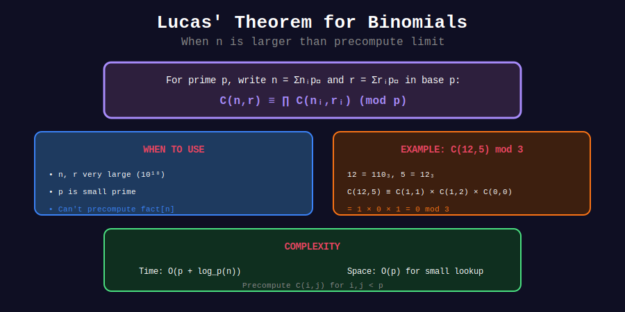

<div align="center">

# 🔮 Lucas' Theorem for Binomials

<p>
  
  
  
</p>

**C(n,k) mod p for Astronomically Large n, k**

*When precomputation isn't possible*

</div>

---

## 🧭 Navigation

| ⬅️ Previous | 📂 Current | ➡️ Next |
|:------------|:----------:|--------:|
| [← 03. Modular Binomial](../03_modular_binomial/README.md) | **04. Lucas** | [05. Advanced →](../05_advanced_problems/README.md) |

---

## 📊 Visual Diagram

<div align="center">



</div>

---

## 📐 The Theorem

**Lucas' Theorem:** For prime p and non-negative integers m, n:

$$\binom{m}{n} \equiv \prod_{i=0}^{k} \binom{m_i}{n_i} \pmod{p}$$

where $m = \sum m_i p^i$ and $n = \sum n_i p^i$ are base-p representations.

### Key Insight

If any digit $n_i > m_i$, then $\binom{m}{n} \equiv 0 \pmod{p}$

---

## 🎨 Visual Walkthrough

```
┌─────────────────────────────────────────────────────────────────┐
│ COMPUTING C(1000, 423) mod 7                                   │
├─────────────────────────────────────────────────────────────────┤
│                                                                 │
│ Step 1: Convert to base 7                                      │
│   1000 in base 7: 2626₇  (2×343 + 6×49 + 2×7 + 6×1)           │
│   423 in base 7:  1146₇  (1×343 + 1×49 + 4×7 + 6×1)           │
│                                                                 │
│ Step 2: Compute products                                       │
│   C(2626₇, 1146₇) ≡ C(2,1) × C(6,1) × C(2,4) × C(6,6) (mod 7) │
│                                                                 │
│ Step 3: Evaluate each                                          │
│   C(2,1) = 2                                                   │
│   C(6,1) = 6                                                   │
│   C(2,4) = 0  ← n_i > m_i, so entire product = 0!             │
│   C(6,6) = 1                                                   │
│                                                                 │
│ Result: C(1000, 423) ≡ 0 (mod 7)                               │
└─────────────────────────────────────────────────────────────────┘
```

---

## 💻 Code Implementations

### 1. Lucas' Theorem Implementation

```python
def lucas(m: int, n: int, p: int) -> int:
    """
    Compute C(m, n) mod p using Lucas' theorem.
    
    Works for m, n up to 10^18 when p is small.
    
    Time: O(log_p(m) × p)
    Space: O(p) for factorial table
    
    Args:
        m, n: Non-negative integers (n ≤ m)
        p: Prime number
    
    Returns:
        C(m, n) mod p
    """
    if n > m:
        return 0
    
    # Precompute factorials mod p (only need 0 to p-1)
    fact = [1] * p
    for i in range(1, p):
        fact[i] = fact[i - 1] * i % p
    
    # Precompute inverse factorials mod p
    inv_fact = [1] * p
    inv_fact[p - 1] = pow(fact[p - 1], p - 2, p)
    for i in range(p - 2, -1, -1):
        inv_fact[i] = inv_fact[i + 1] * (i + 1) % p
    
    def small_nCr(a: int, b: int) -> int:
        """C(a, b) mod p for 0 ≤ a, b < p."""
        if b > a or b < 0:
            return 0
        return fact[a] * inv_fact[b] % p * inv_fact[a - b] % p
    
    # Apply Lucas' theorem
    result = 1
    while m > 0 or n > 0:
        m_digit = m % p
        n_digit = n % p
        result = result * small_nCr(m_digit, n_digit) % p
        if result == 0:
            return 0  # Early termination
        m //= p
        n //= p
    
    return result


# Examples
print(lucas(10**18, 10**9, 7))        # Instant!
print(lucas(1000000000000, 500000000000, 13))  # Also instant!
print(lucas(1000, 423, 7))            # 0
```

### 2. Lucas with Verbose Output

```python
def lucas_verbose(m: int, n: int, p: int) -> int:
    """Lucas' theorem with step-by-step output."""
    print(f"Computing C({m}, {n}) mod {p}")
    
    # Convert to base p
    m_digits, n_digits = [], []
    m_temp, n_temp = m, n
    while m_temp > 0 or n_temp > 0:
        m_digits.append(m_temp % p)
        n_digits.append(n_temp % p)
        m_temp //= p
        n_temp //= p
    
    print(f"{m} in base {p}: {''.join(map(str, m_digits[::-1]))}")
    print(f"{n} in base {p}: {''.join(map(str, n_digits[::-1]))}")
    
    # Compute using Lucas
    result = lucas(m, n, p)
    
    print(f"Result: {result}")
    return result


lucas_verbose(1000, 423, 7)
```

### 3. Generalized Lucas (Prime Power Modulus)

```python
def lucas_prime_power(m: int, n: int, p: int, k: int) -> int:
    """
    C(m, n) mod p^k using generalized Lucas.
    
    More complex - uses Andrew Granville's theorem.
    For basic problems, just use CRT with multiple primes.
    """
    # This is an advanced topic
    # For p^k, combine:
    # 1. Lucas' theorem for p
    # 2. Lifting lemmas for higher powers
    pass
```

---

## 🏆 When to Use Lucas

| Scenario | Method | Why |
|----------|--------|-----|
| n ≤ 10^6, many queries | Precompute factorials | O(1) per query |
| n ≤ 10^18, p ≤ 10^6 | **Lucas' theorem** | Only option! |
| n ≤ 10^18, p > 10^6 | Usually impossible | Too slow |
| Composite modulus | Factor + CRT | Combine Lucas results |

---

## 💡 Key Insights

> **Zero Detection:** If any n_digit > m_digit, result is 0 immediately.

> **Space Efficiency:** Only need O(p) space regardless of n, m size.

> **Digit Independence:** Each base-p digit contributes independently.

> **Binary Special Case:** For p=2, C(m,n) mod 2 = 1 iff (n & m) == n.

---

## 📊 Complexity Comparison

| Method | Time | Space | Max n |
|--------|------|-------|-------|
| Precompute | O(n) + O(1) | O(n) | ~10^7 |
| Direct | O(k log p) | O(1) | ~10^7 |
| **Lucas** | O(log_p(n) × p) | O(p) | **10^18** |

---

<div align="center">

**Made with ❤️ by [Gaurav Goswami](https://github.com/Gaurav14cs17)**

</div>

---

## 🧭 Navigation

| ⬅️ Previous | 📂 Current | ➡️ Next |
|:------------|:----------:|--------:|
| [← 03. Modular Binomial](../03_modular_binomial/README.md) | **04. Lucas** | [05. Advanced →](../05_advanced_problems/README.md) |
