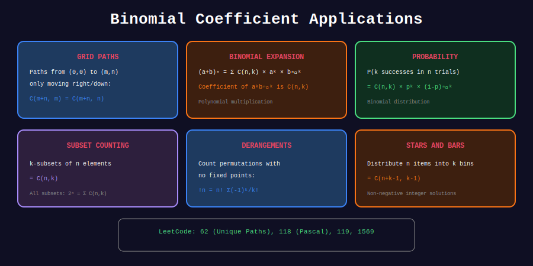

<div align="center">

# 🎯 Advanced Binomial Problems

<p>
  
  
</p>

**LeetCode & Competition Problems**

</div>

---

## 🧭 Navigation

| ⬅️ Previous | 📂 Current | ➡️ Next |
|:------------|:----------:|--------:|
| [← 04. Lucas](../04_lucas_application/README.md) | **05. Advanced** | [🏠 Binomial Home](../README.md) |

---

## 📊 Visual Diagram

<div align="center">



</div>

---

## 🏆 LeetCode Problems

| # | Problem | Difficulty | Key |
|:-:|---------|:----------:|-----|
| 62 | Unique Paths | 🟡 Medium | C(m+n-2, m-1) |
| 1569 | Reorder Array Same BST | 🔴 Hard | Binomial + recursion |

---

## 💻 Solutions

### LeetCode 1569: Number of Ways to Reorder Array

```python
class Solution:
    def numOfWays(self, nums: list[int]) -> int:
        MOD = 10**9 + 7
        binom = BinomialMod(len(nums), MOD)
        
        def solve(arr):
            if len(arr) <= 2:
                return 1
            
            root = arr[0]
            left = [x for x in arr if x < root]
            right = [x for x in arr if x > root]
            
            ways = binom.nCr(len(left) + len(right), len(left))
            ways = ways * solve(left) % MOD
            ways = ways * solve(right) % MOD
            
            return ways
        
        return (solve(nums) - 1) % MOD

```

### Stars and Bars

```python
def stars_and_bars(n: int, k: int) -> int:
    """
    Ways to put n identical items into k distinct bins.
    
    C(n + k - 1, k - 1)
    """
    from math import comb
    return comb(n + k - 1, k - 1)

```

---

## 📚 Key Identities

- **Vandermonde:** $\sum\_k C(m,k)C(n,r-k) = C(m+n,r)$

- **Hockey Stick:** $\sum\_{i=r}^{n} C(i,r) = C(n+1,r+1)$

- **Sum of Row:** $\sum\_k C(n,k) = 2^n$

---

<div align="center">

**Made with ❤️ by [Gaurav Goswami](https://github.com/Gaurav14cs17)**

</div>

---

## 🧭 Navigation

| ⬅️ Previous | 📂 Current | ➡️ Next |
|:------------|:----------:|--------:|
| [← 04. Lucas](../04_lucas_application/README.md) | **05. Advanced** | [🏠 Binomial Home](../README.md) |
