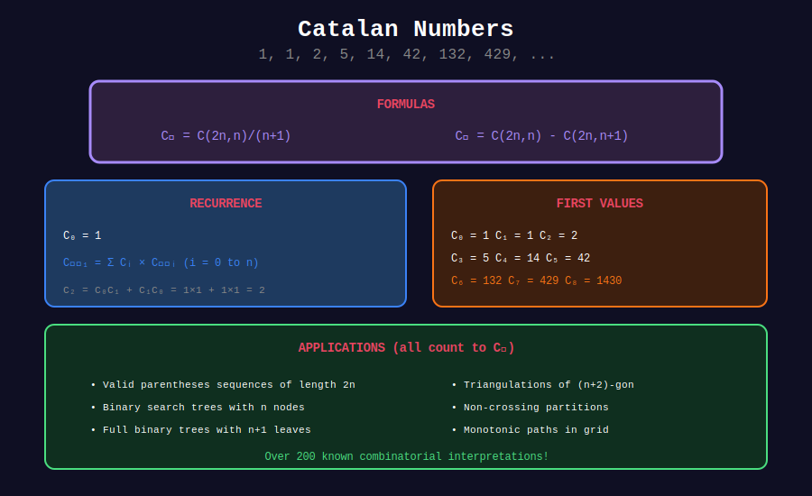

<div align="center">

# 🌸 Basic Catalan Numbers

<p>
  
  
  
</p>

**The Most Elegant Counting Sequence**

*Counting parentheses, paths, trees, and more*

</div>

---

## 🧭 Navigation

| ⬅️ Previous | 📂 Current | ➡️ Next |
|:------------|:----------:|--------:|
| [← Catalan Home](../README.md) | **01. Basic Catalan** | [02. BST Counting →](../02_bst_counting/README.md) |

---

## 📊 Visual Diagram

<div align="center">



</div>

---

## 📐 Mathematical Foundations

### Definition

The **n-th Catalan number** is:

```math
C_n = \frac{1}{n+1}\binom{2n}{n} = \frac{(2n)!}{(n+1)! \cdot n!}

```

### First Few Values

| n | C_n | Meaning |
|:-:|----:|---------|
| 0 | 1 | Empty structure |
| 1 | 1 | Single element |
| 2 | 2 | Two arrangements |
| 3 | 5 | Five arrangements |
| 4 | 14 | |
| 5 | 42 | |
| 6 | 132 | |
| 7 | 429 | |
| 8 | 1430 | |
| 9 | 4862 | |
| 10 | 16796 | |

### Recurrence Relations

**Direct Recurrence:**

```math
C_n = \sum_{i=0}^{n-1} C_i \cdot C_{n-1-i}

```

**Closed Form Recurrence:**

```math
C_n = \frac{2(2n-1)}{n+1} \cdot C_{n-1}

```

---

## 🎨 Visual: What Catalan Numbers Count

```
+-----------------------------------------------------------------+

| CATALAN NUMBER C₃ = 5 counts:                                  |
+-----------------------------------------------------------------+
|                                                                 |
| 1. BALANCED PARENTHESES with 3 pairs:                          |
|    ((()))  (()())  (())()  ()(())  ()()()                      |
|                                                                 |
| 2. BINARY TREES with 3 internal nodes:                         |
|      •         •        •        •         •                   |
|     / \       / \      / \      / \       / \                  |
|    •   •     •   •    •   •    •   •     •   •                 |
|   /   / \     \   \    \   /   /   \   / \   \                |
|  •   •   ·    •   •    •   •  ·   ·   ·   ·   ·               |
|                                                                 |
| 3. PATHS from (0,0) to (n,n) not crossing diagonal:           |
|        .-.             .-.          etc.                       |
|    .---' '-.       .---' '--.                                 |
|    |       |       |        |                                  |
|    '-------'       '--------'                                  |
|                                                                 |
| 4. TRIANGULATIONS of a polygon with n+2 sides:                 |
|    Pentagon (n=2): 5 ways to triangulate                       |
|                                                                 |
| 5. FULL BINARY TREES with n+1 leaves:                          |
|    5 different trees                                           |
+-----------------------------------------------------------------+

```

---

## 💻 Code Implementations

### 1. Direct Formula (Best for Single Query)

```python
def catalan(n: int) -> int:
    """
    Compute n-th Catalan number using closed formula.
    
    Formula: C_n = C(2n, n) / (n + 1)
    
    Time: O(n) for binomial
    Space: O(1)
    """
    if n < 0:
        return 0
    if n <= 1:
        return 1
    
    # Compute C(2n, n) / (n + 1) = C(2n, n+1)
    # Alternative: C(2n, n) - C(2n, n-1)
    result = 1
    for i in range(n):
        result = result * (2 * n - i) // (i + 1)
    
    return result // (n + 1)

# Using math.comb (Python 3.8+)
from math import comb

def catalan_fast(n: int) -> int:
    """Catalan using built-in comb."""
    return comb(2 * n, n) // (n + 1)

# Examples
for i in range(11):
    print(f"C({i}) = {catalan(i)}")

```

### 2. Modular Catalan (For Large n)

```python
def catalan_mod(n: int, mod: int = 10**9 + 7) -> int:
    """
    Compute n-th Catalan number mod p.
    
    C_n = C(2n, n) × (n+1)^(-1) mod p
    
    Time: O(n) for factorials + O(log p) for inverse
    Space: O(1)
    """
    if n <= 1:
        return 1
    
    # Compute C(2n, n) mod p
    numerator = 1
    denominator = 1
    
    for i in range(n):
        numerator = numerator * (2 * n - i) % mod
        denominator = denominator * (i + 1) % mod
    
    # C(2n, n) = numerator × denominator^(-1)
    comb_2n_n = numerator * pow(denominator, mod - 2, mod) % mod
    
    # C_n = C(2n, n) × (n+1)^(-1)
    return comb_2n_n * pow(n + 1, mod - 2, mod) % mod

# Example
print(catalan_mod(1000))  # Catalan(1000) mod 10^9+7

```

### 3. DP Approach (Precompute All)

```python
def catalan_dp(n: int) -> list[int]:
    """
    Compute all Catalan numbers C_0 to C_n.
    
    Uses: C_n = sum(C_i × C_{n-1-i}) for i in 0..n-1
    
    Time: O(n²)
    Space: O(n)
    """
    if n < 0:
        return []
    
    dp = [0] * (n + 1)
    dp[0] = 1
    
    for i in range(1, n + 1):
        for j in range(i):
            dp[i] += dp[j] * dp[i - 1 - j]
    
    return dp

# Example
print(catalan_dp(10))  # [1, 1, 2, 5, 14, 42, 132, 429, 1430, 4862, 16796]

```

### 4. Efficient Recurrence

```python
def catalan_recurrence(n: int) -> int:
    """
    Compute C_n using: C_n = (2(2n-1)/(n+1)) × C_{n-1}
    
    Time: O(n)
    Space: O(1)
    """
    if n <= 1:
        return 1
    
    result = 1
    for i in range(1, n + 1):
        result = result * (4 * i - 2) // (i + 1)
    
    return result

```

---

## 🏆 LeetCode Problems

| # | Problem | Difficulty | Key Concept | Link |
|:-:|---------|:----------:|-------------|------|
| 96 | Unique BSTs | 🟡 Medium | Core Catalan | [LeetCode](https://leetcode.com/problems/unique-binary-search-trees/) |
| 22 | Generate Parentheses | 🟡 Medium | Catalan enumeration | [LeetCode](https://leetcode.com/problems/generate-parentheses/) |
| 894 | All Possible FBT | 🟡 Medium | Full binary trees | [LeetCode](https://leetcode.com/problems/all-possible-full-binary-trees/) |

---

## 💡 Key Insights

> **Formula Connection:** C_n = C(2n, n) - C(2n, n+1) = paths that don't cross diagonal

> **Growth Rate:** C_n ≈ 4^n / (n^1.5 × √π) for large n

> **Alternative Formula:** C_n = C(2n, n+1) (simpler to compute!)

> **DP vs Formula:** Use formula for single query, DP when you need all values

---

## 📖 What Catalan Numbers Count

1. **Balanced parentheses** with n pairs
2. **Binary search trees** with n nodes
3. **Full binary trees** with n+1 leaves
4. **Dyck paths** from (0,0) to (n,n) not crossing y=x
5. **Triangulations** of polygon with n+2 vertices
6. **Non-crossing partitions** of n elements
7. **Mountain ranges** with n up-strokes and n down-strokes
8. **Ballot sequences** where A is never behind B
9. **Rooted ordered trees** with n+1 vertices
10. **Ways to cut convex polygon** into triangles

---

<div align="center">

**Made with ❤️ by [Gaurav Goswami](https://github.com/Gaurav14cs17)**

</div>

---

## 🧭 Navigation

| ⬅️ Previous | 📂 Current | ➡️ Next |
|:------------|:----------:|--------:|
| [← Catalan Home](../README.md) | **01. Basic Catalan** | [02. BST Counting →](../02_bst_counting/README.md) |
