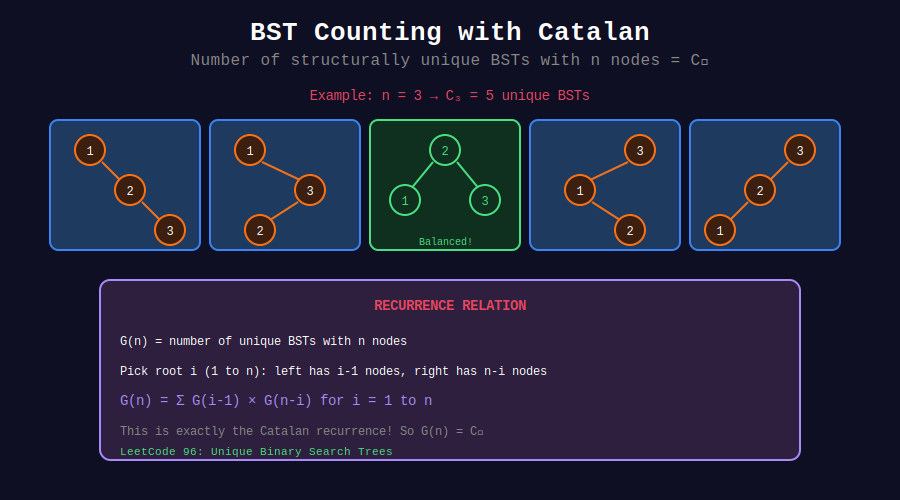

<div align="center">

# 🌲 BST Counting with Catalan Numbers

<p>
  
  
  
</p>

**Counting and Generating Unique BSTs**

*The most classic Catalan application*

</div>

---

## 🧭 Navigation

| ⬅️ Previous | 📂 Current | ➡️ Next |
|:------------|:----------:|--------:|
| [← 01. Basic Catalan](../01_basic_catalan/README.md) | **02. BST Counting** | [03. Parentheses →](../03_parentheses/README.md) |

---

## 📊 Visual Diagram

<div align="center">



</div>

---

## 📐 Why Catalan Numbers?

### The Connection

For n distinct values, the number of structurally unique BSTs equals C_n:

```math
\text{Unique BSTs with n nodes} = C_n = \frac{1}{n+1}\binom{2n}{n}

```

### Intuition

When we pick root = i:

- Left subtree has (i-1) nodes → C_{i-1} structures

- Right subtree has (n-i) nodes → C_{n-i} structures

- Total = sum over all roots = Catalan recurrence!

---

## 🎨 Visual: BST Counting

```
+-----------------------------------------------------------------+
| UNIQUE BSTs with n=3 nodes (values 1, 2, 3): C₃ = 5           |
+-----------------------------------------------------------------+
|                                                                 |
| Root = 1:         Root = 2:         Root = 3:                  |
| Left: 0 nodes     Left: 1 node      Left: 2 nodes              |
| Right: 2 nodes    Right: 1 node     Right: 0 nodes             |
| Count: C₀×C₂=2    Count: C₁×C₁=1    Count: C₂×C₀=2            |
|                                                                 |
|     1                 2                 3                       |
|      \               / \               /                        |
|       2             1   3             2                         |
|        \                             /                          |
|         3                           1                           |
|                                                                 |
|     1                               3                           |
|      \                             /                            |
|       3                           1                             |
|      /                             \                            |
|     2                               2                           |
|                                                                 |
| Total: 2 + 1 + 2 = 5 = C₃ ✓                                   |
+-----------------------------------------------------------------+

```

---

## 💻 Code Implementations

### LeetCode 96: Unique Binary Search Trees

```python
class Solution:
    def numTrees(self, n: int) -> int:
        """
        Count structurally unique BSTs with n nodes.
        
        DP Recurrence:
        dp[n] = sum(dp[i-1] × dp[n-i]) for i = 1 to n
        
        This IS the Catalan recurrence!
        
        Time: O(n²)
        Space: O(n)
        """
        dp = [0] * (n + 1)
        dp[0] = dp[1] = 1
        
        for nodes in range(2, n + 1):
            for root in range(1, nodes + 1):
                left_trees = dp[root - 1]
                right_trees = dp[nodes - root]
                dp[nodes] += left_trees * right_trees
        
        return dp[n]

# Alternative: Direct Catalan formula
class SolutionFormula:
    def numTrees(self, n: int) -> int:
        """Using Catalan formula: C(2n,n) / (n+1)"""
        from math import comb
        return comb(2 * n, n) // (n + 1)

```

### LeetCode 95: Unique Binary Search Trees II

```python
class TreeNode:
    def __init__(self, val=0, left=None, right=None):
        self.val = val
        self.left = left
        self.right = right

class Solution:
    def generateTrees(self, n: int) -> list[TreeNode]:
        """
        Generate all structurally unique BSTs with n nodes.
        
        Approach: For each possible root, recursively generate
        all left and right subtrees, then combine.
        
        Time: O(n × Catalan(n)) ≈ O(4^n / n^0.5)
        Space: O(n × Catalan(n)) for storing trees
        """
        if n == 0:
            return []
        
        def generate(low: int, high: int) -> list[TreeNode]:
            if low > high:
                return [None]
            
            trees = []
            for root_val in range(low, high + 1):
                # Generate all left subtrees (values < root_val)
                left_trees = generate(low, root_val - 1)
                # Generate all right subtrees (values > root_val)
                right_trees = generate(root_val + 1, high)
                
                # Combine: every left with every right
                for left in left_trees:
                    for right in right_trees:
                        root = TreeNode(root_val)
                        root.left = left
                        root.right = right
                        trees.append(root)
            
            return trees
        
        return generate(1, n)

```

### With Memoization

```python
class Solution:
    def generateTrees(self, n: int) -> list[TreeNode]:
        """Generate unique BSTs with memoization."""
        from functools import lru_cache
        
        @lru_cache(maxsize=None)
        def generate(low: int, high: int) -> tuple:
            if low > high:
                return (None,)
            
            trees = []
            for root_val in range(low, high + 1):
                for left in generate(low, root_val - 1):
                    for right in generate(root_val + 1, high):
                        root = TreeNode(root_val, left, right)
                        trees.append(root)
            
            return tuple(trees)
        
        return list(generate(1, n)) if n else []

```

---

## 📊 Complexity Analysis

| Method | Time | Space |
|--------|------|-------|
| Count (DP) | O(n²) | O(n) |
| Count (Formula) | O(n) | O(1) |
| Generate All | O(n × C_n) | O(n × C_n) |

**Catalan Growth:** C_n ≈ 4^n / (n^1.5 × √π)

| n | C_n | Trees to Generate |
|:-:|----:|------------------:|
| 5 | 42 | 42 |
| 10 | 16,796 | 16,796 |
| 15 | 9,694,845 | ❌ Too many! |

---

## 💡 Key Insights

> **Recurrence = Catalan:** The DP recurrence for BST counting IS the Catalan recurrence.

> **Cartesian Product:** Each (left_tree, right_tree) pair gives one unique BST.

> **Memory Sharing:** Generated subtrees can share structure (immutable).

> **Interview Tip:** Start with counting, then move to generation if asked.

---

## 🔗 Related Problems

| Problem | Connection |
|---------|------------|
| Unique BSTs | Direct Catalan |
| Generate BSTs | Enumerate structures |
| Different Possible FBT | Full binary trees |
| Expression Trees | Operator trees |

---

<div align="center">

**Made with ❤️ by [Gaurav Goswami](https://github.com/Gaurav14cs17)**

</div>

---

## 🧭 Navigation

| ⬅️ Previous | 📂 Current | ➡️ Next |
|:------------|:----------:|--------:|
| [← 01. Basic Catalan](../01_basic_catalan/README.md) | **02. BST Counting** | [03. Parentheses →](../03_parentheses/README.md) |
