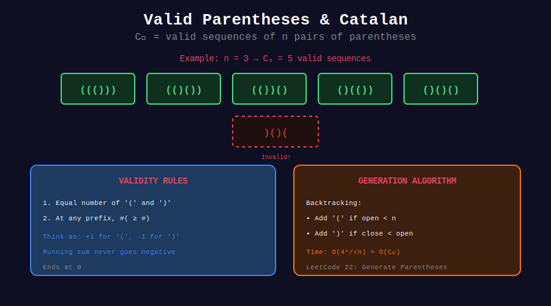

<div align="center">

# 🔄 Parentheses Generation

<p>
  
  
  
</p>

**Generating All Valid Parentheses Combinations**

*The quintessential Catalan problem*

</div>

---

## 🧭 Navigation

| ⬅️ Previous | 📂 Current | ➡️ Next |
|:------------|:----------:|--------:|
| [← 02. BST Counting](../02_bst_counting/README.md) | **03. Parentheses** | [04. Applications →](../04_applications/README.md) |

---

## 📊 Visual Diagram

<div align="center">



</div>

---

## 📐 Mathematical Foundation

### The Core Problem

Given n pairs of parentheses, generate all valid (balanced) combinations.

**Count:** C_n = (2n)! / ((n+1)! × n!)

**Examples:**
- n=1: `()` → 1 combination
- n=2: `(())`, `()()` → 2 combinations
- n=3: `((()))`, `(()())`, `(())()`, `()(())`, `()()()` → 5 combinations

### Valid Parentheses Rules

1. At any point, `open_count >= close_count`
2. At the end, `open_count == close_count == n`

---

## 🎨 Visual: Backtracking Tree

```
┌─────────────────────────────────────────────────────────────────┐
│ GENERATING PARENTHESES for n=2                                 │
├─────────────────────────────────────────────────────────────────┤
│                                                                 │
│                         ""                                      │
│                         │                                       │
│                        "("                                      │
│                       /   \                                     │
│                    "(("   "()"                                  │
│                     │       │                                   │
│                   "(()"   "()("                                 │
│                     │       │                                   │
│                  "(())"  "()()"                                 │
│                    ↓       ↓                                    │
│                 VALID!   VALID!                                 │
│                                                                 │
│ Decision at each step:                                          │
│   - Add '(' if open < n                                        │
│   - Add ')' if close < open                                    │
└─────────────────────────────────────────────────────────────────┘
```

---

## 💻 Code Implementations

### LeetCode 22: Generate Parentheses

```python
class Solution:
    def generateParenthesis(self, n: int) -> list[str]:
        """
        Generate all valid parentheses combinations.
        
        Backtracking with pruning:
        - Add '(' if we have remaining opens
        - Add ')' if close_count < open_count
        
        Time: O(4^n / √n) - Catalan bound
        Space: O(n) for recursion stack
        """
        result = []
        
        def backtrack(current: str, open_count: int, close_count: int):
            # Base case: string complete
            if len(current) == 2 * n:
                result.append(current)
                return
            
            # Can add '(' if we haven't used all opens
            if open_count < n:
                backtrack(current + '(', open_count + 1, close_count)
            
            # Can add ')' if it won't create invalid state
            if close_count < open_count:
                backtrack(current + ')', open_count, close_count + 1)
        
        backtrack("", 0, 0)
        return result


# Optimized with list (avoid string concatenation)
class SolutionOptimized:
    def generateParenthesis(self, n: int) -> list[str]:
        """Using list for O(1) append/pop."""
        result = []
        path = []
        
        def backtrack(open_count: int, close_count: int):
            if len(path) == 2 * n:
                result.append(''.join(path))
                return
            
            if open_count < n:
                path.append('(')
                backtrack(open_count + 1, close_count)
                path.pop()
            
            if close_count < open_count:
                path.append(')')
                backtrack(open_count, close_count + 1)
                path.pop()
        
        backtrack(0, 0)
        return result
```

### LeetCode 32: Longest Valid Parentheses

```python
class Solution:
    def longestValidParentheses(self, s: str) -> int:
        """
        Find longest valid parentheses substring.
        
        Stack approach: Store indices of unmatched '('
        
        Time: O(n)
        Space: O(n)
        """
        stack = [-1]  # Base for length calculation
        max_len = 0
        
        for i, char in enumerate(s):
            if char == '(':
                stack.append(i)
            else:
                stack.pop()
                if not stack:
                    stack.append(i)  # New base
                else:
                    max_len = max(max_len, i - stack[-1])
        
        return max_len


# DP approach
class SolutionDP:
    def longestValidParentheses(self, s: str) -> int:
        """
        dp[i] = length of longest valid ending at i
        
        If s[i] == ')':
          - If s[i-1] == '(': dp[i] = dp[i-2] + 2
          - If s[i-1] == ')' and s[i-dp[i-1]-1] == '(':
              dp[i] = dp[i-1] + 2 + dp[i-dp[i-1]-2]
        """
        if not s:
            return 0
        
        n = len(s)
        dp = [0] * n
        
        for i in range(1, n):
            if s[i] == ')':
                if s[i - 1] == '(':
                    dp[i] = (dp[i - 2] if i >= 2 else 0) + 2
                elif i - dp[i - 1] - 1 >= 0 and s[i - dp[i - 1] - 1] == '(':
                    dp[i] = dp[i - 1] + 2
                    if i - dp[i - 1] - 2 >= 0:
                        dp[i] += dp[i - dp[i - 1] - 2]
        
        return max(dp) if dp else 0
```

### LeetCode 678: Valid Parenthesis String (with *)

```python
class Solution:
    def checkValidString(self, s: str) -> bool:
        """
        Check if string with *, (, ) can be valid.
        * can be '(', ')', or empty.
        
        Track range [lo, hi] of possible open counts.
        
        Time: O(n)
        Space: O(1)
        """
        lo = hi = 0  # Min and max possible open counts
        
        for char in s:
            if char == '(':
                lo += 1
                hi += 1
            elif char == ')':
                lo = max(0, lo - 1)  # Match with ( or ignore
                hi -= 1
            else:  # char == '*'
                lo = max(0, lo - 1)  # * acts as ) or empty
                hi += 1              # * acts as (
            
            if hi < 0:  # Too many )
                return False
        
        return lo == 0
```

---

## 🏆 Related LeetCode Problems

| # | Problem | Difficulty | Key Concept | Link |
|:-:|---------|:----------:|-------------|------|
| 22 | Generate Parentheses | 🟡 Medium | Backtracking | [LeetCode](https://leetcode.com/problems/generate-parentheses/) |
| 32 | Longest Valid Parentheses | 🔴 Hard | Stack/DP | [LeetCode](https://leetcode.com/problems/longest-valid-parentheses/) |
| 678 | Valid Parenthesis String | 🟡 Medium | Range tracking | [LeetCode](https://leetcode.com/problems/valid-parenthesis-string/) |
| 20 | Valid Parentheses | 🟢 Easy | Stack | [LeetCode](https://leetcode.com/problems/valid-parentheses/) |

---

## 💡 Key Insights

> **Catalan Connection:** The number of valid n-pair sequences is C_n.

> **Prefix Property:** At any prefix, #( ≥ #) for valid strings.

> **Two-Pass Technique:** Check forward for ), backward for ( for O(1) space validation.

> **Stack Invariant:** Stack always contains indices of unmatched '('.

---

<div align="center">

**Made with ❤️ by [Gaurav Goswami](https://github.com/Gaurav14cs17)**

</div>

---

## 🧭 Navigation

| ⬅️ Previous | 📂 Current | ➡️ Next |
|:------------|:----------:|--------:|
| [← 02. BST Counting](../02_bst_counting/README.md) | **03. Parentheses** | [04. Applications →](../04_applications/README.md) |
