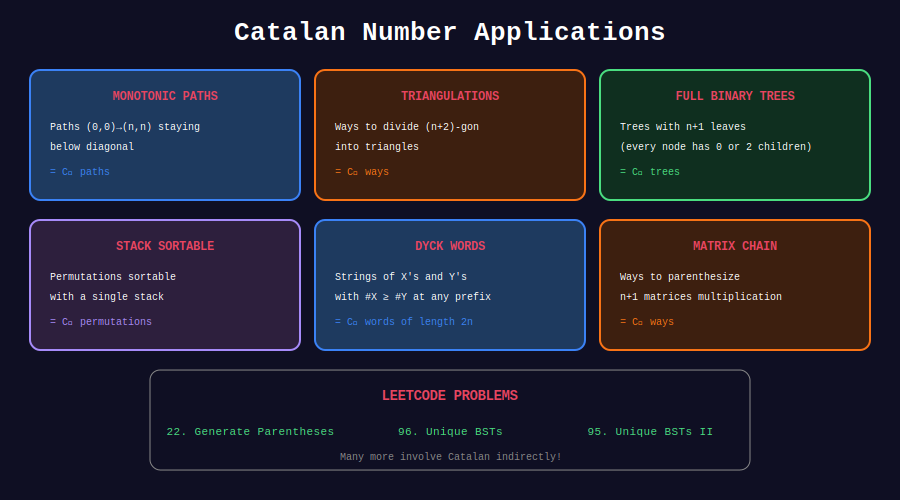

<div align="center">

# 🎯 Catalan Number Applications

<p>
  
  
  
</p>

**Real-World Problems Solved by Catalan Numbers**

*Beyond parentheses and BSTs*

</div>

---

## 🧭 Navigation

| ⬅️ Previous | 📂 Current | ➡️ Next |
|:------------|:----------:|--------:|
| [← 03. Parentheses](../03_parentheses/README.md) | **04. Applications** | [🏠 Catalan Home](../README.md) |

---

## 📊 Visual Diagram

<div align="center">



</div>

---

## 📋 What Catalan Numbers Count

### 1. Full Binary Trees (LeetCode 894)

```python
class TreeNode:
    def __init__(self, val=0, left=None, right=None):
        self.val = val
        self.left = left
        self.right = right


class Solution:
    def allPossibleFBT(self, n: int) -> list[TreeNode]:
        """
        Generate all full binary trees with n nodes.
        
        Full binary tree: every node has 0 or 2 children.
        Only possible when n is odd.
        
        Count: C_{(n-1)/2}
        
        Time: O(2^n)
        Space: O(2^n)
        """
        memo = {1: [TreeNode(0)]}
        
        def generate(n: int) -> list[TreeNode]:
            if n not in memo:
                result = []
                for left_count in range(1, n, 2):  # Odd numbers only
                    right_count = n - 1 - left_count
                    for left in generate(left_count):
                        for right in generate(right_count):
                            root = TreeNode(0)
                            root.left = left
                            root.right = right
                            result.append(root)
                memo[n] = result
            return memo[n]
        
        return generate(n) if n % 2 == 1 else []
```

### 2. Dyck Paths (Grid Paths Not Crossing Diagonal)

```python
def count_dyck_paths(n: int) -> int:
    """
    Count paths from (0,0) to (n,n) that never go above y=x.
    
    Each path: n right moves, n up moves.
    Constraint: at any point, rights >= ups.
    
    Answer: C_n = C(2n, n) / (n + 1)
    """
    from math import comb
    return comb(2 * n, n) // (n + 1)


def generate_dyck_paths(n: int) -> list[str]:
    """Generate all Dyck paths as strings (R=right, U=up)."""
    result = []
    
    def backtrack(path: list, rights: int, ups: int):
        if len(path) == 2 * n:
            result.append(''.join(path))
            return
        
        if rights < n:
            path.append('R')
            backtrack(path, rights + 1, ups)
            path.pop()
        
        if ups < rights:  # Key constraint!
            path.append('U')
            backtrack(path, rights, ups + 1)
            path.pop()
    
    backtrack([], 0, 0)
    return result
```

### 3. Polygon Triangulation

```python
def triangulation_count(n: int) -> int:
    """
    Count ways to triangulate a convex polygon with n vertices.
    
    Answer: C_{n-2}
    """
    from math import comb
    if n < 3:
        return 0
    return comb(2 * (n - 2), n - 2) // (n - 1)


# Example: Pentagon (5 vertices) = C_3 = 5 triangulations
print(triangulation_count(5))  # 5
```

### 4. Mountain Ranges

```python
def count_mountain_ranges(n: int) -> int:
    """
    Count ways to draw n non-overlapping mountain ranges.
    
    Each range: / up, \ down.
    Constraint: never go below ground level.
    
    Answer: C_n
    """
    from math import comb
    return comb(2 * n, n) // (n + 1)


def visualize_mountain(path: str) -> str:
    """Visualize a mountain range from parentheses string."""
    lines = []
    height = 0
    max_height = path.count('(')
    
    for level in range(max_height, 0, -1):
        line = ""
        h = 0
        for char in path:
            if char == '(':
                h += 1
                line += '/' if h == level else ' '
            else:
                line += '\\' if h == level else ' '
                h -= 1
        lines.append(line)
    
    lines.append('─' * len(path))
    return '\n'.join(lines)


# Example
print(visualize_mountain("(())()"))
```

### 5. Non-Crossing Partitions

```python
def non_crossing_partitions(n: int) -> int:
    """
    Count non-crossing partitions of n elements.
    
    Example for n=3:
    {{1,2,3}}, {{1},{2,3}}, {{1,2},{3}}, {{1,3},{2}}, {{1},{2},{3}}
    = 5 = C_3
    
    Answer: C_n
    """
    from math import comb
    return comb(2 * n, n) // (n + 1)
```

### 6. Stack-Sortable Permutations

```python
def is_stack_sortable(perm: list[int]) -> bool:
    """
    Check if permutation can be sorted using a stack.
    
    Stack-sortable iff avoids pattern 231.
    Count: C_n stack-sortable permutations of length n.
    """
    # Check for 231 pattern
    n = len(perm)
    for i in range(n - 2):
        for j in range(i + 1, n - 1):
            for k in range(j + 1, n):
                if perm[j] > perm[k] > perm[i]:
                    return False  # Found 231
    return True


def count_stack_sortable(n: int) -> int:
    """Count stack-sortable permutations of n elements."""
    from math import comb
    return comb(2 * n, n) // (n + 1)
```

---

## 🏆 LeetCode Problems

| # | Problem | Difficulty | Application | Link |
|:-:|---------|:----------:|-------------|------|
| 894 | All Possible FBT | 🟡 Medium | Full binary trees | [LeetCode](https://leetcode.com/problems/all-possible-full-binary-trees/) |
| 96 | Unique Binary Search Trees | 🟡 Medium | BST counting | [LeetCode](https://leetcode.com/problems/unique-binary-search-trees/) |
| 22 | Generate Parentheses | 🟡 Medium | Balanced parentheses | [LeetCode](https://leetcode.com/problems/generate-parentheses/) |
| 1259 | Handshakes No Crossing | 🔴 Hard | Non-crossing | [LeetCode](https://leetcode.com/problems/handshakes-that-dont-cross/) |

---

## 📊 Summary Table

| Application | Formula | Example (n=3) |
|-------------|---------|---------------|
| Balanced parentheses | C_n | 5 sequences |
| BSTs with n nodes | C_n | 5 trees |
| Full binary trees (n leaves) | C_{n-1} | 2 trees (3 nodes) |
| Polygon triangulations (n+2 sides) | C_n | Pentagon: 5 |
| Dyck paths | C_n | 5 paths |
| Mountain ranges | C_n | 5 ranges |
| Non-crossing partitions | C_n | 5 partitions |
| Stack-sortable permutations | C_n | 5 permutations |

---

## 💡 Key Insights

> **Pattern Recognition:** If a problem has Catalan structure (split into two independent subproblems where sizes sum to n-1), it's likely Catalan.

> **Bijections:** All Catalan objects are in bijection. BSTs ↔ Parentheses ↔ Dyck paths.

> **Modified Catalan:** C(2n,n) - C(2n,n+k) counts paths that touch y=x+k at most.

> **Ballot Problem:** Probability candidate A stays ahead = 1/(n+1) = C_n / C(2n,n)

---

<div align="center">

**Made with ❤️ by [Gaurav Goswami](https://github.com/Gaurav14cs17)**

</div>

---

## 🧭 Navigation

| ⬅️ Previous | 📂 Current | ➡️ Next |
|:------------|:----------:|--------:|
| [← 03. Parentheses](../03_parentheses/README.md) | **04. Applications** | [🏠 Catalan Home](../README.md) |
