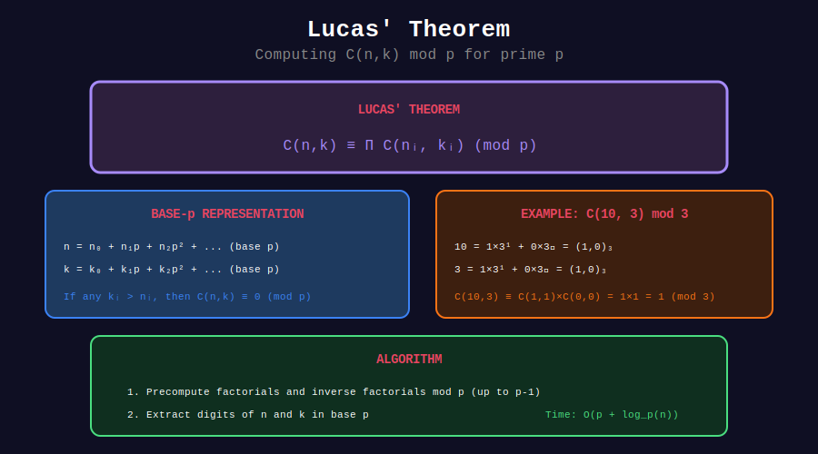

<div align="center">

# 🔮 Basic Lucas' Theorem

<p>
  
  
</p>

**C(m, n) mod p for Huge Numbers**

*Named after Édouard Lucas (1842-1891)*

</div>

---

## 🧭 Navigation

| ⬅️ Previous | 📂 Current | ➡️ Next |
|:------------|:----------:|--------:|
| [🏠 Lucas Home](../README.md) | **01. Basic Lucas** | [02. Sierpiński →](../02_sierpinski/README.md) |

---

## 📊 Visual Diagram

<div align="center">



</div>

---

## 📐 The Theorem

For prime p and non-negative m, n:

```math
C(m, n) \equiv \prod_{i=0}^{k} C(m_i, n_i) \pmod{p}

```

where $m = \sum m\_i p^i$ and $n = \sum n\_i p^i$ are base-p representations.

**Key:** If any $n\_i > m\_i$, then $C(m, n) \equiv 0 \pmod{p}$

---

## 💻 Implementation

```python
def lucas(m: int, n: int, p: int) -> int:
    """
    Compute C(m, n) mod p using Lucas' theorem.
    
    Works for m, n up to 10^18 with small p.
    
    Time: O(log_p(m) × p)
    """
    if n > m:
        return 0
    
    # Precompute factorials mod p
    fact = [1] * p
    for i in range(1, p):
        fact[i] = fact[i - 1] * i % p
    
    inv_fact = [1] * p
    inv_fact[p - 1] = pow(fact[p - 1], p - 2, p)
    for i in range(p - 2, -1, -1):
        inv_fact[i] = inv_fact[i + 1] * (i + 1) % p
    
    def small_nCr(a: int, b: int) -> int:
        if b > a or b < 0:
            return 0
        return fact[a] * inv_fact[b] % p * inv_fact[a - b] % p
    
    result = 1
    while m > 0 or n > 0:
        result = result * small_nCr(m % p, n % p) % p
        m //= p
        n //= p
    
    return result

# Example: C(10^18, 10^9) mod 7
print(lucas(10**18, 10**9, 7))  # Instant!

```

---

## 💡 When to Use

| Scenario | Method |
|----------|--------|
| Small n, k (< 10^6) | Precomputed factorials |
| Large n, small p | Lucas' theorem |
| Large n, large p | Generally impractical |

---

<div align="center">

**Made with ❤️ by [Gaurav Goswami](https://github.com/Gaurav14cs17)**

</div>

---

## 🧭 Navigation

| ⬅️ Previous | 📂 Current | ➡️ Next |
|:------------|:----------:|--------:|
| [🏠 Lucas Home](../README.md) | **01. Basic Lucas** | [02. Sierpiński →](../02_sierpinski/README.md) |
