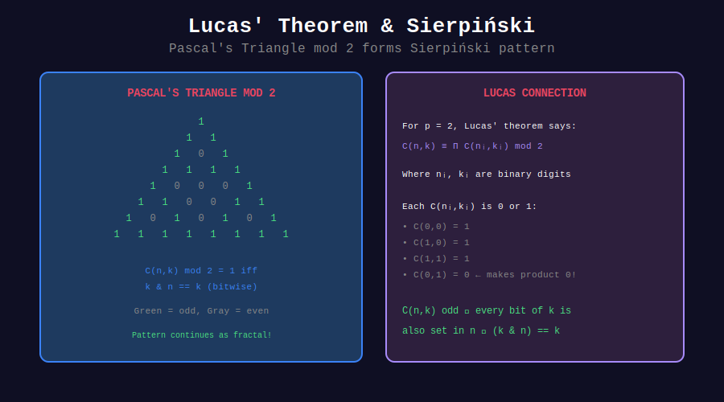

<div align="center">

# 🔺 Sierpiński Triangle & Lucas

<p>
  
  
</p>

**Binary Patterns in Pascal's Triangle**

</div>

---

## 🧭 Navigation

| ⬅️ Previous | 📂 Current | ➡️ Next |
|:------------|:----------:|--------:|
| [← 01. Basic Lucas](../01_basic_lucas/README.md) | **02. Sierpiński** | [03. Applications →](../03_applications/README.md) |

---

## 📊 Visual Diagram

<div align="center">



</div>

---

## 📐 The Connection

By Lucas' theorem with p = 2:

```math
C(m, n) \equiv 1 \pmod{2} \iff n \text{ is a binary submask of } m
```

That is: $(n \mathbin{\&} m) = n$

---

## 🎨 Pascal's Triangle mod 2

```
Row 0:        1
Row 1:       1 1
Row 2:      1 0 1
Row 3:     1 1 1 1
Row 4:    1 0 0 0 1
Row 5:   1 1 0 0 1 1
Row 6:  1 0 1 0 1 0 1
Row 7: 1 1 1 1 1 1 1 1
```

This forms a **Sierpiński triangle** fractal pattern!

---

## 💻 Implementation

```python
def is_binomial_odd(m: int, n: int) -> bool:
    """C(m, n) is odd iff n is binary submask of m."""
    return (n & m) == n

def count_odd_in_row(n: int) -> int:
    """
    Count odd entries in row n of Pascal's triangle.
    
    Answer: 2^(popcount(n))
    """
    return 1 << bin(n).count('1')

def generate_sierpinski(rows: int):
    """Generate visual Sierpiński pattern."""
    for n in range(rows):
        line = ' ' * (rows - n - 1)
        for k in range(n + 1):
            line += '█' if is_binomial_odd(n, k) else ' '
        print(line)

generate_sierpinski(16)
```

---

<div align="center">

**Made with ❤️ by [Gaurav Goswami](https://github.com/Gaurav14cs17)**

</div>

---

## 🧭 Navigation

| ⬅️ Previous | 📂 Current | ➡️ Next |
|:------------|:----------:|--------:|
| [← 01. Basic Lucas](../01_basic_lucas/README.md) | **02. Sierpiński** | [03. Applications →](../03_applications/README.md) |
