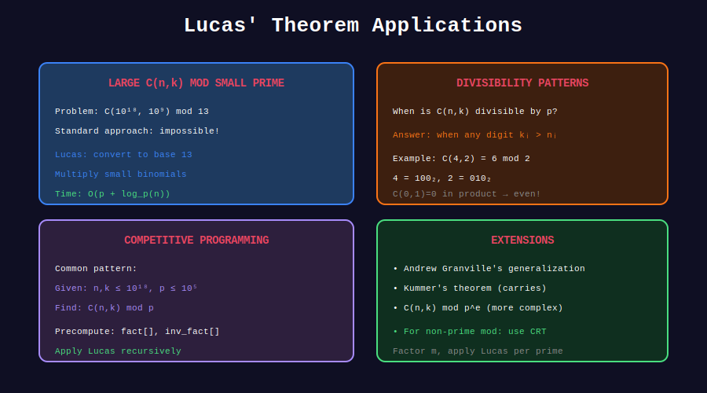

<div align="center">

# 🎯 Lucas' Theorem Applications

<p>
  
  
  
</p>

**Advanced Problems Using Lucas' Theorem**

*Computing binomials for astronomically large numbers*

</div>

---

## 🧭 Navigation

| ⬅️ Previous | 📂 Current | ➡️ Next |
|:------------|:----------:|--------:|
| [← 02. Sierpiński](../02_sierpinski/README.md) | **03. Applications** | [🏠 Lucas Home](../README.md) |

---

## 📊 Visual Diagram

<div align="center">



</div>

---

## 📐 When to Use Lucas

| Scenario | Method |
|----------|--------|
| n ≤ 10^7, many queries | Precompute factorials |
| n ≤ 10^18, p small (≤10^6) | **Lucas' Theorem** |
| n ≤ 10^18, p large | Usually intractable |
| Composite modulus | Factor + CRT |

---

## 💻 Core Implementation

```python
class LucasCalculator:
    """
    Compute C(n, k) mod p for large n, k using Lucas' Theorem.
    
    Time: O(p) precomputation + O(log_p(n)) per query
    Space: O(p)
    """
    def __init__(self, p: int):
        """Initialize with prime p. Works best when p ≤ 10^6."""
        self.p = p
        
        # Precompute factorials and inverses mod p
        self.fact = [1] * p
        for i in range(1, p):
            self.fact[i] = self.fact[i - 1] * i % p
        
        self.inv_fact = [1] * p
        self.inv_fact[p - 1] = pow(self.fact[p - 1], p - 2, p)
        for i in range(p - 2, -1, -1):
            self.inv_fact[i] = self.inv_fact[i + 1] * (i + 1) % p
    
    def small_nCr(self, n: int, r: int) -> int:
        """C(n, r) mod p for n, r < p."""
        if r > n or r < 0:
            return 0
        return self.fact[n] * self.inv_fact[r] % self.p * self.inv_fact[n - r] % self.p
    
    def nCr(self, n: int, r: int) -> int:
        """C(n, r) mod p using Lucas' theorem."""
        if r > n:
            return 0
        
        result = 1
        while n > 0 or r > 0:
            n_digit = n % self.p
            r_digit = r % self.p
            
            result = result * self.small_nCr(n_digit, r_digit) % self.p
            
            if result == 0:
                return 0  # Early termination
            
            n //= self.p
            r //= self.p
        
        return result

# Example usage
calc = LucasCalculator(7)
print(calc.nCr(10**18, 10**9))  # Instant!
```

---

## 🏆 Problem Applications

### 1. Counting Paths in Large Grids

```python
def grid_paths_mod(rows: int, cols: int, p: int) -> int:
    """
    Count paths from (0,0) to (rows-1, cols-1) mod p.
    
    Answer: C(rows + cols - 2, rows - 1)
    
    Works for rows, cols up to 10^18!
    """
    calc = LucasCalculator(p)
    return calc.nCr(rows + cols - 2, rows - 1)

# Example: Huge grid!
print(grid_paths_mod(10**15, 10**15, 7))
```

### 2. Multinomial Coefficients

```python
def multinomial_mod(n: int, groups: list[int], p: int) -> int:
    """
    Compute n! / (k1! × k2! × ... × km!) mod p
    where k1 + k2 + ... + km = n.
    
    Decompose into binomials using Lucas.
    """
    calc = LucasCalculator(p)
    
    result = 1
    remaining = n
    
    for k in groups:
        result = result * calc.nCr(remaining, k) % p
        remaining -= k
    
    return result

# Example: Ways to arrange "MISSISSIPPI" mod 7
# 11! / (1! × 4! × 4! × 2!) 
print(multinomial_mod(11, [1, 4, 4, 2], 7))
```

### 3. Stars and Bars with Large n

```python
def distribute_items(n: int, k: int, p: int) -> int:
    """
    Ways to put n identical items into k distinct bins.
    
    Answer: C(n + k - 1, k - 1)
    """
    calc = LucasCalculator(p)
    return calc.nCr(n + k - 1, k - 1)

# Example: Distribute 10^18 candies among 5 children mod 13
print(distribute_items(10**18, 5, 13))
```

### 4. Kummer's Theorem (Carries in Addition)

```python
def carries_in_addition(a: int, b: int, p: int) -> int:
    """
    Count carries when adding a and b in base p.
    
    By Kummer's theorem:
    ν_p(C(a+b, a)) = number of carries when adding a + b in base p
    
    This tells us the power of p dividing C(a+b, a).
    """
    carries = 0
    carry = 0
    
    while a > 0 or b > 0:
        digit_sum = (a % p) + (b % p) + carry
        carry = digit_sum // p
        carries += carry
        a //= p
        b //= p
    
    return carries

def binomial_divisibility(n: int, k: int, p: int) -> int:
    """
    Find the largest e such that p^e divides C(n, k).
    Uses Kummer's theorem.
    """
    return carries_in_addition(k, n - k, p)

# Example: Find power of 2 dividing C(10, 4)
# C(10,4) = 210 = 2 × 105 = 2 × 3 × 5 × 7
print(binomial_divisibility(10, 4, 2))  # 1
```

### 5. Composite Modulus (CRT)

```python
def nCr_composite(n: int, r: int, m: int) -> int:
    """
    Compute C(n, r) mod m where m may be composite.
    
    Factor m and use CRT to combine results.
    
    Note: Works when m is square-free.
    """
    def factorize(m):
        factors = []
        d = 2
        while d * d <= m:
            if m % d == 0:
                factors.append(d)
                while m % d == 0:
                    m //= d
            d += 1
        if m > 1:
            factors.append(m)
        return factors
    
    def extended_gcd(a, b):
        if b == 0:
            return a, 1, 0
        g, x, y = extended_gcd(b, a % b)
        return g, y, x - (a // b) * y
    
    primes = factorize(m)
    remainders = []
    moduli = []
    
    for p in primes:
        calc = LucasCalculator(p)
        remainders.append(calc.nCr(n, r))
        moduli.append(p)
    
    # CRT reconstruction
    result = 0
    M = m
    
    for i in range(len(primes)):
        Mi = M // moduli[i]
        _, yi, _ = extended_gcd(Mi, moduli[i])
        result = (result + remainders[i] * Mi * yi) % M
    
    return result

# Example: C(100, 50) mod 30 = C(100,50) mod (2×3×5)
print(nCr_composite(100, 50, 30))
```

---

## 🎨 Visual: Lucas Digit Comparison

```
+-----------------------------------------------------------------+
| COMPUTING C(123, 45) mod 7                                     |
+-----------------------------------------------------------------+
|                                                                 |
| Step 1: Convert to base 7                                      |
|   123 = 234₇  (2×49 + 3×7 + 4×1)                              |
|   45  = 063₇  (0×49 + 6×7 + 3×1)                              |
|                                                                 |
| Step 2: Digit-by-digit comparison                              |
|   Position 0: C(4, 3) = 4                                      |
|   Position 1: C(3, 6) = 0 ← 6 > 3, so result is 0!            |
|   Position 2: C(2, 0) = 1                                      |
|                                                                 |
| Result: C(123, 45) ≡ 0 (mod 7)                                 |
|                                                                 |
| Key insight: ANY r_digit > n_digit makes result 0!             |
+-----------------------------------------------------------------+
```

---

## 💡 Key Insights

> **Zero Detection:** C(n,r) ≡ 0 (mod p) iff any r_digit > n_digit in base-p.

> **Binary Special Case:** For p=2, C(n,r) mod 2 = 1 iff (r AND n) == r.

> **Odd Binomials:** C(n,r) is odd iff binary of r is "submask" of binary of n.

> **Kummer's Theorem:** ν_p(C(n,r)) = (carries when adding r + (n-r) in base p).

---

## 📊 Complexity Summary

| Method | Precomputation | Query | Max n |
|--------|----------------|-------|-------|
| Factorials | O(n) | O(1) | 10^7 |
| Lucas | O(p) | O(log_p n) | 10^18 |
| Lucas + CRT | O(sum of primes) | O(k log n) | 10^18 |

---

<div align="center">

**Made with ❤️ by [Gaurav Goswami](https://github.com/Gaurav14cs17)**

</div>

---

## 🧭 Navigation

| ⬅️ Previous | 📂 Current | ➡️ Next |
|:------------|:----------:|--------:|
| [← 02. Sierpiński](../02_sierpinski/README.md) | **03. Applications** | [🏠 Lucas Home](../README.md) |
