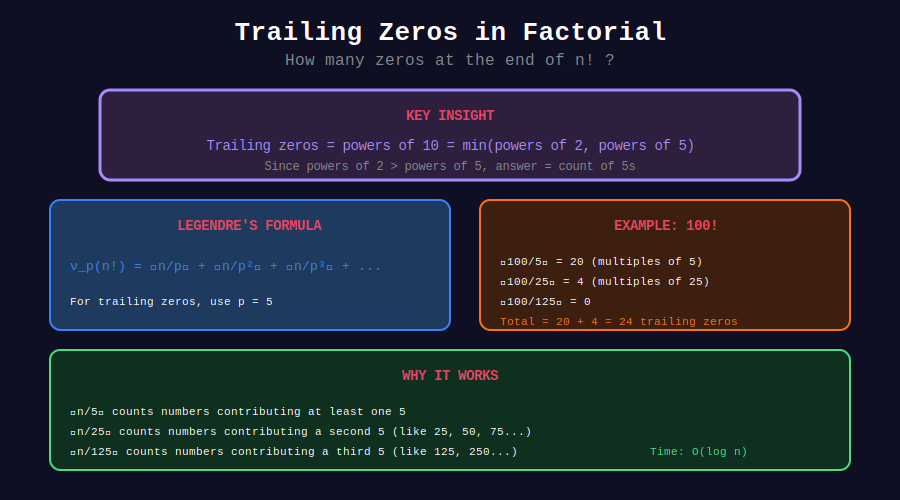

<div align="center">

# 0️⃣ Factorial Trailing Zeros

<p>
  
  
  
</p>

**Counting Trailing Zeros in n! Without Computing n!**

*Classic application of Legendre's formula*

</div>

---

## 🧭 Navigation

| ⬅️ Previous | 📂 Current | ➡️ Next |
|:------------|:----------:|--------:|
| [← Legendre Home](../README.md) | **01. Factorial Zeros** | [02. p-adic Valuation →](../02_p_adic_valuation/README.md) |

---

## 📊 Visual Diagram

<div align="center">



</div>

---

## 📐 Mathematical Foundation

### Legendre's Formula

The exponent of prime p in n! is:

$$
\nu_p(n!) = \sum_{i=1}^{\infty} \left\lfloor \frac{n}{p^i} \right\rfloor = \left\lfloor \frac{n}{p} \right\rfloor + \left\lfloor \frac{n}{p^2} \right\rfloor + \left\lfloor \frac{n}{p^3} \right\rfloor + \cdots
$$

### Why Trailing Zeros?

- A trailing zero is produced by a factor of 10 = 2 × 5
- In n!, there are always more factors of 2 than 5
- So: **Trailing zeros = ν₅(n!)**

---

## 🎨 Visual: Counting Factors of 5

```
+-----------------------------------------------------------------+
| COUNTING TRAILING ZEROS in 100!                                |
+-----------------------------------------------------------------+
|                                                                 |
| Which numbers from 1 to 100 contribute factors of 5?           |
|                                                                 |
| Divisible by 5:  5,10,15,20,25,30,35,40,45,50,                |
|                  55,60,65,70,75,80,85,90,95,100                |
|                  → 20 numbers (each gives at least one 5)      |
|                                                                 |
| Divisible by 25: 25, 50, 75, 100                               |
|                  → 4 numbers (each gives an extra 5)           |
|                                                                 |
| Divisible by 125: none in 1-100                                |
|                                                                 |
| Total factors of 5: 20 + 4 = 24                                |
|                                                                 |
| Formula: ⌊100/5⌋ + ⌊100/25⌋ + ⌊100/125⌋ + ...                |
|        = 20 + 4 + 0 + ...                                      |
|        = 24 trailing zeros                                     |
|                                                                 |
| 100! = 933262154439...00000000000000000000000000               |
|                        ↑ 24 zeros ↑                            |
+-----------------------------------------------------------------+
```

---

## 💻 Code Implementations

### LeetCode 172: Factorial Trailing Zeroes

```python
class Solution:
    def trailingZeroes(self, n: int) -> int:
        """
        Count trailing zeros in n!
        
        Key insight: Count factors of 5 (there are always more 2s).
        
        Time: O(log₅ n)
        Space: O(1)
        """
        zeros = 0
        power_of_5 = 5
        
        while power_of_5 <= n:
            zeros += n // power_of_5
            power_of_5 *= 5
        
        return zeros

# More elegant version
class SolutionElegant:
    def trailingZeroes(self, n: int) -> int:
        zeros = 0
        while n >= 5:
            n //= 5
            zeros += n
        return zeros

# Test
sol = Solution()
print(sol.trailingZeroes(100))  # 24
print(sol.trailingZeroes(1000)) # 249
```

### LeetCode 793: Preimage Size of Factorial Zeroes Function

```python
class Solution:
    def preimageSizeFZF(self, k: int) -> int:
        """
        How many n have exactly k trailing zeros in n!?
        
        Key insight: 
        - f(n) = trailing zeros in n! is non-decreasing
        - f jumps by 1 most of the time, but jumps by 2+ at 
          multiples of 25, 125, etc.
        - Answer is either 0 or 5
        
        Use binary search to find range.
        
        Time: O(log²(k))
        Space: O(1)
        """
        def count_zeros(n: int) -> int:
            zeros = 0
            while n >= 5:
                n //= 5
                zeros += n
            return zeros
        
        def lower_bound(target: int) -> int:
            """Find smallest n with at least target zeros."""
            lo, hi = 0, 5 * target + 1
            while lo < hi:
                mid = (lo + hi) // 2
                if count_zeros(mid) < target:
                    lo = mid + 1
                else:
                    hi = mid
            return lo
        
        # If k is achievable, exactly 5 numbers achieve it
        # If k is skipped (like 5, 11, 17...), answer is 0
        left = lower_bound(k)
        right = lower_bound(k + 1)
        
        return right - left

# Test
sol = Solution()
print(sol.preimageSizeFZF(0))   # 5 (n = 0,1,2,3,4)
print(sol.preimageSizeFZF(5))   # 0 (skipped!)
print(sol.preimageSizeFZF(24))  # 5
```

---

## 📊 Trailing Zeros Table

| n | Trailing Zeros | Why Jump? |
|--:|---------------:|-----------|
| 1-4 | 0 | No factor of 5 |
| 5-9 | 1 | 5 contributes |
| 10-14 | 2 | 10 contributes |
| 20-24 | 4 | |
| 25-29 | 6 | 25 = 5² gives extra |
| 50-54 | 12 | |
| 100-104 | 24 | |
| 125-129 | 31 | 125 = 5³ gives two extra |

---

## 🔍 Skipped Values

Some values of k are never achieved:

```python
def find_skipped(limit: int) -> list[int]:
    """Find trailing zero counts that are skipped."""
    achieved = set()
    n = 0
    current_zeros = 0
    
    while current_zeros <= limit:
        if n % 5 == 0:

            # Count how many 5s divide n
            temp = n
            while temp % 5 == 0 and temp > 0:
                current_zeros += 1
                temp //= 5
        achieved.add(current_zeros)
        n += 1
    
    return [k for k in range(limit + 1) if k not in achieved]

# Skipped values up to 50
print(find_skipped(50))

# [5, 11, 17, 23, 29, 30, 36, 42, 48]
```

**Pattern:** Values k where k ≡ 0 (mod 5) but there's a carry in base-5 representation.

---

## 💡 Key Insights

> **Always 0 or 5:** Exactly 0 or 5 numbers have any given trailing zero count.

> **Skipped Values:** Some zero counts are impossible due to 25, 125, etc.

> **Generalization:** Replace 5 with any prime p to count factors of p in n!.

> **Inverse Problem:** Finding n from trailing zeros requires binary search.

---

<div align="center">

**Made with ❤️ by [Gaurav Goswami](https://github.com/Gaurav14cs17)**

</div>

---

## 🧭 Navigation

| ⬅️ Previous | 📂 Current | ➡️ Next |
|:------------|:----------:|--------:|
| [← Legendre Home](../README.md) | **01. Factorial Zeros** | [02. p-adic Valuation →](../02_p_adic_valuation/README.md) |
