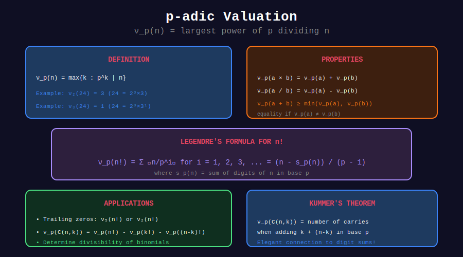

<div align="center">

# 🔢 p-adic Valuation

<p>
  
  
  
</p>

**Measuring How Many Times a Prime Divides a Number**

*The foundation of divisibility analysis*

</div>

---

## 🧭 Navigation

| ⬅️ Previous | 📂 Current | ➡️ Next |
|:------------|:----------:|--------:|
| [← 01. Factorial Zeros](../01_factorial_zeros/README.md) | **02. p-adic Valuation** | [03. Applications →](../03_applications/README.md) |

---

## 📊 Visual Diagram

<div align="center">



</div>

---

## 📐 Mathematical Foundation

### Definition

The **p-adic valuation** (or **p-adic order**) of n, denoted ν_p(n), is the largest exponent e such that p^e divides n:

```math
\nu_p(n) = \max\{e \geq 0 : p^e \mid n\}
```

### Examples

| n | ν₂(n) | ν₃(n) | ν₅(n) |
|--:|------:|------:|------:|
| 12 | 2 | 1 | 0 |
| 60 | 2 | 1 | 1 |
| 100 | 2 | 0 | 2 |
| 1000 | 3 | 0 | 3 |
| 72 | 3 | 2 | 0 |

### Key Properties

```math
\nu_p(a \times b) = \nu_p(a) + \nu_p(b)
\nu_p(a / b) = \nu_p(a) - \nu_p(b)
\nu_p(a + b) \geq \min(\nu_p(a), \nu_p(b))
```

---

## 💻 Code Implementations

### 1. Basic p-adic Valuation

```python
def p_adic_valuation(n: int, p: int) -> int:
    """
    Compute ν_p(n) = largest e such that p^e divides n.
    
    Time: O(log_p n)
    Space: O(1)
    """
    if n == 0:
        return float('inf')  # Convention: ν_p(0) = ∞
    
    count = 0
    while n % p == 0:
        count += 1
        n //= p
    
    return count

# Examples
print(p_adic_valuation(72, 2))   # 3 (72 = 8 × 9 = 2³ × 3²)
print(p_adic_valuation(72, 3))   # 2
print(p_adic_valuation(100, 5))  # 2 (100 = 4 × 25 = 2² × 5²)
```

### 2. p-adic Valuation of Factorial (Legendre's Formula)

```python
def p_adic_factorial(n: int, p: int) -> int:
    """
    Compute ν_p(n!) using Legendre's formula.
    
    ν_p(n!) = ⌊n/p⌋ + ⌊n/p²⌋ + ⌊n/p³⌋ + ...
    
    Time: O(log_p n)
    Space: O(1)
    """
    count = 0
    power = p
    
    while power <= n:
        count += n // power
        power *= p
    
    return count

# Alternative (more elegant)
def p_adic_factorial_v2(n: int, p: int) -> int:
    count = 0
    while n >= p:
        n //= p
        count += n
    return count

# Examples
print(p_adic_factorial(100, 5))  # 24 (trailing zeros in 100!)
print(p_adic_factorial(100, 2))  # 97
```

### 3. p-adic Valuation of Binomial (Kummer's Theorem)

```python
def p_adic_binomial(n: int, k: int, p: int) -> int:
    """
    Compute ν_p(C(n,k)) using Kummer's theorem.
    
    ν_p(C(n,k)) = (number of carries when adding k + (n-k) in base p)
    
    Time: O(log_p n)
    Space: O(1)
    """
    # Method 1: Using Legendre's formula
    # ν_p(C(n,k)) = ν_p(n!) - ν_p(k!) - ν_p((n-k)!)
    return (p_adic_factorial(n, p) - 
            p_adic_factorial(k, p) - 
            p_adic_factorial(n - k, p))

def p_adic_binomial_kummer(n: int, k: int, p: int) -> int:
    """
    Alternative using Kummer's theorem directly.
    Count carries when adding k + (n-k) in base p.
    """
    carries = 0
    carry = 0
    r = n - k
    
    while k > 0 or r > 0:
        sum_digit = (k % p) + (r % p) + carry
        carry = sum_digit // p
        carries += carry
        k //= p
        r //= p
    
    return carries

# Examples
print(p_adic_binomial(10, 3, 2))  # ν₂(C(10,3)) = ν₂(120) = 3
print(p_adic_binomial(10, 5, 5))  # ν₅(C(10,5)) = ν₅(252) = 0
```

### 4. Lifting the Exponent Lemma (LTE)

```python
def lte_lemma_odd(a: int, b: int, p: int, n: int) -> int:
    """
    Compute ν_p(a^n - b^n) for odd prime p where p | (a-b) but p ∤ a, p ∤ b.
    
    LTE Lemma: ν_p(a^n - b^n) = ν_p(a - b) + ν_p(n)
    
    Useful for problems like: find largest power of 3 dividing 2^100 - 1.
    """
    if p == 2:
        raise ValueError("Use lte_lemma_even for p=2")
    
    v_diff = p_adic_valuation(a - b, p)
    v_n = p_adic_valuation(n, p)
    
    return v_diff + v_n

def lte_lemma_even(a: int, b: int, n: int) -> int:
    """
    Compute ν₂(a^n - b^n) for p=2 where a, b are both odd.
    
    For n even: ν₂(a^n - b^n) = ν₂(a-b) + ν₂(a+b) + ν₂(n) - 1
    """
    if a % 2 == 0 or b % 2 == 0:
        raise ValueError("Both a and b must be odd for LTE with p=2")
    if n % 2 != 0:
        raise ValueError("n must be even for this form")
    
    v_diff = p_adic_valuation(a - b, 2)
    v_sum = p_adic_valuation(a + b, 2)
    v_n = p_adic_valuation(n, 2)
    
    return v_diff + v_sum + v_n - 1

# Example: Find ν₃(2^100 - 1)
# Note: 2 - 1 = 1, so LTE doesn't apply directly
# Instead: 2^2 - 1 = 3, ν₃(3) = 1, and 2^100 = (2^2)^50
# So ν₃(2^100 - 1) = ν₃(4^50 - 1) = ν₃(4-1) + ν₃(50) = 1 + 0 = 1
```

---

## 🎨 Visual: Kummer's Theorem

```
+-----------------------------------------------------------------+
| COMPUTING ν₂(C(10, 3)) using Kummer's Theorem                  |
+-----------------------------------------------------------------+
|                                                                 |
| C(10, 3) = C(10, 3) where k=3, n-k=7                           |
|                                                                 |
| Add 3 + 7 in base 2:                                           |
|                                                                 |
|       0011  (3 in binary)                                      |
|     + 0111  (7 in binary)                                      |
|     ------                                                     |
|       1010  (10 in binary)                                     |
|                                                                 |
| Carries:                                                       |
|   Position 0: 1+1=2, carry 1  ←                                |
|   Position 1: 1+1+1=3, carry 1  ←                              |
|   Position 2: 0+1+1=2, carry 1  ←                              |
|   Position 3: 0+0+1=1, no carry                                |
|                                                                 |
| Total carries: 3                                               |
| ∴ ν₂(C(10,3)) = 3                                              |
|                                                                 |
| Verify: C(10,3) = 120 = 8 × 15 = 2³ × 15 ✓                     |
+-----------------------------------------------------------------+
```

---

## 🏆 Applications

### 1. Determining Divisibility of C(n,k)

```python
def is_divisible_by_prime(n: int, k: int, p: int) -> bool:
    """Check if p divides C(n, k)."""
    return p_adic_binomial(n, k, p) > 0

def is_divisible(n: int, k: int, m: int) -> bool:
    """Check if m divides C(n, k)."""
    # Factor m and check each prime
    temp = m
    d = 2
    while d * d <= temp:
        if temp % d == 0:
            e = 0
            while temp % d == 0:
                e += 1
                temp //= d
            if p_adic_binomial(n, k, d) < e:
                return False
        d += 1
    if temp > 1:
        if p_adic_binomial(n, k, temp) < 1:
            return False
    return True
```

### 2. Exact Power of Prime in Product

```python
def power_in_product(arr: list[int], p: int) -> int:
    """Find ν_p of product of array elements."""
    return sum(p_adic_valuation(x, p) for x in arr)
```

---

## 💡 Key Insights

> **Multiplicativity:** ν_p(ab) = ν_p(a) + ν_p(b) makes it easy to compute for products.

> **Kummer's Insight:** Carries in addition reveal divisibility of binomials.

> **LTE Lemma:** Powerful tool for expressions like a^n ± b^n.

> **Zero Convention:** ν_p(0) = ∞ is a useful convention for many formulas.

---

<div align="center">

**Made with ❤️ by [Gaurav Goswami](https://github.com/Gaurav14cs17)**

</div>

---

## 🧭 Navigation

| ⬅️ Previous | 📂 Current | ➡️ Next |
|:------------|:----------:|--------:|
| [← 01. Factorial Zeros](../01_factorial_zeros/README.md) | **02. p-adic Valuation** | [03. Applications →](../03_applications/README.md) |
