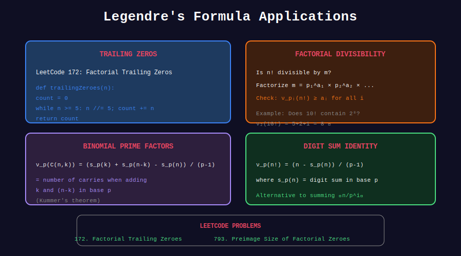

<div align="center">

# 🎯 Legendre's Formula Applications

<p>
  
  
  
</p>

**Real-World Problems Using Prime Factorization of Factorials**

*From competitive programming to number theory*

</div>

---

## 🧭 Navigation

| ⬅️ Previous | 📂 Current | ➡️ Next |
|:------------|:----------:|--------:|
| [← 02. p-adic Valuation](../02_p_adic_valuation/README.md) | **03. Applications** | [🏠 Legendre Home](../README.md) |

---

## 📊 Visual Diagram

<div align="center">



</div>

---

## 📐 Core Formulas

### Legendre's Formula

```math
\nu_p(n!) = \sum_{i=1}^{\infty} \left\lfloor \frac{n}{p^i} \right\rfloor = \frac{n - S_p(n)}{p - 1}

```

where S_p(n) is the sum of digits of n in base p.

### For Binomials (Kummer's Theorem)

```math
\nu_p\binom{m+n}{m} = \text{carries when adding m + n in base } p

```

---

## 💻 Complete Implementations

### 1. Largest Power of p Dividing n!

```python
def largest_power_dividing_factorial(n: int, p: int) -> int:
    """
    Find largest e such that p^e divides n!
    
    Time: O(log_p n)
    Space: O(1)
    """
    count = 0
    power = p
    while power <= n:
        count += n // power
        power *= p
    return count

# Example: What's the largest power of 2 dividing 100!?
print(largest_power_dividing_factorial(100, 2))  # 97

```

### 2. Is n! Divisible by m?

```python
def factorial_divisible_by(n: int, m: int) -> bool:
    """
    Check if n! is divisible by m.
    
    Factor m into primes and check each.
    
    Time: O(√m + k log n) where k = number of prime factors
    Space: O(1)
    """
    temp = m
    d = 2
    
    while d * d <= temp:
        if temp % d == 0:
            # Find power of d in m
            power_in_m = 0
            while temp % d == 0:
                power_in_m += 1
                temp //= d
            
            # Check if n! has enough factors of d
            power_in_factorial = largest_power_dividing_factorial(n, d)
            if power_in_factorial < power_in_m:
                return False
        d += 1
    
    # Handle remaining prime factor > sqrt(m)
    if temp > 1:
        power_in_factorial = largest_power_dividing_factorial(n, temp)
        if power_in_factorial < 1:
            return False
    
    return True

# Examples
print(factorial_divisible_by(10, 1000))  # True (10! = 3628800)
print(factorial_divisible_by(5, 1000))   # False (5! = 120)

```

### 3. Smallest n Such That n! is Divisible by m

```python
def smallest_n_factorial_divisible(m: int) -> int:
    """
    Find smallest n such that m | n!
    
    Binary search + divisibility check.
    
    Time: O(√m × log m × log m)
    Space: O(1)
    """
    def check(n, m):
        return factorial_divisible_by(n, m)
    
    # Upper bound: m is always divisible by m!
    lo, hi = 1, m
    
    while lo < hi:
        mid = (lo + hi) // 2
        if check(mid, m):
            hi = mid
        else:
            lo = mid + 1
    
    return lo

# Example: Smallest n where n! is divisible by 120
print(smallest_n_factorial_divisible(120))  # 5 (since 5! = 120)

```

### 4. Prime Factorization of n!

```python
def factorize_factorial(n: int) -> dict[int, int]:
    """
    Get prime factorization of n! as {prime: exponent}.
    
    Time: O(n + π(n) log n) where π(n) ≈ n/ln(n)
    Space: O(π(n))
    """
    # Sieve for primes up to n
    is_prime = [True] * (n + 1)
    is_prime[0] = is_prime[1] = False
    
    for i in range(2, int(n**0.5) + 1):
        if is_prime[i]:
            for j in range(i*i, n + 1, i):
                is_prime[j] = False
    
    # Get exponent of each prime
    result = {}
    for p in range(2, n + 1):
        if is_prime[p]:
            result[p] = largest_power_dividing_factorial(n, p)
    
    return result

# Example: 10! = 2^8 × 3^4 × 5^2 × 7
print(factorize_factorial(10))
# {2: 8, 3: 4, 5: 2, 7: 1}

```

### 5. Number of Digits in n!

```python
import math

def digits_in_factorial(n: int) -> int:
    """
    Count digits in n! without computing n!
    
    Uses Stirling's approximation:
    log₁₀(n!) ≈ n log₁₀(n) - n log₁₀(e) + 0.5 log₁₀(2πn)
    
    Time: O(n) for exact, O(1) for approximation
    Space: O(1)
    """
    if n < 2:
        return 1
    
    # Exact method for small n
    if n <= 1000:
        log_sum = sum(math.log10(i) for i in range(2, n + 1))
        return int(log_sum) + 1
    
    # Stirling's approximation for large n
    log_factorial = (n * math.log10(n) - 
                     n * math.log10(math.e) + 
                     0.5 * math.log10(2 * math.pi * n))
    return int(log_factorial) + 1

# Examples
print(digits_in_factorial(100))    # 158
print(digits_in_factorial(1000))   # 2568
print(digits_in_factorial(10000))  # 35660

```

### 6. LeetCode 793: Preimage Size of Factorial Zeroes

```python
class Solution:
    def preimageSizeFZF(self, k: int) -> int:
        """
        How many n have exactly k trailing zeros in n!?
        
        Binary search for the range [left, right) where f(n) = k.
        Answer is always 0 or 5.
        """
        def trailing_zeros(n: int) -> int:
            count = 0
            while n >= 5:
                n //= 5
                count += n
            return count
        
        def lower_bound(target: int) -> int:
            lo, hi = 0, 5 * target + 5
            while lo < hi:
                mid = (lo + hi) // 2
                if trailing_zeros(mid) < target:
                    lo = mid + 1
                else:
                    hi = mid
            return lo
        
        left = lower_bound(k)
        right = lower_bound(k + 1)
        return right - left

```

---

## 🎨 Visual: Digit Sum Formula

```
+-----------------------------------------------------------------+
| ALTERNATIVE FORMULA: ν_p(n!) = (n - S_p(n)) / (p - 1)          |
+-----------------------------------------------------------------+
|                                                                 |
| Example: ν₅(100!)                                              |
|                                                                 |
| 100 in base 5: 400₅  (4×25 + 0×5 + 0×1)                       |
| S₅(100) = 4 + 0 + 0 = 4                                        |
|                                                                 |
| ν₅(100!) = (100 - 4) / (5 - 1) = 96 / 4 = 24                  |
|                                                                 |
| Verify with standard formula:                                  |
|   ⌊100/5⌋ + ⌊100/25⌋ + ⌊100/125⌋ = 20 + 4 + 0 = 24 ✓         |
|                                                                 |
| This formula is O(log n) but with smaller constant!            |
+-----------------------------------------------------------------+

```

---

## 📊 Summary of Time Complexities

| Problem | Time | Space |
|---------|------|-------|
| ν_p(n!) | O(log_p n) | O(1) |
| ν_p(C(n,k)) | O(log_p n) | O(1) |
| m \| n!? | O(√m log n) | O(1) |
| Factorize n! | O(n) | O(π(n)) |
| Digits in n! | O(n) exact, O(1) approx | O(1) |

---

## 💡 Key Insights

> **Digit Sum Formula:** ν_p(n!) = (n - S_p(n))/(p-1) is elegant but equivalent.

> **Trailing Zeros Pattern:** Some counts are skipped (5, 11, 17, ...).

> **Factorial Growth:** n! has roughly n log n / log 10 digits.

> **Divisibility:** For m | n!, check all prime factors of m.

---

<div align="center">

**Made with ❤️ by [Gaurav Goswami](https://github.com/Gaurav14cs17)**

</div>

---

## 🧭 Navigation

| ⬅️ Previous | 📂 Current | ➡️ Next |
|:------------|:----------:|--------:|
| [← 02. p-adic Valuation](../02_p_adic_valuation/README.md) | **03. Applications** | [🏠 Legendre Home](../README.md) |
