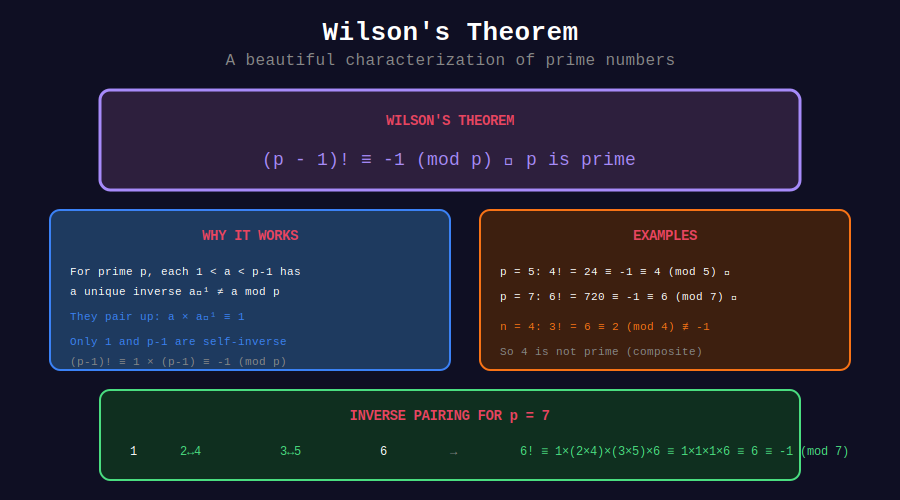

<div align="center">

# 🔮 Basic Wilson's Theorem

<p>
  
  
  
</p>

**A Beautiful Connection Between Primes and Factorials**

*If and only if: the hallmark of powerful theorems*

</div>

---

## 🧭 Navigation

| ⬅️ Previous | 📂 Current | ➡️ Next |
|:------------|:----------:|--------:|
| [← Wilson Home](../README.md) | **01. Basic Wilson** | [02. Primality Test →](../02_primality_test/README.md) |

---

## 📊 Visual Diagram

<div align="center">



</div>

---

## 📐 The Theorem

### Statement

**Wilson's Theorem:** An integer n > 1 is prime if and only if:

```math
(n-1)! \equiv -1 \pmod{n}
```

Equivalently: $(n-1)! \equiv n-1 \pmod{n}$

### Significance

This is one of the few **if and only if** characterizations of primes!

- **Forward:** If p is prime, then (p-1)! ≡ -1 (mod p)
- **Converse:** If (n-1)! ≡ -1 (mod n), then n is prime

---

## 🎨 Visual: Why Wilson's Theorem Works

```
+-----------------------------------------------------------------+
| WHY (p-1)! ≡ -1 (mod p) for prime p                            |
+-----------------------------------------------------------------+
|                                                                 |
| For prime p=7, consider 1, 2, 3, 4, 5, 6 mod 7                 |
|                                                                 |
| Each number (except 1 and 6) pairs with its inverse:           |
|   2 × 4 = 8 ≡ 1 (mod 7)                                        |
|   3 × 5 = 15 ≡ 1 (mod 7)                                       |
|                                                                 |
| Only 1 and p-1 are their own inverses:                         |
|   1 × 1 = 1 ≡ 1 (mod 7)                                        |
|   6 × 6 = 36 ≡ 1 (mod 7)                                       |
|                                                                 |
| So (p-1)! = 1 × (2×4) × (3×5) × 6                              |
|           = 1 × 1 × 1 × 6                                      |
|           = 6 ≡ -1 (mod 7) ✓                                   |
|                                                                 |
| The pairs cancel out, leaving only 1 and p-1!                  |
+-----------------------------------------------------------------+
```

---

## 💻 Code Implementations

### 1. Verify Wilson's Theorem

```python
def verify_wilson(p: int) -> bool:
    """
    Verify Wilson's theorem for a given p.
    
    Returns True if (p-1)! ≡ -1 (mod p).
    
    Time: O(p)
    Space: O(1)
    """
    if p < 2:
        return False
    
    factorial_mod = 1
    for i in range(2, p):
        factorial_mod = (factorial_mod * i) % p
    
    return factorial_mod == p - 1  # -1 mod p = p - 1

# Test for first few primes
primes = [2, 3, 5, 7, 11, 13, 17, 19, 23]
for p in primes:
    result = verify_wilson(p)
    print(f"Wilson for p={p}: {result}")  # All True!

# Test for composite
composites = [4, 6, 8, 9, 10, 12]
for n in composites:
    result = verify_wilson(n)
    print(f"Wilson for n={n}: {result}")  # All False!
```

### 2. Compute (n-1)! mod n Efficiently

```python
def factorial_mod_n(n: int) -> int:
    """
    Compute (n-1)! mod n.
    
    Time: O(n)
    Space: O(1)
    """
    if n <= 1:
        return 0
    
    result = 1
    for i in range(2, n):
        result = (result * i) % n
    
    return result

# Examples
for n in range(2, 15):
    fm = factorial_mod_n(n)
    is_prime = fm == n - 1
    print(f"({n}-1)! mod {n} = {fm}, prime: {is_prime}")
```

### 3. Wilson's Theorem with Optimization

```python
def wilson_check_optimized(n: int) -> bool:
    """
    Check Wilson's theorem with early termination.
    
    Optimization: If any i divides n (for 1 < i < n), 
    then n is composite and we can stop.
    """
    if n < 2:
        return False
    if n == 2:
        return True
    if n % 2 == 0:
        return False
    
    factorial_mod = 1
    for i in range(2, n):
        if n % i == 0:
            return False  # n is composite
        factorial_mod = (factorial_mod * i) % n
        
        # Early termination: if factorial becomes 0 (shouldn't happen for prime)
        if factorial_mod == 0:
            return False
    
    return factorial_mod == n - 1
```

---

## 📊 Verification Table

| n | (n-1)! mod n | (n-1)! ≡ -1? | Prime? |
|:-:|:------------:|:------------:|:------:|
| 2 | 1 | ✓ | ✓ |
| 3 | 2 | ✓ | ✓ |
| 4 | 2 | ✗ | ✗ |
| 5 | 4 | ✓ | ✓ |
| 6 | 0 | ✗ | ✗ |
| 7 | 6 | ✓ | ✓ |
| 8 | 0 | ✗ | ✗ |
| 9 | 0 | ✗ | ✗ |
| 10 | 0 | ✗ | ✗ |
| 11 | 10 | ✓ | ✓ |
| 12 | 0 | ✗ | ✗ |
| 13 | 12 | ✓ | ✓ |

**Pattern:** Composite n > 4 always has (n-1)! ≡ 0 (mod n).

---

## 🔬 The Proof

### Why Primes Satisfy Wilson's Theorem

For prime p, the multiplicative group (ℤ/pℤ)* has order p-1.

1. Each element a ∈ {1, 2, ..., p-1} has a unique inverse a⁻¹
2. Elements equal to their own inverse satisfy a² ≡ 1 (mod p)
3. For prime p, only a = 1 and a = p-1 satisfy this
4. All other elements pair up: a × a⁻¹ ≡ 1

Therefore:

```math
(p-1)! = 1 \times \underbrace{(2 \times 2^{-1}) \times (3 \times 3^{-1}) \times \cdots}_{\text{all pairs = 1}} \times (p-1) \equiv 1 \times 1 \times (p-1) \equiv -1
```

### Why Composites Fail

For composite n = ab where 1 < a, b < n:
- If a ≠ b: both a and b appear in (n-1)!, so ab = n divides (n-1)!
- If a = b (n = a²): we have a and 2a in (n-1)! if n ≥ 6
- Special case n = 4: (4-1)! = 6 ≡ 2 (mod 4) ✓

---

## 💡 Key Insights

> **If and Only If:** Wilson's theorem is a complete characterization of primes.

> **Practical Limitation:** O(n) time makes it impractical for primality testing.

> **Theoretical Importance:** Used in proofs, not in algorithms.

> **Special Cases:** Only 1 and p-1 are their own inverses mod p.

---

## 📖 Corollaries

### Corollary 1: Quadratic Residues
For prime p, x² ≡ -1 (mod p) has a solution iff p ≡ 1 (mod 4).

### Corollary 2: Factorial Modulo Prime
$(p-1)! \equiv -1$ implies formulas for partial factorials.

### Corollary 3: 
$(p-2)! \equiv 1 \pmod{p}$ for prime p.

---

<div align="center">

**Made with ❤️ by [Gaurav Goswami](https://github.com/Gaurav14cs17)**

</div>

---

## 🧭 Navigation

| ⬅️ Previous | 📂 Current | ➡️ Next |
|:------------|:----------:|--------:|
| [← Wilson Home](../README.md) | **01. Basic Wilson** | [02. Primality Test →](../02_primality_test/README.md) |
