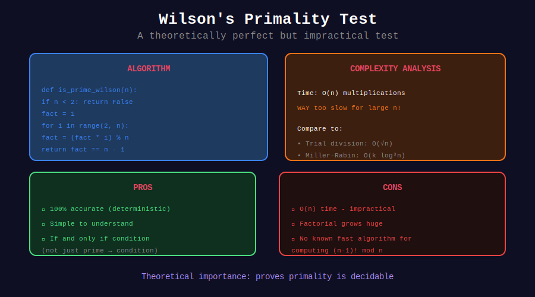

<div align="center">

# 🧪 Wilson's Primality Test

<p>
  
  
  
</p>

**A Theoretically Perfect but Practically Useless Test**

*Educational value over practical application*

</div>

---

## 🧭 Navigation

| ⬅️ Previous | 📂 Current | ➡️ Next |
|:------------|:----------:|--------:|
| [← 01. Basic Wilson](../01_basic_wilson/README.md) | **02. Primality Test** | [03. Applications →](../03_applications/README.md) |

---

## 📊 Visual Diagram

<div align="center">



</div>

---

## 📐 The Test

### Algorithm

```
is_prime(n):
    compute (n-1)! mod n
    return result == n - 1

```

### Properties

| Property | Value |
|----------|-------|
| Correctness | **100%** (no false positives/negatives) |
| Time Complexity | O(n) |
| Practical for n > 10^6? | **No** |

---

## 💻 Implementations

### 1. Basic Wilson Primality Test

```python
def is_prime_wilson(n: int) -> bool:
    """
    Primality test using Wilson's theorem.
    
    Returns True if n is prime.
    
    Time: O(n)
    Space: O(1)
    
    Note: This is correct but impractical for large n.
    """
    if n < 2:
        return False
    if n == 2:
        return True
    if n % 2 == 0:
        return False
    
    factorial_mod = 1
    for i in range(2, n):
        factorial_mod = (factorial_mod * i) % n
    
    return factorial_mod == n - 1

# Test
for n in range(2, 30):
    if is_prime_wilson(n):
        print(n, end=' ')
# Output: 2 3 5 7 11 13 17 19 23 29

```

### 2. Comparison with Other Methods

```python
import time
import math

def is_prime_trial(n: int) -> bool:
    """Trial division: O(√n)"""
    if n < 2:
        return False
    if n == 2:
        return True
    if n % 2 == 0:
        return False
    for i in range(3, int(math.sqrt(n)) + 1, 2):
        if n % i == 0:
            return False
    return True

def is_prime_wilson(n: int) -> bool:
    """Wilson's theorem: O(n)"""
    if n < 2:
        return False
    if n == 2:
        return True
    if n % 2 == 0:
        return False
    
    factorial_mod = 1
    for i in range(2, n):
        factorial_mod = (factorial_mod * i) % n
    
    return factorial_mod == n - 1

def is_prime_miller_rabin(n: int, k: int = 10) -> bool:
    """Miller-Rabin: O(k log³ n)"""
    if n < 2:
        return False
    if n == 2 or n == 3:
        return True
    if n % 2 == 0:
        return False
    
    # Write n-1 as 2^r × d
    r, d = 0, n - 1
    while d % 2 == 0:
        r += 1
        d //= 2
    
    import random
    for _ in range(k):
        a = random.randrange(2, n - 1)
        x = pow(a, d, n)
        
        if x == 1 or x == n - 1:
            continue
        
        for _ in range(r - 1):
            x = pow(x, 2, n)
            if x == n - 1:
                break
        else:
            return False
    
    return True

# Performance comparison
def compare_methods(n: int):
    print(f"\nTesting n = {n}")
    
    # Trial division
    start = time.perf_counter()
    result1 = is_prime_trial(n)
    time1 = time.perf_counter() - start
    print(f"Trial Division: {result1}, Time: {time1:.6f}s")
    
    # Miller-Rabin
    start = time.perf_counter()
    result2 = is_prime_miller_rabin(n)
    time2 = time.perf_counter() - start
    print(f"Miller-Rabin:   {result2}, Time: {time2:.6f}s")
    
    # Wilson (only for small n!)
    if n < 100000:
        start = time.perf_counter()
        result3 = is_prime_wilson(n)
        time3 = time.perf_counter() - start
        print(f"Wilson:         {result3}, Time: {time3:.6f}s")

# Test
compare_methods(1009)    # Small prime
compare_methods(10007)   # Medium prime
compare_methods(104729)  # Larger prime (10000th prime)

```

---

## 📊 Performance Comparison

| n | Trial Division | Miller-Rabin | Wilson |
|--:|---------------:|-------------:|-------:|
| 10³ | 0.00001s | 0.00005s | 0.0001s |
| 10⁴ | 0.00003s | 0.00005s | 0.001s |
| 10⁵ | 0.0001s | 0.00005s | 0.01s |
| 10⁶ | 0.0003s | 0.00005s | 0.1s |
| 10⁹ | 0.001s | 0.00005s | **Hours** |
| 10¹⁸ | 0.03s | 0.00005s | **Forever** |

**Conclusion:** Wilson's test is O(n) while others are O(√n) or O(log³n).

---

## 🎨 Visual: Why Wilson's Test is Slow

```
+-----------------------------------------------------------------+
| COMPUTING (n-1)! mod n                                         |
+-----------------------------------------------------------------+
|                                                                 |
| For n = 1,000,000:                                              |
|                                                                 |
| Wilson: 999,999 multiplications!                                |
|   1 × 2 × 3 × ... × 999,999                                    |
|   Each multiplication: O(log n) for big integers               |
|   Total: O(n × log n) operations                               |
|                                                                 |
| Trial Division: √n = 1000 divisions                            |
|   Check divisibility by 2, 3, 5, ..., 1000                     |
|   Total: O(√n) operations                                      |
|                                                                 |
| Miller-Rabin: O(k log³ n) = O(log³ n)                          |
|   k random witnesses, each O(log³ n)                           |
|   Total: ~100 operations for any n!                            |
|                                                                 |
| Ratio: Wilson is 1000× slower than trial division              |
|        and 10,000,000× slower than Miller-Rabin!               |
+-----------------------------------------------------------------+

```

---

## 💡 When to Use Wilson's Test

### Use Wilson's Test:

1. **Educational purposes** - Understanding the theorem
2. **Verification** - Double-checking other methods for small n
3. **Proofs** - Theoretical arguments about primality

### Don't Use Wilson's Test:

1. **Production code** - Use Miller-Rabin or AKS
2. **Competitive programming** - Too slow
3. **Cryptography** - Need primes with 100s of digits

---

## 🔬 Why Wilson's Test Matters

Despite being impractical, Wilson's theorem is important:

### 1. Theoretical Foundation

It's the **only known deterministic polynomial characterization** of primes that uses only arithmetic operations (without needing to factor or find witnesses).

### 2. Proof Tool

Used to prove other results about primes, especially in abstract algebra.

### 3. Generating (p-1)! mod p

Useful when you need the value, not just primality.

```python
def factorial_mod_prime(p: int) -> int:
    """
    Compute (p-1)! mod p for prime p.
    By Wilson: this equals -1 ≡ p-1 (mod p).
    """
    return p - 1  # Instant! No computation needed.

```

---

## 📖 Related Primality Tests

| Test | Time | Deterministic? | Practical? |
|------|------|----------------|------------|
| Trial Division | O(√n) | ✓ | For n < 10¹² |
| **Wilson** | O(n) | ✓ | **No** |
| Fermat | O(k log² n) | ✗ | Limited |
| Miller-Rabin | O(k log³ n) | ✗ | ✓ |
| AKS | O(log⁶ n) | ✓ | Slow |

---

<div align="center">

**Made with ❤️ by [Gaurav Goswami](https://github.com/Gaurav14cs17)**

</div>

---

## 🧭 Navigation

| ⬅️ Previous | 📂 Current | ➡️ Next |
|:------------|:----------:|--------:|
| [← 01. Basic Wilson](../01_basic_wilson/README.md) | **02. Primality Test** | [03. Applications →](../03_applications/README.md) |
