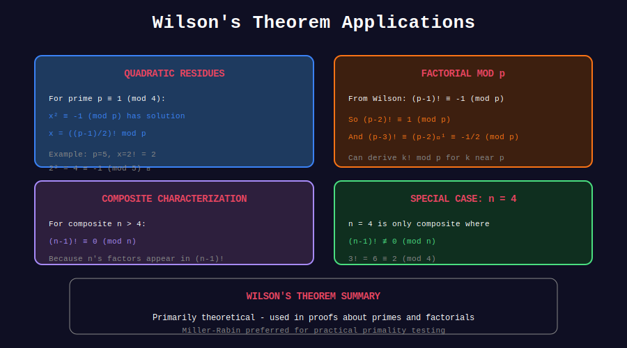

<div align="center">

# 🎯 Wilson's Theorem Applications

<p>
  
  
  
</p>

**Theoretical Applications and Corollaries**

*Where Wilson's Theorem Shines*

</div>

---

## 🧭 Navigation

| ⬅️ Previous | 📂 Current | ➡️ Next |
|:------------|:----------:|--------:|
| [← 02. Primality Test](../02_primality_test/README.md) | **03. Applications** | [🏠 Wilson Home](../README.md) |

---

## 📊 Visual Diagram

<div align="center">



</div>

---

## 📐 Key Corollaries

### Corollary 1: Quadratic Residue of -1

**Theorem:** For odd prime p, -1 is a quadratic residue mod p iff p ≡ 1 (mod 4).

```python
def minus_one_is_qr(p: int) -> bool:
    """
    Check if -1 is a quadratic residue mod p.
    
    By Wilson + group theory:
    - (p-1)! ≡ -1 (mod p)
    - ((p-1)/2)! squared gives ±1
    - The sign depends on p mod 4
    """
    return p % 4 == 1

def find_sqrt_minus_one(p: int) -> int:
    """
    Find x such that x² ≡ -1 (mod p).
    Only works when p ≡ 1 (mod 4).
    
    Uses: ((p-1)/2)! ≡ ±1 (mod p)
    When p ≡ 1 (mod 4), it's ±i where i² = -1.
    """
    if p % 4 != 1:
        return -1  # No solution
    
    # Compute ((p-1)/2)! mod p
    result = 1
    for i in range(1, (p - 1) // 2 + 1):
        result = (result * i) % p
    
    # Verify
    if (result * result) % p == p - 1:  # -1 mod p
        return result
    else:
        return p - result

# Examples
print(find_sqrt_minus_one(5))   # 2 (because 2² = 4 ≡ -1 mod 5)
print(find_sqrt_minus_one(13))  # 5 (because 5² = 25 ≡ -1 mod 13)
print(find_sqrt_minus_one(17))  # 4 (because 4² = 16 ≡ -1 mod 17)

```

### Corollary 2: Partial Factorials

```python
def partial_factorial_mod_p(k: int, p: int) -> int:
    """
    Compute k! mod p for k < p using Wilson's theorem.
    
    We know (p-1)! ≡ -1 (mod p).
    
    So k! × (k+1) × ... × (p-1) ≡ -1 (mod p)
    Thus k! ≡ -1 × ((k+1) × ... × (p-1))^(-1) (mod p)
    """
    if k >= p:
        return 0  # p divides k!
    
    # Compute k! directly (for small k)
    result = 1
    for i in range(2, k + 1):
        result = (result * i) % p
    return result

def partial_factorial_from_wilson(k: int, p: int) -> int:
    """
    Alternative: Use Wilson to compute k! mod p.
    
    k! ≡ (-1) × inverse((k+1) × (k+2) × ... × (p-1)) (mod p)
    
    Useful when k is close to p.
    """
    if k >= p:
        return 0
    if k == p - 1:
        return p - 1  # (p-1)! ≡ -1
    
    # Compute (k+1) × ... × (p-1)
    product = 1
    for i in range(k + 1, p):
        product = (product * i) % p
    
    # k! = -1 × product^(-1)
    product_inv = pow(product, p - 2, p)
    return (p - 1) * product_inv % p

# Verify both methods give same result
p = 23
for k in range(1, p):
    v1 = partial_factorial_mod_p(k, p)
    v2 = partial_factorial_from_wilson(k, p)
    assert v1 == v2, f"Mismatch at k={k}"
print("Both methods agree!")

```

### Corollary 3: Clausen's Generalization

```python
def clausen_theorem(n: int, p: int) -> int:
    """
    For prime p and positive integer n:
    (p-1)! × (2p-1)! × ... × (np-1)! ≡ (-1)^n × n! (mod p)
    
    This is Clausen's generalization of Wilson's theorem.
    """
    # Left side: product of factorials at multiples of p minus 1
    left = 1
    for k in range(1, n + 1):
        # (kp - 1)! mod p
        # By Wilson-like argument, (kp-1)! ≡ (-1)^k (mod p)
        left = (left * pow(-1, k, p)) % p
    
    # Right side: (-1)^n × n! mod p
    right = pow(-1, n, p) * partial_factorial_mod_p(n, p) % p
    
    return left == right

# Verify Clausen's theorem
for p in [5, 7, 11, 13]:
    for n in range(1, 5):
        assert clausen_theorem(n, p), f"Failed for p={p}, n={n}"
print("Clausen's theorem verified!")

```

---

## 💻 Problem Applications

### 1. Computing Binomial Coefficients mod p

```python
def binomial_mod_prime_wilson(n: int, k: int, p: int) -> int:
    """
    Compute C(n, k) mod p using Wilson-based factorial computation.
    
    Works best when n < p (no factors of p in numerator).
    """
    if k > n or k < 0:
        return 0
    if n >= p:
        # Use Lucas' theorem instead
        return lucas_binomial(n, k, p)
    
    # C(n,k) = n! / (k! × (n-k)!)
    num = partial_factorial_mod_p(n, p)
    den = (partial_factorial_mod_p(k, p) * 
           partial_factorial_mod_p(n - k, p)) % p
    
    return num * pow(den, p - 2, p) % p

def lucas_binomial(n: int, k: int, p: int) -> int:
    """Lucas' theorem for C(n,k) mod p when n >= p."""
    if k > n:
        return 0
    if n < p and k < p:
        return binomial_mod_prime_wilson(n, k, p)
    return (binomial_mod_prime_wilson(n % p, k % p, p) * 
            lucas_binomial(n // p, k // p, p)) % p

```

### 2. Sum of Reciprocals (Wolstenholme's Theorem)

```python
def wolstenholme_check(p: int) -> bool:
    """
    Wolstenholme's theorem: For prime p ≥ 5,
    1 + 1/2 + 1/3 + ... + 1/(p-1) ≡ 0 (mod p²)
    
    Also: C(2p-1, p-1) ≡ 1 (mod p³)
    
    Related to Wilson via harmonic sums.
    """
    if p < 5:
        return True  # Vacuously true
    
    # Check numerator of harmonic sum
    # H_{p-1} = 1 + 1/2 + ... + 1/(p-1)
    # Numerator × (p-1)! should be divisible by p²
    
    numerator = 0
    for k in range(1, p):
        # Add (p-1)! / k to numerator
        term = 1
        for i in range(1, p):
            if i != k:
                term = (term * i) % (p * p)
        numerator = (numerator + term) % (p * p)
    
    return numerator == 0

# Test Wolstenholme's theorem
for p in [5, 7, 11, 13, 17, 19, 23]:
    print(f"p={p}: Wolstenholme holds: {wolstenholme_check(p)}")

```

### 3. Generating Quadratic Non-Residues

```python
def find_quadratic_nonresidue(p: int) -> int:
    """
    Find a quadratic non-residue mod p.
    
    Uses: Euler's criterion + Wilson's theorem connection.
    Exactly half of 1, 2, ..., p-1 are QRs.
    """
    for a in range(2, p):
        # Euler's criterion: a^((p-1)/2) ≡ -1 means NQR
        if pow(a, (p - 1) // 2, p) == p - 1:
            return a
    return -1  # Shouldn't happen

# Examples
for p in [5, 7, 11, 13, 17, 19, 23]:
    nqr = find_quadratic_nonresidue(p)
    print(f"p={p}: first NQR = {nqr}")

```

---

## 🎨 Visual: Wilson in Action

```
+-----------------------------------------------------------------+

| USING WILSON TO FIND √(-1) mod 13                              |
+-----------------------------------------------------------------+
|                                                                 |
| Since 13 ≡ 1 (mod 4), -1 is a quadratic residue mod 13.       |
|                                                                 |
| Key: ((p-1)/2)!² ≡ (p-1)! × (-1)^((p-1)/2) (mod p)            |
|                                                                 |
| For p = 13:                                                     |
|   (12/2)! = 6! = 720 ≡ 720 mod 13 = 5                         |
|                                                                 |
| Check: 5² = 25 ≡ 25 - 26 = -1 (mod 13) ✓                      |
|                                                                 |
| So √(-1) ≡ 5 (mod 13)                                          |
|                                                                 |
| Verify: 5² = 25 = 2×13 - 1 = -1 (mod 13) ✓                    |
+-----------------------------------------------------------------+

```

---

## 📊 Summary of Applications

| Application | Uses Wilson For | Complexity |
|-------------|-----------------|------------|
| √(-1) mod p | Factorial computation | O(p) |
| Partial factorials | Direct formula | O(min(k, p-k)) |
| QR detection | Euler criterion | O(log p) |
| Binomial mod p | Factorial inverses | O(n) |
| Wolstenholme | Harmonic sums | O(p) |

---

## 💡 Key Insights

> **Theoretical Tool:** Wilson's theorem is more useful for proofs than algorithms.

> **QR Connection:** The theorem elegantly connects to quadratic residues.

> **Factorial Inversion:** When k is near p-1, compute from p-1 downward.

> **Special Primes:** Primes where p ≡ 1 (mod 4) have extra structure.

---

<div align="center">

**Made with ❤️ by [Gaurav Goswami](https://github.com/Gaurav14cs17)**

</div>

---

## 🧭 Navigation

| ⬅️ Previous | 📂 Current | ➡️ Next |
|:------------|:----------:|--------:|
| [← 02. Primality Test](../02_primality_test/README.md) | **03. Applications** | [🏠 Wilson Home](../README.md) |
