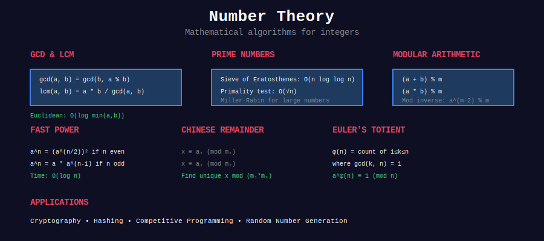

<div align="center">

# 🔢 Number Theory



<p>
  
  
  
</p>

**Mathematical foundations for competitive programming and algorithmic problem solving**

[⬅️ Previous: Computational Geometry](../29_computational_geometry/README.md) | [🏠 Home](../README.md) | [Next: Combinatorics ➡️](../31_combinatorics/README.md)

</div>

---

## 📋 Overview

**Number Theory** forms the mathematical backbone of competitive programming. This comprehensive guide covers essential algorithms and techniques from basic GCD computations to advanced theorems like Chinese Remainder Theorem and Lucas' Theorem.

**What You'll Learn:**
- **Fundamental Algorithms:** GCD/LCM, prime testing, factorization
- **Modular Arithmetic:** Fast exponentiation, modular inverse, Fermat's theorem
- **Advanced Theorems:** Euler's totient, CRT, Wilson's theorem
- **Combinatorial Math:** Binomial coefficients, Catalan numbers, Lucas' theorem
- **Applications:** RSA cryptography, competitive programming problems

---

## 📂 Topics

<table>
<tr>
<td width="33%">

### [01. GCD & LCM](./01_gcd_lcm/)
- Euclidean algorithm O(log n)
- Extended GCD for inverses
- LCM applications
- Binary GCD optimization
- GCD of arrays
- **Problems:** 25+

</td>
<td width="33%">

### [02. Primes](./02_primes/)
- Primality testing
- Sieve of Eratosthenes
- Segmented sieve
- Prime factorization
- Miller-Rabin test
- **Problems:** 30+

</td>
<td width="33%">

### [03. Modular Arithmetic](./03_modular_arithmetic/)
- Basic operations (mod)
- Modular inverse
- Fast exponentiation
- Fermat's little theorem
- Euler's theorem
- **Problems:** 28+

</td>
</tr>
<tr>
<td width="33%">

### [04. Divisors](./04_divisors/)
- Count divisors τ(n)
- Sum of divisors σ(n)
- Perfect numbers
- Multiplicative functions
- Sieve techniques
- **Problems:** 20+

</td>
<td width="33%">

### [05. Euler's Totient](./05_euler_totient/)
- φ(n) function
- Euler's theorem
- Totient properties
- Summatory function
- RSA cryptography
- **Problems:** 18+

</td>
<td width="33%">

### [06. Chinese Remainder](./06_chinese_remainder/)
- CRT algorithm
- System of congruences
- Garner's algorithm
- Applications
- Competitive problems
- **Problems:** 12+

</td>
</tr>
<tr>
<td width="33%">

### [07. Linear Diophantine](./07_linear_diophantine/)
- ax + by = c equations
- Frobenius coin problem
- Extended GCD method
- General solutions
- Applications
- **Problems:** 15+

</td>
<td width="33%">

### [08. Binomial Coefficients](./08_binomial_coefficients/)
- Pascal's triangle
- Combinations nCr
- Modular binomial
- Lucas' theorem prep
- DP optimization
- **Problems:** 22+

</td>
<td width="33%">

### [09. Catalan Numbers](./09_catalan_numbers/)
- Catalan formula
- BST counting
- Parentheses problems
- Path counting
- Applications
- **Problems:** 16+

</td>
</tr>
<tr>
<td width="33%">

### [10. Lucas' Theorem](./10_lucas_theorem/)
- Binomial mod prime
- Base-p representation
- Sierpinski triangle
- Fast computation
- Applications
- **Problems:** 10+

</td>
<td width="33%">

### [11. Legendre's Formula](./11_legendres_formula/)
- Trailing zeros in n!
- p-adic valuation
- Prime power in factorial
- Optimization techniques
- Applications
- **Problems:** 12+

</td>
<td width="33%">

### [12. Wilson's Theorem](./12_wilsons_theorem/)
- (p-1)! ≡ -1 (mod p)
- Primality testing
- Modular inverse
- Factorial properties
- Applications
- **Problems:** 8+

</td>
</tr>
</table>

---

## 🎯 Quick Start Guide

### For Beginners
**Start Here:**
1. [GCD & LCM](./01_gcd_lcm/) - Euclidean algorithm fundamentals
2. [Modular Arithmetic Basics](./03_modular_arithmetic/01_basic_operations/)
3. [Prime Testing](./02_primes/01_primality_testing/)
4. [Count Divisors](./04_divisors/01_count_divisors/)

### For Intermediate
**Focus On:**
1. [Extended GCD](./01_gcd_lcm/02_extended_gcd/)
2. [Fast Exponentiation](./03_modular_arithmetic/03_fast_exponentiation/)
3. [Euler's Totient](./05_euler_totient/)
4. [Binomial Coefficients](./08_binomial_coefficients/)

### For Advanced
**Master These:**
1. [Chinese Remainder Theorem](./06_chinese_remainder/)
2. [Lucas' Theorem](./10_lucas_theorem/)
3. [Segmented Sieve](./02_primes/04_segmented_sieve/)
4. [Linear Diophantine](./07_linear_diophantine/)

---

## 🏆 Must-Do Problems

### 🟢 Easy (Beginner Friendly)

| Problem | Topic | Link |
|---------|-------|------|
| GCD of Array | GCD | [LeetCode 1979](https://leetcode.com/problems/find-greatest-common-divisor-of-array/) |
| Count Primes | Primes | [LeetCode 204](https://leetcode.com/problems/count-primes/) |
| Power of Three | Modular | [LeetCode 326](https://leetcode.com/problems/power-of-three/) |
| Perfect Number | Divisors | [LeetCode 507](https://leetcode.com/problems/perfect-number/) |
| Add Digits | Modular | [LeetCode 258](https://leetcode.com/problems/add-digits/) |

### 🟡 Medium (Core Concepts)

| Problem | Topic | Link |
|---------|-------|------|
| Pow(x, n) | Fast Exp | [LeetCode 50](https://leetcode.com/problems/powx-n/) |
| Ugly Number II | Primes | [LeetCode 264](https://leetcode.com/problems/ugly-number-ii/) |
| Nth Magical Number | GCD/LCM | [LeetCode 878](https://leetcode.com/problems/nth-magical-number/) |
| Bulb Switcher | Divisors | [LeetCode 319](https://leetcode.com/problems/bulb-switcher/) |
| Four Divisors | Divisors | [LeetCode 1390](https://leetcode.com/problems/four-divisors/) |
| Super Pow | Modular | [LeetCode 372](https://leetcode.com/problems/super-pow/) |

### 🔴 Hard (Advanced)

| Problem | Topic | Link |
|---------|-------|------|
| Smallest Good Base | Number Theory | [LeetCode 483](https://leetcode.com/problems/smallest-good-base/) |
| Preimage Size of Factorial | Legendre | [LeetCode 793](https://leetcode.com/problems/preimage-size-of-factorial-zeroes-function/) |
| K-th Smallest in Multiplication Table | Divisors | [LeetCode 668](https://leetcode.com/problems/kth-smallest-number-in-multiplication-table/) |
| Super Washing Machines | Number Theory | [LeetCode 517](https://leetcode.com/problems/super-washing-machines/) |

---

## 📐 Core Algorithms Reference

### 1. Euclidean Algorithm
```python
def gcd(a, b):
    """Greatest Common Divisor - O(log min(a,b))"""
    while b:
        a, b = b, a % b
    return a
```

### 2. Fast Modular Exponentiation
```python
def pow_mod(base, exp, mod):
    """Compute (base^exp) % mod - O(log exp)"""
    result = 1
    base %= mod
    while exp > 0:
        if exp & 1:
            result = (result * base) % mod
        base = (base * base) % mod
        exp >>= 1
    return result
```

### 3. Sieve of Eratosthenes
```python
def sieve(n):
    """Find all primes up to n - O(n log log n)"""
    is_prime = [True] * (n + 1)
    is_prime[0] = is_prime[1] = False
    
    for i in range(2, int(n**0.5) + 1):
        if is_prime[i]:
            for j in range(i*i, n + 1, i):
                is_prime[j] = False
    
    return [i for i in range(n + 1) if is_prime[i]]
```

### 4. Euler's Totient Function
```python
def phi(n):
    """Count numbers coprime to n - O(√n)"""
    result = n
    p = 2
    while p * p <= n:
        if n % p == 0:
            result -= result // p
            while n % p == 0:
                n //= p
        p += 1
    if n > 1:
        result -= result // n
    return result
```

---

## 🔑 Key Theorems

### Fundamental Theorem of Arithmetic
**Every integer > 1 has a unique prime factorization**
```
n = p₁^a₁ × p₂^a₂ × ... × pₖ^aₖ
```

### Fermat's Little Theorem
**If p is prime and gcd(a,p) = 1:**
```
a^(p-1) ≡ 1 (mod p)
```

### Euler's Theorem
**If gcd(a,n) = 1:**
```
a^φ(n) ≡ 1 (mod n)
```

### Chinese Remainder Theorem
**System of congruences with coprime moduli has unique solution mod (m₁×m₂×...×mₖ)**

### Wilson's Theorem
**p is prime iff:**
```
(p-1)! ≡ -1 (mod p)
```

---

## 💡 Problem-Solving Patterns

### Pattern 1: GCD/LCM Problems
- **When:** Need common factors or multiples
- **Technique:** Euclidean algorithm, prime factorization
- **Examples:** Fraction simplification, synchronized events

### Pattern 2: Modular Arithmetic
- **When:** Large number computations, remainder queries
- **Technique:** Fast exponentiation, modular inverse
- **Examples:** Power calculations, cyclic patterns

### Pattern 3: Prime-Based
- **When:** Factorization, divisibility, uniqueness
- **Technique:** Sieve, primality testing
- **Examples:** Ugly numbers, prime counting

### Pattern 4: Counting & Combinatorics
- **When:** Arrangements, selections, paths
- **Technique:** Binomial coefficients, Catalan numbers
- **Examples:** Parentheses matching, path counting

---

## 📊 Complexity Cheat Sheet

| Algorithm | Time | Space | Use Case |
|-----------|------|-------|----------|
| **Euclidean GCD** | O(log n) | O(1) | GCD computation |
| **Extended GCD** | O(log n) | O(1) | Modular inverse |
| **Fast Exponentiation** | O(log n) | O(1) | Large powers |
| **Sieve of Eratosthenes** | O(n log log n) | O(n) | Many primes |
| **Primality Test (Miller-Rabin)** | O(k log³ n) | O(1) | Single prime check |
| **Prime Factorization** | O(√n) | O(log n) | Factor decomposition |
| **Euler's Totient** | O(√n) | O(1) | Count coprimes |
| **Totient Sieve** | O(n log log n) | O(n) | Many φ values |

---

## 🧠 Advanced Topics Preview

### Multiplicative Functions
Functions where f(a×b) = f(a)×f(b) for coprime a, b
- τ(n): number of divisors
- σ(n): sum of divisors
- φ(n): Euler's totient
- μ(n): Möbius function

### Quadratic Residues
Study of x² ≡ a (mod p)
- Legendre symbol
- Quadratic reciprocity
- Tonelli-Shanks algorithm

### Primitive Roots
Generators of multiplicative groups modulo n
- Existence conditions
- Finding primitive roots
- Discrete logarithm

---

## 📚 Learning Resources

### Online Resources
- [CP-Algorithms: Number Theory](https://cp-algorithms.com/)
- [OEIS (Integer Sequences)](https://oeis.org/)
- [Brilliant.org: Number Theory](https://brilliant.org/courses/number-theory/)
- [Art of Problem Solving](https://artofproblemsolving.com/wiki/index.php/Number_theory)

### Books
- **Elementary Number Theory** by Burton
- **Introduction to Analytic Number Theory** by Apostol
- **Concrete Mathematics** by Graham, Knuth, Patashnik
- **Competitive Programmer's Handbook** by Laaksonen

### Practice Platforms
- [Codeforces](https://codeforces.com/) - Number theory tags
- [Project Euler](https://projecteuler.net/) - Mathematical problems
- [AtCoder](https://atcoder.jp/) - Math-heavy contests
- [SPOJ](https://www.spoj.com/) - Classical problems

---

## 🗺️ Learning Path

```
Week 1-2: Foundations
+-- GCD & LCM (Euclidean algorithm)
+-- Basic modular arithmetic
+-- Prime testing (trial division)
+-- Simple divisor problems

Week 3-4: Core Concepts
+-- Extended GCD
+-- Fast exponentiation
+-- Sieve of Eratosthenes
+-- Euler's totient function
+-- Fermat's little theorem

Week 5-6: Advanced Theorems
+-- Chinese Remainder Theorem
+-- Wilson's theorem
+-- Lucas' theorem
+-- Legendre's formula
+-- Linear Diophantine equations

Week 7-8: Mastery
+-- Binomial coefficients (advanced)
+-- Catalan numbers applications
+-- Multiplicative functions
+-- Competition-level problems
```

---

<div align="center">

## 🎓 Certification Path

Master all **12 topics** → Solve **100+ problems** → Become a **Number Theory Expert**

[⬅️ Previous: Computational Geometry](../29_computational_geometry/README.md) | [🏠 Home](../README.md) | [Next: Combinatorics ➡️](../31_combinatorics/README.md)

</div>

