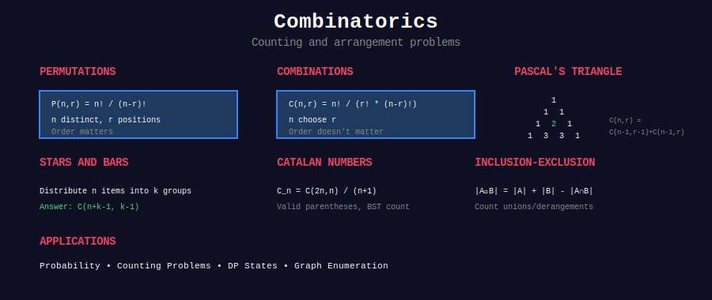

<div align="center">

# 🎲 Combinatorics



<p>
  
  
  
</p>

**The Art and Science of Counting, Arranging, and Selecting**

*Master permutations, combinations, and special sequences*

</div>

---

## 🧭 Navigation

| ⬅️ Previous | 📂 Current | ➡️ Next |
|:------------|:----------:|--------:|
| [← Number Theory](../30_number_theory/README.md) | **Combinatorics** | [Game Theory →](../32_game_theory/README.md) |

---

## 📐 Mathematical Foundations

### 1️⃣ Fundamental Counting Principles

**Addition Principle:**
If task A can be done in $m$ ways and task B in $n$ ways, and they're mutually exclusive:

```math
\text{Total ways} = m + n
```

**Multiplication Principle:**
If task A can be done in $m$ ways and task B in $n$ ways independently:

```math
\text{Total ways} = m \times n
```

**Example:** Choose 1 fruit from 3 apples OR 2 oranges → $3 + 2 = 5$ ways  
Choose 1 shirt from 3 AND 1 pant from 4 → $3 \times 4 = 12$ ways

---

### 2️⃣ Permutations

**Definition:** Arrangement of objects where order matters.

**Formula (n distinct objects):**

```math
P(n) = n!
```

**Formula (r objects from n):**

```math
P(n, r) = \frac{n!}{(n-r)!} = n \times (n-1) \times \cdots \times (n-r+1)
```

**Proof:**
- First position: $n$ choices
- Second position: $n-1$ choices
- ...
- r-th position: $(n-r+1)$ choices
- Total: $n \times (n-1) \times \cdots \times (n-r+1) = \frac{n!}{(n-r)!}$ ∎

**With Repetition:**

```math
P_{repetition}(n, r) = n^r
```

**Circular Permutations:**

```math
P_{circular}(n) = (n-1)!
```

---

### 3️⃣ Combinations

**Definition:** Selection of objects where order doesn't matter.

**Formula:**

```math
C(n, r) = \binom{n}{r} = \frac{n!}{r!(n-r)!}
```

**Proof:**
- Permutations of r from n: $P(n,r) = \frac{n!}{(n-r)!}$
- Each combination counted $r!$ times (different orders)
- Combinations: $\frac{P(n,r)}{r!} = \frac{n!}{r!(n-r)!}$ ∎

**Pascal's Identity:**

```math
\binom{n}{r} = \binom{n-1}{r-1} + \binom{n-1}{r}
```

**Proof:** Choose from $n$ objects. Either:
- Include first object: choose $r-1$ from remaining $n-1$ → $\binom{n-1}{r-1}$
- Exclude first object: choose $r$ from remaining $n-1$ → $\binom{n-1}{r}$ ∎

---

### 4️⃣ Binomial Theorem

**Theorem:**

```math
(x + y)^n = \sum_{k=0}^{n} \binom{n}{k} x^{n-k} y^k
```

**Special Cases:**

```math
\sum_{k=0}^{n} \binom{n}{k} = 2^n \quad \text{(set } x=y=1\text{)}
\sum_{k=0}^{n} (-1)^k \binom{n}{k} = 0 \quad \text{(set } x=1, y=-1\text{)}
```

---

### 5️⃣ Catalan Numbers

**Definition:** 

```math
C_n = \frac{1}{n+1}\binom{2n}{n} = \frac{(2n)!}{(n+1)!n!}
```

**Recurrence:**

```math
C_0 = 1, \quad C_n = \sum_{i=0}^{n-1} C_i \cdot C_{n-1-i}
```

**First few terms:** $1, 1, 2, 5, 14, 42, 132, \ldots$

**Applications:**
- Valid parentheses sequences of length $2n$
- Number of BSTs with $n$ nodes
- Number of ways to triangulate polygon
- Paths not crossing diagonal in grid

**Proof (Parentheses):**
- Total sequences: $\binom{2n}{n}$
- Invalid (crossing): $\binom{2n}{n+1}$
- Valid: $\binom{2n}{n} - \binom{2n}{n+1} = \frac{1}{n+1}\binom{2n}{n}$ ∎

---

### 6️⃣ Inclusion-Exclusion Principle

**For 2 sets:**

```math
|A \cup B| = |A| + |B| - |A \cap B|
```

**For 3 sets:**

```math
|A \cup B \cup C| = |A| + |B| + |C| - |A \cap B| - |A \cap C| - |B \cap C| + |A \cap B \cap C|
```

**General Formula:**

```math
\left|\bigcup_{i=1}^{n} A_i\right| = \sum_{i} |A_i| - \sum_{i<j} |A_i \cap A_j| + \sum_{i<j<k} |A_i \cap A_j \cap A_k| - \cdots
```

---

### 7️⃣ Pigeonhole Principle

**Simple Form:** If $n+1$ objects placed in $n$ boxes, at least one box contains $\geq 2$ objects.

**Generalized:** If $n$ objects placed in $k$ boxes, at least one box contains $\geq \lceil \frac{n}{k} \rceil$ objects.

**Application:** In any group of 367 people, at least 2 share same birthday.

---

## 🎨 Visual Patterns

### Pattern 1: Pascal's Triangle

```
                    1
                  1   1
                1   2   1
              1   3   3   1
            1   4   6   4   1
          1   5  10  10   5   1
        1   6  15  20  15   6   1

Properties:
- Entry = C(n,r) = nCr
- Each entry = sum of two above it
- Row sum = 2^n
- Alternating sum = 0
```

### Pattern 2: Catalan Numbers Visualization

```
C₀ = 1:  ()
C₁ = 1:  ()()
C₂ = 2:  ()()()  (())()
         ()(())  ((()))
C₃ = 5:  ()()()()
         ()()(())
         ()(())()
         (())(())
         ((()))()
         ()(()())
         (()(()))
         ((())())
         (((())))
```

---

## 📂 Subtopics

<table>
<tr>
<td width="33%" valign="top">

### [01. Permutations](./01_permutations/)

**Core Concepts:**
- Generate all permutations
- Next permutation algorithm
- Kth permutation
- Permutations with duplicates
- Circular permutations

**Key Problems:**
- Permutations (#46)
- Next Permutation (#31)
- Permutation Sequence (#60)

**Time:** O(n×n!)

</td>
<td width="33%" valign="top">

### [02. Combinations](./02_combinations/)

**Core Concepts:**
- nCr calculation
- Generate combinations
- Pascal's triangle
- Combination sum variants
- Binomial coefficients

**Key Problems:**
- Combinations (#77)
- Combination Sum (#39, #40)
- Pascal's Triangle (#118)

**Time:** O(2^n)

</td>
<td width="33%" valign="top">

### [03. Special Sequences](./03_special_sequences/)

**Core Concepts:**
- Catalan numbers
- Fibonacci variants
- Derangements
- Stirling numbers
- Bell numbers

**Key Problems:**
- Unique BSTs (#96)
- Valid Parentheses (#22)
- Climbing Stairs (#70)

**Applications:** Many!

</td>
</tr>
</table>

---

## 🏆 Key Problems by Category

### 🟢 Easy (Foundation)

| # | Problem | Category | Concept |
|:-:|---------|----------|---------|
| 70 | [Climbing Stairs](https://leetcode.com/problems/climbing-stairs/) | Fibonacci | Basic recurrence |
| 118 | [Pascal's Triangle](https://leetcode.com/problems/pascals-triangle/) | Combinations | nCr generation |
| 119 | [Pascal's Triangle II](https://leetcode.com/problems/pascals-triangle-ii/) | Combinations | Space optimization |
| 509 | [Fibonacci Number](https://leetcode.com/problems/fibonacci-number/) | Sequences | Classic |
| 1646 | [Get Maximum in Generated Array](https://leetcode.com/problems/get-maximum-in-generated-array/) | Sequences | Pattern |

### 🟡 Medium (Core Skills)

| # | Problem | Category | Concept |
|:-:|---------|----------|---------|
| 31 | [Next Permutation](https://leetcode.com/problems/next-permutation/) | Permutations | Lexicographic order |
| 46 | [Permutations](https://leetcode.com/problems/permutations/) | Permutations | Backtracking |
| 47 | [Permutations II](https://leetcode.com/problems/permutations-ii/) | Permutations | With duplicates |
| 60 | [Permutation Sequence](https://leetcode.com/problems/permutation-sequence/) | Permutations | Kth permutation |
| 77 | [Combinations](https://leetcode.com/problems/combinations/) | Combinations | Basic generation |
| 39 | [Combination Sum](https://leetcode.com/problems/combination-sum/) | Combinations | With repetition |
| 40 | [Combination Sum II](https://leetcode.com/problems/combination-sum-ii/) | Combinations | No repetition |
| 62 | [Unique Paths](https://leetcode.com/problems/unique-paths/) | Combinations | Grid paths = nCr |
| 63 | [Unique Paths II](https://leetcode.com/problems/unique-paths-ii/) | Combinations | With obstacles |
| 96 | [Unique Binary Search Trees](https://leetcode.com/problems/unique-binary-search-trees/) | Catalan | BST counting |
| 95 | [Unique BSTs II](https://leetcode.com/problems/unique-binary-search-trees-ii/) | Catalan | Generate all BSTs |
| 22 | [Generate Parentheses](https://leetcode.com/problems/generate-parentheses/) | Catalan | Valid sequences |
| 216 | [Combination Sum III](https://leetcode.com/problems/combination-sum-iii/) | Combinations | Fixed size |
| 377 | [Combination Sum IV](https://leetcode.com/problems/combination-sum-iv/) | Permutations | Order matters |
| 526 | [Beautiful Arrangement](https://leetcode.com/problems/beautiful-arrangement/) | Permutations | Constraint satisfaction |

### 🔴 Hard (Advanced)

| # | Problem | Category | Concept |
|:-:|---------|----------|---------|
| 629 | [K Inverse Pairs Array](https://leetcode.com/problems/k-inverse-pairs-array/) | Permutations | DP counting |
| 920 | [Number of Music Playlists](https://leetcode.com/problems/number-of-music-playlists/) | Permutations | Complex constraints |
| 1735 | [Count Ways to Make Array](https://leetcode.com/problems/count-ways-to-make-array-with-product/) | Combinations | Prime factorization |
| 1916 | [Count Ways to Build Rooms](https://leetcode.com/problems/count-ways-to-build-rooms-in-an-ant-colony/) | Permutations | Tree constraints |
| 1994 | [Number of Good Subsets](https://leetcode.com/problems/the-number-of-good-subsets/) | Combinations | Bitmask + math |
| 2514 | [Count Anagrams](https://leetcode.com/problems/count-anagrams/) | Permutations | With repetitions |
| 2338 | [Count Ideal Arrays](https://leetcode.com/problems/count-the-number-of-ideal-arrays/) | Combinations | Stars and bars |

---

## 💻 Core Implementation Templates

### Template 1: Generate All Permutations

```python
def permute(nums: List[int]) -> List[List[int]]:
    """
    Generate all permutations of distinct integers.
    
    Time: O(n×n!), Space: O(n!)
    
    Total permutations: n!
    Each takes O(n) to build
    """
    result = []
    
    def backtrack(path, remaining):
        if not remaining:
            result.append(path[:])
            return
        
        for i in range(len(remaining)):
            # Choose
            path.append(remaining[i])
            # Explore
            backtrack(path, remaining[:i] + remaining[i+1:])
            # Unchoose
            path.pop()
    
    backtrack([], nums)
    return result
```

### Template 2: Next Permutation

```python
def next_permutation(nums: List[int]) -> None:
    """
    Rearrange to next lexicographically greater permutation.
    
    Algorithm:
    1. Find rightmost i where nums[i] < nums[i+1]
    2. Find rightmost j where nums[j] > nums[i]
    3. Swap nums[i] and nums[j]
    4. Reverse nums[i+1:]
    
    Time: O(n), Space: O(1)
    """
    # Step 1: Find pivot (rightmost ascending pair)
    i = len(nums) - 2
    while i >= 0 and nums[i] >= nums[i + 1]:
        i -= 1
    
    if i >= 0:  # Not last permutation
        # Step 2: Find rightmost element > pivot
        j = len(nums) - 1
        while nums[j] <= nums[i]:
            j -= 1
        
        # Step 3: Swap
        nums[i], nums[j] = nums[j], nums[i]
    
    # Step 4: Reverse suffix
    nums[i + 1:] = reversed(nums[i + 1:])
```

### Template 3: Calculate nCr (Combinations)

```python
def nCr(n: int, r: int) -> int:
    """
    Calculate C(n,r) = n!/(r!(n-r)!)
    
    Optimization: C(n,r) = C(n, n-r), use smaller r
    
    Time: O(min(r, n-r)), Space: O(1)
    """
    if r > n - r:  # Optimize
        r = n - r
    
    result = 1
    for i in range(r):
        result = result * (n - i) // (i + 1)
    
    return result

def nCr_mod(n: int, r: int, mod: int) -> int:
    """
    Calculate C(n,r) mod m using Pascal's triangle.
    
    Time: O(n×r), Space: O(r)
    """
    if r > n:
        return 0
    
    dp = [0] * (r + 1)
    dp[0] = 1
    
    for i in range(1, n + 1):
        for j in range(min(i, r), 0, -1):
            dp[j] = (dp[j] + dp[j - 1]) % mod
    
    return dp[r]
```

### Template 4: Generate Combinations

```python
def combine(n: int, k: int) -> List[List[int]]:
    """
    Generate all combinations of k numbers from 1..n.
    
    Time: O(C(n,k)×k), Space: O(C(n,k)×k)
    """
    result = []
    
    def backtrack(start, path):
        if len(path) == k:
            result.append(path[:])
            return
        
        # Need k-len(path) more numbers
        # Available: n-start+1 numbers
        need = k - len(path)
        remain = n - start + 1
        available = remain - need + 1
        
        for i in range(start, start + available):
            path.append(i)
            backtrack(i + 1, path)
            path.pop()
    
    backtrack(1, [])
    return result
```

### Template 5: Catalan Numbers

```python
def catalan_numbers(n: int) -> List[int]:
    """
    Generate first n Catalan numbers.
    
    C(n) = C(0)×C(n-1) + C(1)×C(n-2) + ... + C(n-1)×C(0)
    Or: C(n) = (2n)! / ((n+1)!×n!)
    
    Time: O(n²), Space: O(n)
    """
    if n == 0:
        return []
    
    catalan = [0] * (n + 1)
    catalan[0] = catalan[1] = 1
    
    for i in range(2, n + 1):
        for j in range(i):
            catalan[i] += catalan[j] * catalan[i - 1 - j]
    
    return catalan[1:]

def nth_catalan(n: int) -> int:
    """
    Calculate nth Catalan number using formula.
    
    C(n) = C(2n, n) / (n+1)
    
    Time: O(n), Space: O(1)
    """
    result = 1
    for i in range(n):
        result = result * (2 * n - i) // (i + 1)
    return result // (n + 1)
```

---

## 🎓 Common Patterns & Techniques

### Pattern 1: Choose or Not Choose

**When:** Subsets, combinations, subset sum

```python
def pattern_choose_not_choose(nums, target):
    def backtrack(index, current):
        if condition_met(current):
            result.append(current[:])
            return
        if index >= len(nums):
            return
        
        # Choose current element
        current.append(nums[index])
        backtrack(index + 1, current)
        current.pop()
        
        # Don't choose current element
        backtrack(index + 1, current)
```

### Pattern 2: Lexicographic Generation

**When:** Next permutation, kth permutation

```python
def lexicographic_pattern():
    # 1. Find rightmost ascending pair (pivot)
    # 2. Find rightmost element > pivot
    # 3. Swap them
    # 4. Reverse suffix
```

### Pattern 3: Pascal's Triangle DP

**When:** nCr calculations, path counting

```python
def pascal_dp(n, r):
    dp = [[0] * (r + 1) for _ in range(n + 1)]
    for i in range(n + 1):
        dp[i][0] = 1
    for i in range(1, n + 1):
        for j in range(1, min(i, r) + 1):
            dp[i][j] = dp[i-1][j-1] + dp[i-1][j]
    return dp[n][r]
```

---

## 💡 Key Insights

> **Permutations vs Combinations:**  
> - **Permutations:** Order matters → "ABC" ≠ "CAB"  
> - **Combinations:** Order doesn't matter → {A,B,C} = {C,A,B}

> **When to Use Catalan Numbers:**  
> - Balanced parentheses  
> - Number of BSTs  
> - Paths not crossing diagonal  
> - Triangulations of polygon

> **Pascal's Triangle Applications:**  
> - Binomial coefficients  
> - Fibonacci (diagonals)  
> - Powers of 11  
> - Probability distributions

---

## 📚 References

| Topic | Resource | Link |
|-------|----------|------|
| **Combinatorics Basics** | Concrete Mathematics | Knuth, Graham, Patashnik |
| **Generating Functions** | generatingfunctionology | Herbert Wilf |
| **Catalan Numbers** | OEIS | [A000108](https://oeis.org/A000108) |
| **Permutations** | CP-Algorithms | [Link](https://cp-algorithms.com/combinatorics/generating_combinations.html) |
| **Pascal's Triangle** | Wikipedia | [Link](https://en.wikipedia.org/wiki/Pascal%27s_triangle) |

---

## 💭 Common Interview Questions

**Q: When do I use permutations vs combinations?**  
A: Ask: "Does order matter?" Order matters → Permutations. Order doesn't → Combinations.

**Q: How to handle duplicates in permutations?**  
A: Use formula: $\frac{n!}{n\_1! \times n\_2! \times \cdots \times n\_k!}$ where $n\_i$ is frequency of element $i$.

**Q: Why is Unique Paths a combination problem?**  
A: To reach (m,n), need m-1 downs and n-1 rights. Total: m+n-2 moves. Choose positions for downs: $\binom{m+n-2}{m-1}$.

**Q: How to compute large nCr values?**  
A: Use modular arithmetic with Lucas theorem for prime modulus, or DP with Pascal's triangle.

**Q: What's the connection between Catalan and BSTs?**  
A: Number of BSTs with n nodes = $C\_n$ because each root splits into left/right subtrees: $C\_n = \sum\_{i=0}^{n-1} C\_i \times C\_{n-1-i}$.

---

<div align="center">

### 🎓 Master Combinatorics

*"The art of counting without counting"*

**Understanding patterns > Memorizing formulas**

**Made with ❤️ by [Gaurav Goswami](https://github.com/Gaurav14cs17)**

</div>

---

## 🧭 Navigation

| ⬅️ Previous | 📂 Current | ➡️ Next |
|:------------|:----------:|--------:|
| [← Number Theory](../30_number_theory/README.md) | **Combinatorics** | [Game Theory →](../32_game_theory/README.md) |
