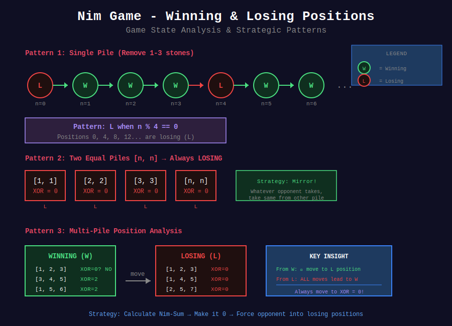
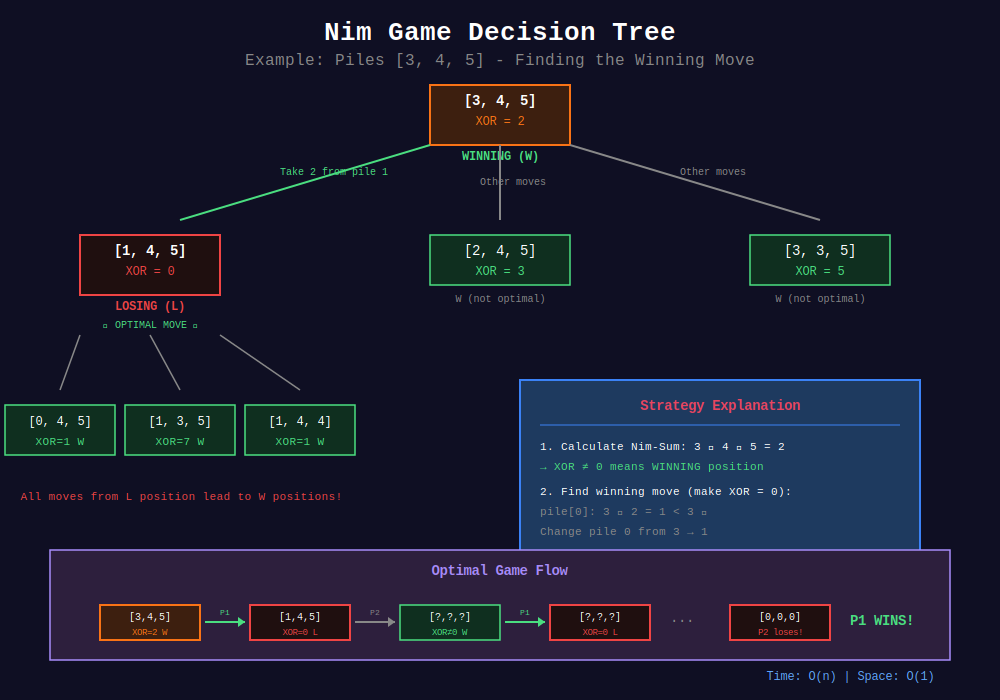

<div align="center">

# 🎲 Nim Game

<p>
  
  
</p>

**The Foundation of Combinatorial Game Theory**

*Bouton's Theorem & the XOR Strategy*

</div>

---

## 🧭 Navigation

| ⬅️ Previous | 📂 Current | ➡️ Next |
|:------------|:----------:|--------:|
| [🏠 Game Theory Home](../README.md) | **01. Nim Game** | [02. Minimax →](../02_minimax/README.md) |

---

## 📐 Mathematical Foundations

### 1️⃣ Classic Nim Rules

**Setup:** $n$ piles of stones with sizes $a\_1, a\_2, \ldots, a\_n$

**Rules:**
1. Two players alternate turns
2. On each turn, player removes **any positive number** of stones from **exactly one** pile
3. Player who removes the **last stone wins** (normal play)
4. Both players play optimally

---

### 2️⃣ Bouton's Theorem (1901)

**Theorem:** A Nim position with pile sizes $a\_1, a\_2, \ldots, a\_n$ is a **losing position** (L-position) if and only if:

```math
a_1 \oplus a_2 \oplus \cdots \oplus a_n = 0
```

where $\oplus$ denotes bitwise XOR.

**Proof:**

*Part 1:* Terminal position (all piles empty) has Nim-Sum = 0, and previous player won.

*Part 2:* From position with Nim-Sum = 0:
- Any move changes exactly one pile size
- This changes the Nim-Sum to non-zero
- Therefore, all moves from L-position lead to W-positions

*Part 3:* From position with Nim-Sum ≠ 0:
- Let $s = a\_1 \oplus a\_2 \oplus \cdots \oplus a\_n \neq 0$
- Let $k$ be position of highest bit in $s$
- Find pile $a\_i$ with bit $k$ set
- New pile size: $a\_i' = a\_i \oplus s < a\_i$
- After this move: $a\_1 \oplus \cdots \oplus a\_i' \oplus \cdots \oplus a\_n = 0$

Therefore, from W-position, can always move to L-position. $\blacksquare$

---

### 3️⃣ Nim-Sum Properties

**XOR Properties:**

```math
\begin{align}
a \oplus a &= 0 \\
a \oplus 0 &= a \\
a \oplus b &= b \oplus a \quad \text{(commutative)} \\
(a \oplus b) \oplus c &= a \oplus (b \oplus c) \quad \text{(associative)}
\end{align}
```

**Binary XOR:**
```
  5 = 101₂
⊕ 3 = 011₂
  -------
  6 = 110₂
```

---

### 4️⃣ Misère Nim

**Variant:** Player who takes **last stone loses**.

**Theorem:** Misère Nim strategy:
- If all piles have size ≤ 1: Winning if odd number of piles
- Otherwise: Same as normal Nim (make Nim-Sum = 0)

---

## 🎨 Visual Diagrams

### Nim-Sum (XOR) Calculation
<p align="center">
  
</p>

### Winning & Losing Positions
<p align="center">
  
</p>

### Nim Decision Tree
<p align="center">
  
</p>

---

## 📝 Visual Walkthroughs

### Walkthrough 1: Classic Nim Example

```
+-----------------------------------------------------------------+
| GAME: Piles [3, 4, 5]                                           |
+-----------------------------------------------------------------+
| STEP 1: Calculate Nim-Sum                                       |
|                                                                  |
|   3 = 011₂                                                       |
|   4 = 100₂                                                       |
|   5 = 101₂                                                       |
|   ---------                                                      |
| XOR = 010₂ = 2                                                   |
|                                                                  |
| Nim-Sum ≠ 0 → WINNING POSITION for first player!               |
+-----------------------------------------------------------------+
| STEP 2: Find Winning Move                                       |
|                                                                  |
| Goal: Make Nim-Sum = 0                                          |
|                                                                  |
| Highest bit in Nim-Sum = 2 (bit position 1)                     |
| Find pile with bit 1 set: pile 3 (value 5 = 101₂)              |
|                                                                  |
| Target: 5 ⊕ 2 = 101₂ ⊕ 010₂ = 111₂ = 7                         |
| But 7 > 5, so this doesn't work...                              |
|                                                                  |
| Try pile 1 (value 3 = 011₂):                                    |
| Target: 3 ⊕ 2 = 011₂ ⊕ 010₂ = 001₂ = 1                         |
| Yes! 1 < 3, so remove 2 stones from pile 1                      |
|                                                                  |
| New configuration: [1, 4, 5]                                    |
| Verify: 1 ⊕ 4 ⊕ 5 = 001₂ ⊕ 100₂ ⊕ 101₂ = 000₂ = 0 ✓            |
+-----------------------------------------------------------------+
| STEP 3: Opponent's Turn (Losing Position)                       |
|                                                                  |
| Current: [1, 4, 5], Nim-Sum = 0                                 |
| Any move makes Nim-Sum ≠ 0                                      |
| First player can always respond to make it 0 again              |
|                                                                  |
| RESULT: First player wins with optimal play! ✓                  |
+-----------------------------------------------------------------+
```

---

### Walkthrough 2: Nim-Sum Pattern Recognition

```
+-----------------------------------------------------------------+
| PATTERN: Single Pile Nim                                        |
+-----------------------------------------------------------------+
| Pile Size | Nim-Sum | Position | Strategy                       |
|-----------+---------+----------+--------------------------------|
|     0     |    0    |    L     | Lost (no moves)                |
|     1     |    1    |    W     | Take all                       |
|     2     |    2    |    W     | Take all                       |
|     3     |    3    |    W     | Take all                       |
|     4     |    4    |    W     | Take all                       |
|                                                                  |
| Single pile: Always winning (unless empty)                      |
+-----------------------------------------------------------------+

+-----------------------------------------------------------------+
| PATTERN: Two Equal Piles                                        |
+-----------------------------------------------------------------+
|   Piles   | Nim-Sum | Position | Strategy                       |
|-----------+---------+----------+--------------------------------|
|   [0,0]   |    0    |    L     | Lost                           |
|   [1,1]   |  1⊕1=0  |    L     | Mirror opponent                |
|   [2,2]   |  2⊕2=0  |    L     | Mirror opponent                |
|   [3,3]   |  3⊕3=0  |    L     | Mirror opponent                |
|   [n,n]   |    0    |    L     | Mirror opponent                |
|                                                                  |
| Strategy: Whatever opponent takes from one pile,                |
|           take same amount from other pile!                     |
+-----------------------------------------------------------------+
```

---

## 💻 Code Implementations

### Implementation 1: Basic Nim

```python
def can_win_nim(piles: list[int]) -> bool:
    """
    Determine if first player can win in Nim.
    
    Time: O(n), Space: O(1)
    
    Example:
        >>> can_win_nim([3, 4, 5])
        True  # Nim-Sum = 2
        >>> can_win_nim([2, 2])
        False  # Nim-Sum = 0
    """
    nim_sum = 0
    for pile in piles:
        nim_sum ^= pile
    return nim_sum != 0
```

---

### Implementation 2: Find Winning Move

```python
def find_winning_move(piles: list[int]) -> tuple[int, int] | None:
    """
    Find a winning move: (pile_index, new_pile_size).
    
    Returns None if already in losing position.
    
    Time: O(n), Space: O(1)
    
    Example:
        >>> find_winning_move([3, 4, 5])
        (0, 1)  # Change pile 0 from 3 to 1
    """
    nim_sum = 0
    for pile in piles:
        nim_sum ^= pile
    
    if nim_sum == 0:
        return None  # Already losing position
    
    # Find pile where we can make nim_sum = 0
    for i, pile in enumerate(piles):
        target = pile ^ nim_sum
        if target < pile:
            return (i, target)
    
    return None
```

---

### Implementation 3: LeetCode 292 - Nim Game

```python
def canWinNim(n: int) -> bool:
    """
    LeetCode 292: Nim Game
    
    One pile, can remove 1-3 stones.
    
    Pattern: Lose if n % 4 == 0
    
    Time: O(1), Space: O(1)
    
    Proof:
    - n=1,2,3: Win (take all)
    - n=4: Lose (opponent gets 1,2,or 3, always wins)
    - n=5,6,7: Win (leave opponent with 4)
    - n=8: Lose (same pattern)
    - Pattern repeats every 4
    """
    return n % 4 != 0
```

---

### Implementation 4: Misère Nim

```python
def can_win_misere_nim(piles: list[int]) -> bool:
    """
    Misère Nim: Last player to move LOSES.
    
    Strategy:
    1. If all piles ≤ 1: Win if odd number of piles
    2. Otherwise: Play normal Nim (make nim_sum = 0)
    
    Time: O(n), Space: O(1)
    """
    nim_sum = 0
    all_ones = True
    
    for pile in piles:
        nim_sum ^= pile
        if pile > 1:
            all_ones = False
    
    if all_ones:

        # Count piles (non-zero)
        count = sum(1 for p in piles if p > 0)
        return count % 2 == 1
    else:

        # Normal nim strategy
        return nim_sum != 0
```

---

### Implementation 5: Nim with Limited Moves

```python
def nim_with_moves(n: int, moves: list[int]) -> bool:
    """
    Nim variant: Can only remove k stones where k in moves.
    
    Use Grundy numbers (Sprague-Grundy theorem).
    
    Time: O(n × |moves|), Space: O(n)
    
    Example:
        >>> nim_with_moves(5, [1, 2, 3])
        False  # Grundy number is 0
    """

    # Calculate Grundy numbers
    grundy = [0] * (n + 1)
    
    for i in range(1, n + 1):

        # Find mex of successors
        successors = set()
        for move in moves:
            if i >= move:
                successors.add(grundy[i - move])
        
        # MEX (minimum excludant)
        mex = 0
        while mex in successors:
            mex += 1
        
        grundy[i] = mex
    
    return grundy[n] != 0
```

---

## 🏆 LeetCode Problems

### 🟢 Easy
| # | Problem | Key Insight | Solution |
|:-:|---------|-------------|----------|
| 292 | [Nim Game](https://leetcode.com/problems/nim-game/) | `n % 4 != 0` | O(1) pattern |
| 1025 | [Divisor Game](https://leetcode.com/problems/divisor-game/) | Even wins | `n % 2 == 0` |

### 🟡 Medium
| # | Problem | Key Insight | Solution |
|:-:|---------|-------------|----------|
| 294 | [Flip Game II](https://leetcode.com/problems/flip-game-ii/) | Grundy numbers | Impartial game |

### 🔴 Hard
| # | Problem | Key Insight | Solution |
|:-:|---------|-------------|----------|
| 810 | [Chalkboard XOR Game](https://leetcode.com/problems/chalkboard-xor-game/) | XOR + parity | Nim variant |

---

## 💡 Key Insights

> **XOR Magic:**  
> Nim-Sum = 0 is losing position. XOR has perfect properties for game theory!

> **Winning Strategy:**  
> Always move to make Nim-Sum = 0. Force opponent into losing positions.

> **Pattern Recognition:**  
> Many games reduce to Nim or have Nim-like patterns (n % 4, etc.)

> **Grundy Numbers:**  
> Generalize Nim to ANY impartial game. Combine multiple games via XOR.

---

## 📚 References

| Resource | Link |
|----------|------|
| **Bouton's Paper** | American Mathematical Monthly (1901) |
| **Wikipedia** | [Nim](https://en.wikipedia.org/wiki/Nim) |
| **Winning Ways** | Conway, Berlekamp, Guy |

---

<div align="center">

**Made with ❤️ by [Gaurav Goswami](https://github.com/Gaurav14cs17)**

</div>

---

## 🧭 Navigation

| ⬅️ Previous | 📂 Current | ➡️ Next |
|:------------|:----------:|--------:|
| [🏠 Game Theory Home](../README.md) | **01. Nim Game** | [02. Minimax →](../02_minimax/README.md) |

