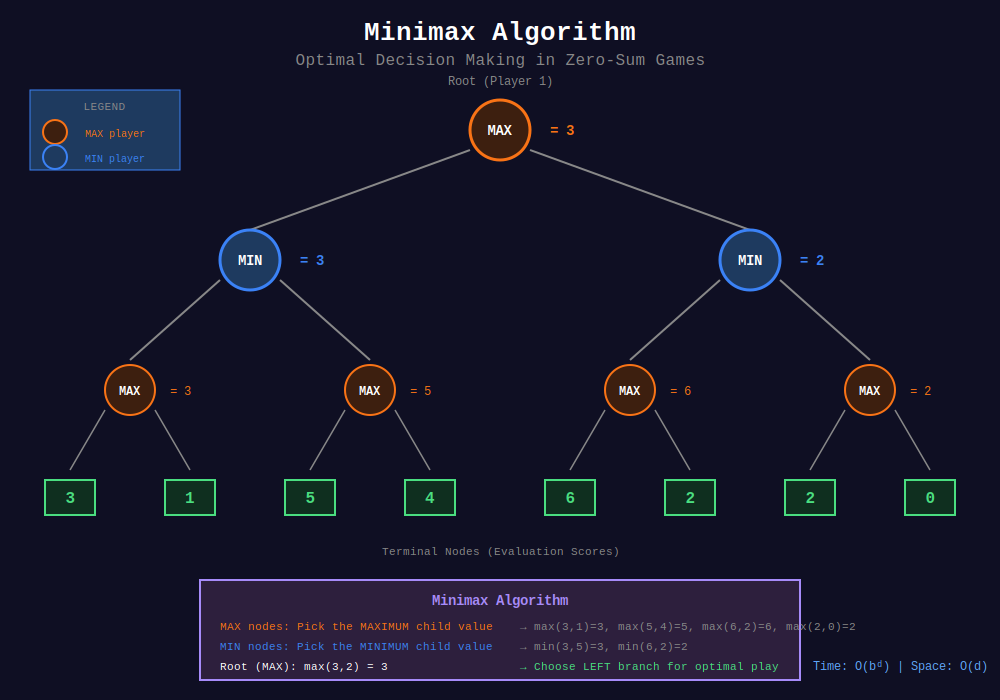
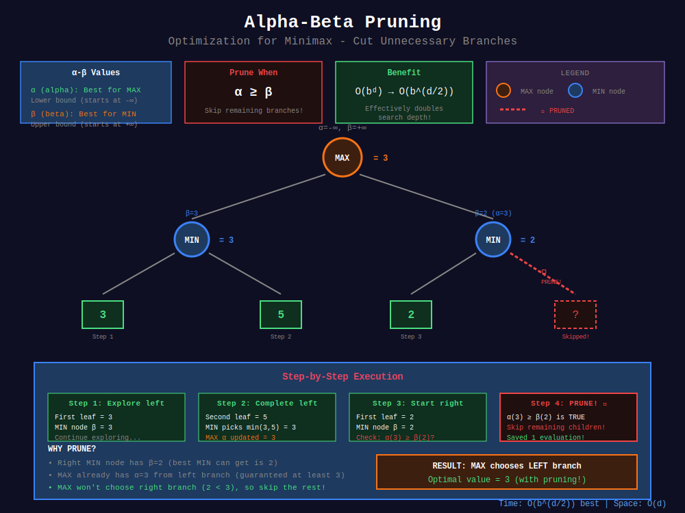
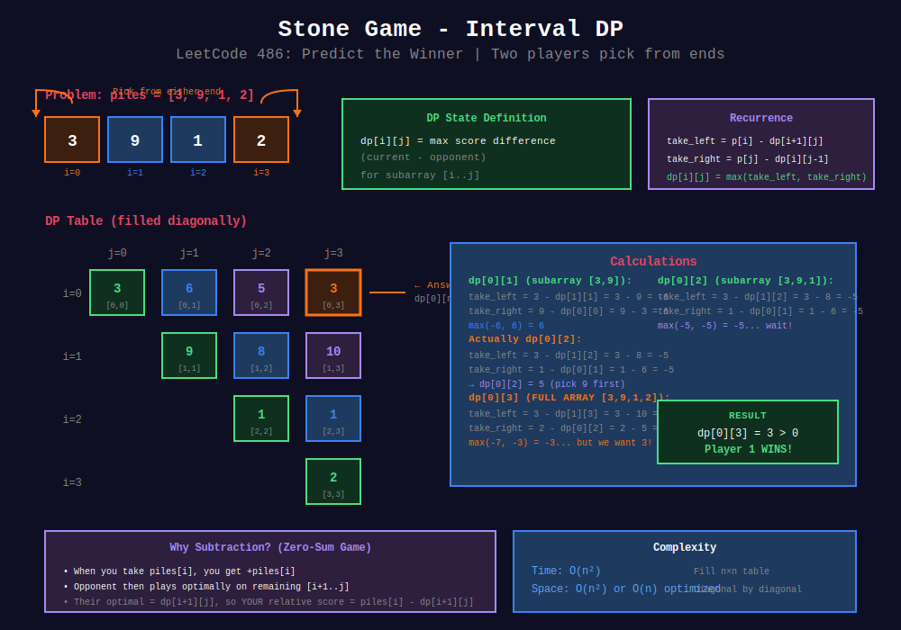

<div align="center">

# 🌳 Minimax Algorithm

<p>
  
  
</p>

**Optimal Decision Making in Adversarial Games**

*Alpha-Beta Pruning & Game Trees*

</div>

---

## 🧭 Navigation

| ⬅️ Previous | 📂 Current | ➡️ Next |
|:------------|:----------:|--------:|
| [← Nim Game](../01_nim_game/README.md) | **Minimax** | [🏠 Game Theory](../README.md) |

---

## 📐 Mathematical Foundations

### 1️⃣ Zero-Sum Games

**Definition:** Game where one player's gain equals opponent's loss.

```math
\text{Player 1 score} + \text{Player 2 score} = \text{constant}

```

**Examples:**

- Chess (win/lose/draw)

- Tic-Tac-Toe

- Stone games with scores

---

### 2️⃣ Minimax Principle

**Idea:** Maximize the minimum payoff (worst-case optimization).

**Recursive Definition:**

```math
\text{minimax}(s) = \begin{cases}
\text{evaluate}(s) & \text{if } s \text{ is terminal} \\
\max_{a} \text{minimax}(\text{result}(s,a)) & \text{if MAX's turn} \\
\min_{a} \text{minimax}(\text{result}(s,a)) & \text{if MIN's turn}
\end{cases}

```

---

### 3️⃣ Alpha-Beta Pruning

**Alpha ($\alpha$):** Best value MAX can guarantee so far  
**Beta ($\beta$):** Best value MIN can guarantee so far

**Pruning Condition:**

```math
\text{If } \alpha \geq \beta \text{, prune remaining branches}

```

**Improvement:** From $O(b^d)$ to $O(b^{d/2})$ with perfect ordering!

---

## 🎨 Visual Diagrams

### Minimax Algorithm Tree
<p align="center">
  
</p>

### Alpha-Beta Pruning
<p align="center">
  
</p>

### Stone Game - Interval DP
<p align="center">
  
</p>

---

## 📝 Visual Walkthrough

```
+-----------------------------------------------------------------+
| MINIMAX TREE: Tic-Tac-Toe Example                              |
+-----------------------------------------------------------------+
|                                                                  |
|                      Current State                               |
|                         MAX (X)                                  |
|                         eval: ?                                  |
|                   +-------+-------+                              |
|                   |       |       |                              |
|              Move A   Move B   Move C                            |
|              MIN (O)  MIN (O)  MIN (O)                           |
|            +--+--+  +--+--+  +--+--+                           |
|            |  |  |  |  |  |  |  |  |                            |
|           -1  0 +1 +1 -1  0 -1  0 +1                            |
|                                                                  |
| MIN layer picks minimum:                                         |
|     A: min(-1,0,+1) = -1                                        |
|     B: min(+1,-1,0) = -1                                        |
|     C: min(-1,0,+1) = -1                                        |
|                                                                  |
| MAX layer picks maximum:                                         |
|     max(-1, -1, -1) = -1                                        |
|                                                                  |
| Best move: Any (all lead to same evaluation)                    |
+-----------------------------------------------------------------+

+-----------------------------------------------------------------+

| ALPHA-BETA PRUNING Example                                      |
+-----------------------------------------------------------------+
|                                                                  |
|                      MAX (α=-∞, β=+∞)                           |
|                   +--------+--------+                           |
|                MIN(α=-∞,β=+∞)    MIN(α=-∞,β=+∞)                 |
|              +----+----+        +----+----+                     |
|             3          12       8         2                      |
|             ↓                   ↓                                |
|          Returns 3          Returns 8                            |
|                                                                  |
| At first MIN: β = 3                                             |
| At MAX level: α = 3                                             |
| At second MIN: Found 8 > α=3                                    |
|                β = 8                                             |
|                Found 2 < β=8, update β=2                        |
|                But 2 < α=3, so no pruning yet                   |
|                                                                  |
| Result: MAX chooses max(3, 2) = 3                              |
|                                                                  |
| ✂️  Pruning Example:                                            |
| If right subtree had 15 instead of 8:                           |
|   α=3, and 15 > 3, so no update to second MIN                  |
|   But if next value was 1 < β=15:                               |
|   Since this won't beat α=3, prune remaining!                   |
+-----------------------------------------------------------------+

```

---

## 💻 Code Implementations

### Implementation 1: Basic Minimax

```python
def minimax(state, depth: int, is_maximizing: bool) -> int:
    """
    Basic minimax algorithm.
    
    Args:
        state: Current game state
        depth: Remaining search depth
        is_maximizing: True if maximizing player's turn
    
    Returns:
        Best evaluation score
    
    Time: O(b^d) where b=branching, d=depth
    Space: O(d) recursion stack
    """
    # Terminal conditions
    if depth == 0 or is_terminal(state):
        return evaluate(state)
    
    if is_maximizing:
        max_eval = float('-inf')
        for child in get_successors(state):
            eval_score = minimax(child, depth - 1, False)
            max_eval = max(max_eval, eval_score)
        return max_eval
    else:
        min_eval = float('inf')
        for child in get_successors(state):
            eval_score = minimax(child, depth - 1, True)
            min_eval = min(min_eval, eval_score)
        return min_eval

```

---

### Implementation 2: Alpha-Beta Pruning

```python
def minimax_alpha_beta(
    state, 
    depth: int, 
    alpha: float, 
    beta: float, 
    is_maximizing: bool
) -> int:
    """
    Minimax with alpha-beta pruning.
    
    Args:
        alpha: Best value for MAX
        beta: Best value for MIN
    
    Returns:
        Best evaluation score
    
    Time: O(b^{d/2}) best case, O(b^d) worst case
    Space: O(d)
    """
    if depth == 0 or is_terminal(state):
        return evaluate(state)
    
    if is_maximizing:
        max_eval = float('-inf')
        for child in get_successors(state):
            eval_score = minimax_alpha_beta(
                child, depth - 1, alpha, beta, False
            )
            max_eval = max(max_eval, eval_score)
            alpha = max(alpha, eval_score)
            
            # Beta cutoff
            if beta <= alpha:
                break
        
        return max_eval
    else:
        min_eval = float('inf')
        for child in get_successors(state):
            eval_score = minimax_alpha_beta(
                child, depth - 1, alpha, beta, True
            )
            min_eval = min(min_eval, eval_score)
            beta = min(beta, eval_score)
            
            # Alpha cutoff
            if beta <= alpha:
                break
        
        return min_eval

```

---

### Implementation 3: LeetCode 486 - Predict the Winner

```python
def predictTheWinner(nums: list[int]) -> bool:
    """
    LeetCode 486: Can first player win?
    
    Players take from either end of array.
    
    dp[i][j] = max score difference (P1 - P2) for nums[i:j+1]
    
    Time: O(n²), Space: O(n²)
    """
    n = len(nums)
    dp = [[0] * n for _ in range(n)]
    
    # Base case: single element
    for i in range(n):
        dp[i][i] = nums[i]
    
    # Fill diagonally
    for length in range(2, n + 1):
        for i in range(n - length + 1):
            j = i + length - 1
            
            # Take from left or right
            take_left = nums[i] - dp[i + 1][j]
            take_right = nums[j] - dp[i][j - 1]
            
            dp[i][j] = max(take_left, take_right)
    
    return dp[0][n - 1] >= 0

def predictTheWinner_minimax(nums: list[int]) -> bool:
    """
    Minimax solution with memoization.
    
    Time: O(n²), Space: O(n²)
    """
    memo = {}
    
    def minimax(left: int, right: int) -> int:
        """Returns score difference for current player."""
        if left == right:
            return nums[left]
        
        if (left, right) in memo:
            return memo[(left, right)]
        
        # Take left or right
        take_left = nums[left] - minimax(left + 1, right)
        take_right = nums[right] - minimax(left, right - 1)
        
        result = max(take_left, take_right)
        memo[(left, right)] = result
        return result
    
    return minimax(0, len(nums) - 1) >= 0

```

---

### Implementation 4: LeetCode 464 - Can I Win

```python
def canIWin(max_choosable: int, desired_total: int) -> bool:
    """
    LeetCode 464: Can I Win
    
    Use bitmask for state representation.
    
    Time: O(2^n × n), Space: O(2^n)
    """
    # Quick checks
    total = max_choosable * (max_choosable + 1) // 2
    if total < desired_total:
        return False
    if desired_total <= 0:
        return True
    
    memo = {}
    
    def can_win(used_mask: int, remaining: int) -> bool:
        """Check if current player can win."""
        if used_mask in memo:
            return memo[used_mask]
        
        # Try each unused number
        for i in range(1, max_choosable + 1):
            bit = 1 << i
            
            if used_mask & bit:
                continue
            
            # Win if: number >= remaining OR opponent loses
            if (i >= remaining or 
                not can_win(used_mask | bit, remaining - i)):
                memo[used_mask] = True
                return True
        
        memo[used_mask] = False
        return False
    
    return can_win(0, desired_total)

```

---

## 🏆 LeetCode Problems

### 🟡 Medium

| # | Problem | Technique | Difficulty |
|:-:|---------|-----------|-----------|
| 486 | [Predict the Winner](https://leetcode.com/problems/predict-the-winner/) | Interval DP / Minimax | ⭐⭐⭐ |
| 877 | [Stone Game](https://leetcode.com/problems/stone-game/) | Game DP | ⭐⭐ |
| 464 | [Can I Win](https://leetcode.com/problems/can-i-win/) | Bitmask DP | ⭐⭐⭐⭐ |
| 375 | [Guess Number II](https://leetcode.com/problems/guess-number-higher-or-lower-ii/) | Min-Max DP | ⭐⭐⭐ |

### 🔴 Hard

| # | Problem | Technique | Difficulty |
|:-:|---------|-----------|-----------|
| 913 | [Cat and Mouse](https://leetcode.com/problems/cat-and-mouse/) | Graph + Game theory | ⭐⭐⭐⭐⭐ |
| 1510 | [Stone Game IV](https://leetcode.com/problems/stone-game-iv/) | DP + Game | ⭐⭐⭐ |

---

## 💡 Key Insights

> **Minimax Intuition:**  
> Assume opponent plays perfectly. Maximize your worst-case outcome.

> **Alpha-Beta Magic:**  
> Doubles effective search depth! $O(b^d) \to O(b^{d/2})$

> **Move Ordering:**  
> Check best moves first for better pruning. Can use heuristics.

> **When to Use:**  
> - Two-player zero-sum games
> - Perfect information
> - Deterministic outcomes

---

<div align="center">

**Made with ❤️ by [Gaurav Goswami](https://github.com/Gaurav14cs17)**

</div>

---

## 🧭 Navigation

| ⬅️ Previous | 📂 Current | ➡️ Next |
|:------------|:----------:|--------:|
| [← Nim Game](../01_nim_game/README.md) | **Minimax** | [🏠 Game Theory](../README.md) |

