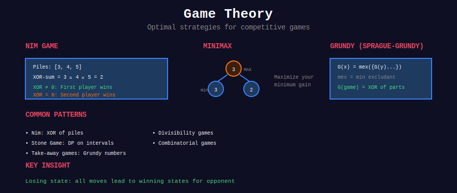

<div align="center">

# 🎮 Game Theory



<p>
  
  
  
</p>

**Optimal Play, Strategy, and Winning Positions**

*Master Nim, Minimax, and Sprague-Grundy Theorem*

</div>

---

## 🎨 Visual Overview

<p align="center">
  
</p>

---

## 🧭 Navigation

| ⬅️ Previous | 📂 Current | ➡️ Next |
|:------------|:----------:|--------:|
| [← Combinatorics](../31_combinatorics/README.md) | **Game Theory** | [Matrix Exponentiation →](../33_matrix_exponentiation/README.md) |

---

## 📐 Mathematical Foundations

### 1️⃣ Impartial Games

**Definition:** A game is **impartial** if both players have the same moves available from any position.

**Examples:**

- Nim game

- Chomp

- Subtract a square

**Key Theorem (Sprague-Grundy):** Every impartial game is equivalent to a Nim game.

---

### 2️⃣ Game States & Positions

**Winning Position (W):** The player whose turn it is can force a win.

**Losing Position (L):** The player whose turn it is will lose with optimal play.

**Recursive Definition:**

- A position is **losing** if all moves lead to **winning** positions

- A position is **winning** if there exists at least one move to a **losing** position

```math
\begin{align}
\text{Position is L} &\iff \text{All successors are W} \\
\text{Position is W} &\iff \exists \text{ successor that is L}
\end{align}

```

---

### 3️⃣ Nim Game Theory

**Classic Nim:** Multiple piles of stones. Players alternate removing any number of stones from a single pile. Player who takes the last stone wins.

**Nim-Sum (XOR):** For piles with sizes $a\_1, a\_2, \ldots, a\_n$:

```math
\text{Nim-Sum} = a_1 \oplus a_2 \oplus \cdots \oplus a_n

```

**Bouton's Theorem (1901):**

```math
\begin{cases}
\text{Nim-Sum} = 0 &\implies \text{Losing position (L)} \\
\text{Nim-Sum} \neq 0 &\implies \text{Winning position (W)}
\end{cases}

```

**Proof:**
1. Terminal position (all piles empty): Nim-Sum = 0 → Previous player wins
2. From Nim-Sum = 0, any move creates Nim-Sum ≠ 0
3. From Nim-Sum ≠ 0, can always move to Nim-Sum = 0

**Strategy:** Always move to make Nim-Sum = 0.

---

### 4️⃣ Sprague-Grundy Theorem

**Grundy Number (Nimber):** For position $P$:

```math
g(P) = \text{mex}\{g(P') : P' \text{ is a successor of } P\}

```

where $\text{mex}(S) = \min\{n \geq 0 : n \notin S\}$ (minimum excludant)

**Properties:**

- $g(P) = 0$ iff $P$ is a losing position

- $g(P) > 0$ iff $P$ is a winning position

- For multiple independent games: $g(G\_1 + G\_2 + \cdots) = g(G\_1) \oplus g(G\_2) \oplus \cdots$

**Example:**

```
Game: Remove 1, 2, or 3 stones from pile

g(0) = mex({}) = 0  (losing)
g(1) = mex({g(0)}) = mex({0}) = 1
g(2) = mex({g(0), g(1)}) = mex({0, 1}) = 2
g(3) = mex({g(0), g(1), g(2)}) = mex({0, 1, 2}) = 3
g(4) = mex({g(1), g(2), g(3)}) = mex({1, 2, 3}) = 0  (losing!)
g(5) = mex({g(2), g(3), g(4)}) = mex({2, 3, 0}) = 1

Pattern: g(n) = n mod 4

```

---

### 5️⃣ Minimax Algorithm

**Two-Player Zero-Sum Games:** One player's gain is another's loss.

**Minimax Principle:** Maximize the minimum gain (or minimize the maximum loss).

**Algorithm:**

```
minimax(position, depth, isMaximizing):
    if terminal or depth = 0:
        return evaluate(position)
    
    if isMaximizing:
        maxEval = -∞
        for each child of position:
            eval = minimax(child, depth-1, false)
            maxEval = max(maxEval, eval)
        return maxEval
    else:
        minEval = +∞
        for each child of position:
            eval = minimax(child, depth-1, true)
            minEval = min(minEval, eval)
        return minEval

```

**Time Complexity:** $O(b^d)$ where $b$ = branching factor, $d$ = depth

---

### 6️⃣ Alpha-Beta Pruning

**Optimization:** Prune branches that can't affect the final decision.

**Alpha ($\alpha$):** Best value maximizer can guarantee
**Beta ($\beta$):** Best value minimizer can guarantee

**Pruning Condition:** If $\alpha \geq \beta$, prune remaining branches

**Time Complexity:** $O(b^{d/2})$ with optimal ordering (half the depth!)

---

### 7️⃣ Dynamic Programming on Games

For many game problems, use **memoization** or **DP**:

**State:** Current game configuration
**Transition:** Possible moves
**Base Case:** Terminal positions

```math
\text{dp}[\text{state}] = \begin{cases}
\text{win} &\text{if } \exists \text{ move to losing state} \\
\text{lose} &\text{if all moves lead to winning states}
\end{cases}

```

---

## 🎨 Visual Patterns

### Pattern 1: Nim Game Decision Tree

```
                     [3, 4, 5]
                   XOR = 3^4^5 = 2
                   (Winning position!)
                   
        Take 2 from pile 1
        Take 2 from pile 2
        Take 2 from pile 3
              ↓            ↓            ↓
         [1,4,5]      [3,2,5]      [3,4,3]
         XOR=0        XOR=4        XOR=4
         (Lose!)      (Win)        (Win)
         
    Choose move to [1,4,5] to guarantee win!

```

### Pattern 2: Grundy Numbers Visualization

```
Position:  0   1   2   3   4   5   6   7   8
Grundy:    0   1   2   3   0   1   2   3   0
           L   W   W   W   L   W   W   W   L
           
Pattern repeats every 4 positions!

```

---

## 📂 Subtopics

<table>
<tr>
<td width="33%" valign="top">

### [01. Nim Game](./01_nim_game/)

**Core Concepts:**

- Classic Nim

- Nim-Sum (XOR)

- Bouton's Theorem

- Misère Nim

- Multi-pile Nim

**Key Problems:**

- Nim Game (#292)

- Game of Nim (#1510)

- Chalkboard XOR (#810)

**Time:** O(n)

</td>
<td width="33%" valign="top">

### [02. Minimax](./02_minimax/)

**Core Concepts:**

- Game trees

- Minimax algorithm

- Alpha-beta pruning

- Evaluation functions

- Two-player games

**Key Problems:**

- Predict Winner (#486)

- Stone Game (#877)

- Cat and Mouse (#913)

**Time:** O(b^d)

</td>
<td width="33%" valign="top">

### [03. Stone Games](./03_stone_games/)

**Core Concepts:**

- Stone pile games

- DP on games

- Optimal strategy

- Interval DP

- Game states

**Key Problems:**

- Stone Game I-V

- Can I Win (#464)

- Flip Game II (#294)

**Patterns:** Many!

</td>
</tr>
</table>

---

## 🏆 Key Problems by Category

### 🟢 Easy (Foundation)

| # | Problem | Category | Key Concept |
|:-:|---------|----------|-------------|
| 292 | [Nim Game](https://leetcode.com/problems/nim-game/) | Nim | Pattern: n % 4 |
| 1025 | [Divisor Game](https://leetcode.com/problems/divisor-game/) | Game Theory | Odd/even pattern |

### 🟡 Medium (Core Skills)

| # | Problem | Category | Key Concept |
|:-:|---------|----------|-------------|
| 486 | [Predict the Winner](https://leetcode.com/problems/predict-the-winner/) | Minimax | Interval DP |
| 877 | [Stone Game](https://leetcode.com/problems/stone-game/) | Stone | Always first wins |
| 1140 | [Stone Game II](https://leetcode.com/problems/stone-game-ii/) | Stone | DP with M parameter |
| 1406 | [Stone Game III](https://leetcode.com/problems/stone-game-iii/) | Stone | Take 1, 2, or 3 |
| 1510 | [Stone Game IV](https://leetcode.com/problems/stone-game-iv/) | Stone | Square numbers |
| 464 | [Can I Win](https://leetcode.com/problems/can-i-win/) | Minimax | Bitmask DP |
| 294 | [Flip Game II](https://leetcode.com/problems/flip-game-ii/) | Grundy | Impartial game |
| 375 | [Guess Number Higher or Lower II](https://leetcode.com/problems/guess-number-higher-or-lower-ii/) | Minimax | Min-max cost |

### 🔴 Hard (Advanced)

| # | Problem | Category | Key Concept |
|:-:|---------|----------|-------------|
| 913 | [Cat and Mouse](https://leetcode.com/problems/cat-and-mouse/) | Graph | BFS + game states |
| 1563 | [Stone Game V](https://leetcode.com/problems/stone-game-v/) | Stone | Interval DP |
| 810 | [Chalkboard XOR Game](https://leetcode.com/problems/chalkboard-xor-game/) | Nim | XOR properties |
| 1140 | [Stone Game VII](https://leetcode.com/problems/stone-game-vii/) | Stone | Sum DP |
| 1872 | [Stone Game VIII](https://leetcode.com/problems/stone-game-viii/) | Stone | Prefix sum DP |
| 2029 | [Stone Game IX](https://leetcode.com/problems/stone-game-ix/) | Stone | Modulo 3 pattern |

---

## 💻 Core Implementation Templates

### Template 1: Nim Game (XOR)

```python
def nim_game(piles: list[int]) -> bool:
    """
    Determine if first player wins in Nim.
    
    Bouton's Theorem: XOR all pile sizes.
    If XOR = 0, second player wins (losing position).
    If XOR ≠ 0, first player wins (winning position).
    
    Time: O(n), Space: O(1)
    """
    xor_sum = 0
    for pile in piles:
        xor_sum ^= pile
    
    return xor_sum != 0

def find_winning_move(piles: list[int]) -> tuple[int, int]:
    """
    Find winning move: (pile_index, stones_to_remove)
    
    Move to make XOR = 0.
    """
    xor_sum = 0
    for pile in piles:
        xor_sum ^= pile
    
    if xor_sum == 0:
        return None  # Already in losing position
    
    # Find pile where removing stones makes XOR = 0
    for i, pile in enumerate(piles):
        target = pile ^ xor_sum
        if target < pile:
            return (i, pile - target)
    
    return None

```

---

### Template 2: Grundy Numbers

```python
def calculate_grundy(n: int, moves: list[int], memo: dict = None) -> int:
    """
    Calculate Grundy number for position n.
    
    moves: List of possible stone removals
    
    Time: O(n × |moves|)
    Space: O(n)
    """
    if memo is None:
        memo = {}
    
    if n in memo:
        return memo[n]
    
    if n == 0:
        return 0  # Losing position
    
    # Calculate successors
    successors = set()
    for move in moves:
        if n >= move:
            successors.add(calculate_grundy(n - move, moves, memo))
    
    # MEX (minimum excludant)
    mex = 0
    while mex in successors:
        mex += 1
    
    memo[n] = mex
    return mex

def can_win_grundy(n: int, moves: list[int]) -> bool:
    """
    Check if current player can win.
    
    Grundy number = 0 means losing position.
    """
    return calculate_grundy(n, moves) != 0

```

---

### Template 3: Minimax with Alpha-Beta Pruning

```python
def minimax(state, depth: int, is_maximizing: bool, 
            alpha: float = float('-inf'), 
            beta: float = float('inf')) -> int:
    """
    Minimax with alpha-beta pruning.
    
    state: Current game state
    depth: Remaining depth to search
    is_maximizing: True if maximizing player
    alpha: Best value for maximizer
    beta: Best value for minimizer
    
    Returns: Best score for current player
    
    Time: O(b^d) worst case, O(b^{d/2}) with good ordering
    """
    # Terminal condition
    if depth == 0 or is_terminal(state):
        return evaluate(state)
    
    if is_maximizing:
        max_eval = float('-inf')
        for child in get_successors(state):
            eval_score = minimax(child, depth - 1, False, alpha, beta)
            max_eval = max(max_eval, eval_score)
            alpha = max(alpha, eval_score)
            
            # Beta cutoff
            if beta <= alpha:
                break
        
        return max_eval
    else:
        min_eval = float('inf')
        for child in get_successors(state):
            eval_score = minimax(child, depth - 1, True, alpha, beta)
            min_eval = min(min_eval, eval_score)
            beta = min(beta, eval_score)
            
            # Alpha cutoff
            if beta <= alpha:
                break
        
        return min_eval

```

---

### Template 4: Game DP (Stone Game Pattern)

```python
def stone_game_dp(piles: list[int]) -> bool:
    """
    Stone Game: Two players pick from ends of array.
    Can first player win?
    
    dp[i][j] = max score difference (first - second) 
               for subarray piles[i:j+1]
    
    Time: O(n²), Space: O(n²)
    """
    n = len(piles)
    dp = [[0] * n for _ in range(n)]
    
    # Base case: single pile
    for i in range(n):
        dp[i][i] = piles[i]
    
    # Fill diagonally
    for length in range(2, n + 1):
        for i in range(n - length + 1):
            j = i + length - 1
            
            # Take from left or right
            take_left = piles[i] - dp[i + 1][j]
            take_right = piles[j] - dp[i][j - 1]
            
            dp[i][j] = max(take_left, take_right)
    
    return dp[0][n - 1] > 0

def stone_game_dp_optimized(piles: list[int]) -> bool:
    """
    Space-optimized version: O(n) space
    """
    n = len(piles)
    dp = piles[:]
    
    for length in range(2, n + 1):
        for i in range(n - length + 1):
            j = i + length - 1
            dp[i] = max(piles[i] - dp[i + 1], piles[j] - dp[i])
    
    return dp[0] > 0

```

---

### Template 5: Bitmask Game State

```python
def can_i_win(max_choosable: int, desired_total: int) -> bool:
    """
    LeetCode 464: Can I Win
    
    Use bitmask to represent used numbers.
    
    Time: O(2^n × n), Space: O(2^n)
    """
    # Quick checks
    total_sum = max_choosable * (max_choosable + 1) // 2
    if total_sum < desired_total:
        return False
    if desired_total <= 0:
        return True
    
    memo = {}
    
    def can_win(used_mask: int, remaining: int) -> bool:
        """
        used_mask: bitmask of used numbers
        remaining: remaining sum to reach
        """
        if used_mask in memo:
            return memo[used_mask]
        
        # Try each unused number
        for i in range(1, max_choosable + 1):
            bit = 1 << i
            
            if used_mask & bit:
                continue  # Already used
            
            # If this number wins, or opponent loses after this
            if i >= remaining or not can_win(used_mask | bit, remaining - i):
                memo[used_mask] = True
                return True
        
        memo[used_mask] = False
        return False
    
    return can_win(0, desired_total)

```

---

## 🎓 Common Patterns & Techniques

### Pattern 1: Odd/Even Parity

```python
# Many games have odd/even winning patterns
def divisor_game(n: int) -> bool:
    """
    LeetCode 1025: Player with even n wins
    """
    return n % 2 == 0

```

### Pattern 2: Symmetry Strategy

```python
# Mirror opponent's moves
def can_win_symmetry(n: int) -> bool:
    """
    If game has symmetry, second player often wins
    """
    return n % 2 == 0  # Even allows perfect mirroring

```

### Pattern 3: Backward Induction

```python
# Work backwards from terminal states
def solve_game(n: int) -> bool:
    """
    dp[i] = True if position i is winning
    """
    dp = [False] * (n + 1)
    
    for i in range(1, n + 1):
        # Try all moves
        for move in possible_moves(i):
            next_pos = i - move
            if not dp[next_pos]:  # Found losing position
                dp[i] = True
                break
    
    return dp[n]

```

---

## 💡 Key Insights

> **Nim Game Key Principle:**  
> XOR all pile sizes. If result is 0, you're in a losing position. Otherwise, winning position.

> **Grundy Number Intuition:**  
> Grundy number = 0 means losing position. Multiple games combine via XOR of their Grundy numbers.

> **Minimax Strategy:**  
> Assume opponent plays optimally. Maximize your minimum guaranteed outcome.

> **Alpha-Beta Pruning:**  
> Can reduce search space from $O(b^d)$ to $O(b^{d/2})$ - effectively doubling search depth!

> **Stone Game Patterns:**  
> Many stone games use interval DP: `dp[i][j]` = best score for subarray `[i, j]`

> **Symmetry Wins:**  
> If game has perfect symmetry, second player can often mirror first player's moves to win.

---

## 📚 References

| Topic | Resource | Link |
|-------|----------|------|
| **Nim Theory** | Wikipedia | [Nim](https://en.wikipedia.org/wiki/Nim) |
| **Sprague-Grundy** | CP-Algorithms | [Game Theory](https://cp-algorithms.com/game_theory/sprague-grundy-nim.html) |
| **Minimax** | Wikipedia | [Minimax](https://en.wikipedia.org/wiki/Minimax) |
| **Alpha-Beta** | Stanford CS | [Alpha-Beta Pruning](https://cs.stanford.edu/people/eroberts/courses/soco/projects/1998-99/game-theory/alphabeta.html) |
| **Combinatorial Games** | Winning Ways | By Conway, Berlekamp, Guy |

---

## 💭 Common Interview Questions

**Q: How do you know if you're in a winning or losing position?**  
A: Work backwards from terminal states. Losing position = all moves lead to winning positions. Winning position = at least one move to losing position.

**Q: What's the difference between Nim and Grundy numbers?**  
A: Nim game is special case. Grundy numbers generalize to ANY impartial game - they're the "Nim equivalent" of that game.

**Q: When should I use Minimax vs DP?**  
A: Minimax for evaluating game trees with scoring. DP for determining win/lose in discrete games with clear states.

**Q: How does Alpha-Beta pruning work?**  
A: Track best guaranteed scores for both players. If we find a path worse than what we can already guarantee, don't explore it.

**Q: Why do many Stone Games have similar patterns?**  
A: They use interval DP because you're choosing from ends of an array. Pattern: `dp[i][j]` = optimal score for subarray.

---

<div align="center">

### 🎯 Master Game Theory

*"In game theory, optimal play assumes your opponent is also optimal"*

**Understand the mathematics, master the strategy**

**Made with ❤️ by [Gaurav Goswami](https://github.com/Gaurav14cs17)**

</div>

---

## 🧭 Navigation

| ⬅️ Previous | 📂 Current | ➡️ Next |
|:------------|:----------:|--------:|
| [← Combinatorics](../31_combinatorics/README.md) | **Game Theory** | [Matrix Exponentiation →](../33_matrix_exponentiation/README.md) |
