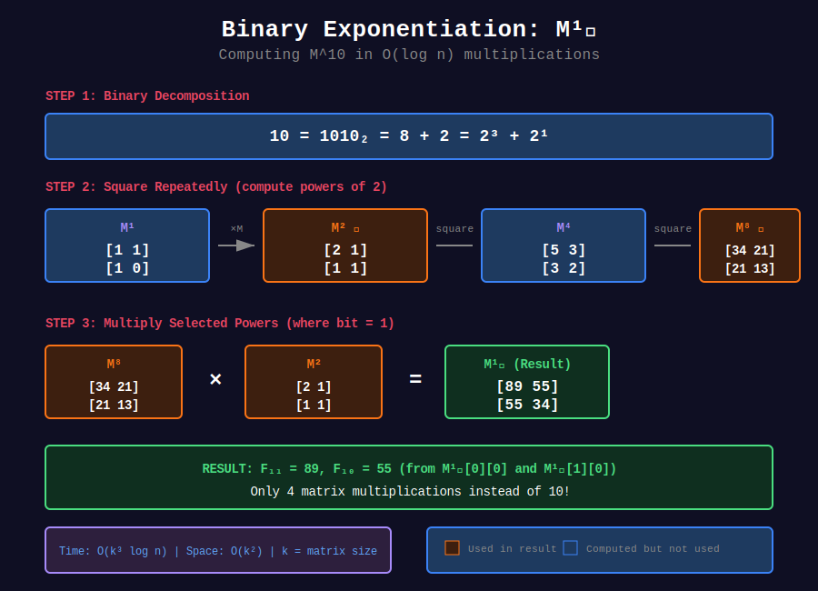
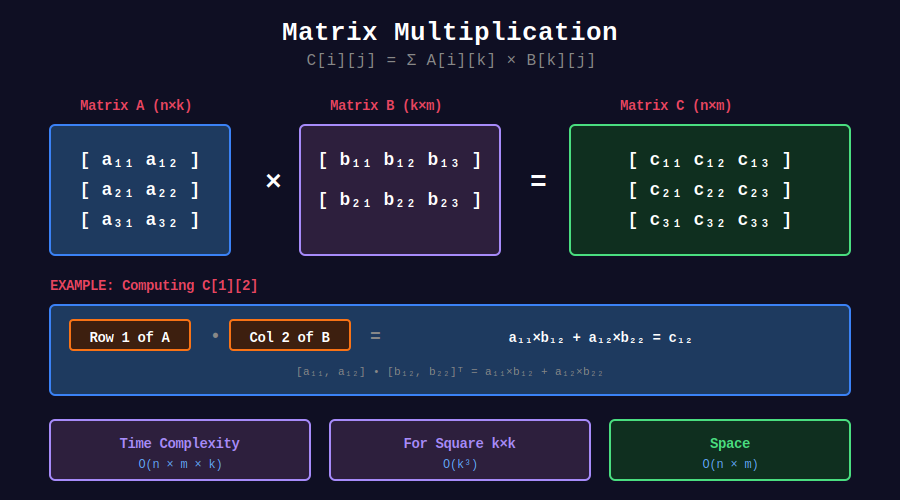
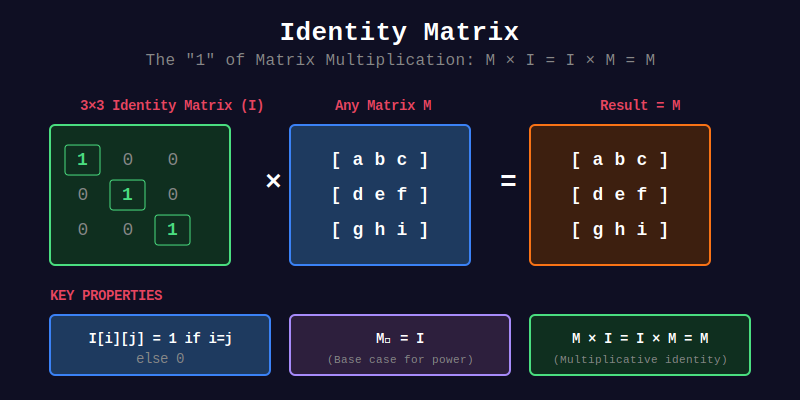

<div align="center">

# ⚡ Matrix Power

<p>
  
  
</p>

**Fast Matrix Exponentiation Using Binary Method**

*Compute M^n in O(log n) multiplications*

</div>

---

## 🧭 Navigation

| ⬅️ Previous | 📂 Current | ➡️ Next |
|:------------|:----------:|--------:|
| [🏠 Matrix Exp Home](../README.md) | **01. Matrix Power** | [02. Linear Recurrence →](../02_linear_recurrence/README.md) |

---

## 🎨 Visual Guides

<div align="center">

### Binary Exponentiation Process



*Computing M¹⁰ in only 4 multiplications using binary decomposition*

---

### Matrix Multiplication Fundamentals



*How matrix elements are computed: row × column dot product*

---

### Identity Matrix



*The multiplicative identity: M × I = I × M = M*

</div>

---

## 📐 Mathematical Foundations

### Binary Exponentiation for Matrices

**Formula:**

$$M^n = \begin{cases}
I & \text{if } n = 0 \\
(M^{n/2})^2 & \text{if } n \text{ is even} \\
M \cdot (M^{(n-1)/2})^2 & \text{if } n \text{ is odd}
\end{cases}$$

**Time Complexity:**
- Naive: $O(n)$ matrix multiplications
- Binary: $O(\log n)$ matrix multiplications
- Each multiplication: $O(k^3)$ for $k \times k$ matrix
- **Total: $O(k^3 \log n)$**

---

## 💻 Code Implementations

### Implementation 1: Matrix Multiplication

```python
def matrix_multiply(A: list[list[int]], B: list[list[int]], 
                   mod: int = None) -> list[list[int]]:
    """
    Multiply two matrices.
    
    Time: O(n³)
    Space: O(n²)
    """
    n = len(A)
    m = len(B[0])
    k = len(B)
    
    C = [[0] * m for _ in range(n)]
    
    for i in range(n):
        for j in range(m):
            for p in range(k):
                C[i][j] += A[i][p] * B[p][j]
                if mod:
                    C[i][j] %= mod
    
    return C
```

### Implementation 2: Matrix Power

```python
def matrix_power(M: list[list[int]], n: int, 
                mod: int = None) -> list[list[int]]:
    """
    Compute M^n using binary exponentiation.
    
    Time: O(k³ log n)
    Space: O(k²)
    """
    size = len(M)
    
    # Identity matrix
    result = [[1 if i == j else 0 for j in range(size)] 
              for i in range(size)]
    
    base = [row[:] for row in M]
    
    while n > 0:
        if n % 2 == 1:
            result = matrix_multiply(result, base, mod)
        base = matrix_multiply(base, base, mod)
        n //= 2
    
    return result
```

### Implementation 3: Optimized 2×2 Matrix

```python
def matrix_2x2_multiply(A: tuple, B: tuple, mod: int) -> tuple:
    """
    Optimized multiplication for 2×2 matrices.
    Matrices stored as (a, b, c, d) for [[a,b],[c,d]]
    
    Time: O(1)
    """
    a1, b1, c1, d1 = A
    a2, b2, c2, d2 = B
    
    return (
        (a1*a2 + b1*c2) % mod,
        (a1*b2 + b1*d2) % mod,
        (c1*a2 + d1*c2) % mod,
        (c1*b2 + d1*d2) % mod
    )


def matrix_2x2_power(M: tuple, n: int, mod: int) -> tuple:
    """
    Fast power for 2×2 matrix.
    
    Time: O(log n)
    """
    result = (1, 0, 0, 1)  # Identity
    base = M
    
    while n > 0:
        if n % 2 == 1:
            result = matrix_2x2_multiply(result, base, mod)
        base = matrix_2x2_multiply(base, base, mod)
        n //= 2
    
    return result
```

---

## 🏆 LeetCode Problems

### 🟢 Easy
| # | Problem | Matrix Size | Time |
|:-:|---------|-------------|------|
| 509 | [Fibonacci](https://leetcode.com/problems/fibonacci-number/) | 2×2 | O(log n) |

### 🟡 Medium
| # | Problem | Matrix Size | Time |
|:-:|---------|-------------|------|
| 1137 | [Tribonacci](https://leetcode.com/problems/n-th-tribonacci-number/) | 3×3 | O(log n) |
| 935 | [Knight Dialer](https://leetcode.com/problems/knight-dialer/) | 10×10 | O(log n) |

---

## 🔄 Algorithm Visualization

The binary exponentiation algorithm works by:

1. **Decompose** the exponent into binary form (e.g., 10 = 1010₂ = 8 + 2)
2. **Square repeatedly** to compute M¹, M², M⁴, M⁸...
3. **Multiply selected powers** where the binary bit is 1

This reduces O(n) operations to O(log n)!

---

## 💡 Key Insights

> **Why Binary Exponentiation?**  
> Reduces n multiplications to log n. For n=10⁹, that's 30 operations instead of 1 billion!

> **Matrix Size Matters:**  
> 2×2: 8 operations per multiply  
> 3×3: 27 operations  
> k×k: k³ operations

> **Modular Arithmetic:**  
> Always take mod at each step to avoid overflow

---

<div align="center">

**Made with ❤️ by [Gaurav Goswami](https://github.com/Gaurav14cs17)**

</div>

---

## 🧭 Navigation

| ⬅️ Previous | 📂 Current | ➡️ Next |
|:------------|:----------:|--------:|
| [🏠 Matrix Exp Home](../README.md) | **01. Matrix Power** | [02. Linear Recurrence →](../02_linear_recurrence/README.md) |

