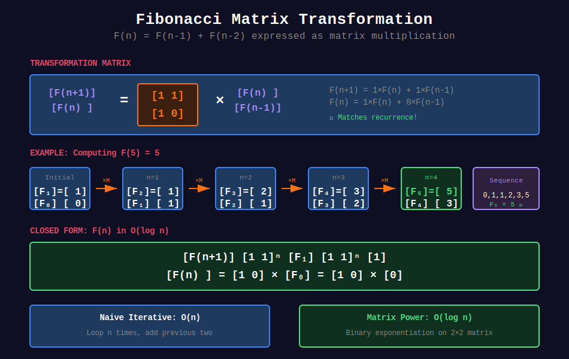
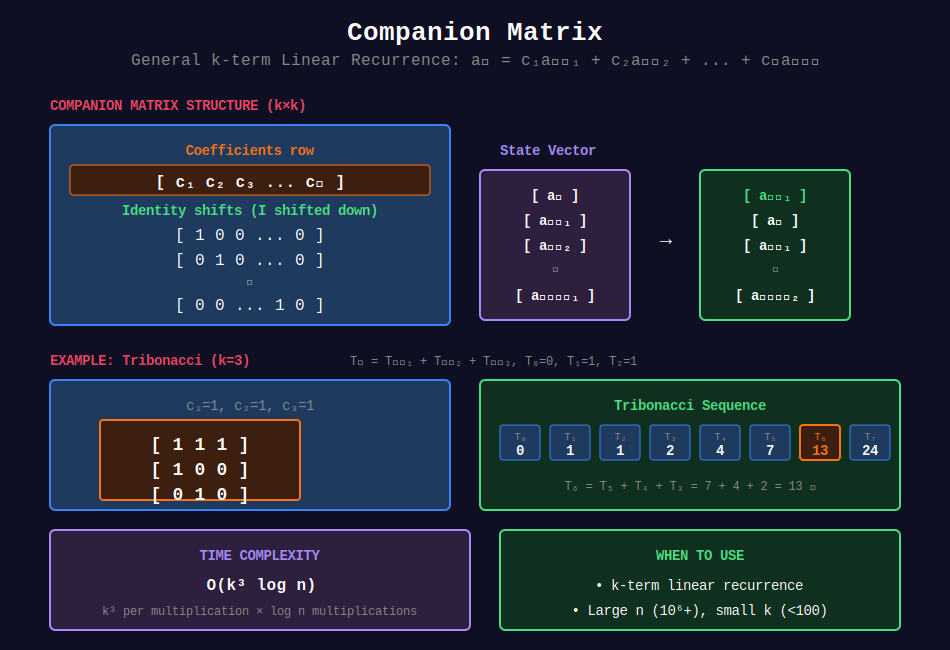
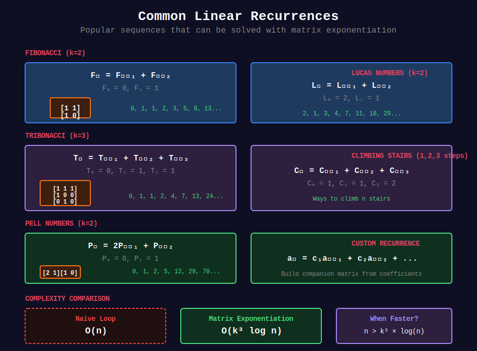

<div align="center">

# 🔢 Linear Recurrence

<p>
  
  
</p>

**Solving Linear Recurrences in O(log n)**

*Fibonacci, Tribonacci, and Beyond*

</div>

---

## 🧭 Navigation

| ⬅️ Previous | 📂 Current | ➡️ Next |
|:------------|:----------:|--------:|
| [← 01. Matrix Power](../01_matrix_power/README.md) | **02. Linear Recurrence** | [🏠 Matrix Exp Home](../README.md) |

---

## 🎨 Visual Guides

<div align="center">

### Fibonacci Matrix Transformation



*Converting the Fibonacci recurrence into matrix form*

---

### Companion Matrix Structure



*General k-term recurrence solved with companion matrix*

---

### Common Recurrence Types



*Popular sequences: Fibonacci, Tribonacci, Lucas, Pell, and more*

</div>

---

## 📐 Mathematical Foundations

### Linear Recurrence Definition

```math
a_n = c_1 a_{n-1} + c_2 a_{n-2} + \cdots + c_k a_{n-k}

```

**Examples:**

**Fibonacci:** $F_n = F_{n-1} + F_{n-2}$, $F_0=0, F_1=1$  
**Tribonacci:** $T_n = T_{n-1} + T_{n-2} + T_{n-3}$, $T_0=0, T_1=1, T_2=1$  
**Lucas:** $L_n = L_{n-1} + L_{n-2}$, $L_0=2, L_1=1$

---

## 💻 Code Implementations

### Implementation 1: Fibonacci

```python
def fibonacci(n: int, mod: int = 10**9 + 7) -> int:
    """
    Compute F(n) using matrix exponentiation.
    
    Time: O(log n)
    Space: O(1)
    """
    if n <= 1:
        return n
    
    M = [[1, 1], [1, 0]]
    result = matrix_power(M, n - 1, mod)
    return result[0][0]

```

### Implementation 2: Tribonacci

```python
def tribonacci(n: int, mod: int = 10**9 + 7) -> int:
    """
    T(n) = T(n-1) + T(n-2) + T(n-3)
    
    Matrix: [[1,1,1], [1,0,0], [0,1,0]]
    
    Time: O(log n)
    """
    if n == 0:
        return 0
    if n <= 2:
        return 1
    
    M = [[1, 1, 1],
         [1, 0, 0],
         [0, 1, 0]]
    
    result = matrix_power(M, n - 2, mod)
    
    # T(2)=1, T(1)=1, T(0)=0
    return (result[0][0] + result[0][1]) % mod

```

### Implementation 3: General k-term Recurrence

```python
def linear_recurrence(coeffs: list[int], initial: list[int], 
                     n: int, mod: int = 10**9 + 7) -> int:
    """
    Solve a_n = c₁·a_{n-1} + ... + cₖ·a_{n-k}
    
    Args:
        coeffs: [c₁, c₂, ..., cₖ]
        initial: [a₀, a₁, ..., a_{k-1}]
        n: Index to compute
    
    Returns:
        a_n mod m
    
    Time: O(k³ log n)
    """
    k = len(coeffs)
    if n < k:
        return initial[n]
    
    # Companion matrix
    M = [[0] * k for _ in range(k)]
    M[0] = coeffs
    for i in range(1, k):
        M[i][i-1] = 1
    
    result = matrix_power(M, n - k + 1, mod)
    
    ans = 0
    for i in range(k):
        ans += result[0][i] * initial[k - 1 - i]
        ans %= mod
    
    return ans

```

---

## 🏆 LeetCode Problems

### 🟢 Easy

| # | Problem | Recurrence | Solution |
|:-:|---------|-----------|----------|
| 70 | [Climbing Stairs](https://leetcode.com/problems/climbing-stairs/) | Fibonacci | Matrix power |
| 509 | [Fibonacci](https://leetcode.com/problems/fibonacci-number/) | F(n)=F(n-1)+F(n-2) | 2×2 matrix |

### 🟡 Medium

| # | Problem | Type | Matrix Size |
|:-:|---------|------|-------------|
| 1137 | [Tribonacci](https://leetcode.com/problems/n-th-tribonacci-number/) | 3-term | 3×3 |
| 790 | [Domino Tiling](https://leetcode.com/problems/domino-and-tromino-tiling/) | State machine | 4×4 |
| 1220 | [Vowel Permutation](https://leetcode.com/problems/count-vowels-permutation/) | Transitions | 5×5 |

### 🔴 Hard

| # | Problem | Type | Complexity |
|:-:|---------|------|-----------|
| 935 | [Knight Dialer](https://leetcode.com/problems/knight-dialer/) | Graph transitions | 10×10 |
| 552 | [Attendance Record II](https://leetcode.com/problems/student-attendance-record-ii/) | State DP | Complex |

---

## 🔑 Matrix Construction Guide

### For k-term recurrence: aₙ = c₁aₙ₋₁ + c₂aₙ₋₂ + ... + cₖaₙ₋ₖ

1. **First row**: Coefficients `[c₁, c₂, ..., cₖ]`
2. **Below**: Identity matrix shifted down by one row

3. **Size**: k × k companion matrix

### Example Matrices:

| Recurrence | Matrix Size | First Row |
|------------|-------------|-----------|
| Fibonacci | 2×2 | `[1, 1]` |
| Tribonacci | 3×3 | `[1, 1, 1]` |
| Pell | 2×2 | `[2, 1]` |

---

## 💡 Key Insights

> **Pattern Recognition:**  
> If you see `dp[i] = f(dp[i-1], dp[i-2], ...)` and n is huge, use matrix exponentiation!

> **Common Recurrences:**  
> - Fibonacci family (2-3 terms)
> - Tiling problems
> - Path counting
> - String generation

> **When It Works:**  
> **Linear** recurrences only! Non-linear (like F(n)×F(n-1)) won't work.

---

<div align="center">

**Made with ❤️ by [Gaurav Goswami](https://github.com/Gaurav14cs17)**

</div>

---

## 🧭 Navigation

| ⬅️ Previous | 📂 Current | ➡️ Next |
|:------------|:----------:|--------:|
| [← 01. Matrix Power](../01_matrix_power/README.md) | **02. Linear Recurrence** | [🏠 Matrix Exp Home](../README.md) |

