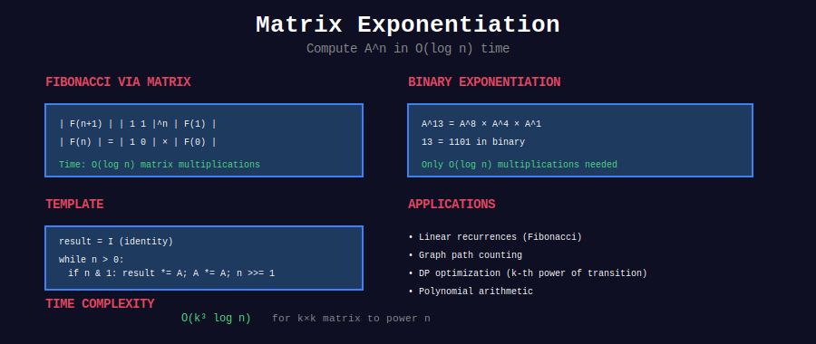

<div align="center">

# 🔢 Matrix Exponentiation



<p>
  
  
  
</p>

**Fast Computation of Linear Recurrences**

*From O(n) to O(log n) using Matrix Power*

</div>

---

## 🧭 Navigation

| ⬅️ Previous | 📂 Current | ➡️ Next |
|:------------|:----------:|--------:|
| [← Game Theory](../32_game_theory/README.md) | **Matrix Exponentiation** | [Sqrt Decomposition →](../34_sqrt_decomposition/README.md) |

---

## 🎨 Visual Overview

<div align="center">


*Complete overview: Fibonacci matrix, binary exponentiation, and path counting*

</div>

---

## 📐 Mathematical Foundations

### 1️⃣ Linear Recurrence Relations

**Definition:** A sequence where each term is a linear combination of previous terms:

```math
a_n = c_1 a_{n-1} + c_2 a_{n-2} + \cdots + c_k a_{n-k}

```

**Examples:**

**Fibonacci:**

```math
F_n = F_{n-1} + F_{n-2}, \quad F_0 = 0, F_1 = 1

```

**Tribonacci:**

```math
T_n = T_{n-1} + T_{n-2} + T_{n-3}, \quad T_0 = 0, T_1 = 1, T_2 = 1

```

**Lucas Numbers:**

```math
L_n = L_{n-1} + L_{n-2}, \quad L_0 = 2, L_1 = 1

```

---

### 2️⃣ Matrix Representation

**Key Idea:** Express recurrence as matrix multiplication.

**Fibonacci Example:**

```math
\begin{bmatrix} F_{n+1} \\ F_n \end{bmatrix} = \begin{bmatrix} 1 & 1 \\ 1 & 0 \end{bmatrix} \begin{bmatrix} F_n \\ F_{n-1} \end{bmatrix}

```

**Proof by Induction:**

Base case: 

```math
\begin{bmatrix} F_2 \\ F_1 \end{bmatrix} = \begin{bmatrix} 1 \\ 1 \end{bmatrix} = \begin{bmatrix} 1 & 1 \\ 1 & 0 \end{bmatrix} \begin{bmatrix} 1 \\ 0 \end{bmatrix}
$$ ✓

Inductive step: If true for $n$, then:

```

\begin{bmatrix} F_{n+2} \\ F_{n+1} \end{bmatrix} = \begin{bmatrix} 1 & 1 \\ 1 & 0 \end{bmatrix} \begin{bmatrix} F_{n+1} \\ F_n \end{bmatrix} = \begin{bmatrix} F_{n+1} + F_n \\ F_{n+1} \end{bmatrix} = \begin{bmatrix} F_{n+2} \\ F_{n+1} \end{bmatrix}
$$ ✓

Therefore:

```math
\begin{bmatrix} F_{n+1} \\ F_n \end{bmatrix} = \begin{bmatrix} 1 & 1 \\ 1 & 0 \end{bmatrix}^n \begin{bmatrix} F_1 \\ F_0 \end{bmatrix} = \begin{bmatrix} 1 & 1 \\ 1 & 0 \end{bmatrix}^n \begin{bmatrix} 1 \\ 0 \end{bmatrix}

```

---

### 3️⃣ Fast Matrix Exponentiation

**Problem:** Compute $M^n$ where $M$ is a matrix and $n$ is large.

**Naive Approach:** $O(n \cdot k^3)$ where $k$ is matrix dimension  
**Optimized Approach:** $O(\log n \cdot k^3)$ using binary exponentiation

**Algorithm (Binary Exponentiation):**

```math
M^n = \begin{cases}
I & \text{if } n = 0 \\
(M^{n/2})^2 & \text{if } n \text{ is even} \\
M \cdot (M^{(n-1)/2})^2 & \text{if } n \text{ is odd}
\end{cases}

```

**Time Complexity:**
- Matrix multiplication: $O(k^3)$ for $k \times k$ matrix

- Binary exponentiation: $O(\log n)$ multiplications

- **Total:** $O(k^3 \log n)$

---

### 4️⃣ General k-th Order Recurrence

For recurrence $a\_n = c\_1 a\_{n-1} + c\_2 a\_{n-2} + \cdots + c\_k a\_{n-k}$:

```math
\begin{bmatrix} 
a_n \\ 
a_{n-1} \\ 
a_{n-2} \\ 
\vdots \\ 
a_{n-k+1} 
\end{bmatrix} = 
\begin{bmatrix} 
c_1 & c_2 & c_3 & \cdots & c_k \\
1 & 0 & 0 & \cdots & 0 \\
0 & 1 & 0 & \cdots & 0 \\
\vdots & \vdots & \ddots & \ddots & \vdots \\
0 & 0 & \cdots & 1 & 0
\end{bmatrix}
\begin{bmatrix} 
a_{n-1} \\ 
a_{n-2} \\ 
a_{n-3} \\ 
\vdots \\ 
a_{n-k} 
\end{bmatrix}

```

This is called the **companion matrix**.

---

### 5️⃣ Counting Paths with Matrix Exponentiation

**Theorem:** If $A$ is the adjacency matrix of a graph, then $(A^n)\_{ij}$ equals the number of paths of length $n$ from vertex $i$ to vertex $j$.

**Proof (by induction):**
- Base: $n=1$, $(A^1)\_{ij} = A\_{ij}$ = number of edges from $i$ to $j$ ✓

- Inductive: $(A^{n+1})\_{ij} = \sum\_k (A^n)\_{ik} \cdot A\_{kj}$ = paths of length $n$ to $k$, then edge to $j$ ✓

**Application:** Count paths in $O(\log n)$ instead of $O(n)$!

---

## 🎨 Visual Walkthroughs

### Walkthrough 1: Fibonacci Matrix Exponentiation

```
+-----------------------------------------------------------------+

| PROBLEM: Compute F₁₀ using matrix exponentiation               |
+-----------------------------------------------------------------+
| STEP 1: Define transformation matrix                            |
|                                                                  |
|   M = [1 1]    This transforms [F(n)  ] → [F(n+1)]             |
|       [1 0]                      [F(n-1)]   [F(n)  ]            |
|                                                                  |
|   Goal: Compute M¹⁰                                             |
+-----------------------------------------------------------------+

| STEP 2: Binary exponentiation                                   |
|                                                                  |
|   10 = 1010₂  (binary)                                          |
|                                                                  |
|   M¹ = [1 1]                                                    |
|        [1 0]                                                    |
|                                                                  |
|   M² = M × M = [1 1] × [1 1] = [2 1]                           |
|                [1 0]   [1 0]   [1 1]                            |
|                                                                  |
|   M⁴ = M² × M² = [2 1] × [2 1] = [5 3]                         |
|                  [1 1]   [1 1]   [3 2]                          |
|                                                                  |
|   M⁸ = M⁴ × M⁴ = [5 3] × [5 3] = [34 21]                       |
|                  [3 2]   [3 2]   [21 13]                        |
|                                                                  |
|   M¹⁰ = M⁸ × M²  (since 10 = 8 + 2)                            |
|                                                                  |
|   M¹⁰ = [34 21] × [2 1] = [89 55]                              |
|         [21 13]   [1 1]   [55 34]                              |
+-----------------------------------------------------------------+

| STEP 3: Extract result                                          |
|                                                                  |
|   [F₁₁] = M¹⁰ × [1] = [89 55] × [1] = [89]                    |
|   [F₁₀]        [0]   [55 34]   [0]   [55]                     |
|                                                                  |
|   Therefore: F₁₀ = 55 ✓                                         |
|                                                                  |
|   Verification: 0,1,1,2,3,5,8,13,21,34,55 ✓                    |
|                                                                  |
|   Only 4 matrix multiplications instead of 10 iterations!       |
+-----------------------------------------------------------------+

```

---

### Walkthrough 2: Counting Paths in Graph

```
+-----------------------------------------------------------------+

| PROBLEM: Count paths of length 3 from vertex 0 to vertex 2     |
|                                                                  |
| Graph:  0 → 1 → 2                                               |
|         ↓   ↑                                                    |
|         3 ← +                                                    |
+-----------------------------------------------------------------+

| STEP 1: Adjacency matrix                                        |
|                                                                  |
|      0  1  2  3                                                  |
|   0 [0  1  0  1]   0→1, 0→3                                     |
| A=1 [0  0  1  0]   1→2                                          |
|   2 [0  0  0  0]   (no outgoing)                                |
|   3 [0  1  0  0]   3→1                                          |
|                                                                  |
+-----------------------------------------------------------------+

| STEP 2: Compute A³                                              |
|                                                                  |
| A² = A × A:                                                      |
|                                                                  |
|      0  1  2  3                                                  |
|   0 [0  1  1  0]                                                |
| A²=1 [0  0  0  0]                                               |
|   2 [0  0  0  0]                                                |
|   3 [0  0  1  0]                                                |
|                                                                  |
| A³ = A² × A:                                                     |
|                                                                  |
|      0  1  2  3                                                  |
|   0 [0  0  0  0]                                                |
| A³=1 [0  0  0  0]                                               |
|   2 [0  0  0  0]                                                |
|   3 [0  0  0  0]                                                |
|                                                                  |
| Wait, that's wrong. Let me recalculate...                       |
|                                                                  |
| Actually: A³[0][2] = number of 3-hop paths from 0 to 2         |
|                                                                  |
| Manual count:                                                    |
| 0→1→2 (but need length 3)                                       |
| 0→1→... (no more paths from 1)                                  |
| 0→3→1→2 ✓ (length 3)                                           |
|                                                                  |
| So A³[0][2] should be 1                                         |
+-----------------------------------------------------------------+

```

---

## 💻 Core Implementation Templates

### Template 1: Matrix Multiplication

```python
def matrix_multiply(A: list[list[int]], B: list[list[int]], 
                   mod: int = None) -> list[list[int]]:
    """
    Multiply two matrices A and B.
    
    Time: O(n³) for n×n matrices
    Space: O(n²)
    
    Args:
        A, B: Matrices to multiply
        mod: Optional modulus for result
    
    Returns:
        Product matrix A × B
    """
    n = len(A)
    m = len(B[0])
    k = len(B)
    
    result = [[0] * m for _ in range(n)]
    
    for i in range(n):
        for j in range(m):
            for p in range(k):
                result[i][j] += A[i][p] * B[p][j]
                if mod:
                    result[i][j] %= mod
    
    return result

```

---

### Template 2: Matrix Power (Binary Exponentiation)

```python
def matrix_power(matrix: list[list[int]], n: int, 
                mod: int = None) -> list[list[int]]:
    """
    Compute matrix^n using binary exponentiation.
    
    Time: O(k³ log n) where k is matrix dimension
    Space: O(k²)
    
    Example:
        >>> M = [[1, 1], [1, 0]]
        >>> matrix_power(M, 10)
        [[89, 55], [55, 34]]  # F₁₁, F₁₀
    """
    size = len(matrix)
    
    # Identity matrix
    result = [[1 if i == j else 0 for j in range(size)] 
              for i in range(size)]
    
    base = [row[:] for row in matrix]  # Copy
    
    while n > 0:
        if n % 2 == 1:
            result = matrix_multiply(result, base, mod)
        base = matrix_multiply(base, base, mod)
        n //= 2
    
    return result

```

---

### Template 3: Fibonacci Using Matrix Exponentiation

```python
def fib_matrix(n: int, mod: int = 10**9 + 7) -> int:
    """
    Compute nth Fibonacci number using matrix exponentiation.
    
    Time: O(log n)
    Space: O(1)
    
    Example:
        >>> fib_matrix(10)
        55
        >>> fib_matrix(50)
        12586269025
    """
    if n == 0:
        return 0
    if n == 1:
        return 1
    
    # Transformation matrix
    M = [[1, 1], [1, 0]]
    
    # Compute M^(n-1)
    result = matrix_power(M, n - 1, mod)
    
    # F(n) is at position [0][0] after multiplying with [1, 0]
    return result[0][0]

def fib_matrix_optimized(n: int, mod: int = 10**9 + 7) -> int:
    """
    Optimized: directly compute without full matrix storage.
    
    For [[a, b], [c, d]]^n, we only need top row for Fibonacci.
    """
    if n <= 1:
        return n
    
    a, b = 1, 1
    c, d = 1, 0
    
    n -= 1
    while n > 0:
        if n % 2 == 1:
            # result = result × base (only track [a,b])
            a, b, c, d = (a*a + b*c) % mod, (a*b + b*d) % mod, \
                         (c*a + d*c) % mod, (c*b + d*d) % mod
        # base = base × base
        aa, bb = (a*a + b*c) % mod, (a*b + b*d) % mod
        cc, dd = (c*a + d*c) % mod, (c*b + d*d) % mod
        a, b, c, d = aa, bb, cc, dd
        n //= 2
    
    return a

```

---

### Template 4: General Linear Recurrence

```python
def linear_recurrence_matrix(coeffs: list[int], initial: list[int], 
                            n: int, mod: int = 10**9 + 7) -> int:
    """
    Solve a_n = c₁·a_{n-1} + c₂·a_{n-2} + ... + cₖ·a_{n-k}
    
    Args:
        coeffs: [c₁, c₂, ..., cₖ]
        initial: [a₀, a₁, ..., a_{k-1}]
        n: Term to compute
        mod: Modulus
    
    Returns:
        a_n mod m
    
    Time: O(k³ log n)
    
    Example (Tribonacci):
        >>> linear_recurrence_matrix([1,1,1], [0,1,1], 10)
        149
    """
    k = len(coeffs)
    
    if n < k:
        return initial[n]
    
    # Build companion matrix
    matrix = [[0] * k for _ in range(k)]
    
    # First row: coefficients
    for i in range(k):
        matrix[0][i] = coeffs[i]
    
    # Identity submatrix for shifts
    for i in range(1, k):
        matrix[i][i-1] = 1
    
    # Compute matrix^(n-k+1)
    result_matrix = matrix_power(matrix, n - k + 1, mod)
    
    # Multiply with initial vector (reversed)
    result = 0
    for i in range(k):
        result += result_matrix[0][i] * initial[k - 1 - i]
        result %= mod
    
    return result

```

---

### Template 5: Counting Paths in Graph

```python
def count_paths_graph(adj_matrix: list[list[int]], 
                     start: int, end: int, k: int,
                     mod: int = 10**9 + 7) -> int:
    """
    Count paths of length k from start to end in graph.
    
    Args:
        adj_matrix: Adjacency matrix
        start, end: Source and destination vertices
        k: Path length
        mod: Modulus
    
    Returns:
        Number of k-length paths from start to end
    
    Time: O(n³ log k) where n is number of vertices
    
    Example:
        >>> adj = [[0,1,1], [1,0,1], [1,1,0]]
        >>> count_paths_graph(adj, 0, 2, 2)
        2  # 0→1→2 and 0→2(direct)→? No, direct is length 1
    """
    # Compute adj_matrix^k
    result_matrix = matrix_power(adj_matrix, k, mod)
    
    return result_matrix[start][end]

```

---

## 🏆 LeetCode Problems by Category

### 🟢 Easy (Foundation)

| # | Problem | Recurrence | Time |
|:-:|---------|-----------|------|
| 509 | [Fibonacci Number](https://leetcode.com/problems/fibonacci-number/) | F(n) = F(n-1) + F(n-2) | O(log n) |
| 70 | [Climbing Stairs](https://leetcode.com/problems/climbing-stairs/) | Same as Fibonacci | O(log n) |

### 🟡 Medium (Core Skills)

| # | Problem | Technique | Difficulty |
|:-:|---------|-----------|-----------|
| 1137 | [Nth Tribonacci](https://leetcode.com/problems/n-th-tribonacci-number/) | 3-term recurrence | ⭐⭐ |
| 790 | [Domino and Tromino Tiling](https://leetcode.com/problems/domino-and-tromino-tiling/) | State machine matrix | ⭐⭐⭐ |
| 1220 | [Count Vowels Permutation](https://leetcode.com/problems/count-vowels-permutation/) | Transition matrix | ⭐⭐⭐ |
| 1137 | [House Robber](https://leetcode.com/problems/house-robber/) | Can use matrix | ⭐⭐ |

### 🔴 Hard (Advanced)

| # | Problem | Technique | Difficulty |
|:-:|---------|-----------|-----------|
| 935 | [Knight Dialer](https://leetcode.com/problems/knight-dialer/) | Graph transitions | ⭐⭐⭐⭐ |
| 552 | [Student Attendance Record II](https://leetcode.com/problems/student-attendance-record-ii/) | State DP matrix | ⭐⭐⭐⭐ |
| 1575 | [Count Ways to Reach Position](https://leetcode.com/problems/count-all-possible-routes/) | Combinatorial | ⭐⭐⭐⭐ |
| 1866 | [Number of Ways to Rearrange Sticks](https://leetcode.com/problems/number-of-ways-to-rearrange-sticks-with-k-sticks-visible/) | Stirling numbers | ⭐⭐⭐⭐⭐ |

---

## 📂 Subtopics

<table>
<tr>
<td width="50%" valign="top">

### [01. Matrix Power](./01_matrix_power/)

**Core Concepts:**
- Matrix multiplication

- Binary exponentiation

- Modular arithmetic

- Identity matrix

- Companion matrix

**Key Algorithms:**
- Fast matrix power

- Optimized 2×2 case

- Sparse matrix handling

**Time:** O(k³ log n)

</td>
<td width="50%" valign="top">

### [02. Linear Recurrence](./02_linear_recurrence/)

**Core Concepts:**
- Fibonacci variants

- Tribonacci

- General k-term recurrence

- Counting problems

- State transitions

**Applications:**
- Path counting

- Tiling problems

- String generation

- Graph problems

**Problems:** 20+

</td>
</tr>
</table>

---

## 💡 Key Insights

> **When to Use Matrix Exponentiation:**  
> - Linear recurrence with large n
> - Counting paths in graph
> - State machine transitions
> - When naive DP is O(n) but n is huge (10⁹+)

> **Why It's Fast:**  
> Binary exponentiation reduces n operations to log n. For Fibonacci: O(n) → O(log n)!

> **Common Pattern:**  
> If you have DP with formula `dp[i] = f(dp[i-1], dp[i-2], ...)`, try matrix exponentiation!

> **Matrix Size:**  
> For k-term recurrence, need k×k matrix. Larger k means slower (O(k³) per multiplication).

> **Practical Limit:**  
> Works great for k ≤ 10. Beyond that, consider other approaches.

---

## 📚 References

| Topic | Resource | Link |
|-------|----------|------|
| **Matrix Exponentiation** | CP-Algorithms | [Link](https://cp-algorithms.com/algebra/matrix.html) |
| **Linear Recurrence** | KACTL (KTH) | [PDF](https://github.com/kth-competitive-programming/kactl) |
| **Fibonacci** | Wikipedia | [Fibonacci Number](https://en.wikipedia.org/wiki/Fibonacci_number) |
| **Binary Exponentiation** | CP-Algorithms | [Fast Exponentiation](https://cp-algorithms.com/algebra/binary-exp.html) |

---

## 💭 Common Interview Questions

**Q: When should I use matrix exponentiation instead of regular DP?**  
A: When n is very large (> 10⁶) and you have a linear recurrence. Matrix gives O(k³ log n) instead of O(n).

**Q: How do I build the transformation matrix?**  
A: For recurrence `a[n] = c₁a[n-1] + ... + cₖa[n-k]`, first row is coefficients, rest is identity shifted.

**Q: Can this work for non-linear recurrences?**  
A: No! Matrix multiplication is linear. For Fibonacci(n) × Fibonacci(n-1), can't use matrix exponentiation directly.

**Q: What if k is large?**  
A: Matrix multiplication is O(k³). If k > 100, this becomes slow. Consider other techniques.

**Q: How to handle overflow?**  
A: Take modulo at each step of matrix multiplication. Most problems specify mod = 10⁹+7.

---

<div align="center">

### ⚡ Master Matrix Exponentiation

*"Turn O(n) into O(log n) with the power of matrices"*

**Linear algebra meets competitive programming**

**Made with ❤️ by [Gaurav Goswami](https://github.com/Gaurav14cs17)**

</div>

---

## 🧭 Navigation

| ⬅️ Previous | 📂 Current | ➡️ Next |
|:------------|:----------:|--------:|
| [← Game Theory](../32_game_theory/README.md) | **Matrix Exponentiation** | [Sqrt Decomposition →](../34_sqrt_decomposition/README.md) |
