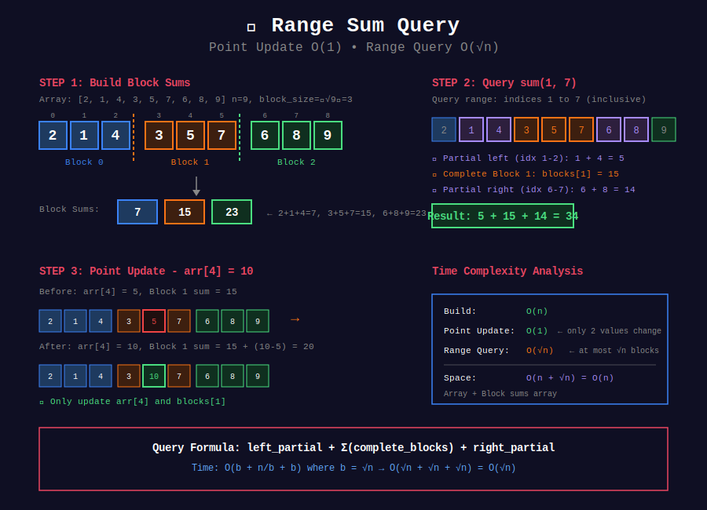
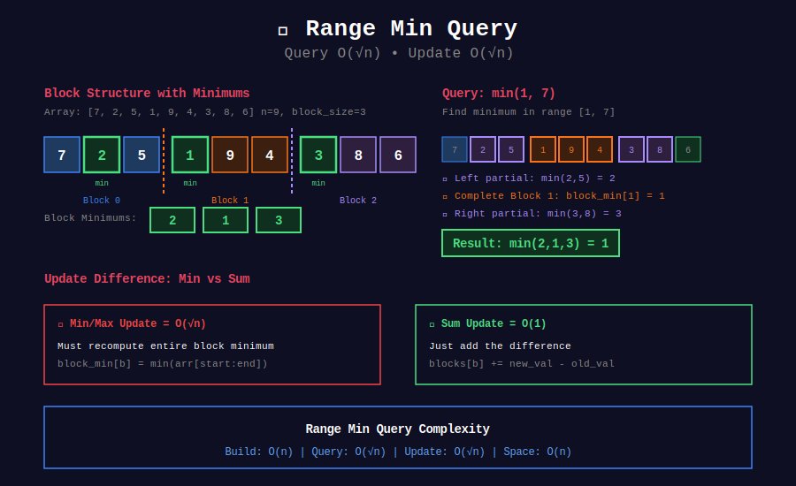
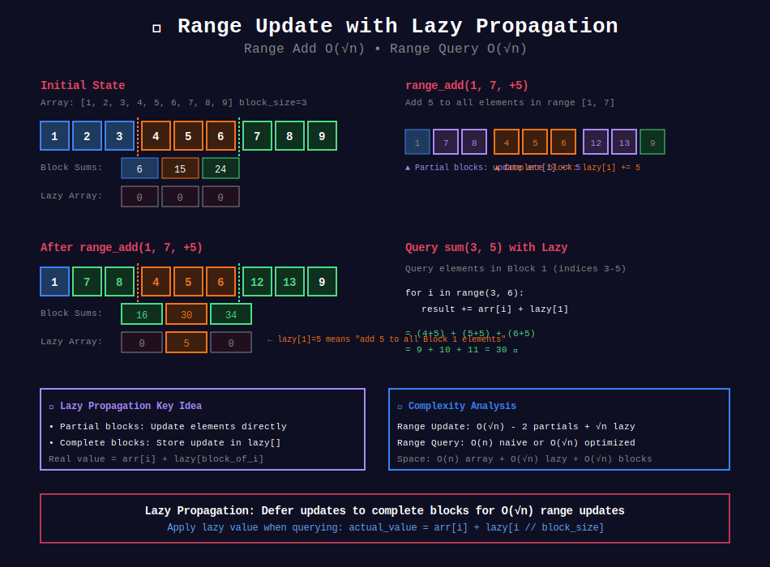

<div align="center">

# 📊 Range Queries with Sqrt Decomposition

<p>
  
  
</p>

**Efficient Range Operations Using Block Decomposition**

*Sum, Min, Max, GCD in O(√n)*

</div>

---

## 🧭 Navigation

| ⬅️ Previous | 📂 Current | ➡️ Next |
|:------------|:----------:|--------:|
| [🏠 Sqrt Decomp Home](../README.md) | **01. Range Queries** | [02. Mo's Algorithm →](../02_mos_algorithm/README.md) |

---

## 📐 Query Types

### Supported Operations
- ✅ Range Sum
- ✅ Range Min/Max
- ✅ Range GCD/LCM
- ✅ Point Update
- ✅ Range Update
- ✅ Range Assignment

All in **O(√n)** time!

---

## 🎨 Visual Diagrams

### Range Sum Query with Point Update

<div align="center">

</div>

### Range Minimum Query

<div align="center">

</div>

### Range Update with Lazy Propagation

<div align="center">

</div>

---

## 💻 Complete Implementations

### Implementation 1: Range Sum with Point Update

```python
import math

class RangeSumQuery:
    """
    Range sum queries with point updates.
    
    Operations:
    - Build: O(n)
    - Query: O(√n)
    - Update: O(1)
    
    Space: O(n)
    """
    def __init__(self, arr: list[int]):
        self.n = len(arr)
        self.block_size = int(math.ceil(math.sqrt(self.n)))
        self.num_blocks = (self.n + self.block_size - 1) // self.block_size
        
        self.arr = arr[:]
        self.blocks = [0] * self.num_blocks
        
        for i in range(self.n):
            self.blocks[i // self.block_size] += arr[i]
    
    def update(self, idx: int, val: int) -> None:
        """Update arr[idx] = val in O(1)"""
        block_id = idx // self.block_size
        self.blocks[block_id] += val - self.arr[idx]
        self.arr[idx] = val
    
    def query(self, left: int, right: int) -> int:
        """Sum of arr[left:right+1] in O(√n)"""
        result = 0
        left_block = left // self.block_size
        right_block = right // self.block_size
        
        if left_block == right_block:
            for i in range(left, right + 1):
                result += self.arr[i]
        else:
            # Left partial block
            for i in range(left, (left_block + 1) * self.block_size):
                if i < self.n:
                    result += self.arr[i]
            
            # Complete blocks
            for b in range(left_block + 1, right_block):
                result += self.blocks[b]
            
            # Right partial block
            for i in range(right_block * self.block_size, right + 1):
                result += self.arr[i]
        
        return result
```

---

### Implementation 2: Range Min Query

```python
class RangeMinQuery:
    """
    Range minimum queries with point updates.
    
    Operations:
    - Build: O(n)
    - Query: O(√n)
    - Update: O(√n)
    """
    def __init__(self, arr: list[int]):
        self.n = len(arr)
        self.block_size = int(math.ceil(math.sqrt(self.n)))
        self.num_blocks = (self.n + self.block_size - 1) // self.block_size
        
        self.arr = arr[:]
        self.block_min = [float('inf')] * self.num_blocks
        
        for i in range(self.n):
            block_id = i // self.block_size
            self.block_min[block_id] = min(
                self.block_min[block_id], 
                arr[i]
            )
    
    def update(self, idx: int, val: int) -> None:
        """Update arr[idx] = val"""
        self.arr[idx] = val
        
        # Recompute block minimum
        block_id = idx // self.block_size
        start = block_id * self.block_size
        end = min(start + self.block_size, self.n)
        
        self.block_min[block_id] = min(self.arr[start:end])
    
    def query(self, left: int, right: int) -> int:
        """Minimum of arr[left:right+1]"""
        result = float('inf')
        left_block = left // self.block_size
        right_block = right // self.block_size
        
        if left_block == right_block:
            for i in range(left, right + 1):
                result = min(result, self.arr[i])
        else:
            # Left partial
            for i in range(left, (left_block + 1) * self.block_size):
                if i < self.n:
                    result = min(result, self.arr[i])
            
            # Complete blocks
            for b in range(left_block + 1, right_block):
                result = min(result, self.block_min[b])
            
            # Right partial
            for i in range(right_block * self.block_size, right + 1):
                result = min(result, self.arr[i])
        
        return result
```

---

### Implementation 3: Range Update + Range Query

```python
class RangeUpdateQuery:
    """
    Range updates and range sum queries.
    
    Operations:
    - Build: O(n)
    - Query: O(√n)
    - Range Update: O(√n)
    """
    def __init__(self, arr: list[int]):
        self.n = len(arr)
        self.block_size = int(math.ceil(math.sqrt(self.n)))
        self.num_blocks = (self.n + self.block_size - 1) // self.block_size
        
        self.arr = arr[:]
        self.blocks = [0] * self.num_blocks
        self.lazy = [0] * self.num_blocks
        
        for i in range(self.n):
            self.blocks[i // self.block_size] += arr[i]
    
    def range_add(self, left: int, right: int, val: int) -> None:
        """Add val to arr[left:right+1]"""
        left_block = left // self.block_size
        right_block = right // self.block_size
        
        if left_block == right_block:
            for i in range(left, right + 1):
                self.arr[i] += val
                self.blocks[left_block] += val
        else:
            # Left partial
            for i in range(left, (left_block + 1) * self.block_size):
                if i < self.n:
                    self.arr[i] += val
                    self.blocks[left_block] += val
            
            # Complete blocks - lazy propagation
            for b in range(left_block + 1, right_block):
                self.lazy[b] += val
                block_size = min(
                    self.block_size,
                    self.n - b * self.block_size
                )
                self.blocks[b] += val * block_size
            
            # Right partial
            for i in range(right_block * self.block_size, right + 1):
                self.arr[i] += val
                self.blocks[right_block] += val
    
    def query(self, left: int, right: int) -> int:
        """Sum of arr[left:right+1]"""
        result = 0
        for i in range(left, right + 1):
            block_id = i // self.block_size
            result += self.arr[i] + self.lazy[block_id]
        return result
```

---

## 🏆 LeetCode Problems

### 🟡 Medium
| # | Problem | Type | Solution |
|:-:|---------|------|----------|
| 307 | [Range Sum Query - Mutable](https://leetcode.com/problems/range-sum-query-mutable/) | Point update | Sqrt decomp |

### 🔴 Hard
| # | Problem | Type | Solution |
|:-:|---------|------|----------|
| 327 | [Count of Range Sum](https://leetcode.com/problems/count-of-range-sum/) | Complex query | Modified sqrt decomp |

---

## 💡 Key Insights

> **Point Update = O(1):**  
> Only need to update one block summary!

> **Range Query = O(√n):**  
> At most √n complete blocks + 2 partial blocks

> **Range Update = O(√n):**  
> Use lazy propagation for complete blocks

> **Flexibility:**  
> Easy to adapt for different operations (min, max, GCD, etc.)

---

<div align="center">

**Made with ❤️ by [Gaurav Goswami](https://github.com/Gaurav14cs17)**

</div>

---

## 🧭 Navigation

| ⬅️ Previous | 📂 Current | ➡️ Next |
|:------------|:----------:|--------:|
| [🏠 Sqrt Decomp Home](../README.md) | **01. Range Queries** | [02. Mo's Algorithm →](../02_mos_algorithm/README.md) |

